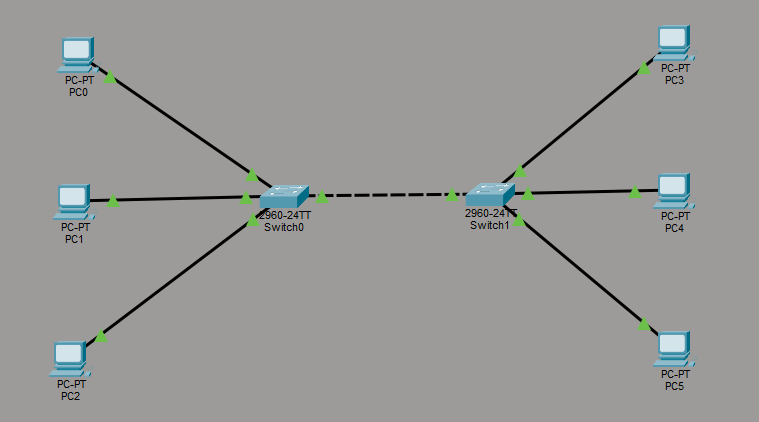
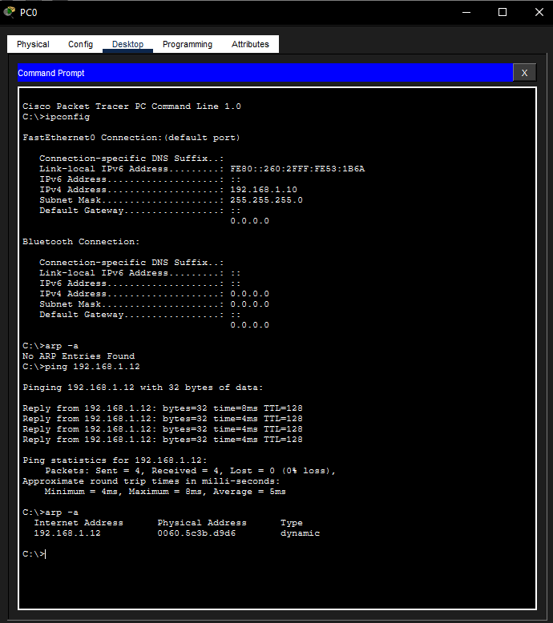
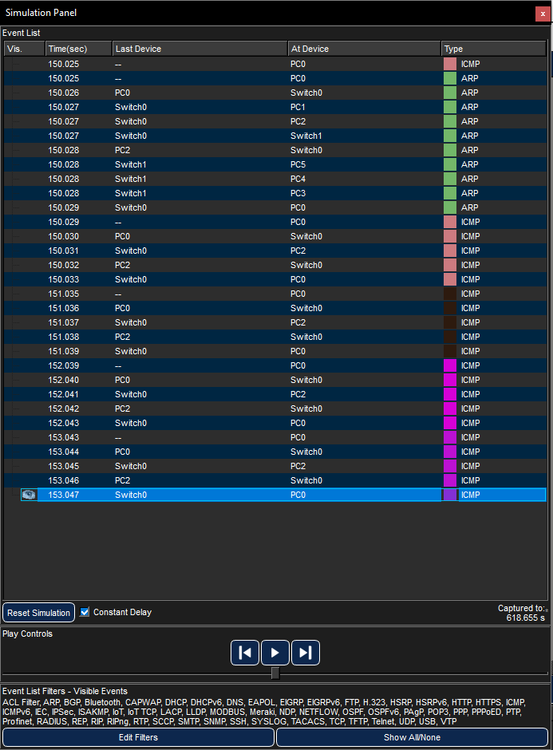

# ARP Lab - MAC vs IP, Switched LAN

This lab was built in Cisco Packet Tracer to observe how ARP actually works at the Data Link layer. The goal was to see the ARP cache start empty, watch it get populated after a ping, and understand why ARP has to happen before any ICMP traffic can flow.

The `.pkt` file is included in `assets/` so the lab can be opened and stepped through in Packet Tracer directly.

---

# Topology



A simple switched LAN with six PCs spread across two 2960 switches. Switch0 and Switch1 are connected to each other, forming one flat Layer 2 network.

| Device | IP Address | Subnet Mask |
|---|---|---|
| PC0 | 192.168.1.10 | 255.255.255.0 |
| PC1 | 192.168.1.11 | 255.255.255.0 |
| PC2 | 192.168.1.12 | 255.255.255.0 |
| PC3 | 192.168.1.13 | 255.255.255.0 |
| PC4 | 192.168.1.14 | 255.255.255.0 |
| PC5 | 192.168.1.15 | 255.255.255.0 |

All devices are on the same subnet so there is no routing involved here. Every packet stays at Layer 2.

---

# How ARP Works

IP addresses are how we identify devices at Layer 3. But when a frame actually gets sent across a network, it uses MAC addresses at Layer 2. ARP is the protocol that bridges that gap. Before PC0 can send anything to PC2, it needs to know PC2's MAC address. It does not have that information by default, so it broadcasts an ARP request to the entire network asking "who has 192.168.1.12, tell me your MAC". PC2 responds directly with its MAC, and PC0 stores that mapping in its ARP cache.

After that exchange, PC0 knows where to send frames without asking again.

---

# The Lab

## ARP Cache Before and After Ping



Running `arp -a` on PC0 before any communication shows no entries at all. The cache is empty because PC0 has not spoken to anyone yet.

Running `ping 192.168.1.12` triggers communication with PC2. Once the ping completes, running `arp -a` again shows a new entry:

```
192.168.1.12    0060.5c3b.d9d6    dynamic
```

PC0 now knows PC2's MAC address and has cached it. The `dynamic` label means it was learned automatically through ARP rather than set manually.

## Simulation Event List



Running the same ping in Simulation mode makes the sequence visible. The event list shows what actually happened in order:

1. PC0 generates an ICMP packet to send to PC2
2. Before sending it, PC0 realises it does not have PC2's MAC address
3. PC0 sends an ARP broadcast at t=150.025
4. The broadcast floods out through Switch0 to PC1, PC2, Switch1, and then through Switch1 to PC3, PC4, PC5
5. PC2 recognises its own IP and sends an ARP reply back to PC0
6. Only after the ARP reply arrives does the first ICMP packet get sent at t=150.029

This is the key point: ping does not start with ICMP. It starts with ARP. ICMP only flows once the MAC address is known.

---

# Key Concepts

- **ARP operates at Layer 2.** It is a Data Link layer protocol that resolves Layer 3 IP addresses to Layer 2 MAC addresses.
- **ARP requests are broadcasts.** Every device on the subnet receives them, but only the target responds.
- **ARP replies are unicast.** Once PC2 knows who is asking, it responds directly to PC0's MAC rather than broadcasting back.
- **The ARP cache avoids redundancy.** Once a mapping is learned it is stored locally so ARP does not need to run again for every packet.
- **Switches learn MAC addresses too.** Each switch builds its own MAC address table from the traffic passing through it, which is how it knows which port to forward frames to.

---

# Environment

- Tool: Cisco Packet Tracer
- Lab file: [assets/arp_lab1.pkt](assets/arp_lab1.pkt)
