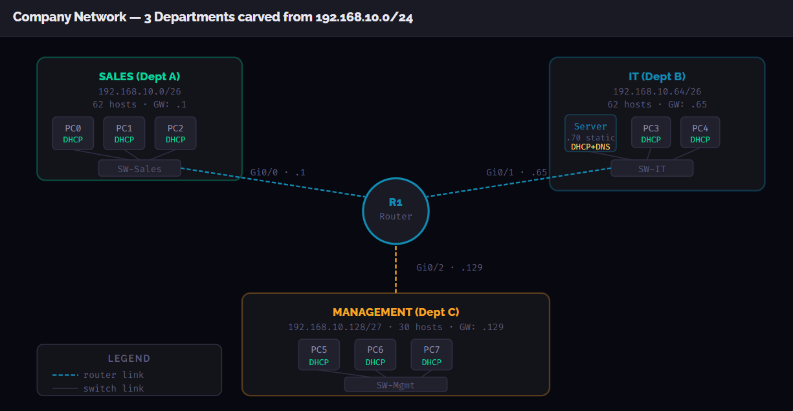
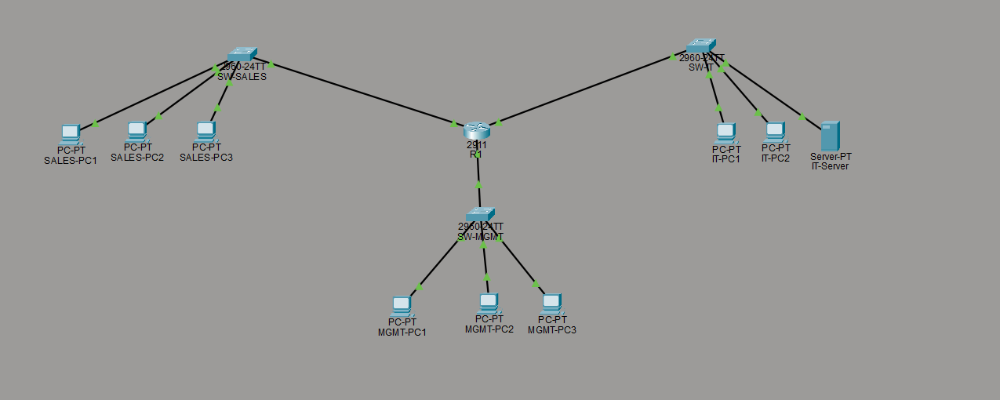
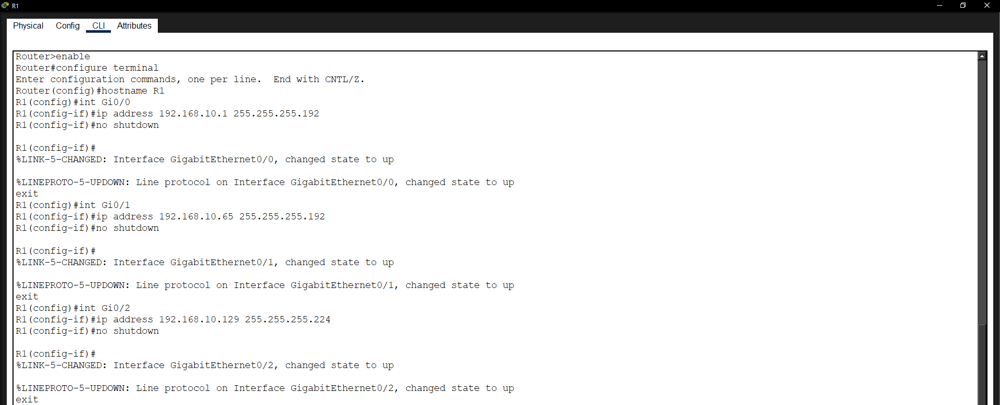
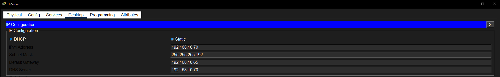
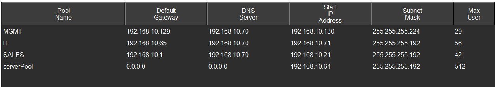
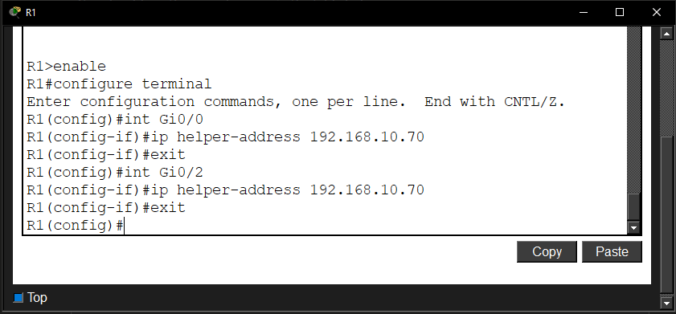
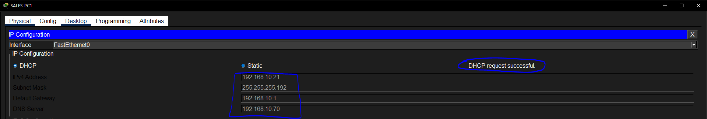
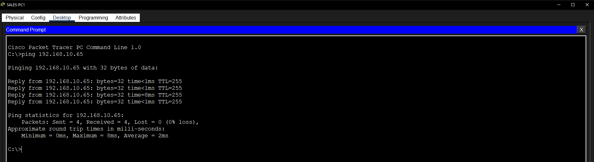
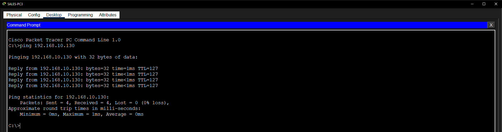
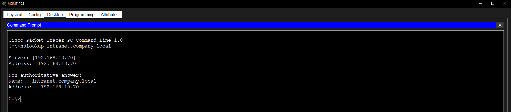

# Company Network Lab - Subnetting, DHCP Server, DNS, Inter-VLAN Routing

This is a capstone lab that brings together everything covered in the networking section so far: subnetting, router interface configuration, DHCP, DNS, and inter-subnet routing. Instead of a simple two-device setup, this simulates a small company network with three departments, each on its own subnet, all routed through a single router.

The `.pkt` file is in `assets/` and can be opened in Packet Tracer to explore or modify the configuration.

---

# Network Design



The base network `192.168.10.0/24` is subnetted into three department subnets:

| Department | Subnet | Subnet Mask | Gateway | Usable Hosts |
|---|---|---|---|---|
| SALES (Dept A) | 192.168.10.0/26 | 255.255.255.192 | 192.168.10.1 | 62 |
| IT (Dept B) | 192.168.10.64/26 | 255.255.255.192 | 192.168.10.65 | 62 |
| MANAGEMENT (Dept C) | 192.168.10.128/27 | 255.255.255.224 | 192.168.10.129 | 30 |

The IT subnet hosts the company server at `192.168.10.70` (static), which runs both DHCP and DNS services for the entire network. SALES and MANAGEMENT clients get their IPs from this server via DHCP relay on the router.

---

# Packet Tracer Topology



Three switches, one per department, all connected to a central Cisco 2911 router. The IT switch also connects the IT-Server. Device naming follows department conventions: SALES-PC1, IT-PC1, MGMT-PC1 and so on.

---

# Step 1 - Router Interface Configuration



```
Router> enable
Router# configure terminal
Router(config)# hostname R1

R1(config)# int Gi0/0
R1(config-if)# ip address 192.168.10.1 255.255.255.192
R1(config-if)# no shutdown
R1(config-if)# exit

R1(config)# int Gi0/1
R1(config-if)# ip address 192.168.10.65 255.255.255.192
R1(config-if)# no shutdown
R1(config-if)# exit

R1(config)# int Gi0/2
R1(config-if)# ip address 192.168.10.129 255.255.255.224
R1(config-if)# no shutdown
R1(config-if)# exit
```

Each interface gets the gateway IP for its subnet with the correct subnet mask. The `LINEPROTO-5-UPDOWN` messages confirm each interface came up successfully after `no shutdown`. The subnet masks here are not the standard `/24` but carved-down `/26` and `/27` masks to match the subnetting design.

---

# Step 2 - Static IP for the IT Server



The IT-Server is given a static IP of `192.168.10.70` with:

- Subnet Mask: `255.255.255.192`
- Default Gateway: `192.168.10.65` (IT subnet gateway)
- DNS Server: `192.168.10.70` (points to itself since it runs the DNS service)

The server needs a static IP because it is the central DHCP and DNS server. If its IP changed, all the pool configurations and DNS records would break.

---

# Step 3 - DHCP Pools on the Server



Rather than configuring DHCP pools on the router using Cisco IOS commands, the DHCP service is run from the IT-Server directly. Four pools are configured:

| Pool Name | Gateway | DNS Server | Start IP | Subnet Mask | Max Users |
|---|---|---|---|---|---|
| SALES | 192.168.10.1 | 192.168.10.70 | 192.168.10.21 | 255.255.255.192 | 42 |
| IT | 192.168.10.65 | 192.168.10.70 | 192.168.10.71 | 255.255.255.192 | 56 |
| MGMT | 192.168.10.129 | 192.168.10.70 | 192.168.10.130 | 255.255.255.224 | 29 |
| serverPool | 0.0.0.0 | 0.0.0.0 | 192.168.10.64 | 255.255.255.192 | 512 |

Each pool specifies its own gateway and points all clients at `192.168.10.70` for DNS. The start IPs leave room at the bottom of each range for statically assigned devices. The `serverPool` is a catch-all pool for the IT subnet's server address space.

---

# Step 4 - DNS Record on the Server


A single DNS A Record is configured:

| Name | Type | Address |
|---|---|---|
| intranet.company.local | A Record | 192.168.10.70 |

This simulates an internal company intranet hostname. Any device on the network that queries `intranet.company.local` gets pointed to the IT-Server's IP. The `.local` domain is a common convention for internal private DNS zones.

---

# Step 5 - DHCP Relay on the Router



```
R1(config)# int Gi0/0
R1(config-if)# ip helper-address 192.168.10.70
R1(config-if)# exit

R1(config)# int Gi0/2
R1(config-if)# ip helper-address 192.168.10.70
R1(config-if)# exit
```

This is the most important part of making a centralised DHCP server work across subnets. DHCP uses broadcasts, and routers do not forward broadcasts between subnets by default. `ip helper-address` tells the router to intercept DHCP broadcasts arriving on that interface and forward them as unicast packets to the specified DHCP server IP.

Gi0/1 (the IT subnet) does not need a helper address since the DHCP server is on that same subnet and clients there can reach it directly.

---

# Step 6 - Clients Receiving DHCP Assignments



SALES-PC1 shows a successful DHCP request with:
- IP: `192.168.10.21`
- Subnet Mask: `255.255.255.192`
- Default Gateway: `192.168.10.1`
- DNS Server: `192.168.10.70`

All fields came from the SALES pool on the IT-Server, forwarded through the router relay on Gi0/0. The same process worked for all other clients across all three departments.

---

# Testing

## Cross-subnet Ping



```
C:\> ping 192.168.10.65
```

SALES-PC1 pings the IT subnet gateway at `192.168.10.65`. All four packets get replies, confirming that the router is correctly routing traffic between the SALES and IT subnets.

## Intra-subnet Ping



```
C:\> ping 192.168.10.130
```

A MGMT PC pings another MGMT PC at `192.168.10.130`. This confirms devices within the same subnet can communicate through the switch without needing the router.

## DNS Resolution Across Subnets



```
C:\> nslookup intranet.company.local
```

MGMT-PC1, which is on a completely different subnet from the DNS server, successfully resolves `intranet.company.local` to `192.168.10.70`. This is the full chain working end to end: DHCP relay gave the client the DNS server address, the router forwarded the DNS query across subnets, and the IT-Server returned the correct answer.

---

# Key Concepts

- **Subnetting from a single block.** A `/24` can be split into smaller subnets of different sizes depending on how many hosts each one needs. SALES and IT got `/26` for 62 hosts each, MANAGEMENT got `/27` for 30 hosts.
- **Centralised DHCP server vs router-based DHCP.** Instead of configuring pools on the router with `ip dhcp pool`, a dedicated server running the DHCP service handles all pools. This is closer to how production networks operate.
- **`ip helper-address` is essential for cross-subnet DHCP.** Without it, DHCP broadcasts from SALES and MGMT clients never reach the IT-Server. The router intercepts them and forwards them as directed unicast.
- **DNS works across subnets transparently.** As long as clients know the DNS server IP (handed out by DHCP) and the router can forward packets between subnets, DNS resolution works regardless of which subnet the server is on.

---

# Lab File

- [assets/company_network.pkt](assets/company_network.pkt)

---

# Environment

- Simulation: Cisco Packet Tracer
- Devices: Cisco 2911 router, three Cisco 2960 switches, one Server-PT, eight PC-PT clients
