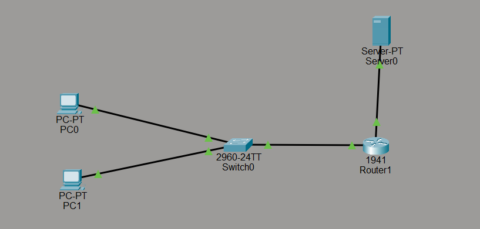
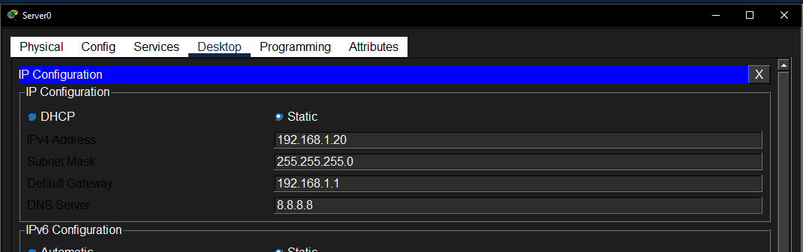
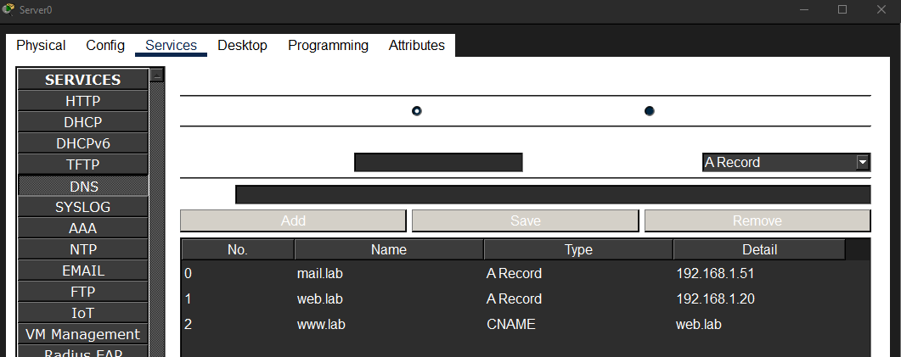
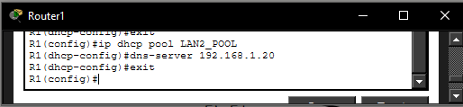
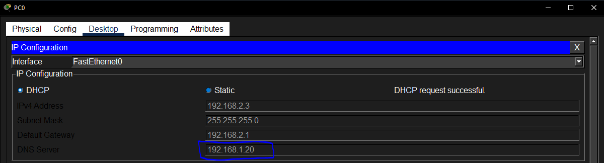
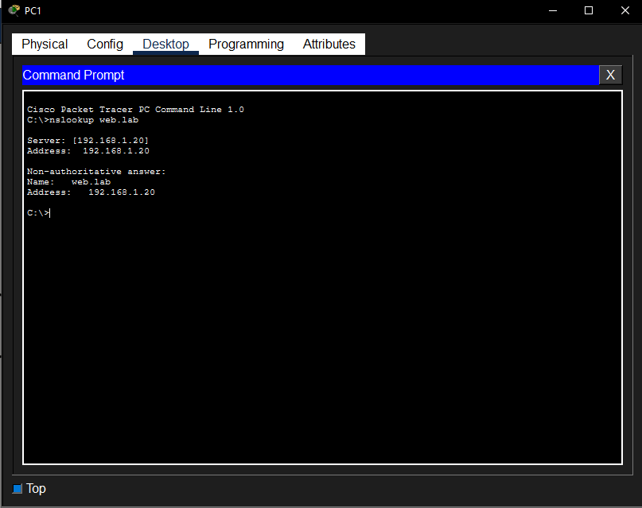
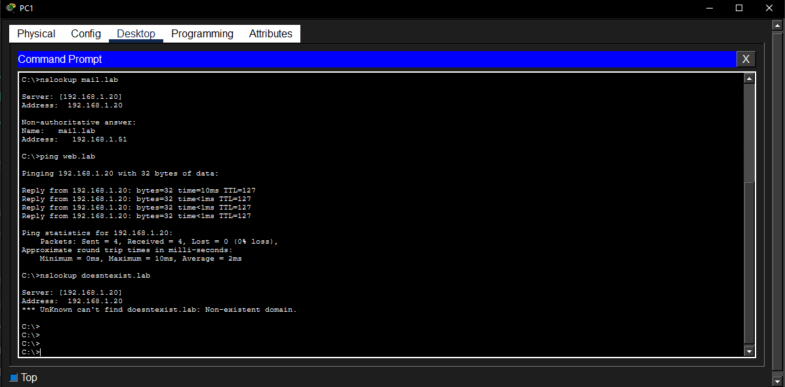

# DNS Server Lab

This lab builds on top of the routing and DHCP work from the previous lab. The goal was to set up a DNS server inside Packet Tracer, create custom DNS records, point DHCP clients at it, and verify that name resolution works correctly from the client machines.

The `.pkt` file is in `assets/` and can be opened in Packet Tracer.

---

# Topology



The topology uses a single Cisco 1941 router with two interfaces:

- `GigabitEthernet0/0` connects to Server0, which will act as the DNS server with a static IP
- `GigabitEthernet0/1` connects to a switch, which connects PC0 and PC1 as DHCP clients

The idea is that the DNS server sits on one subnet and the clients sit on the other. The router handles traffic between them.

---

# Step 1 - Exclude the DNS Server IP from DHCP


```
R1(config)# ip dhcp excluded-address 192.168.1.20
```

Before assigning a static IP to the server, its address needs to be excluded from the DHCP pool. If this step is skipped, the router might hand out that same IP to a DHCP client and cause a conflict. `192.168.1.20` is the address that will be manually assigned to the DNS server.

---

# Step 2 - Assign a Static IP to the DNS Server



In Server0's Desktop > IP Configuration, the mode is switched to Static and the following is set manually:

- IP Address: `192.168.1.20`
- Subnet Mask: `255.255.255.0`
- Default Gateway: `192.168.1.1`

The DNS server field here is just for Server0's own resolution and does not affect what the clients use. The important thing is that Server0 has a fixed, predictable IP that the router and clients can reliably point to.

---

# Step 3 - Configure DNS Records on the Server



In Server0's Services tab, DNS is enabled and three records are added:

| No. | Name | Type | Detail |
|---|---|---|---|
| 0 | mail.lab | A Record | 192.168.1.51 |
| 1 | web.lab | A Record | 192.168.1.20 |
| 2 | www.lab | CNAME | web.lab |

An **A Record** maps a hostname directly to an IP address. A **CNAME** (Canonical Name) is an alias that points to another hostname rather than an IP. Here `www.lab` is an alias for `web.lab`, so resolving either name eventually returns the same IP. This is how most real web servers work, where `www.domain.com` and `domain.com` point to the same place through a CNAME.

---

# Step 4 - Point the DHCP Pool at the DNS Server



```
R1(config)# ip dhcp pool LAN2_POOL
R1(dhcp-config)# dns-server 192.168.1.20
R1(dhcp-config)# exit
```

The DHCP pool for the client subnet is updated to hand out `192.168.1.20` as the DNS server address. Any client that renews its DHCP lease after this change will receive the new DNS server in its configuration.

---

# Step 5 - Clients Pick Up the New DNS Server



After refreshing DHCP on PC0, the IP Configuration shows `192.168.1.20` in the DNS Server field. The DHCP assignment was successful and PC0 will now send all DNS queries to Server0.

---

# Step 6 - Verify Name Resolution



```
C:\> nslookup web.lab
```

PC1 successfully resolves `web.lab` to `192.168.1.20`. The response shows the DNS server that answered (`192.168.1.20`) and the resolved address. This confirms the A Record is working correctly.

---

# Step 7 - Full Verification



```
C:\> nslookup mail.lab
C:\> ping web.lab
C:\> nslookup doesntexist.lab
```

Three tests run from PC1:

`nslookup mail.lab` resolves correctly to `192.168.1.51`, confirming the second A Record is working.

`ping web.lab` does not just ping an IP, it first resolves the name to `192.168.1.20` and then sends ICMP packets to that address. All four packets get replies, which means both DNS resolution and routing across subnets are working correctly.

`nslookup doesntexist.lab` returns `Non-existent domain`, which is the expected behaviour for a domain not in the DNS records. This confirms the server is properly authoritative and not just returning random results.

---

# Key Concepts

- **A Records** map a hostname to an IP directly. They are the most common DNS record type.
- **CNAME records** are aliases. They point to another hostname rather than an IP, which means they chain through an A Record to get the final address.
- **DNS and DHCP work together.** DHCP hands out the DNS server address alongside the IP, gateway, and subnet mask. Without that, clients would need DNS configured manually.
- **Excluding static IPs from DHCP is essential.** Any device with a manually assigned IP needs to have that IP excluded from the DHCP pool first.
- **nslookup is the basic DNS diagnostic tool.** A successful lookup proves resolution works. A failed lookup on a nonexistent domain proves the server is actually authoritative rather than just passing queries somewhere else.

---

# Lab File

- [assets/DNS_lab.pkt](assets/DNS_lab.pkt)

---

# Environment

- Simulation: Cisco Packet Tracer
- Devices: Cisco 1941 router, Cisco 2960 switch, Server-PT, two PC-PT clients
