# DNS Querying on Linux

This section covers practical DNS querying tools available on Linux: `dig`, `host`,
`nslookup`, and `resolvectl`. These tools let you inspect DNS records, test resolution
paths, override local resolution, and understand how your system resolves names.

## Installation

```bash
sudo apt install -y dnsutils
```

Installs `dig` and `host` on Debian/Ubuntu systems. `nslookup` is included in the
same package. `resolvectl` is part of `systemd` and is available by default on
Ubuntu 24.04.

---

## dig

`dig` (Domain Information Groper) is the standard tool for querying DNS servers
directly. It gives detailed output broken into sections: header, question, answer,
and statistics.

### Basic A record query

```bash
dig google.com
```

Queries the system's configured DNS resolver for A records (IPv4 addresses) for
`google.com`. The answer section returns 6 A records because Google load-balances
across multiple IPs. The header shows `ANSWER: 6`, confirming six records were
returned. `IN` stands for Internet Class, the standard DNS class for public internet
records.

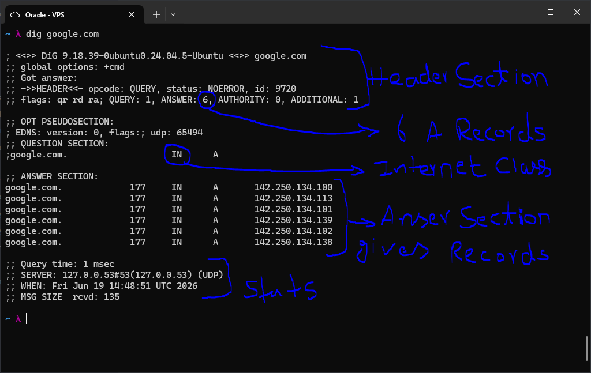

### MX record query

```bash
dig google.com MX
```

Queries for Mail Exchanger records. The answer shows `smtp.google.com` with a
priority of 10. The TTL value (300 seconds here) tells resolvers how long to cache
this record before querying again. The server line (`127.0.0.53`) confirms the query
went through systemd-resolved, which acts as the local stub resolver.

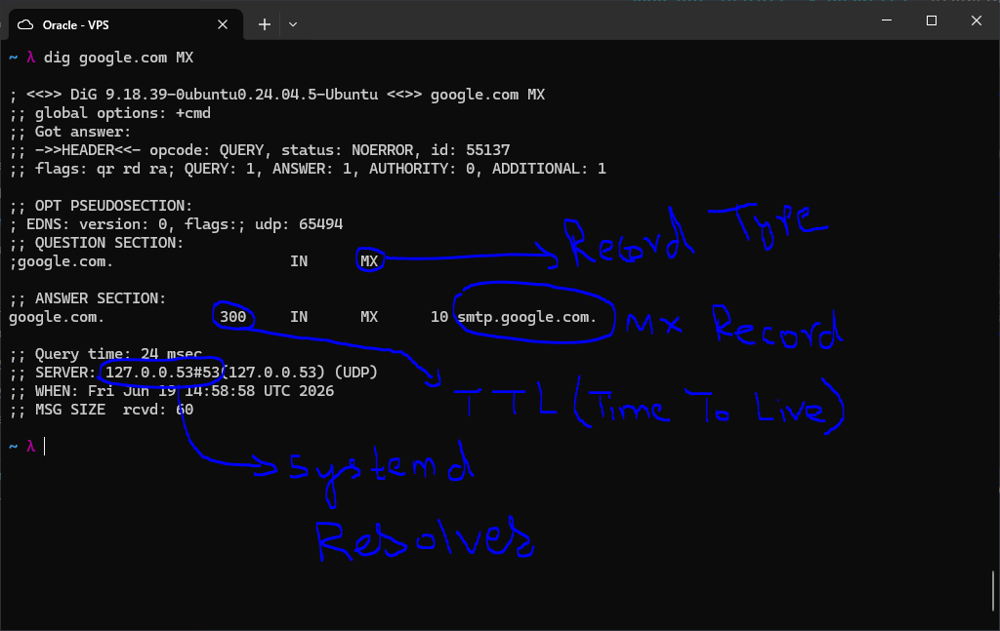

### NS record query

```bash
dig google.com NS
```

Returns the authoritative nameservers for the domain. Google has four: ns1 through
ns4.google.com. The additional section includes their A and AAAA records (IPv4 and
IPv6 addresses respectively), which dig fetches automatically to save an extra
lookup. The larger MSG SIZE (287 bytes vs 135 for a simple A query) reflects the
extra data returned.

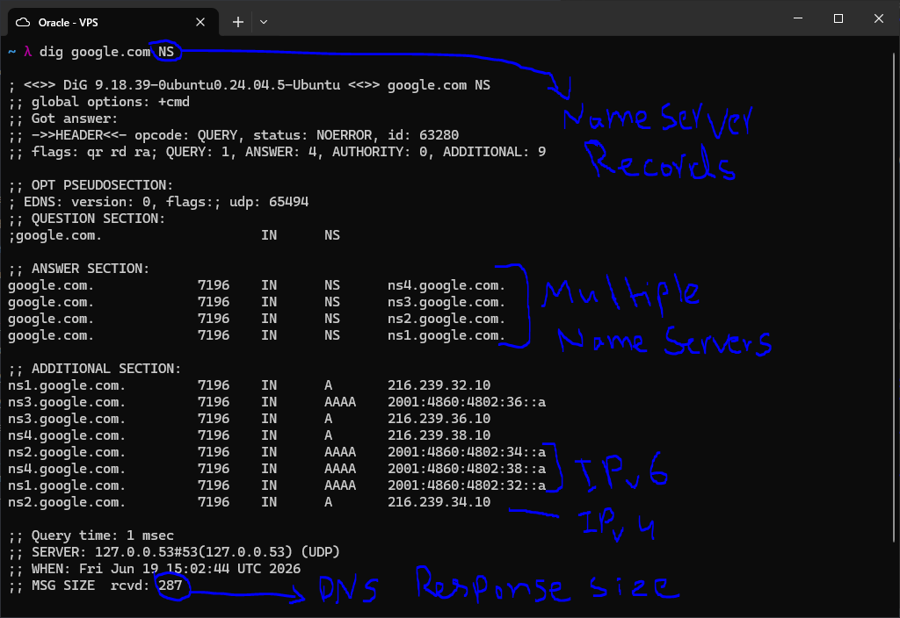

### Query a specific DNS server

```bash
dig @1.1.1.1 google.com
```

The `@` flag overrides the system resolver and sends the query directly to the
specified server -- in this case Cloudflare's public DNS at 1.1.1.1. The stats
section confirms the server used was `1.1.1.1#53`. This is useful for comparing
results between resolvers or testing what a specific server returns.

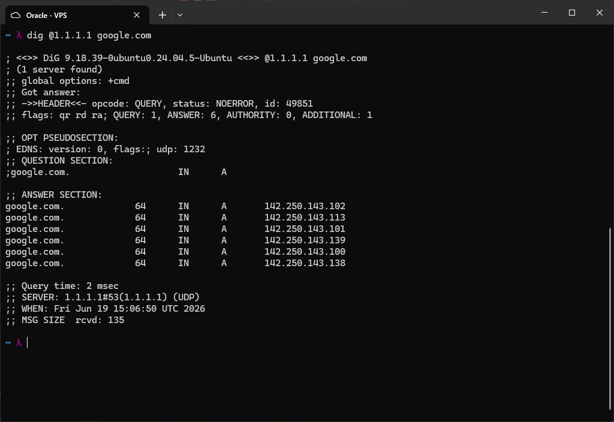

### Trace full resolution path

```bash
dig +trace google.com
```

Simulates the full recursive resolution process step by step: root servers, then
.com TLD servers, then Google's authoritative nameservers. This shows how DNS
actually works from the ground up. The `network unreachable` lines for IPv6
addresses are expected -- the VPS has no IPv6 routing to those root server
addresses, so dig falls back to IPv4 automatically.

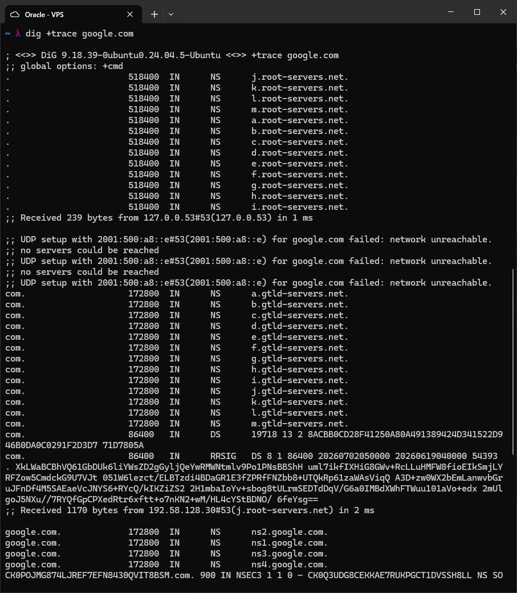

### Short output and the host command

```bash
dig +short google.com          # returns only the IP addresses
dig +short google.com MX       # returns only the mail server entries
host google.com                # simple human-readable lookup
host -t MX google.com          # lookup a specific record type
```

`+short` strips all headers and returns just the answer data. The `host` command is
a simpler alternative to `dig` that outputs results in plain English. It returns A
records, AAAA records, and MX records in one shot by default.

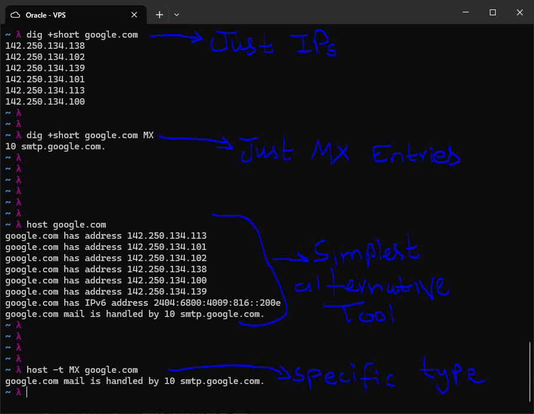

---

## /etc/hosts

`/etc/hosts` is a static local file that the OS consults before making any DNS
query. Entries here take priority over DNS -- whatever is listed in this file is
what the system uses, regardless of what the DNS server says.

### Viewing the file

```bash
cat /etc/hosts
```

The default file maps `127.0.0.1` to `localhost` and includes standard IPv6
loopback and multicast entries. These are local-only mappings that never touch the
network.

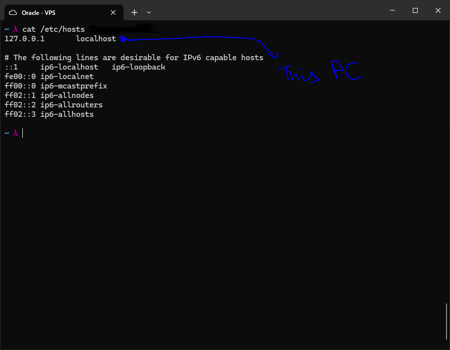

### Adding entries

```bash
echo "127.0.0.1 test.internal" | sudo tee -a /etc/hosts
echo "1.2.3.4 google.com" | sudo tee -a /etc/hosts
```

`tee -a` appends the string to the file with root privileges without needing to
open an editor. The first command creates a custom internal name that resolves to
localhost. The second overrides `google.com` to point to a fake IP, which
demonstrates how hosts file entries take precedence over real DNS.

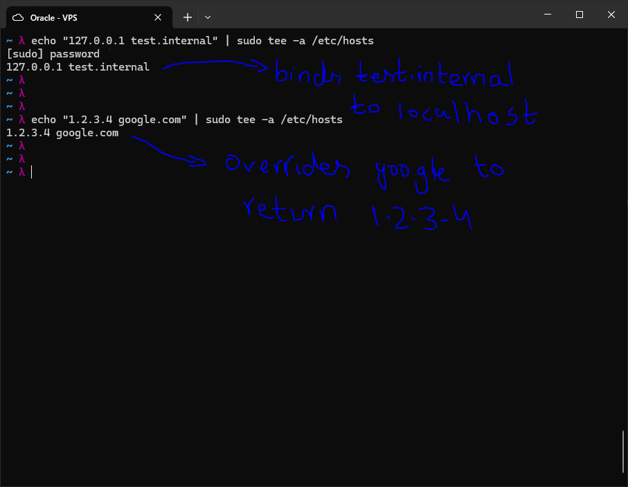

### Observing the override

```bash
dig +short google.com      # returns 1.2.3.4 -- hosts file takes effect
ping -c 1 google.com       # resolves to 1.2.3.4, results in 100% packet loss
getent hosts google.com    # shows what the OS resolver returns: 1.2.3.4
```

Even `dig`, which is a DNS querying tool, cannot bypass the hosts file on this
system because it goes through systemd-resolved, which respects the hosts file
first. `getent hosts` is the most accurate way to see what the OS resolver will
actually return for a name, as it follows the same lookup order the system uses.

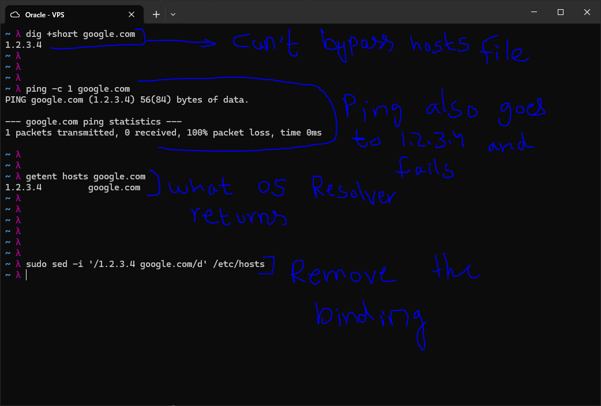

### Removing an entry

```bash
sudo sed -i '/1.2.3.4 google.com/d' /etc/hosts
```

Deletes the matching line from the file in-place. After this, `google.com` resolves
normally again via DNS.

### Real-world uses

- Block ads or trackers: `0.0.0.0 ads.doubleclick.net`
- Test a site before DNS propagates: `203.0.113.10 mysite.com`
- Create internal names for lab machines: `192.168.1.10 devserver.local`

---

## nslookup

`nslookup` is an older interactive DNS query tool. It works similarly to `dig` but
uses a conversational interface and is available on both Linux and Windows, making
it useful for cross-platform troubleshooting.

```bash
nslookup                      # enter interactive mode
> server 8.8.8.8              # switch to Google's public DNS
> set type=MX                 # query MX records
> google.com                  # run the query
> set type=A                  # switch to A records
> set debug                   # enable verbose output showing full query and answer
> google.com                  # run again with debug output
```

In debug mode, `nslookup` shows the full question and answer structure, including
TTL and record class, similar to `dig`'s default output. The `Non-authoritative
answer` label means the result came from a cache, not directly from Google's own
nameservers.

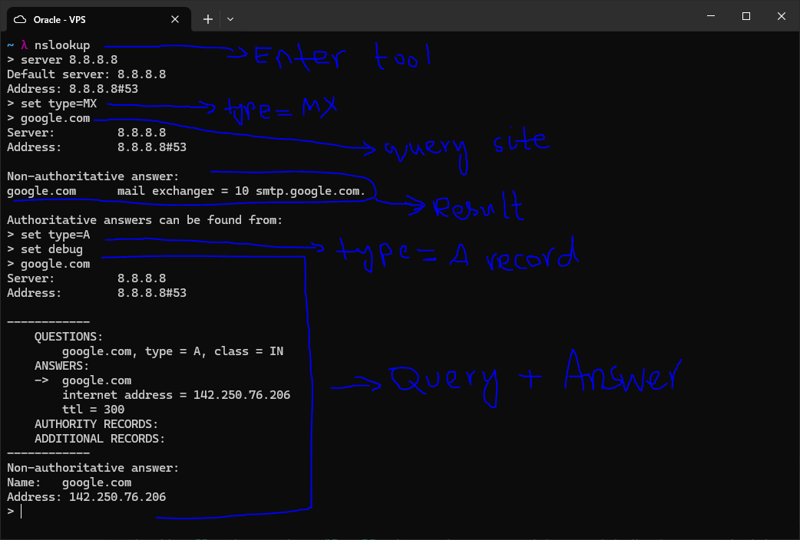

---

## resolvectl

`resolvectl` is the control interface for `systemd-resolved`, the DNS resolver
daemon that Ubuntu 24.04 uses by default. It manages DNS per network interface and
maintains a local cache.

```bash
resolvectl status
```

Shows the active DNS configuration per interface. On this VPS, the primary
interface `ens3` uses `169.254.169.254` as its DNS server -- this is Oracle Cloud's
internal metadata and DNS service address. The VCN domain is the internal Oracle
network domain for this instance.

```bash
resolvectl query google.com
```

Resolves a name through systemd-resolved directly, with verbose output showing
which interface handled the query, whether the result was authenticated (DNSSEC),
and whether it came from cache or the network.

```bash
resolvectl flush-caches
```

Clears the local DNS cache held by systemd-resolved. Useful when testing DNS
changes or after modifying `/etc/hosts`, to ensure the resolver picks up fresh
data.

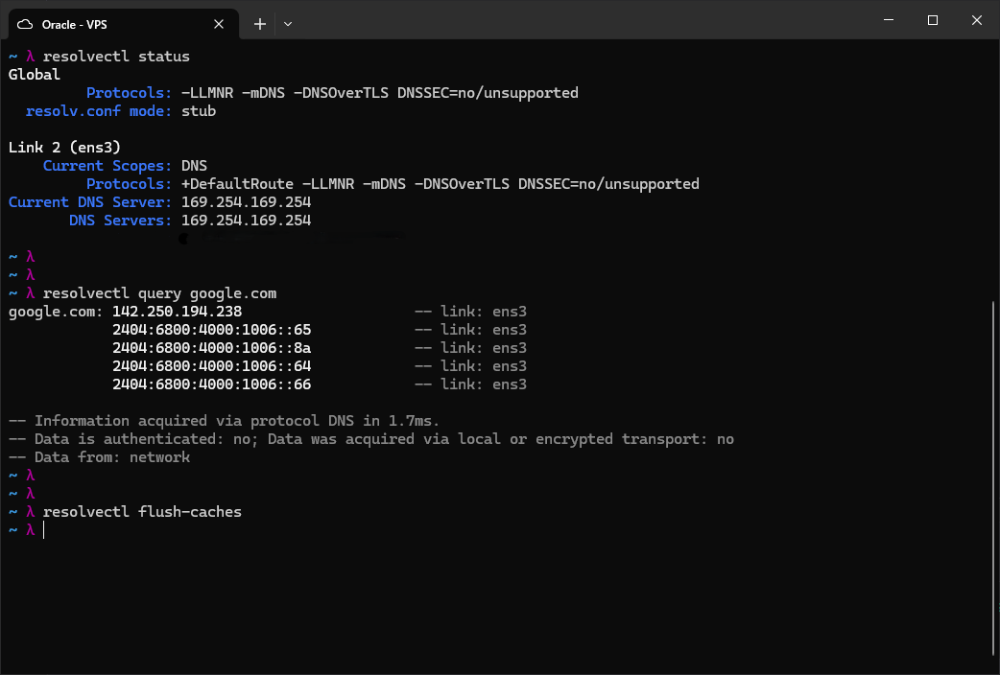
