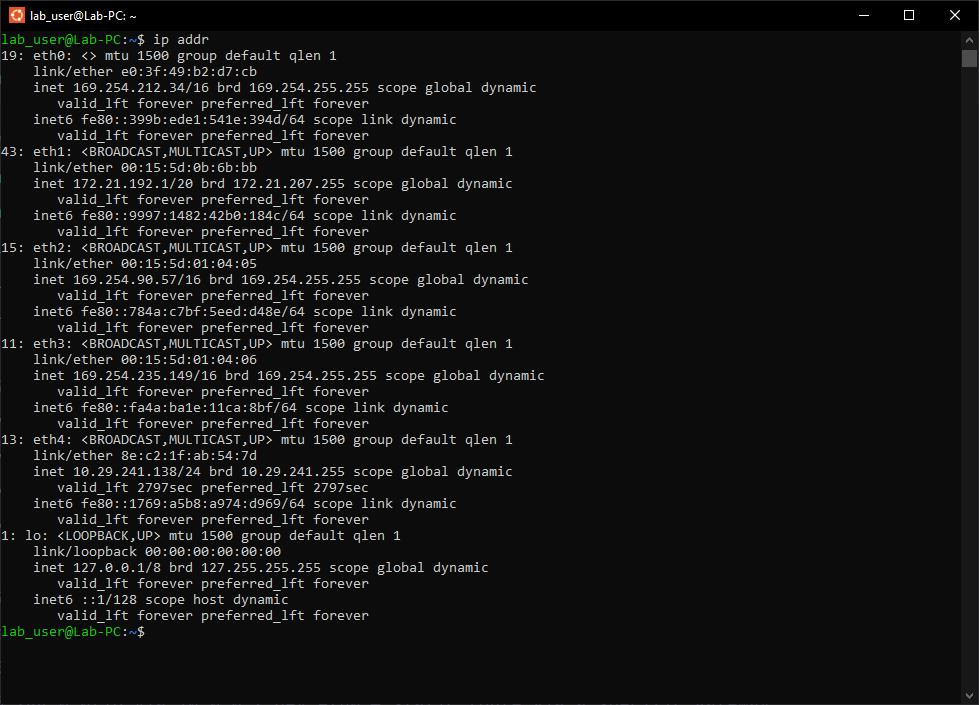
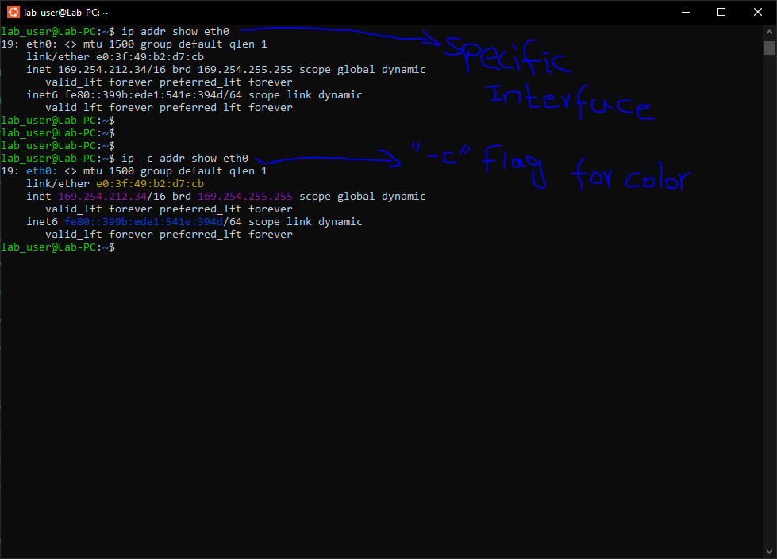
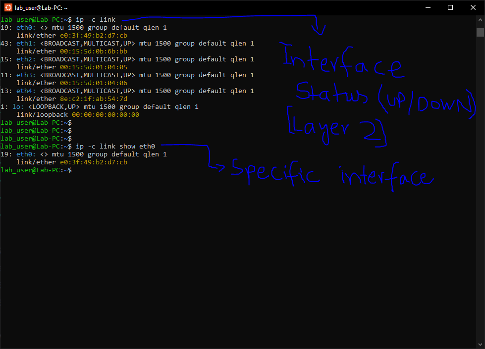
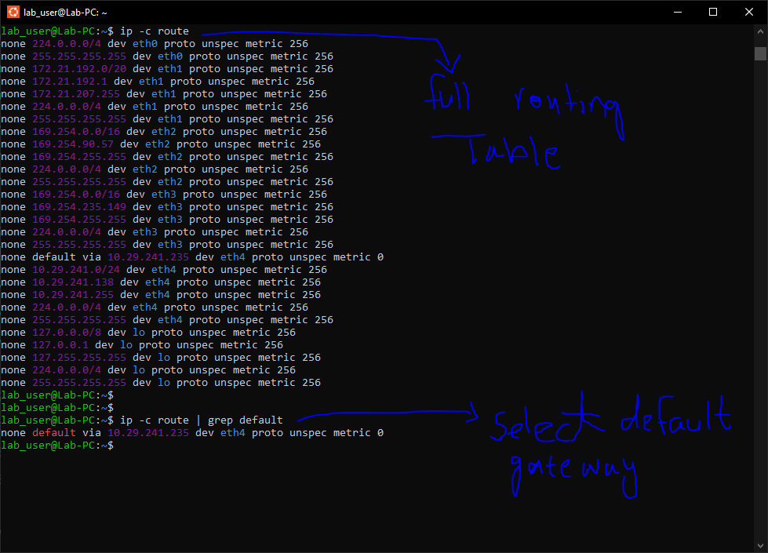
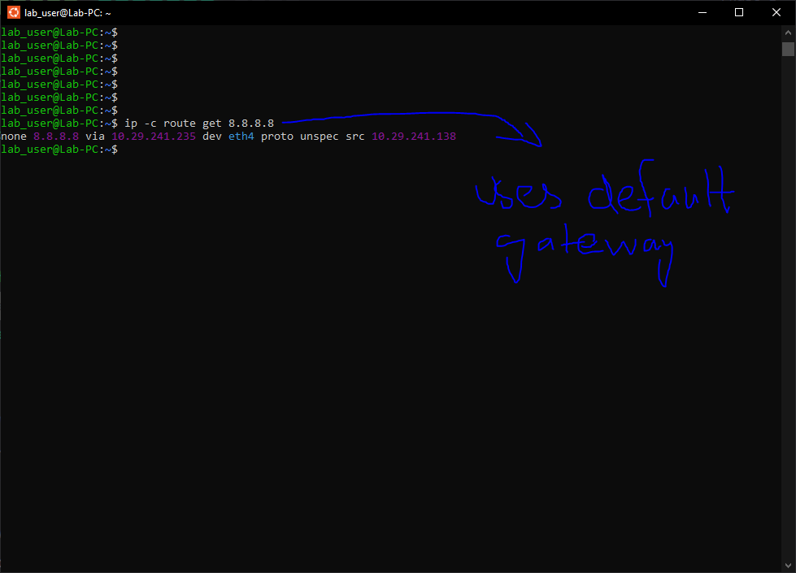
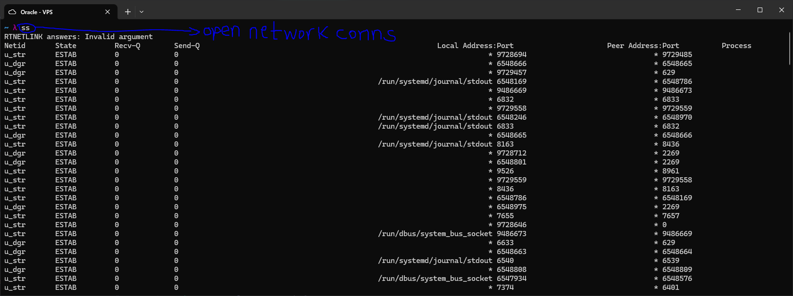
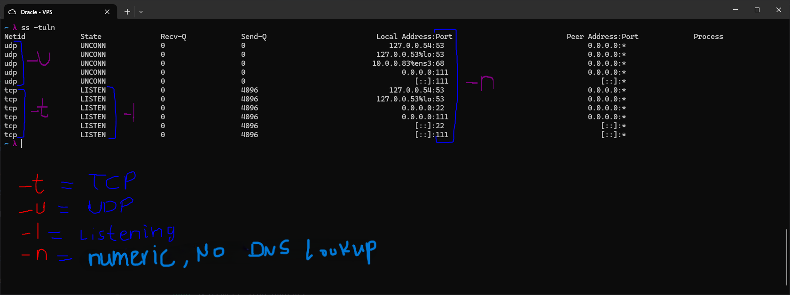
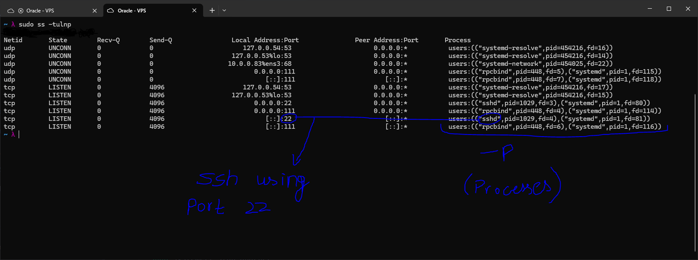

# ip and ss

Tools for inspecting network interfaces, routing tables, and active
connections directly from the Linux command line.

These exercises were done on WSL (Ubuntu) rather than the Oracle VPS to avoid
accidentally taking down a network interface and locking myself out of the
remote machine.

---

## ip addr

`ip addr` shows all network interfaces along with their assigned IP addresses,
both IPv4 and IPv6.

```bash
ip addr
```



The output includes physical and virtual Ethernet interfaces, plus the
loopback interface (`lo`). Each interface entry shows its MAC address
(`link/ether`), IPv4 address with subnet (`inet`), and IPv6 link-local
address (`inet6`).

To inspect a single interface:

```bash
ip addr show eth0
```

Adding `-c` enables colored output, which makes it easier to distinguish
addresses, flags, and metadata at a glance:

```bash
ip -c addr show eth0
```



---

## ip link

`ip link` shows Layer 2 (data link layer) information: interface state
(UP/DOWN) and MAC addresses, without IP address details.

```bash
ip -c link
```



To check a specific interface:

```bash
ip -c link show eth0
```

This is useful for confirming whether an interface is physically up before
troubleshooting IP-level connectivity.

---

## ip route

`ip route` displays the kernel routing table -- the rules the system uses to
decide where to send outgoing packets.

```bash
ip -c route
```



The table can be long on machines with multiple interfaces. To extract just
the default gateway:

```bash
ip -c route | grep default
```

The default route is used for any destination that does not match a more
specific entry in the table.

To ask the kernel exactly which route it would use to reach a specific IP:

```bash
ip -c route get 8.8.8.8
```



The output confirms that traffic to `8.8.8.8` would exit through the default
gateway, as expected for an external address.

---

## ss (Socket Statistics)

`ss` is the modern replacement for `netstat`. It shows open network
connections and listening ports on the system.

Running `ss` without any flags dumps every open socket, including many
internal Unix domain sockets used by systemd and dbus:

```bash
ss
```



### Filtering to useful output

The most practical combination for checking what is listening on the network:

```bash
ss -tuln
```



| Flag | Meaning |
|------|---------|
| `-t` | Show TCP sockets |
| `-u` | Show UDP sockets |
| `-l` | Show only listening sockets |
| `-n` | Numeric mode -- show port numbers instead of service names |

### Identifying which process owns a socket

Adding `-p` includes the process name and PID for each socket. This requires
`sudo` to see processes owned by other users:

```bash
sudo ss -tulnp
```



In this output, port 22 is held by `sshd` -- the active SSH daemon. Port 111
is `rpcbind`. This makes it easy to confirm which service is behind any open
port.

### Practical use case

After installing and starting a web server, `ss` can confirm it is actually
listening before testing it in a browser:

```bash
sudo systemctl start apache2
ss -tlnp | grep :80    # port 80 should appear

sudo systemctl stop apache2
ss -tlnp | grep :80    # port 80 should disappear
```

This pattern is useful any time you start a new service and want to verify it
bound to the expected port.
