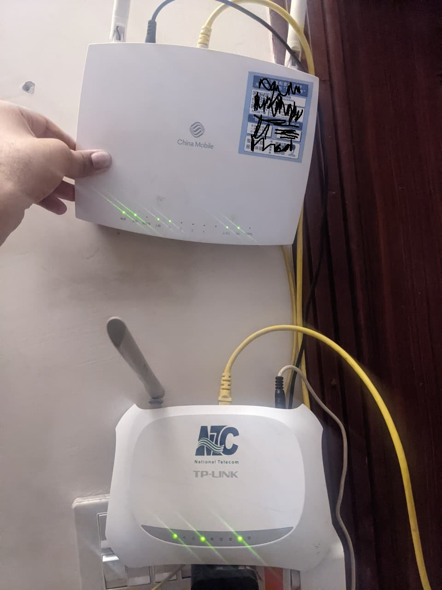

# Lab Setup - Router Workaround

Before any real hardware networking practice could happen, there was a problem to solve. This documents how it was worked around.

---

## The Problem

The main router at home is a China Mobile ISP-issued unit with locked firmware. Advanced settings including static IP assignment, custom DNS, port forwarding, and any kind of routing configuration are either hidden or disabled entirely. There is no way through the admin panel to change this since the ISP deliberately restricts it.

A spare TP-Link ADSL2+ router was available. It has all those settings fully accessible. The catch was that its WAN port is a DSL port (RJ-11 phone jack), not a standard ethernet jack. This means it cannot receive a connection from the main router's LAN port the conventional way since the connectors are physically incompatible.

---

## The Workaround

Rather than treating the TP-Link as a second internet gateway (which the hardware could not support anyway), it was repurposed as a configurable LAN-side device using a simple LAN-to-LAN ethernet connection.

```
[ISP] ──► [China Mobile Router] ──LAN──► [TP-Link TL-XXXX]
              192.168.1.1                    192.168.1.2
              (ISP-locked)                   (fully unlocked)
```

One ethernet cable from a LAN port on the China Mobile router into a LAN port on the TP-Link. Not the DSL port, not a WAN port, just a standard LAN port. The TP-Link is not acting as a router or gateway in this setup. It sits inside the existing network as a managed node with its own admin panel accessible at a static IP.



---

## The IP Conflict Problem

The TP-Link's default admin IP was `192.168.1.1`, which is the same as the China Mobile router. Plugging them together immediately would create an IP conflict and make both inaccessible.

The fix was to temporarily isolate the TP-Link by connecting directly to it from a laptop with no other network connection, change its LAN IP from `192.168.1.1` to `192.168.1.2` in the admin panel, then reconnect it to the main router. After that, both routers are accessible independently at their respective addresses.

---

## What This Unlocked

| Feature | China Mobile Router | TP-Link Lab Router |
|---|---|---|
| DHCP server control | Locked | Full access |
| DHCP reservations by MAC | Locked | Full access |
| Custom DNS | Locked | Full access |
| Static routes | Locked | Full access |
| Port forwarding | Locked | Configurable |
| Internet access | Yes | Yes, through main router |

The TP-Link now acts as the lab's configurable network device. Its DHCP server hands out addresses in the `192.168.1.100` range to devices connected to it, and its admin panel is fully accessible at `192.168.1.2` at any time.

---

## What This Taught

- ISP firmware locks are a real-world constraint that sysadmins and network engineers regularly encounter. The answer is usually to work around them logically rather than try to break them.
- A router does not need to be the internet gateway to be useful. Any device with a configurable network stack can serve as a lab device when connected to an existing network.
- IP conflict resolution is a practical skill. Two devices sharing the same IP on the same subnet will cause both to become unreachable. The solution is always to isolate first, reconfigure, then reconnect.
- Physical hardware constraints do not always require new hardware. The DSL WAN port limitation was bypassed entirely by using the LAN ports instead and rethinking the role of the device.
