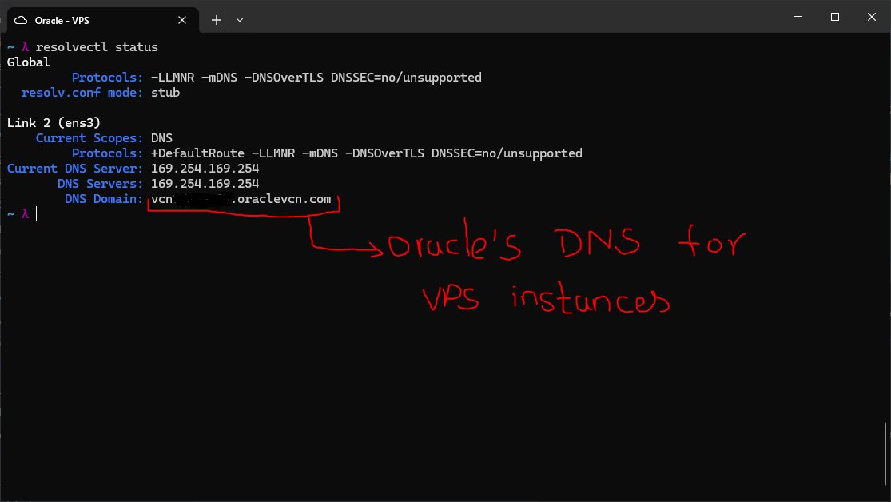

# DNS Providers and Resolution Order

---

## DNS Resolution Order

At the operating system level, a DNS query is resolved in the following order:

1. First, it checks the `/etc/hosts` file and keeps it above everything else.
   If a redirection is found in the file, it does not look any further.
2. Second, the local DNS cache is checked. A TTL (time to live) specifies how
   long a DNS result remains in cache after the first request. The cache can be
   cleared with `resolvectl flush-caches`.
3. Third, if there is no entry in the hosts file or local DNS cache for the
   domain in question, the OS asks its configured DNS server, which is
   typically set automatically by the router or manually inside the OS.

This order is important for diagnosing and troubleshooting DNS issues at the
OS level.

---

## DNS Providers

Three of the major DNS providers are Google (8.8.8.8), Cloudflare (1.1.1.1),
and Quad9 (9.9.9.9). I wrote a script to compare response times and determine
the fastest from my VPS:

```bash
for dns in 8.8.8.8 1.1.1.1 9.9.9.9; do
    echo "$dns : "
    dig @$dns +noall +stats 2>&1 | grep "Query time"
done
```

**Response:**
```bash
8.8.8.8: ;; Query time: 3 msec  
1.1.1.1: ;; Query time: 2 msec  
9.9.9.9: ;; Query time: 2 msec
```

Cloudflare and Quad9 both came in at 2ms, making Google's DNS the slowest of the three from this location.

---

## OS Default DNS



I checked the default DNS server on my VPS using `resolvectl status`. It
returned Oracle's own VCN DNS at `169.254.169.254` -- a link-local address
used internally by OCI to provide DNS resolution for virtualized instances
within the virtual cloud network.

---

# DNS Failure Diagnosis Playbook

A step-by-step guide to systematically identify and resolve DNS issues on a
Linux system.

## Step 1 -- Can the server ping a known IP address?

Before blaming DNS, confirm the network layer itself is working.

```bash
ping -c 2 8.8.8.8
```

| Result | Meaning | Action |
|--------|---------|--------|
| Success | Network layer works -- problem is DNS-specific | Continue to Step 2 |
| Failure | Network itself is broken (cable, routing, firewall) | Fix network first before proceeding |

---

## Step 2 -- What DNS server is configured?

Check which DNS resolver the system is pointing to.

```bash
cat /etc/resolv.conf
resolvectl status
```

| Result | Meaning | Action |
|--------|---------|--------|
| Shows a valid IP | DNS server is configured | Continue to Step 3 |
| Empty or wrong address | Misconfigured resolver | Fix `/etc/resolv.conf` or your DHCP config |

---

## Step 3 -- Can you reach the DNS resolver directly?

Test whether port 53 is accessible to an external resolver.

```bash
dig @8.8.8.8 google.com +short
```

| Result | Meaning | Action |
|--------|---------|--------|
| Returns an IP | Resolver is reachable and working | Continue to Step 4 |
| Timeout | Port 53 is blocked | Check UFW/firewall rules or verify the resolver is up |

---

## Step 4 -- Does the local resolver work?

Test whether the system's own configured resolver can resolve names.

```bash
dig google.com +short
```

| Result | Meaning | Action |
|--------|---------|--------|
| Returns an IP | Local resolution works fine | Continue to Step 5 |
| Fails | `systemd-resolved` is misconfigured | Run `systemctl status systemd-resolved` to investigate |

---

## Step 5 -- Is `/etc/hosts` overriding the answer?

A wrong entry in the hosts file can silently return a bad IP regardless of
what DNS says.

```bash
grep google.com /etc/hosts
getent hosts google.com
```

| Result | Meaning | Action |
|--------|---------|--------|
| No override found | Not a hosts file issue | Continue to Step 6 |
| Wrong IP in hosts file | Hosts file is hijacking the DNS answer | Edit `/etc/hosts` and remove the incorrect entry |

---

## Step 6 -- Is the DNS cache serving a stale record?

Flush the DNS cache and retry the lookup to rule out a cached bad answer.

```bash
resolvectl flush-caches
dig google.com
```

| Result | Meaning | Action |
|--------|---------|--------|
| Works after flush | Stale cache was the problem | No further action needed |
| Still fails | Domain may not exist (NXDOMAIN) or there is an upstream authoritative DNS issue | Investigate upstream DNS or verify the domain is valid |
