# curl, wget, and tcpdump

Tools for making HTTP requests from the command line and capturing raw network
traffic to observe what is actually crossing the wire.

---

## curl

curl makes HTTP requests, displays responses, follows redirects, and exposes
the full request and response cycle including TLS handshakes. It is the
standard tool for testing APIs and inspecting web server behavior from the
terminal.

### Fetching a page

```bash
curl https://example.com
```

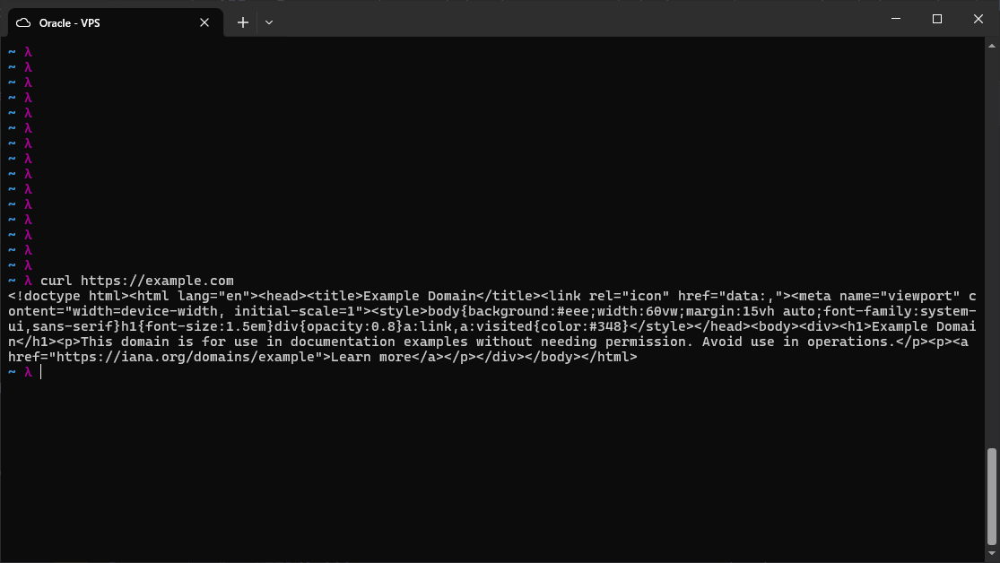

The full HTML response body is printed to stdout.

### Saving output to a file

```bash
curl -o output.html https://example.com
```

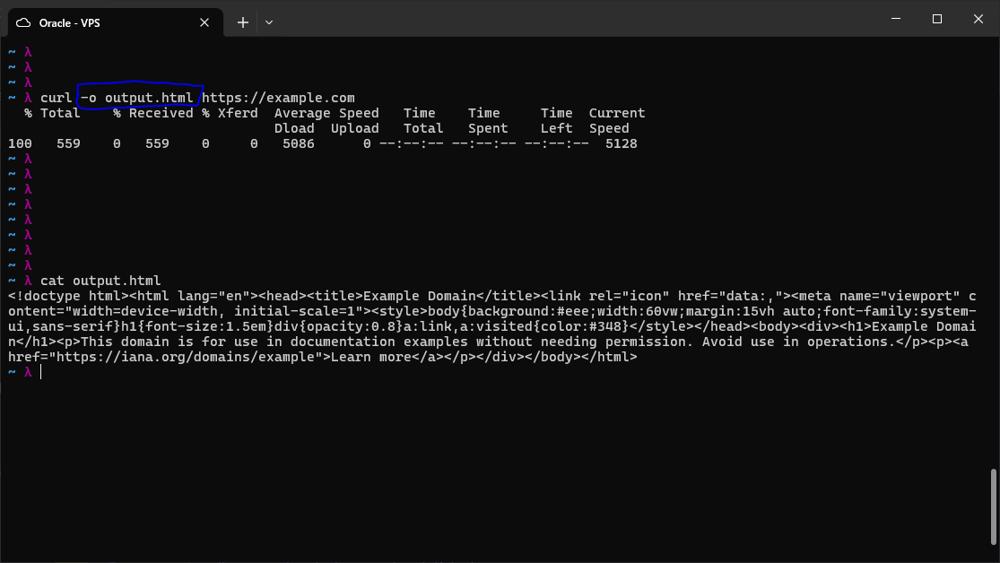

The `-o` flag redirects the response body to a file instead of the terminal.
The progress meter shows transfer speed and total bytes received.

### Fetching headers only

```bash
curl -I https://example.com
```

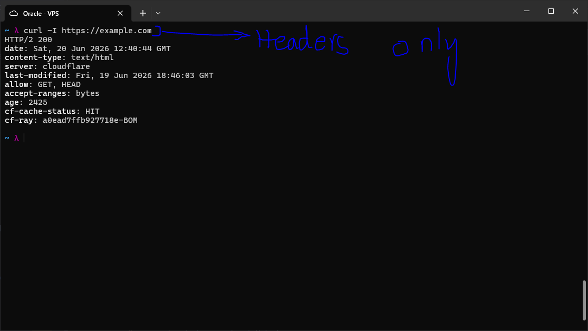

`-I` sends an HTTP HEAD request, which asks the server to return headers
without a body. This is useful for checking status codes, content type, cache
status, and what server software is running -- without downloading the full
page.

Add `-L` to follow redirects automatically when the server returns a 301 or
302 response.

### Verbose mode: the full HTTP timeline

```bash
curl -v https://example.com
```

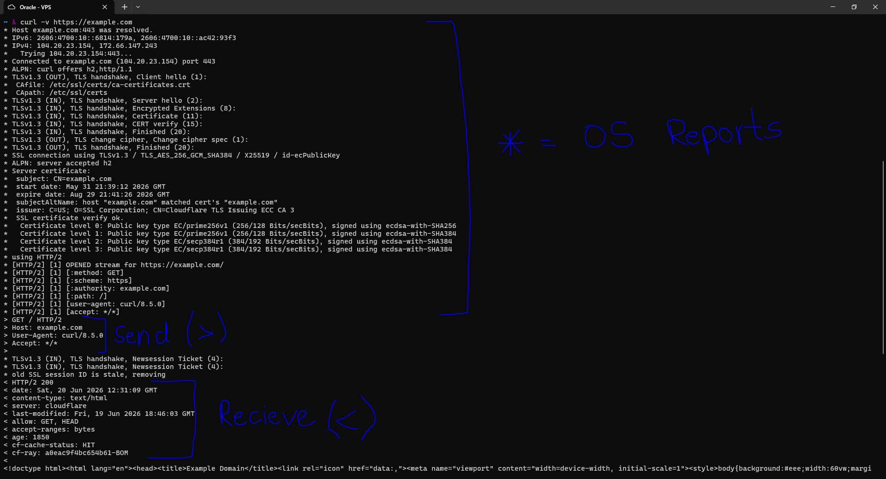

Verbose mode shows every stage of the connection:

| Prefix | Meaning |
|--------|---------|
| `*` | curl internal reports -- DNS resolution, TLS handshake steps, certificate details |
| `>` | Outbound request headers sent to the server |
| `<` | Inbound response headers received from the server |

This output is useful for debugging TLS issues, verifying which HTTP version
is being used, and confirming exactly what headers are being sent.

### Other useful flags

```bash
# Silent mode -- suppress progress bar
curl -s https://example.com

# Print only the HTTP status code
curl -w "%{http_code}\n" -s -o /dev/null https://example.com

# Send a custom User-Agent header
curl -A "My-Agent/1.0" https://example.com

# Add a custom request header
curl -H "X-Custom-Header: value" https://example.com

# Follow redirects
curl -L https://example.com
```

---

## wget

wget is built for downloading files rather than interactive request inspection.
Its main advantage over curl for downloads is the ability to resume interrupted
transfers.

```bash
# Basic download
wget https://example.com/file.tar.gz

# Resume an interrupted download
wget -c https://example.com/large.iso

# Quiet mode -- suppress output
wget -q https://example.com/file.tar.gz

# Save with a specific filename
wget -O /tmp/output.html https://example.com
```

---

## tcpdump

tcpdump captures raw packets directly off a network interface. It is the
command-line equivalent of Wireshark. The main use cases in a lab context are
watching DNS queries resolve in real time, observing TCP handshakes, and
demonstrating why unencrypted protocols are dangerous.

### Finding your default interface

Before running tcpdump on a VPS, check which interface carries default traffic:

```bash
ip route | grep default
```

The interface name next to `dev` (commonly `ens3` on Oracle Cloud) is what
you pass to tcpdump with `-i`.

### Capturing HTTP traffic

```bash
sudo tcpdump -i ens3 -n -A port 80
```

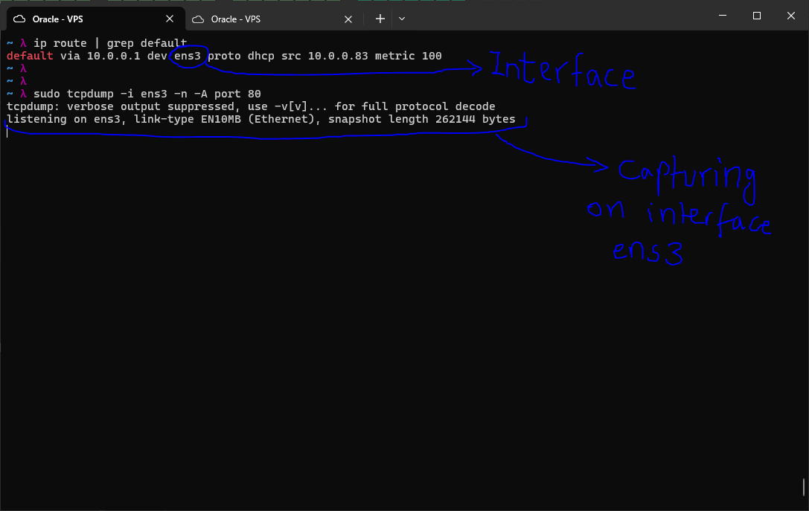

| Flag | Meaning |
|------|---------|
| `-i ens3` | Capture on this interface |
| `-n` | Numeric mode -- do not resolve IPs to hostnames |
| `-A` | Print packet payload as ASCII text |
| `port 80` | Filter to HTTP traffic only |

### Observing plaintext HTTP

With tcpdump running on port 80, running a header-only request against a
plain HTTP site:

```bash
curl -I http://httpforever.com/
```

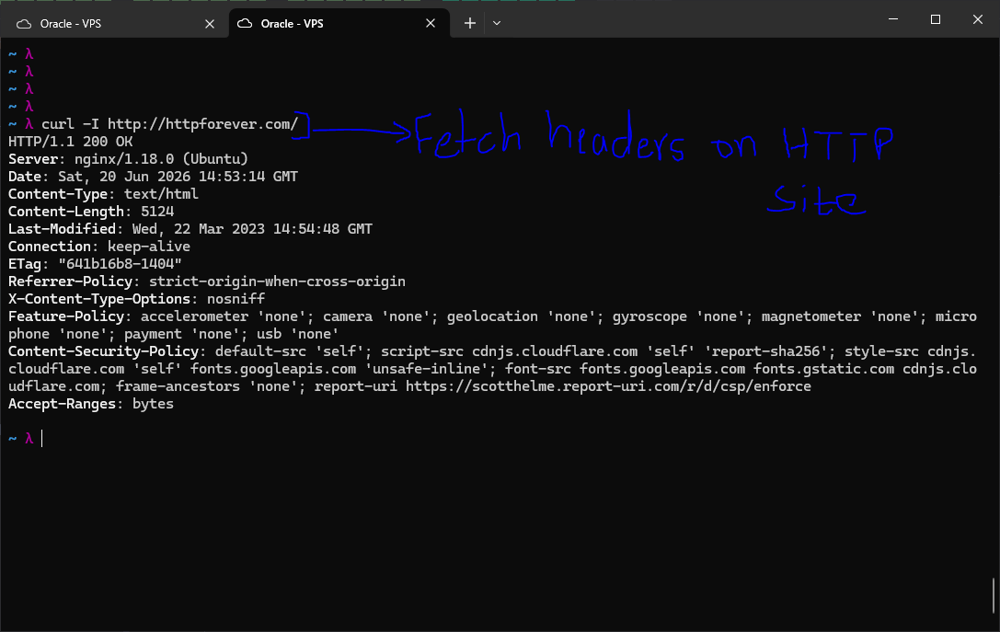

The response headers captured by tcpdump are fully readable in plaintext:

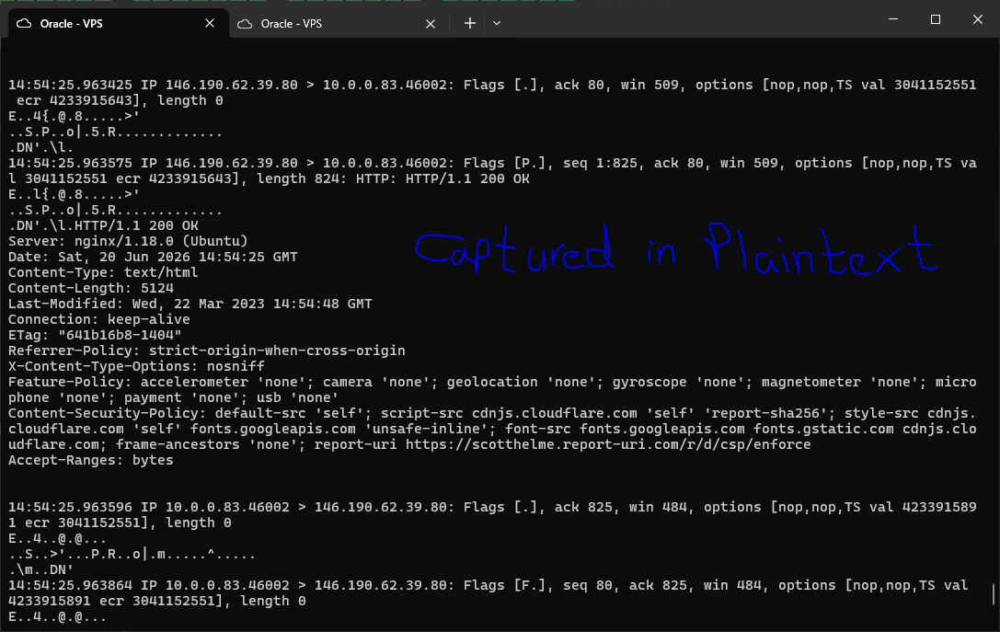

The entire server response -- status code, server software, content type,
security policy headers -- is visible to anyone on the network path. This is
the practical demonstration of why HTTPS is not optional.

### Capturing DNS queries

```bash
sudo tcpdump -i ens3 -n port 53
```

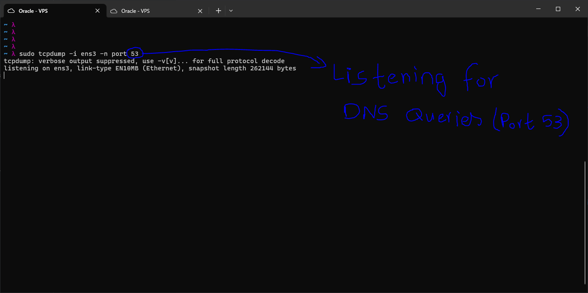

Port 53 carries DNS. With the capture running, trigger a DNS lookup in a
second terminal:

```bash
dig google.com
```

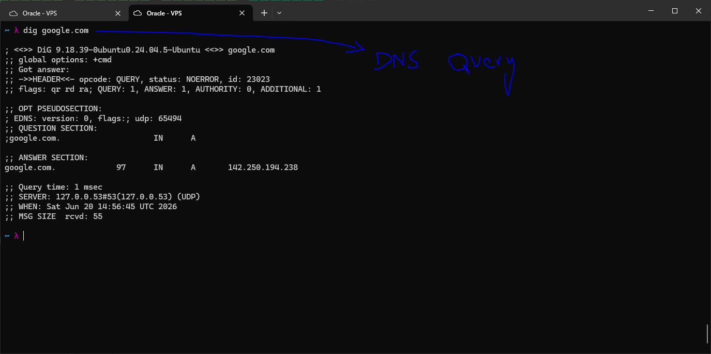

tcpdump captures both the outgoing query and the full response, showing every
A record returned:

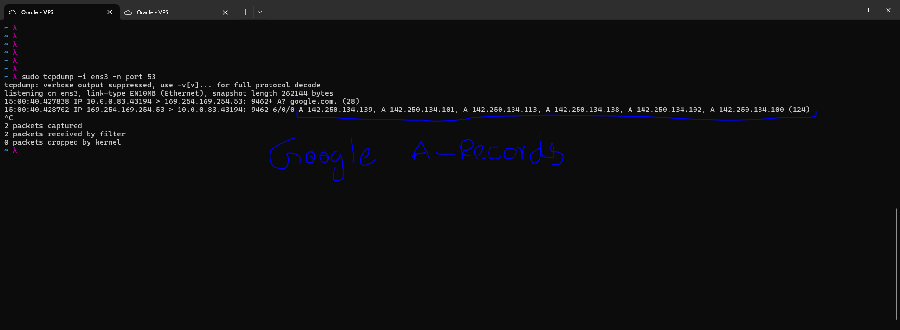

The two-packet exchange is visible: the query leaving the machine, and the
resolver returning multiple A records for google.com.

### Saving captures to a file

```bash
sudo tcpdump -i ens3 -n port 53 -w ./capture.pcap
```

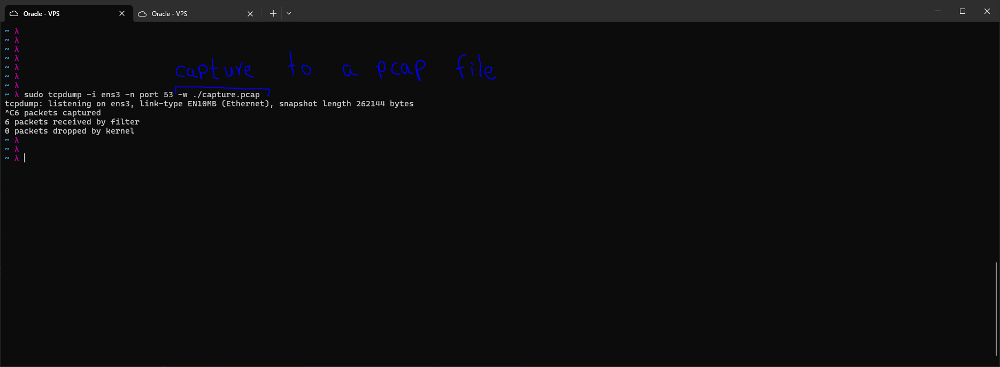

The `-w` flag writes captured packets to a `.pcap` file instead of printing
them to the terminal. The file can be opened in Wireshark for graphical
analysis, filtering, and protocol inspection.
