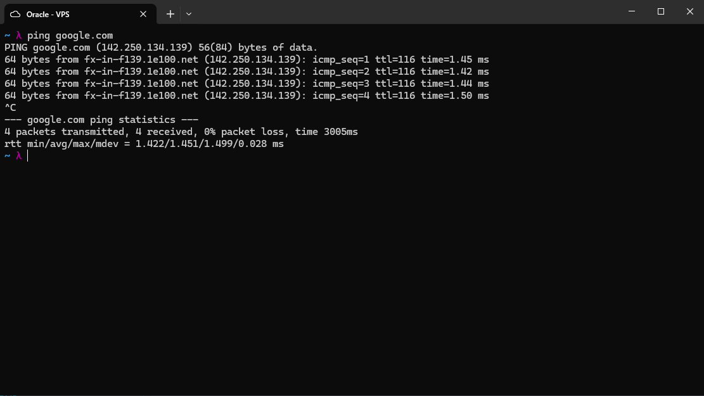
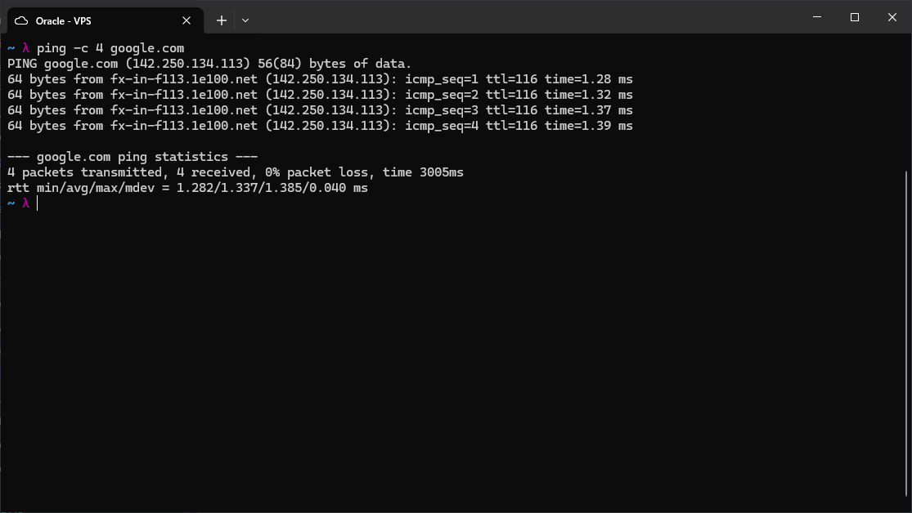
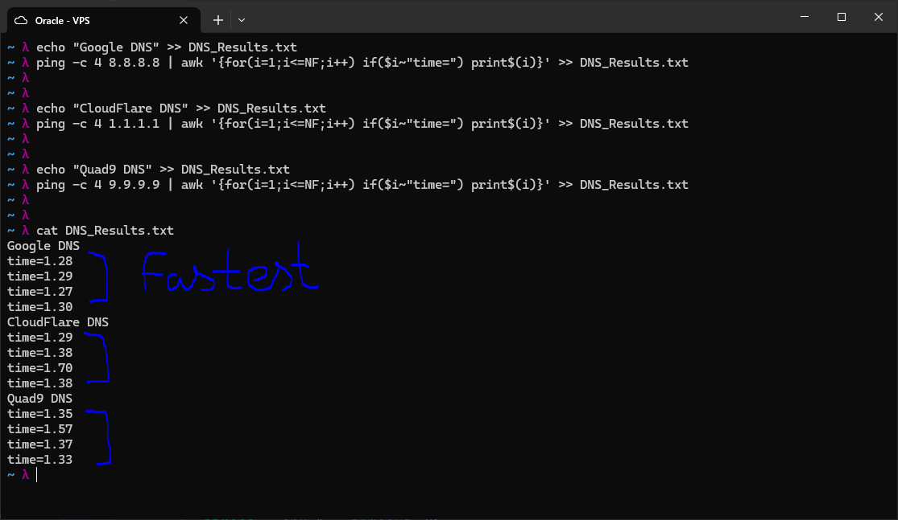
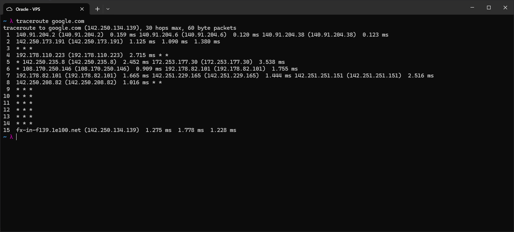
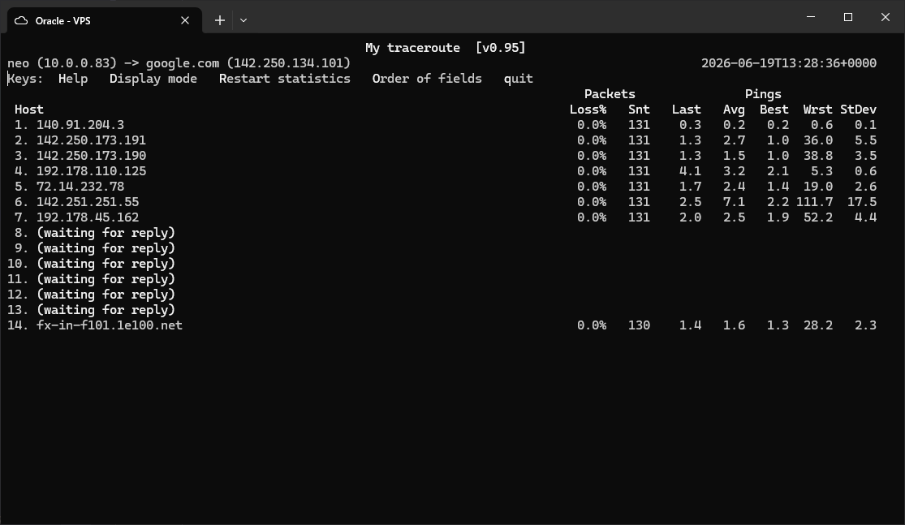
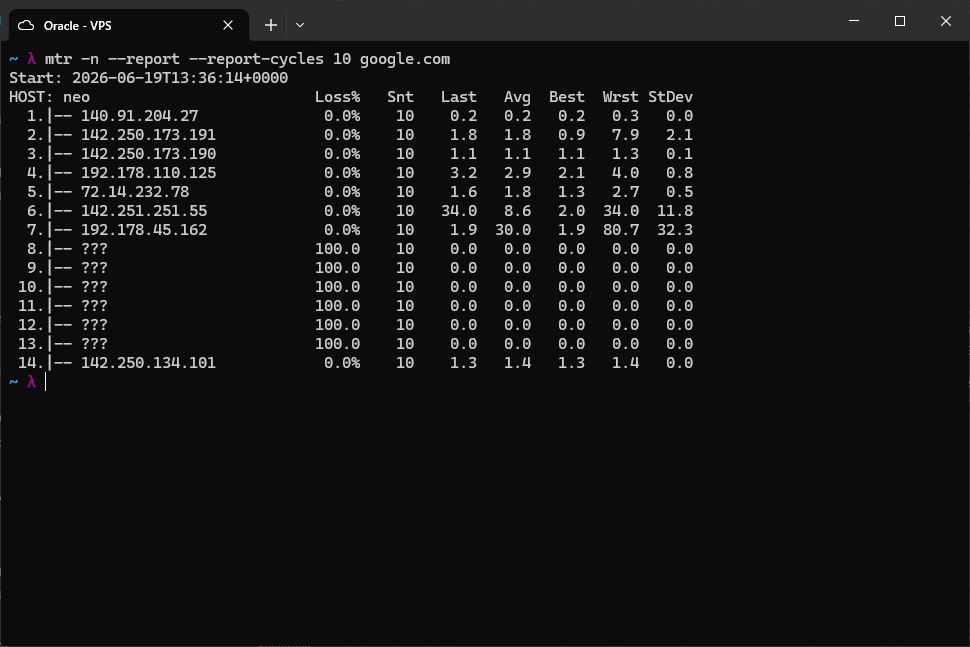
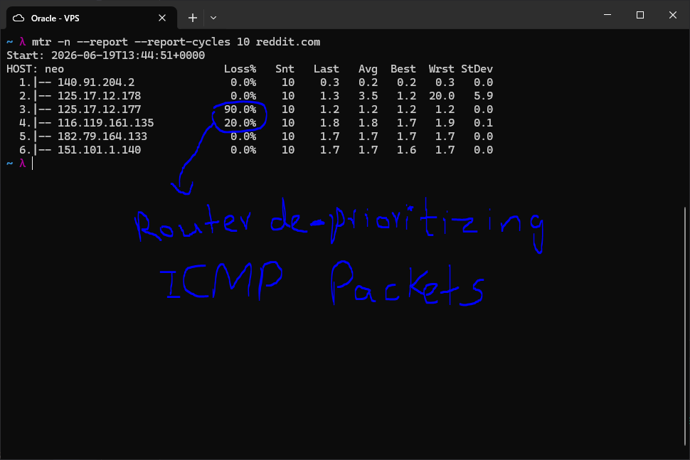

# Ping, Traceroute, and MTR

Tools for testing connectivity, measuring latency, and diagnosing where packet loss occurs along a network path.

## Ping

Install ping if not already available:

```bash
sudo apt install -y iputils-ping
```

Basic ping sends ICMP echo requests continuously until interrupted with Ctrl+C:

```bash
ping google.com
```



Use `-c` to send a fixed number of packets and exit automatically:

```bash
ping -c 4 google.com
```



### DNS Latency Comparison

Ping can be used to compare round-trip latency to different DNS resolvers. The
`awk` expression extracts only the `time=` field from each reply line and
appends it to a results file, keeping the output clean.

```bash
echo "Google DNS" >> DNS_Results.txt
ping -c 4 8.8.8.8 | awk '{for(i=1;i<=NF;i++) if($i~"time=") print$(i)}' >> DNS_Results.txt

echo "CloudFlare DNS" >> DNS_Results.txt
ping -c 4 1.1.1.1 | awk '{for(i=1;i<=NF;i++) if($i~"time=") print$(i)}' >> DNS_Results.txt

echo "Quad9 DNS" >> DNS_Results.txt
ping -c 4 9.9.9.9 | awk '{for(i=1;i<=NF;i++) if($i~"time=") print$(i)}' >> DNS_Results.txt

cat DNS_Results.txt
```



From this VPS, Google DNS (8.8.8.8) had the lowest and most consistent
latency, while Cloudflare (1.1.1.1) showed higher variation across the four
packets.

---

## Traceroute

Traceroute maps the path packets take to a destination by sending probes with
incrementing TTL values. Each hop decrements the TTL by one; when it hits
zero, that router sends back an ICMP Time Exceeded message, revealing its
address and latency.

```bash
traceroute google.com
```



Hops showing `* * *` did not respond to the probes. This is normal -- many
routers silently drop traceroute packets for security or traffic management
reasons. The path still completed successfully at hop 15.

---

## MTR (My Traceroute)

MTR combines ping and traceroute into a single tool. It continuously probes
every hop and updates statistics in real time, making it more useful than a
one-shot traceroute for diagnosing intermittent issues.

Install MTR:

```bash
sudo apt install -y mtr
```

### Interactive Mode

```bash
mtr google.com
```



This opens a live interface that refreshes continuously. Press `q` to quit.
The columns show:

| Column | Meaning |
|--------|---------|
| Host | IP address of that hop |
| Loss% | Packet loss percentage at that hop |
| Snt | Total packets sent |
| Last | Latency of the most recent probe (ms) |
| Avg | Average latency across all probes (ms) |
| Best | Lowest latency seen (ms) |
| Wrst | Highest latency seen (ms) |
| StDev | Jitter -- how consistent the latency is |

### Report Mode

The `-n` flag skips reverse DNS lookups, `--report` prints a summary and
exits, and `--report-cycles` sets how many probes to send per hop:

```bash
mtr -n --report --report-cycles 10 google.com
```



### Reading Loss% Correctly

Loss at an intermediate hop does not always mean a real problem. Routers can
be configured to de-prioritize or rate-limit ICMP packets (the probe type MTR
uses) while still forwarding regular traffic normally.

```bash
mtr -n --report --report-cycles 10 reddit.com
```



In this output, hops 3 and 4 show 90% and 20% loss respectively, but hop 6
(the destination) shows 0% loss. This confirms the intermediate routers are
de-prioritizing ICMP probes -- not dropping actual traffic. The rule of thumb:

- Loss at an intermediate hop, but 0% at the final destination = ICMP
  de-prioritization by that router, not a real problem
- Loss starting at hop X and continuing through every subsequent hop including
  the destination = real packet loss at or after hop X
