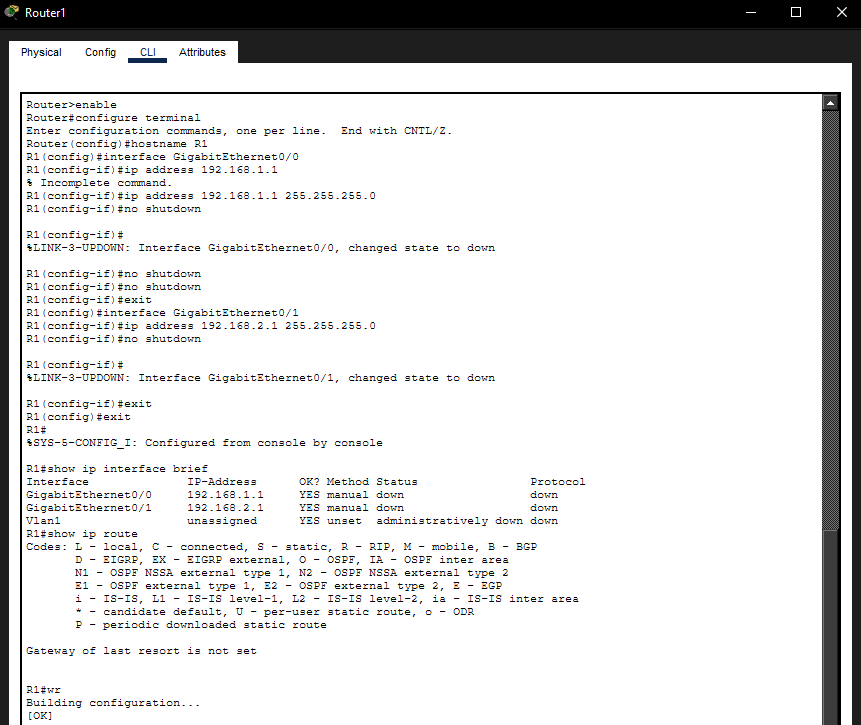
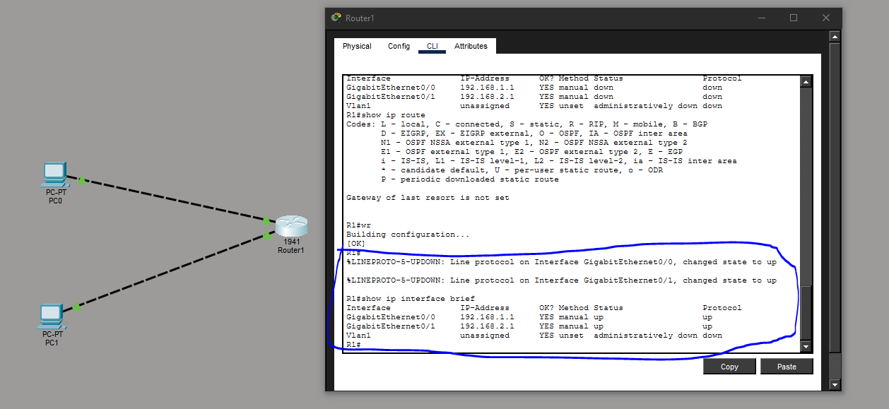
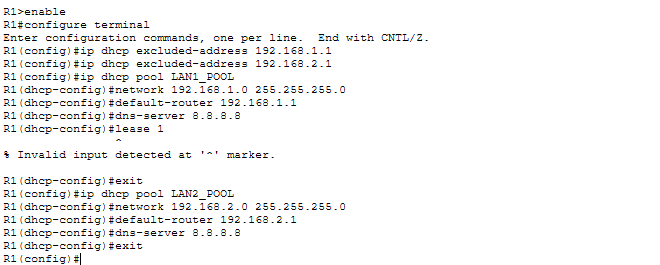
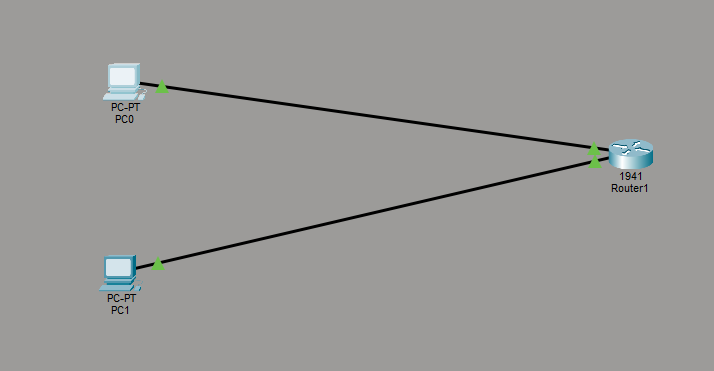
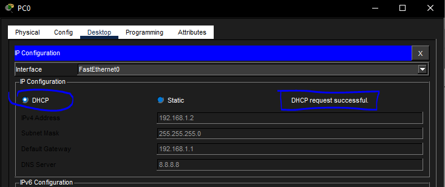
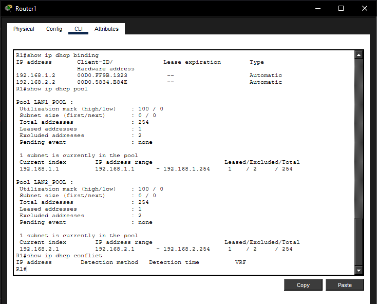
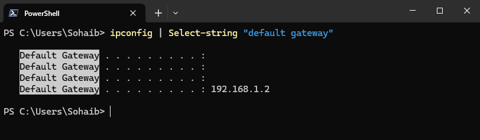
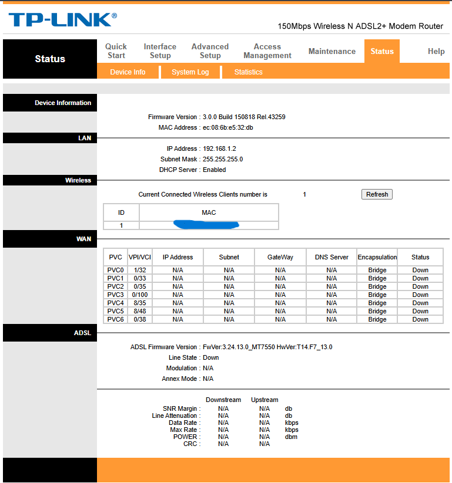
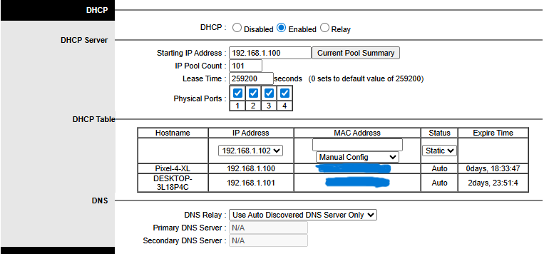
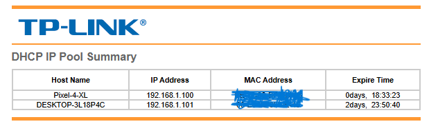

# Routing and DHCP

This covers configuring a Cisco router from scratch in Packet Tracer and then observing the same DHCP concepts on a real spare router at home. The two labs complement each other well since Packet Tracer gives a clean controlled environment to learn the commands, and the real router shows what the same concepts look like in practice.

Both `.pkt` lab files are in `assets/` and can be opened in Packet Tracer to step through the configuration.

---

# Part 1 - Packet Tracer: Router Setup

## Configuring the Router



Starting from scratch with a Cisco 1941 router. The first thing to do in Cisco IOS is enter privileged exec mode with `enable`, then drop into global configuration mode with `configure terminal`. From there:

```
Router> enable
Router# configure terminal
Router(config)# hostname R1
R1(config)# interface GigabitEthernet0/0
R1(config-if)# ip address 192.168.1.1 255.255.255.0
R1(config-if)# no shutdown
R1(config-if)# exit
R1(config)# interface GigabitEthernet0/1
R1(config-if)# ip address 192.168.2.1 255.255.255.0
R1(config-if)# no shutdown
R1(config-if)# exit
R1(config)# exit
R1# show ip interface brief
R1# wr
```

`no shutdown` is required because Cisco router interfaces are administratively down by default. Without it the interface stays off even after assigning an IP. `wr` (short for `write`) saves the running config to NVRAM so it persists after a reboot.

`show ip interface brief` gives a quick status table of all interfaces, their IPs, and whether they are up or down. At this point both interfaces show as `manual down` because nothing is connected to them yet.

## Testing with Connected PCs



After connecting PC0 to GigabitEthernet0/0 and PC1 to GigabitEthernet0/1, the interfaces come up. The `LINEPROTO-5-UPDOWN` messages in the CLI confirm the line protocol changed state to up on both interfaces. Running `show ip interface brief` again now shows both as `up/up`, meaning the physical connection and protocol are both active.

---

# Part 2 - Packet Tracer: DHCP Configuration

## Setting Up DHCP Pools



With the interfaces already configured, DHCP pools are added on top. The first step is excluding the gateway IPs from the DHCP range so the router never accidentally assigns its own address to a client:

```
R1(config)# ip dhcp excluded-address 192.168.1.1
R1(config)# ip dhcp excluded-address 192.168.2.1

R1(config)# ip dhcp pool LAN1_POOL
R1(dhcp-config)# network 192.168.1.0 255.255.255.0
R1(dhcp-config)# default-router 192.168.1.1
R1(dhcp-config)# dns-server 8.8.8.8
R1(dhcp-config)# lease 1
R1(dhcp-config)# exit

R1(config)# ip dhcp pool LAN2_POOL
R1(dhcp-config)# network 192.168.2.0 255.255.255.0
R1(dhcp-config)# default-router 192.168.2.1
R1(dhcp-config)# dns-server 8.8.8.8
R1(dhcp-config)# exit
```

Two pools are created, one per interface. Each pool defines its subnet, the default gateway clients should use, and the DNS server. The router will now hand out addresses from these ranges to any client that sends a DHCP Discover packet on that interface.

## Testing DHCP Assignment



Two PCs are connected to the router, one per interface, and set to DHCP mode.



PC0 shows `DHCP request successful` with an assigned IP of `192.168.1.2`, gateway `192.168.1.1`, and DNS `8.8.8.8`. This confirms the LAN1_POOL is working correctly.

## Verifying Leases on the Router



```
R1# show ip dhcp binding
R1# show ip dhcp pool
R1# show ip dhcp conflict
```

`show ip dhcp binding` shows every IP the router has handed out along with the client MAC address. Both PCs appear here with their assigned IPs. `show ip dhcp pool` shows utilisation stats for each pool including how many addresses have been leased and how many are excluded. `show ip dhcp conflict` returns empty, meaning no duplicate IP issues were detected.

---

# Part 3 - Real Hardware: Spare Router DHCP

This section applies the same concepts to a real TP-Link router set up at home as a lab device. The setup story is documented separately in [lab setup](../lab_setup/README.md).

## Checking the Gateway from the Host Machine



```powershell
ipconfig | Select-String "default gateway"
```

Running this on the Windows host confirms the default gateway is `192.168.1.2`, which is the TP-Link lab router. This means the machine is sitting behind it and receiving its network config from it.

## Logging Into the Router Admin Panel



Navigating to `192.168.1.2` in a browser opens the TP-Link admin interface. The status page shows the LAN IP, MAC address, and confirms the DHCP server is enabled. The WAN section shows all DSL PVCs as down, which is expected since this router is not connected to a phone line and is being used purely as a LAN-side lab device.

## Viewing the DHCP Configuration



The DHCP section shows the pool starting at `192.168.1.100` with 101 addresses available. The lease table at the bottom shows two devices that have been assigned IPs automatically.

## DHCP Pool Summary



The Current Pool Summary confirms both devices received their IPs via DHCP. The hostnames, IPs, MAC addresses, and lease expiry times are all visible. This is the real-world equivalent of `show ip dhcp binding` on the Cisco router.

---

# Key Concepts

- **Router interfaces are off by default.** On Cisco IOS, `no shutdown` is required to bring them up. Forgetting this is a common mistake when a config looks right but nothing works.
- **Excluded addresses prevent conflicts.** Always exclude the gateway IP before defining a DHCP pool or the router might assign its own IP to a client.
- **DHCP pools are per-subnet.** Each interface subnet needs its own pool with the correct network and default-router values.
- **`show` commands are essential.** `show ip interface brief`, `show ip dhcp binding`, and `show ip dhcp pool` are the go-to verification commands after any config change.
- **The concepts are the same across platforms.** Whether it is Cisco IOS CLI or a TP-Link web interface, DHCP works the same way underneath: excluded range, pool definition, lease assignment.

---

# Lab Files

- [assets/router_lab1.pkt](assets/router_lab1.pkt) - Router interface configuration lab
- [assets/router_lab2.pkt](assets/router_lab2.pkt) - DHCP configuration lab

---

# Environment

- Simulation: Cisco Packet Tracer, Cisco 1941 router
- Real hardware: TP-Link ADSL2+ router (used as LAN-side lab device)
- Host machine: Windows 10
