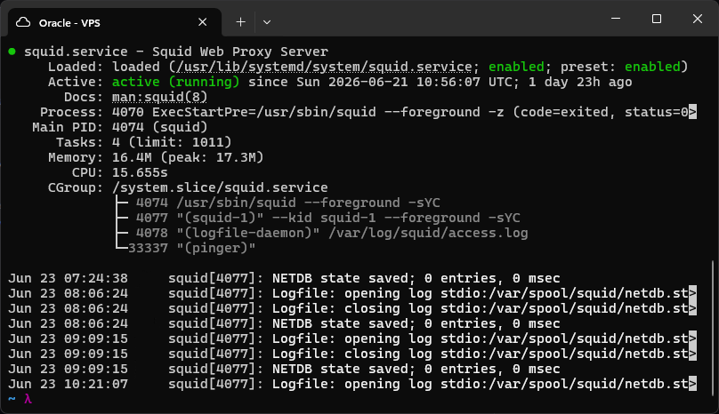
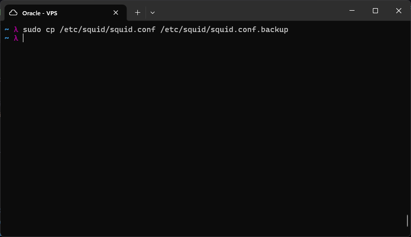
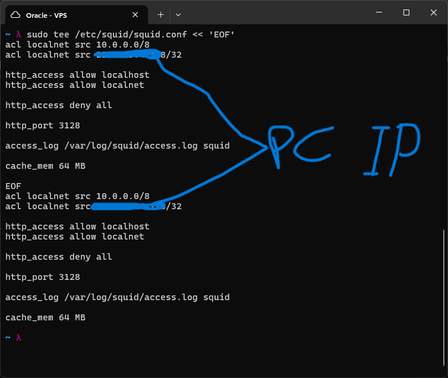
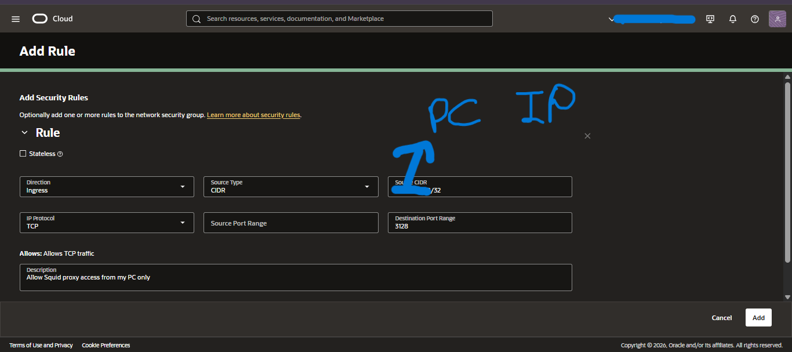
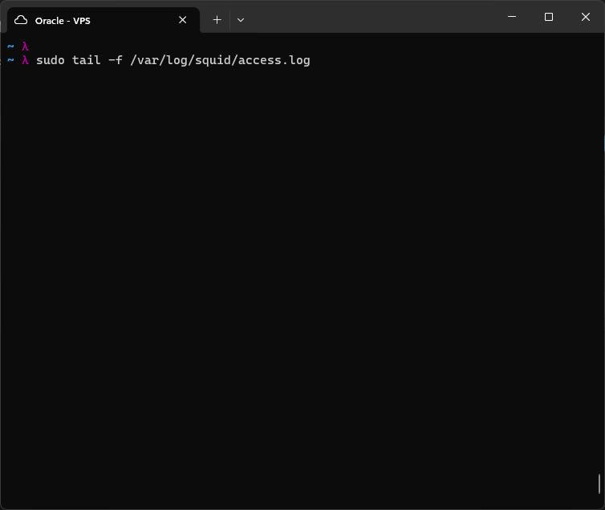
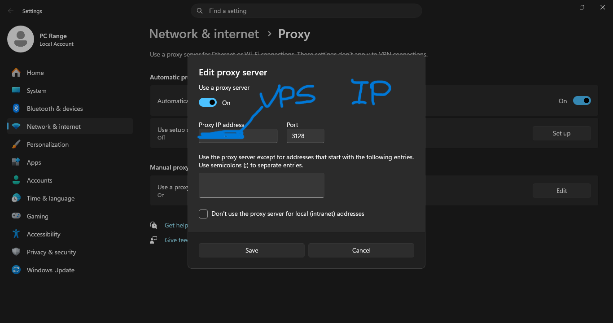
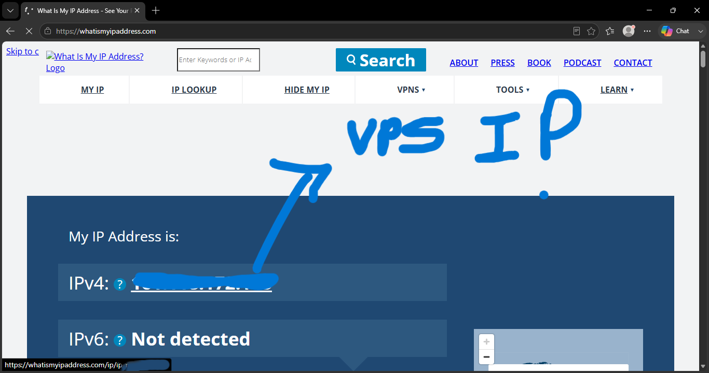
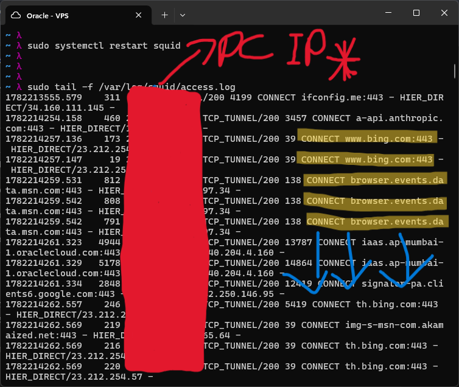

# Proxy

A proxy is an intermediary that sits between a client and a server. Different
types serve different purposes -- understanding which type to deploy for which
use case is a core sysadmin and security skill.

## Forward Proxy

Sits in front of clients. The client sends all requests through the proxy and
the destination server sees the proxy's IP, not the client's. Used for
content filtering, caching, and bypassing geo-restrictions.

## Reverse Proxy

Sits in front of servers. The client connects to the proxy which forwards the
request to a backend server. Used for load balancing, SSL termination,
caching, and shielding backend infrastructure.

## Transparent Proxy

The client does not know it exists. A network device intercepts traffic
automatically without any client configuration. Used by ISPs and corporate
networks for filtering and monitoring.

---

# Squid Forward Proxy

Squid is the most widely deployed forward proxy in the world. It can cache
web content, filter domains, log all requests, and control who can browse
what. In this lab, Squid was deployed on the VPS and the Windows PC was
configured to route all browser traffic through it.

## Installation

```bash
sudo apt install -y squid
sudo systemctl status squid
```



Squid starts automatically after installation and runs as a systemd service.

## Configuration

The default config file is large and heavily commented. The original was
backed up before replacing it with a minimal config written from scratch:

```bash
sudo cp /etc/squid/squid.conf /etc/squid/squid.conf.backup
```



```bash
sudo tee /etc/squid/squid.conf << 'EOF'
acl localnet src 10.0.0.0/8       # VPN clients
acl localnet src YOUR_PC_IP/32    # your PC's public IP

http_access allow localhost
http_access allow localnet
http_access deny all

http_port 3128

access_log /var/log/squid/access.log squid

cache_mem 64 MB
EOF
```



The config defines two ACL entries under the name `localnet`: the VPN subnet
and the PC's public IP. Only these sources are permitted to use the proxy.
Everything else is denied by default. Port 3128 is the standard Squid port.

## Firewall Configuration

Oracle Cloud uses a two-tier firewall. Both layers must allow TCP port 3128
or the PC cannot reach Squid.

**OS layer (iptables):**

```bash
sudo iptables -I INPUT -p tcp -s YOUR_PC_IP --dport 3128 -j ACCEPT
```

This inserts an ACCEPT rule at the top of the INPUT chain, allowing TCP
connections to port 3128 only from the specified PC IP. iptables is covered
in depth in a later lab.

**Cloud layer (OCI Network Security Group):**



An ingress rule was added to the VPS Network Security Group: protocol TCP,
source CIDR set to the PC's public IP with a /32 mask, destination port 3128.
Unlike the WireGuard rule which was open to 0.0.0.0/0, Squid is locked to a
single source IP since there is no reason for the proxy to be publicly
accessible.

## Starting and Monitoring

```bash
sudo systemctl restart squid
sudo tail -f /var/log/squid/access.log
```



The log monitor was started before connecting the browser so incoming requests
would be visible as they arrived.

## Connecting the Browser

Windows Settings > Network and Internet > Proxy > Manual proxy setup:

- Proxy IP address: VPS public IP
- Port: 3128



## Verification

With the proxy active, visiting `whatismyipaddress.com` returned the VPS
public IP instead of the PC's home IP, confirming all browser traffic was
routing through Squid on the VPS.



The access log on the VPS updated in real time as pages were loaded, showing
each proxied request with its timestamp, duration, client IP, status code,
and destination:



The log format is:
`timestamp  duration  client_ip  result/code  bytes  method  destination`
Each line confirms the proxy received the request, forwarded it, and returned
the response -- the full forward proxy cycle visible at the network level.

