# WireGuard VPN Setup

In this lab I set up a WireGuard VPN server on the Oracle Cloud VPS and
connected two clients -- a Windows PC and an Android phone -- routing all
their traffic through the VPS.

---

## What is WireGuard

WireGuard is a modern VPN protocol built for simplicity and security. At
around 4,000 lines of code it has a much smaller attack surface than
alternatives like OpenVPN (~70,000 lines).

Key properties:

- UDP only -- fast and stateless, no TCP overhead
- Uses Base64-encoded public/private key pairs generated by WireGuard itself
- Public keys are exchanged manually between peers in config files; private
  keys never leave the device they were generated on
- Both sides derive the same shared session secret using Diffie-Hellman --
  no private key is transmitted during the handshake
- All traffic is encrypted with ChaCha20-Poly1305 and wrapped in UDP
- Default port: 51820

---

## 1. Oracle Cloud Firewall Preparation

Oracle Cloud has two independent firewall layers. Both must allow UDP 51820
or WireGuard packets will never reach the VPS:

- **OCI Network Security Group / Security List** -- the cloud-level firewall
  controlled from the OCI console
- **OS-level iptables** -- the firewall running inside Ubuntu on the VPS
  itself

Changes to one have no effect on the other.

### OCI Console: Create a Network Security Group

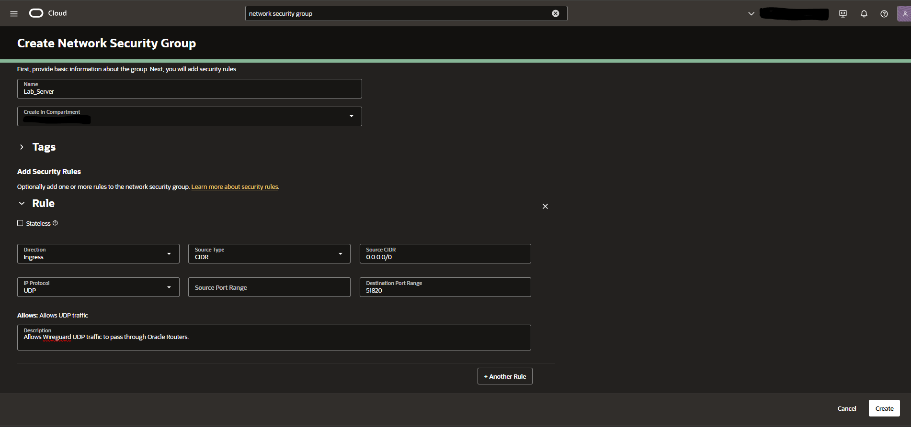

A custom Network Security Group named `Lab_Server` was created with one
ingress rule: protocol UDP, source 0.0.0.0/0, destination port 51820. This
allows WireGuard handshake packets to pass through Oracle's network-level
router.

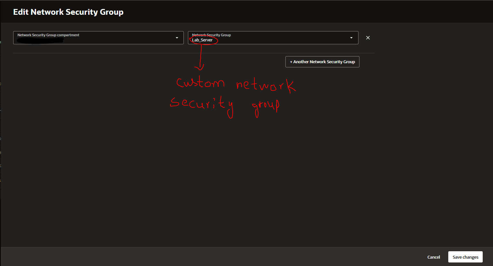

The NSG was then attached to the VPS's VNIC (virtual network interface card)
so the rule applies to this specific instance.

---

## 2. Server Installation and Key Generation

```bash
sudo apt install wireguard -y
```

Generate the server key pair:

```bash
wg genkey | sudo tee /etc/wireguard/server_private.key | \
  wg pubkey | sudo tee /etc/wireguard/server_public.key
```

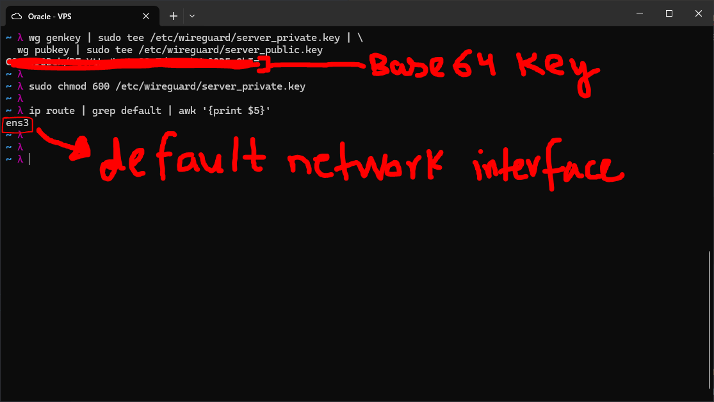

`wg genkey` generates a random private key. `wg pubkey` derives the public
key from it. Both are Base64-encoded strings. The public key is safe to share
with clients; the private key must never leave the server.

```bash
sudo chmod 600 /etc/wireguard/server_private.key
```

Permissions are locked to root-only, the same principle as SSH private keys.

The default network interface was identified for use in the config:

```bash
ip route | grep default | awk '{print $5}'
# Returns: ens3
```

---

## 3. Server Configuration

```bash
sudo vim /etc/wireguard/wg0.conf
```

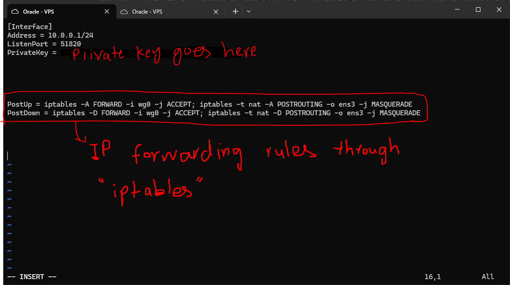

```ini
[Interface]
Address = 10.0.0.1/24
ListenPort = 51820
PrivateKey = SERVER_PRIVATE_KEY_HERE

PostUp = iptables -A FORWARD -i wg0 -j ACCEPT; iptables -t nat -A POSTROUTING -o ens3 -j MASQUERADE
PostDown = iptables -D FORWARD -i wg0 -j ACCEPT; iptables -t nat -D POSTROUTING -o ens3 -j MASQUERADE
```

Config breakdown:

| Directive | Purpose |
|-----------|---------|
| `Address = 10.0.0.1/24` | VPN IP of this server. Clients get addresses in the same /24 subnet (10.0.0.2, 10.0.0.3 etc.) |
| `ListenPort = 51820` | UDP port WireGuard listens on |
| `PrivateKey` | Server's private key -- used to decrypt incoming client traffic |
| `PostUp` | iptables rules applied when the interface comes up -- enables forwarding and NAT so client traffic exits through the VPS's real IP |
| `PostDown` | Removes those iptables rules when the interface goes down |

Without the PostUp rules the tunnel connects but clients cannot reach the
internet, because the kernel does not know to forward packets from the VPN
subnet to the internet interface.

### Enable IP Forwarding

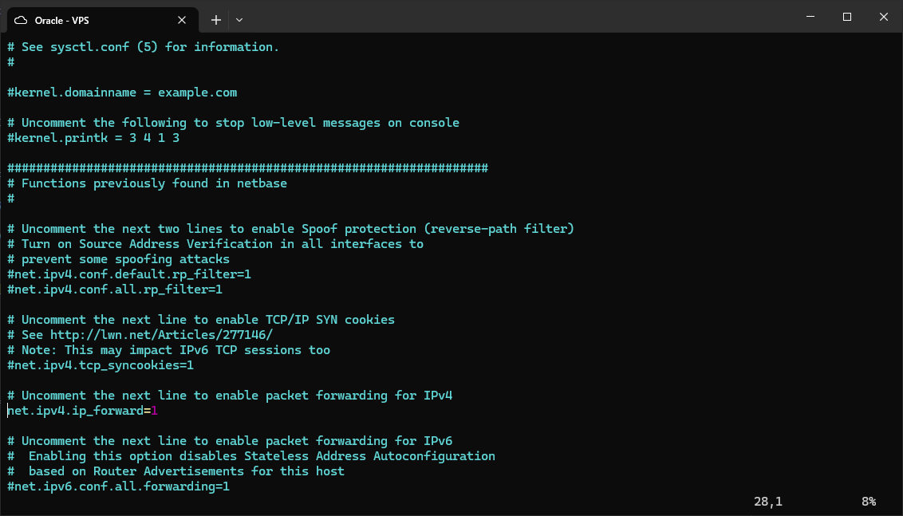

```bash
echo "net.ipv4.ip_forward = 1" | sudo tee -a /etc/sysctl.conf
sudo sysctl -p
```

IP forwarding must be enabled at the kernel level for the VPS to act as a
router for VPN clients. Without this, packets arriving from the tunnel have
nowhere to go.

### Start WireGuard

```bash
sudo systemctl enable --now wg-quick@wg0
sudo wg show
```

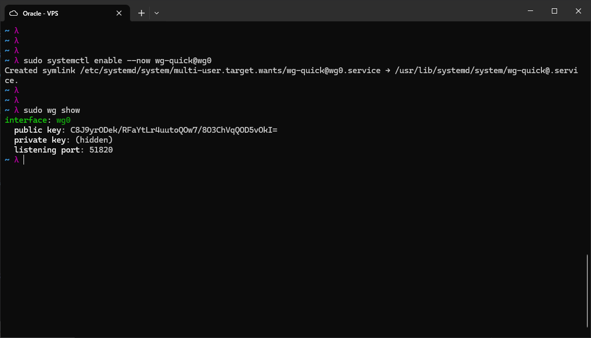

The interface came up with the correct public key and listening port. No peers
yet at this stage.

---

## 4. Windows Client

A key pair was generated for the Windows client on the VPS:

```bash
wg genkey | tee /tmp/win_private.key | wg pubkey > /tmp/win_public.key
```

The client was registered as a peer on the server:

```bash
sudo wg set wg0 peer $(cat /tmp/win_public.key) allowed-ips 10.0.0.2/32
sudo wg-quick save wg0
```

The WireGuard Windows app was installed and configured with a new tunnel:

```ini
[Interface]
PrivateKey = WIN_PRIVATE_KEY_HERE
Address = 10.0.0.2/32
DNS = 1.1.1.1

[Peer]
PublicKey = SERVER_PUBLIC_KEY_HERE
Endpoint = VPS_PUBLIC_IP:51820
AllowedIPs = 0.0.0.0/0
PersistentKeepalive = 25
```

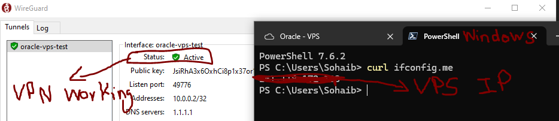

After activating the tunnel, `curl ifconfig.me` in PowerShell returned the
VPS public IP confirming all traffic was routing through the tunnel.

---

## 5. Phone Client (Android)

The phone config was generated on the VPS and delivered via QR code to avoid
manual key entry:

```bash
# Generate phone key pair
wg genkey | tee /tmp/phone_private.key | wg pubkey > /tmp/phone_public.key

# Create phone config file
cat > /tmp/phone_wg.conf << EOF
[Interface]
Address = 10.0.0.3/32
PrivateKey = $(cat /tmp/phone_private.key)
DNS = 1.1.1.1

[Peer]
PublicKey = $(sudo cat /etc/wireguard/server_public.key)
Endpoint = $(curl ifconfig.me):51820
AllowedIPs = 0.0.0.0/0
PersistentKeepalive = 25
EOF

# Register phone as a peer on the server
sudo wg set wg0 peer $(cat /tmp/phone_public.key) allowed-ips 10.0.0.3/32
sudo wg-quick save wg0

# Display QR code in terminal
qrencode -t ansiutf8 < /tmp/phone_wg.conf

# Clean up -- private key must not remain in /tmp
rm /tmp/phone_private.key /tmp/phone_public.key /tmp/phone_wg.conf
```

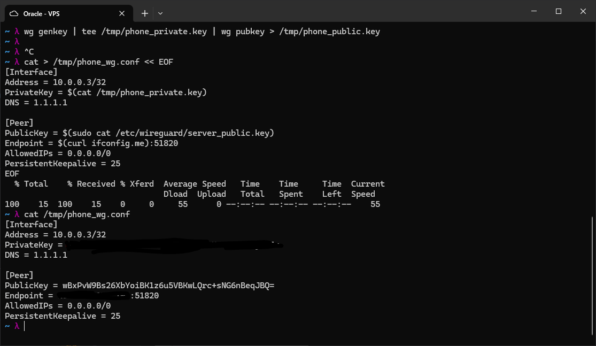

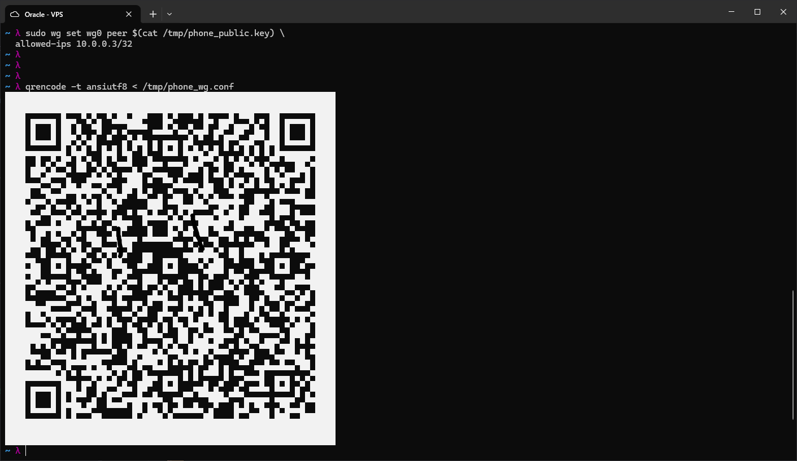

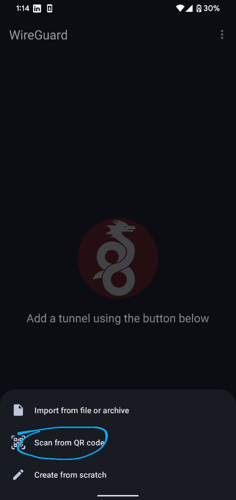

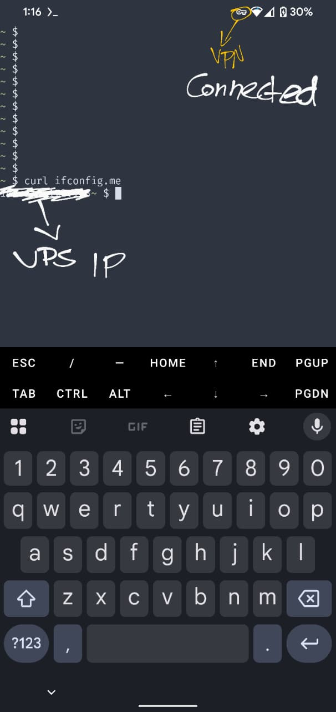

The WireGuard Android app scanned the QR code, imported the config, and
connected. `curl ifconfig.me` on the phone confirmed traffic was exiting
through the VPS.

---

## Troubleshooting Note

During setup the tunnel handshake completed successfully but internet access
failed on the Windows client. The root cause was Oracle Cloud's default
iptables FORWARD chain containing a REJECT rule that sat above the ACCEPT
rule added by WireGuard's PostUp. Since iptables processes rules top to
bottom, forwarded packets were rejected before reaching the ACCEPT rule. The
fix was inserting the ACCEPT rules at position 1 with `-I FORWARD 1` rather
than appending with `-A`. See the incident log for the full post-mortem.
