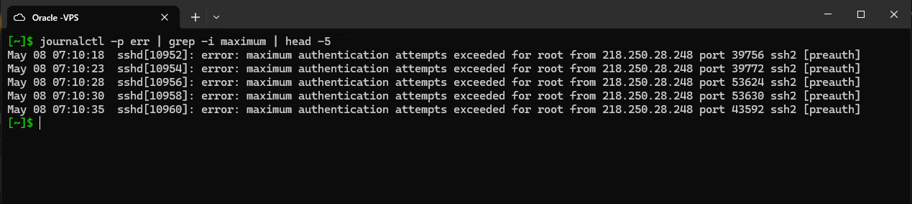
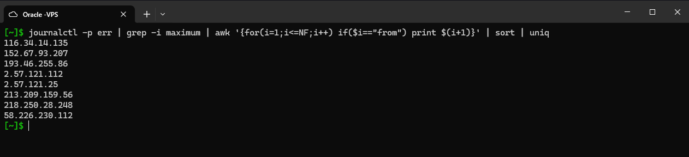

# Bruteforce Attack Audit

This is a practical consolidation of everything covered so far in this section: reading system logs with journalctl, filtering with grep, and extracting specific fields with awk. Instead of running these tools against dummy data, this applies them to real attack traffic on the VPS.

Any internet-facing server will have bots constantly hammering it with login attempts. This audit makes that visible and pulls out the attacking IPs in a clean format.

---

## Step 1 - Sample the Attack Traffic



```bash
journalctl -p err | grep -i maximum | head -5
```

`journalctl -p err` filters the system journal to error-level entries only. Piping that through `grep -i maximum` narrows it down further to lines mentioning "maximum", which in practice means SSH authentication failure messages where a remote IP has exceeded the maximum number of auth attempts. That pattern is almost always automated bruteforce behaviour rather than a real user mistyping their password.

`head -5` limits the output to 5 lines just to sample what is happening without flooding the terminal. At this point you can already see public IPs in the log entries.

---

## Step 2 - Extract and Deduplicate the Attacking IPs



```bash
journalctl -p err | grep -i maximum | awk '{for(i=1;i<=NF;i++) if($i=="from") print$(i+1)}' | sort | uniq
```

This takes the same filtered journal output and extracts just the IP addresses from it. The awk part loops through every field in each line (`for(i=1;i<=NF;i++)`) and checks if the current field is the word "from". When it finds it, it prints the next field (`$(i+1)`), which is always the IP address based on how the log message is structured.

The result is a raw list of IPs, some of which appear multiple times. Piping through `sort` groups identical IPs together, and `uniq` then collapses each group down to a single entry. The final output is a clean, deduplicated list of every IP that has been bruteforcing the server.

---

## What This Demonstrates

This exercise ties together several things practiced earlier in this section:

- `journalctl` for reading structured system logs
- `grep` for narrowing output by pattern
- `awk` for extracting a specific field based on a condition in the surrounding text
- `sort` and `uniq` as a standard pipeline pattern for deduplication

It also gives a concrete picture of what passive exposure looks like on a public-facing server. The server was not advertised anywhere and the attacks were already there.

---

## Environment

- Platform: Oracle Cloud VPS
- OS: Ubuntu (Linux)
- Access: SSH from local machine
