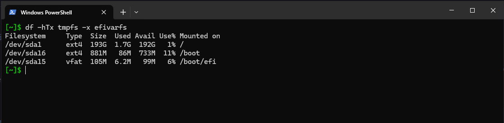
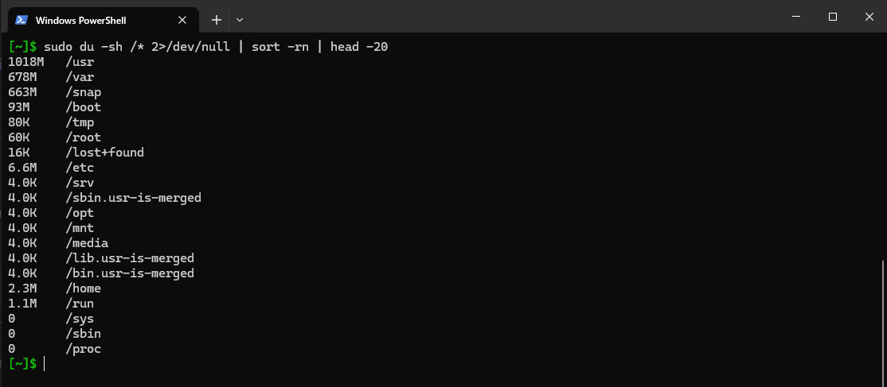
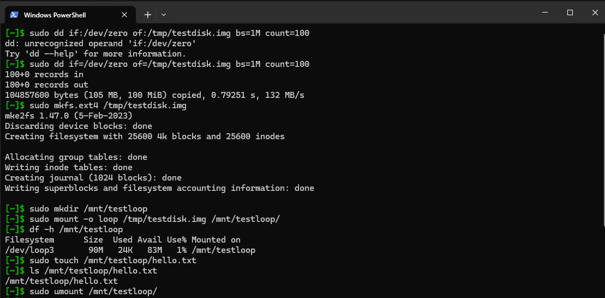
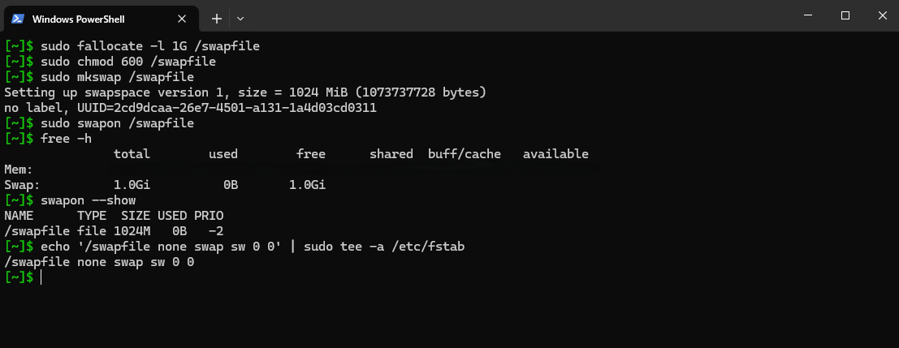

# Storage - df, du, lsblk, Filesystems, Swap

This covers the main tools for understanding storage on a Linux system, plus hands-on work creating and mounting a filesystem from scratch and setting up a swapfile.

---

# Disk Space - df and du

These two commands answer slightly different questions. `df` tells you about filesystems and how full they are. `du` tells you how much space specific directories or files are actually using.

## df



```bash
df -hTx tmpfs -x efivarfs
```

`df` by default includes virtual filesystems like `tmpfs` and `efivarfs` which aren't real storage and just add noise to the output. The `-x` flag excludes them. The `-h` flag gives human-readable sizes (GB, MB) instead of raw block counts, and `-T` adds a column showing the filesystem type so you can see what each partition is formatted as.

## du



```bash
sudo du -sh /* 2>/dev/null | sort -rn | head -20
```

This scans every directory directly under root (`/*`) and reports how much disk space each one is consuming. The `-s` flag gives a single summary per directory instead of recursing into every subfolder, and `-h` makes sizes readable. Errors from directories you don't have permission to read are silently discarded with `2>/dev/null`. The output is then sorted in descending order by size and trimmed to the top 20, which makes it a quick way to find what's eating your disk.

---

# Creating a Filesystem from Scratch

This was the more interesting part. The goal was to go through the full process of creating a disk image, formatting it, mounting it, using it, and unmounting it, entirely in software without touching any real hardware.



### 1. Create a 100MB blank file

```bash
sudo dd if=/dev/zero of=/tmp/testdisk.img bs=1M count=100
```

`dd` is a low-level copy tool. Here it reads from `/dev/zero` (a special file that just produces null bytes) and writes 100 blocks of 1MB each into a file called `testdisk.img`. The result is a 100MB file full of zeros, which will act as a virtual disk.

### 2. Format it with ext4

```bash
sudo mkfs.ext4 /tmp/testdisk.img
```

`mkfs.ext4` writes an ext4 filesystem structure into the file, the same way it would onto a real partition. After this the file is a proper disk image with an inode table, journal, and everything else ext4 needs.

### 3. Create a mount point

```bash
sudo mkdir /mnt/testloop
```

Mount points are just empty directories. The filesystem gets attached here.

### 4. Mount it using a loop device

```bash
sudo mount -o loop /tmp/testdisk.img /mnt/testloop
```

The `-o loop` option tells the kernel to use a loop device, which is a mechanism that lets a regular file be treated as a block device. The kernel maps the file to something like `/dev/loop0` behind the scenes and then mounts that.

### 5. Verify it is mounted

```bash
df -h /mnt/testloop
```

At this point the 100MB image shows up as a real mounted filesystem.

### 6. Write a file to it

```bash
sudo touch /mnt/testloop/hello.txt
```

Just confirming the filesystem is usable and writable.

### 7. Unmount when done

```bash
sudo umount /mnt/testloop
```

Always unmount before deleting or moving the image file, otherwise the kernel still has the loop device open.

---

# Swap

Swap is disk space the kernel can use as overflow when RAM fills up. It's slower than RAM but better than an out-of-memory crash. On a VPS with limited memory it's worth having even if you rarely hit it.



### Check current swap status

```bash
swapon --show
free -h
```

`swapon --show` lists any active swap devices or files. `free -h` gives a broader memory overview including the swap row.

### Create a 1GB swapfile

```bash
sudo fallocate -l 1G /swapfile
```

`fallocate` allocates the space for the file immediately without writing anything, which is faster than using `dd` for this purpose. The result is a 1GB file at `/swapfile`.

### Lock down permissions

```bash
sudo chmod 600 /swapfile
```

The swapfile can contain memory contents from running processes, so it should only be readable by root. This step is required before the kernel will accept it as swap.

### Format it as swap

```bash
sudo mkswap /swapfile
```

Writes the swap header that the kernel expects at the start of the file.

### Activate it

```bash
sudo swapon /swapfile
```

### Verify it is active

```bash
free -h
swapon --show
```

### Make it permanent across reboots

```bash
echo '/swapfile none swap sw 0 0' | sudo tee -a /etc/fstab
```

`/etc/fstab` is the file the system reads at boot to know what to mount and activate automatically. The entry format is: device, mount point, type, options, dump, pass. For swap, the mount point is `none` and the type is `swap`. Without this line, the swapfile disappears after a reboot.

---

# Environment

- Platform: Oracle Cloud VPS
- OS: Ubuntu (Linux)
- Access: SSH from local machine
