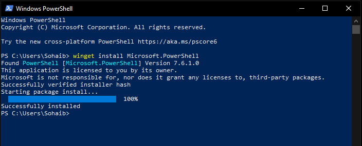
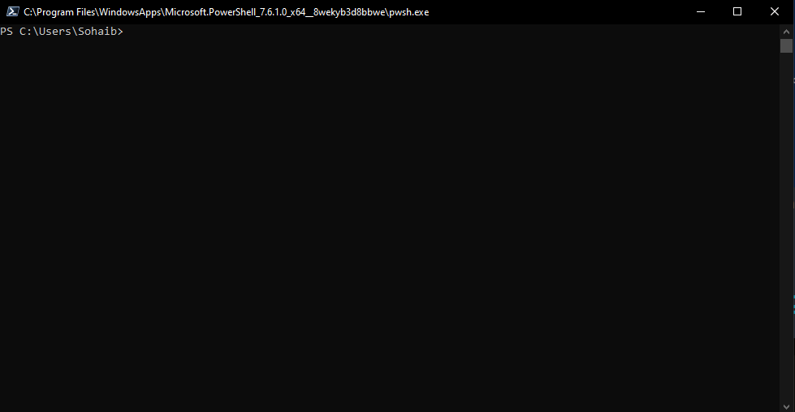

# Windows PowerUser Lab - Setup

## PowerShell

The foundation for Windows administration is PowerShell. It is used across the Microsoft ecosystem whether that is desktop Windows, Windows Server, or Azure cloud infrastructure.

There are two versions worth knowing about:

- **Windows PowerShell 5.1** - shiimages/ps built into Windows, no longer actively developed
- **PowerShell 7+** - the current version, open source, cross-platform, and what Azure and modern Microsoft tooling actually uses

For this lab series I installed PowerShell 7 instead of using the built-in 5.1. The reasoning is straightforward: Azure administration and the `Az` PowerShell module are built around PowerShell 7, so learning on the older version would just mean relearning things later.

---

## Installation



```powershell
winget install Microsoft.Powershell
```

`winget` is the Windows package manager. This pulls and installs the latest stable PowerShell release, which at the time of writing is 7.6.1.0.

---

## First Launch



The executable for PowerShell 7 is `pwsh.exe`, as opposed to `powershell.exe` for the older 5.1. That distinction matters when scripting or setting default terminals since both versions can coexist on the same machine. The new prompt confirms it is running the cross-platform version.

All upcoming Windows command-line labs will be done in this version.

---

## Environment

- **Daily machine:** Windows 10 (fully updated)
- **Planned VM setup:** For infrastructure topics like Active Directory and Group Policy, I will create Windows and Windows Server VMs inside VirtualBox rather than touching the host system  
