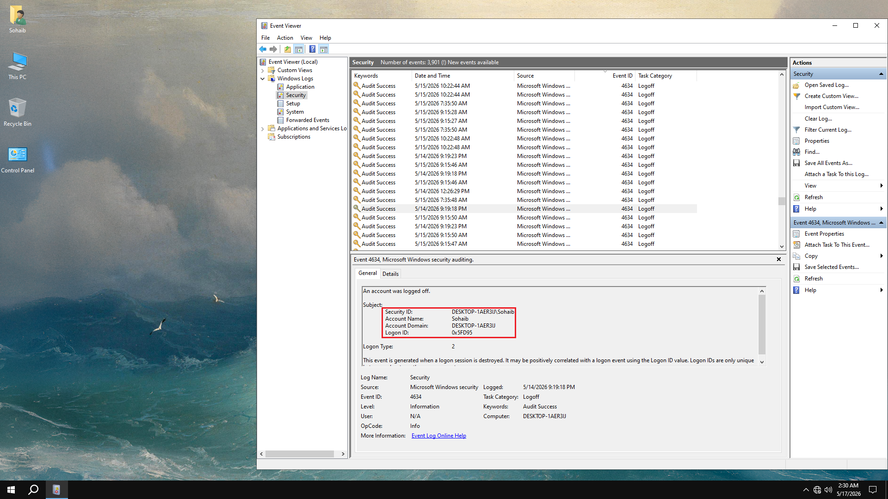
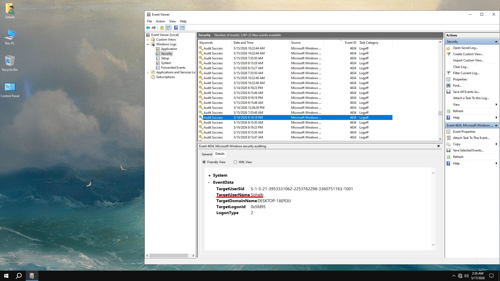
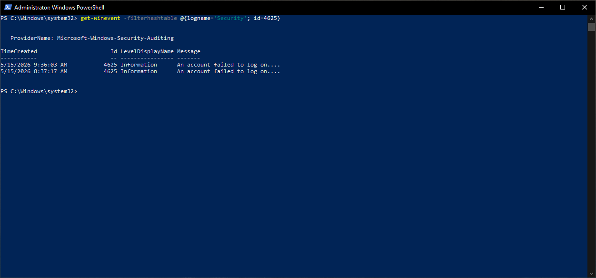
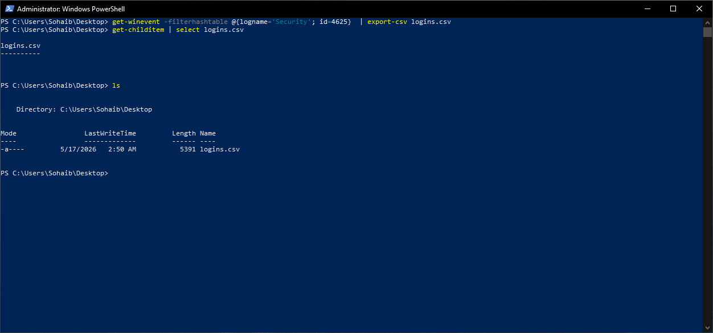

# Windows Event Logs - Event Viewer and PowerShell

Windows logs everything that happens on the system into structured event logs. These cover security events like login attempts, system events like service crashes, and application events. Knowing how to read these is a core sysadmin skill, both for troubleshooting and security auditing.

This was practiced on a Windows 10 VM running inside Hyper-V, using the built-in Windows PowerShell 5.1 (the VM did not yet have PowerShell 7 installed at this point).

---

# Event Viewer - GUI

Event Viewer (`eventvwr.exe`) is the GUI tool for browsing Windows event logs. It is useful for getting a visual overview of what logs exist and drilling into individual events.



The main log categories under Windows Logs:

| Log | What it contains |
|---|---|
| Application | Events from installed applications |
| Security | Login attempts, account changes, privilege use, auditing |
| Setup | Windows installation and update events |
| System | OS-level events, driver issues, service starts and stops |

The Security log is the most relevant for auditing purposes. Every entry here has an Event ID which identifies exactly what happened. Clicking an event in the top pane shows the full detail in the bottom pane, including which account was involved, from which machine, and the logon type.



The Details tab inside an event shows the raw XML structure of the event data. This is useful because it exposes every field individually (TargetUserName, TargetDomainName, LogonType, TargetLogonId) in a structured way, which is what PowerShell actually queries when you pull events programmatically.

---

# Useful Security Event IDs

These are the event IDs worth knowing for basic security auditing:

| Event ID | Meaning |
|---|---|
| 4624 | Successful logon |
| 4625 | Failed logon attempt |
| 4634 | Account logged off |
| 4648 | Logon attempted with explicit credentials |
| 4720 | User account created |
| 4722 | User account enabled |
| 4725 | User account disabled |
| 4740 | Account locked out |
| 4776 | Credential validation attempt |

---

# Querying Events with PowerShell

PowerShell can query event logs directly using `Get-WinEvent`, which is more powerful than the GUI for filtering and exporting.

## Filtering by Event ID



```powershell
Get-WinEvent -FilterHashtable @{logname='Security'; id=4625}
```

`-FilterHashtable` is the efficient way to filter events. It filters at the source rather than pulling all events and piping them through `Where-Object`, which would be much slower on a large log. Here it pulls all Event ID 4625 entries from the Security log, which are failed logon attempts. Two entries are returned, both from the same day.

## Exporting Events to CSV



```powershell
Get-WinEvent -FilterHashtable @{logname='Security'; id=4625} | export-csv logins.csv
Get-ChildItem | select logins.csv
```

Piping the output through `Export-CSV` writes all the event objects to a CSV file with each property as a column. This is useful for sharing event data, importing into a spreadsheet for analysis, or archiving a snapshot of log activity. `Get-ChildItem` confirms the file was created successfully.

The exported CSV preserves all event properties as structured columns, which is significantly more useful than plain text log output for any kind of analysis.

---

# Why This Matters

Reading event logs is one of the first things a sysadmin or security analyst does when investigating an incident. Understanding which Event IDs map to which actions, and being able to pull and filter them programmatically rather than clicking through the GUI, is a practical skill that applies directly to SIEM tools and incident response workflows covered later in the plan.

---

# Environment

- Machine: Windows 10 VM (Hyper-V)
- Shell: Windows PowerShell 5.1 (built-in)
- GUI tool: Event Viewer (`eventvwr.exe`)
