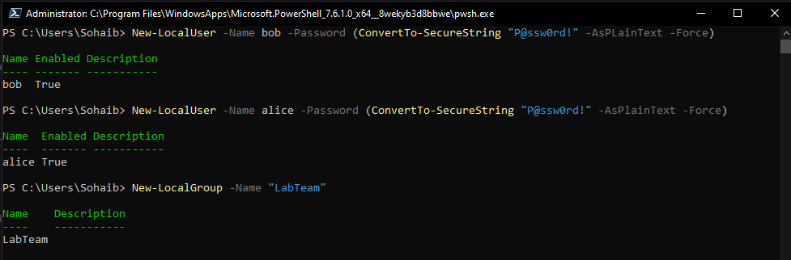
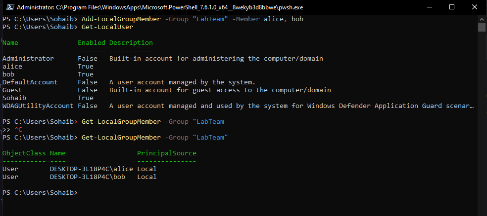
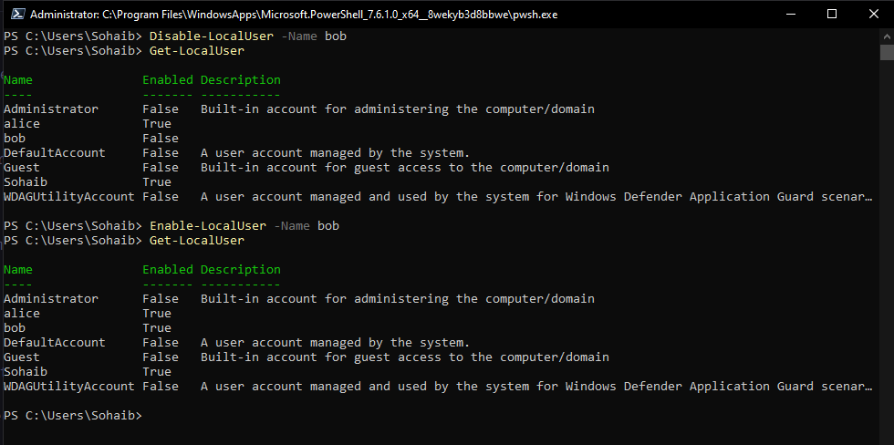

# PowerShell - Local User and Group Management

This covers managing local Windows user accounts and groups entirely through PowerShell without touching the GUI. It mirrors the Linux user management practice from Phase 1 but on the Windows side.

All commands were run in an elevated PowerShell 7 session (Run as Administrator), which is required for creating and modifying local accounts.

---

# Creating Users and a Group



```powershell
# Create local users
New-LocalUser -Name bob -Password (ConvertTo-SecureString "yourpassword" -AsPlainText -Force)
New-LocalUser -Name alice -Password (ConvertTo-SecureString "yourpassword" -AsPlainText -Force)

# Create a local group
New-LocalGroup -Name "LabTeam"
```

`New-LocalUser` creates a local account. The password cannot be passed as plain text directly, it has to be converted to a SecureString first using `ConvertTo-SecureString` with the `-AsPlainText -Force` flags. In production you would never hardcode a password in a command like this, you would use `Read-Host -AsSecureString` to prompt for it instead.

`New-LocalGroup` creates a local security group. Groups are how you assign permissions to multiple users at once rather than managing each account individually.

---

# Adding Members to a Group



```powershell
# Add both users to the group in one command
Add-LocalGroupMember -Group "LabTeam" -Member alice, bob

# Verify all local users
Get-LocalUser

# Verify group membership
Get-LocalGroupMember -Group "LabTeam"
```

`Add-LocalGroupMember` accepts multiple members in one call as a comma-separated list. `Get-LocalGroupMember` returns each member with their ObjectClass, full name including the machine prefix, and PrincipalSource which confirms they are local accounts rather than domain accounts.

---

# Disabling and Enabling Accounts



```powershell
# Disable an account
Disable-LocalUser -Name bob

# Re-enable it
Enable-LocalUser -Name bob

# Confirm current state of all accounts
Get-LocalUser
```

`Disable-LocalUser` locks the account without deleting it. The Enabled column in `Get-LocalUser` output changes to False, meaning the account exists but cannot be used to log in. This is the Windows equivalent of `usermod -L` on Linux and is the correct approach when an account needs to be suspended rather than permanently removed.

Other useful cmdlets in this space:

```powershell
Remove-LocalUser -Name bob              # delete a user permanently
Remove-LocalGroupMember -Group "LabTeam" -Member bob  # remove from group
Set-LocalUser -Name bob -Description "Lab test account"  # update properties
Get-LocalGroup                          # list all local groups
```

---

# Environment

- Machine: Windows 10 Pro (local)
- Shell: PowerShell 7, run as Administrator
