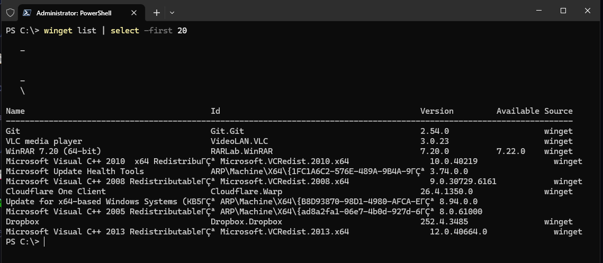
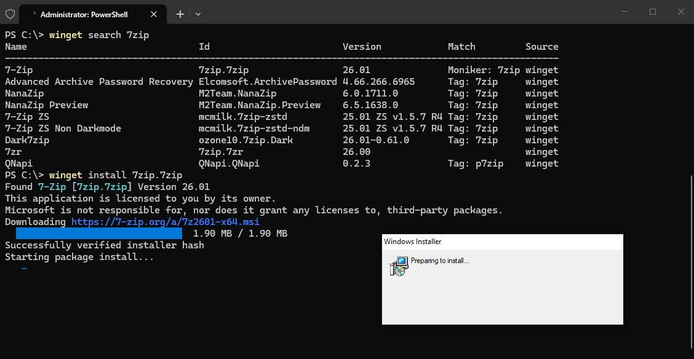
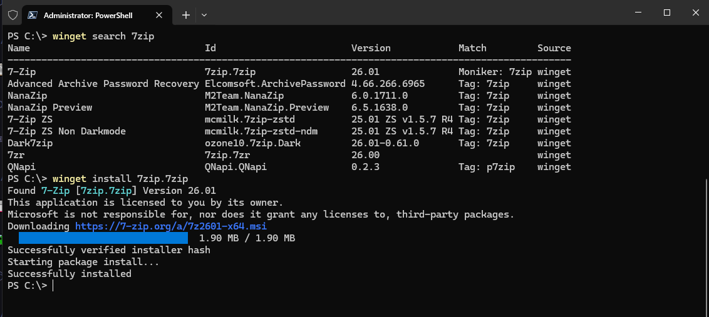
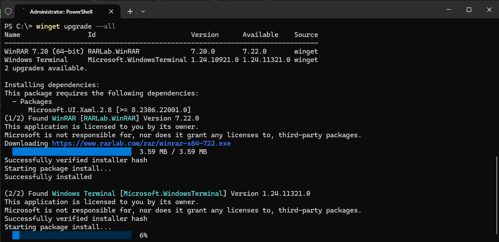
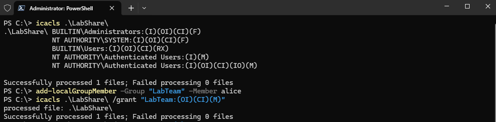
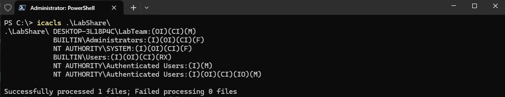
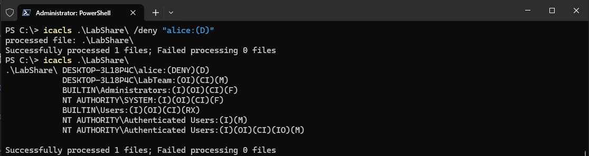

# Windows Package Management and File Permissions

This covers two things: managing software through winget from the command line, and controlling file/folder access permissions using icacls. Both are things you would typically do through the GUI on Windows but are worth knowing how to do properly through PowerShell and CLI tools.

---

# winget - Windows Package Manager

winget is the official Windows package manager, similar to `apt` on Ubuntu. It lets you search, install, update and remove software from the command line without going through a browser or installer wizard.

## Listing Installed Packages



```powershell
winget list | select -first 20
```

`winget list` shows all software currently installed on the machine, including packages not installed through winget itself. Piping through `select -first 20` limits the output to the first 20 entries since the full list is usually very long. Each entry shows the package Name, Id, current Version, Available version if an update exists, and Source.

## Searching and Installing a Package




```powershell
winget search 7zip
winget install 7zip.7zip
```

`winget search` queries the winget repository and returns all matching packages with their IDs. The ID is what you use for installation rather than the display name, since display names can be ambiguous. winget downloads the installer, verifies the hash, and runs the install silently. No browser, no clicking through installer screens.

## Upgrading All Packages



```powershell
winget upgrade --all
```

This checks every installed package for available updates and upgrades them all in sequence. It is the equivalent of `sudo apt upgrade` on Linux. winget handles dependency resolution automatically, as seen here where it pulled in `Microsoft.UI.Xaml` as a dependency before upgrading WinRAR.

Other useful winget commands:

```powershell
winget uninstall <package-id>        # remove a package
winget show <package-id>             # detailed info about a package
winget upgrade <package-id>          # upgrade a specific package only
```

---

# icacls - Windows File Permissions

`icacls` (Integrity Control Access Control Lists) is the command-line tool for viewing and modifying NTFS permissions on files and folders. It is the Windows equivalent of `chmod` and `chown` combined, though the permission model is different.

## Viewing Current Permissions



```powershell
icacls .\LabShare\
```

Running `icacls` on a folder prints the ACL (Access Control List) for it. Each line shows a principal (user or group) and the permissions they hold in parentheses. The permission flags used here:

| Flag | Meaning |
|---|---|
| F | Full control |
| M | Modify |
| RX | Read and execute |
| R | Read only |
| W | Write only |
| D | Delete |
| I | Permission inherited from parent |
| OI | Object inherit - applies to files inside the folder |
| CI | Container inherit - applies to subfolders |
| IO | Inherit only - does not apply to the folder itself |

## Granting Group Permissions



```powershell
add-LocalGroupMember -Group "LabTeam" -Member alice
icacls .\LabShare\ /grant "LabTeam:(OI)(CI)(M)"
```

First alice is added to the LabTeam group, then the group is granted Modify access to the LabShare folder with inheritance flags so the permission applies to all files and subfolders inside it. After running this, `LabTeam` appears at the top of the ACL when you query the folder again.

## Denying Access Explicitly



```powershell
icacls .\LabShare\ /deny "alice:(D)"
icacls .\LabShare\
```

`/deny` adds an explicit deny entry for a specific permission. Deny entries always take precedence over allow entries in Windows NTFS, regardless of what groups the user belongs to. Here alice is denied Delete access even though she is in LabTeam which has Modify rights. The deny entry appears at the top of the ACL output, which reflects the order Windows evaluates permissions.

This is a key difference from Linux permissions: Windows ACLs support explicit deny as a first-class concept, while Linux relies purely on allowing or not allowing.

---

# Environment

- Machine: Windows 10 Pro (local)
- Shell: PowerShell 7, run as Administrator
