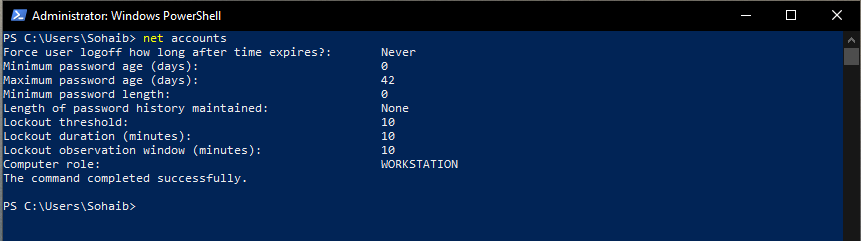
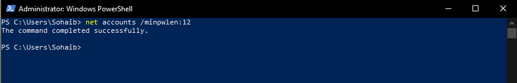
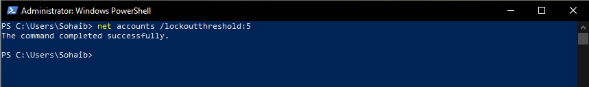
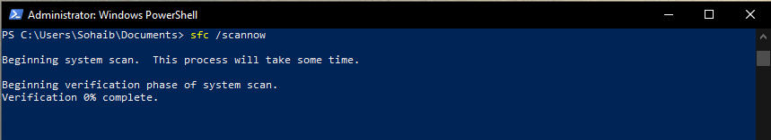
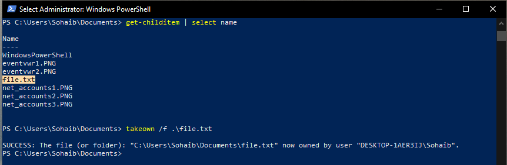
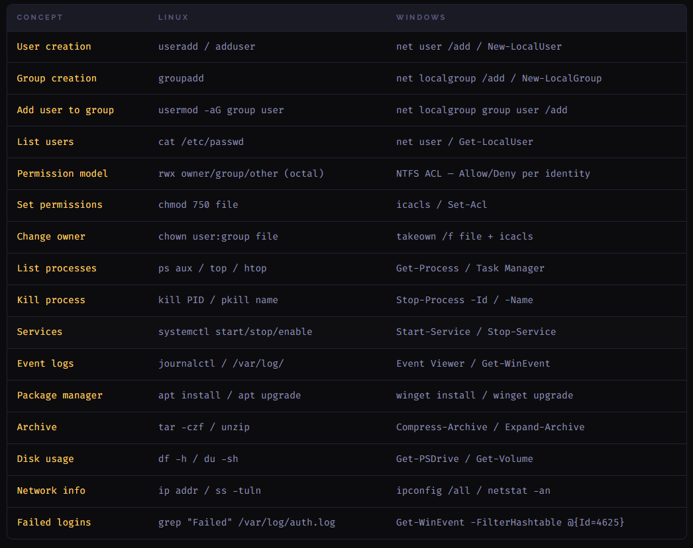

# Windows PowerUser - Password Policy, System Integrity, File Ownership

This covers the final set of Windows command-line tools for Phase 1: enforcing password and lockout policies through `net accounts`, scanning system file integrity with `sfc`, and taking ownership of files using `takeown`. The section ends with a Linux to Windows command comparison that consolidates everything covered across both operating systems.

---

# net accounts - Password and Lockout Policy

`net accounts` is a legacy but still widely used command for viewing and setting local password and account lockout policies. It predates PowerShell and is available in both cmd and PowerShell.

## Viewing Current Policy



```powershell
net accounts
```

This prints the current local account policy. Key fields from the output:

| Field | Value | Meaning |
|---|---|---|
| Maximum password age | 42 days | Passwords expire after 42 days |
| Minimum password length | 0 | No minimum enforced |
| Lockout threshold | 10 | Account locks after 10 failed attempts |
| Lockout duration | 10 minutes | How long the account stays locked |
| Lockout observation window | 10 minutes | The window in which failed attempts are counted |

A minimum password length of 0 and no password history means the default local policy is quite weak. Enforcing these is one of the first hardening steps on any new Windows machine.

## Setting Minimum Password Length



```powershell
net accounts /minpwlen:12
```

Sets the minimum password length to 12 characters. Any new password set after this point must meet this requirement. Existing passwords are not immediately invalidated.

## Setting Lockout Threshold



```powershell
net accounts /lockoutthreshold:5
```

Reduces the lockout threshold from 10 to 5 failed attempts. This is a basic bruteforce mitigation. After 5 consecutive wrong passwords the account locks for the duration set by `/lockoutduration`.

Other useful `net accounts` flags:

```powershell
net accounts /maxpwage:30          # expire passwords after 30 days
net accounts /lockoutduration:30   # lock accounts for 30 minutes
net accounts /uniquepw:5           # prevent reuse of last 5 passwords
```

---

# sfc - System File Checker

`sfc /scannow` is a built-in Windows tool that scans all protected system files and replaces corrupted or modified ones with a cached clean copy from the Windows Component Store. It requires an elevated shell.



```powershell
sfc /scannow
```

The scan runs through two phases: scanning and verification. It takes several minutes to complete. When finished it reports one of three outcomes:

- No integrity violations found - system files are clean
- Found corrupt files and repaired them - files were replaced from cache
- Found corrupt files but could not repair - cache itself may be damaged, requires DISM to repair first

If sfc cannot repair files, the next step is:

```powershell
DISM /Online /Cleanup-Image /RestoreHealth
```

This repairs the Windows Component Store itself, after which sfc can be run again successfully.

---

# takeown - Taking File Ownership

On Windows, ownership of a file determines who has ultimate control over its permissions. Administrators can take ownership of any file on the system even if they are currently denied access.



```powershell
Get-ChildItem | Select Name      # list files in current directory
takeown /f .\file.txt            # take ownership of the file
```

`takeown /f` sets the current user as the owner of the specified file. Once you own a file you can modify its ACL with `icacls` to grant yourself the permissions you need. Taking ownership alone does not grant read or write access, it just gives you the right to change the permissions.

This is the Windows equivalent of `chown` on Linux, though the workflow is slightly different since on Windows you take ownership first and then set permissions as a separate step.

For directories, add `/r` to recurse into all contents:

```powershell
takeown /f .\foldername\ /r /d y
```

The `/d y` flag auto-confirms the prompt that appears for each subdirectory.

---

# Linux vs Windows - Command Reference

After completing both the Linux and Windows PowerUser sections, the table below maps equivalent concepts across both operating systems. The tools differ but the underlying concepts are the same.



| Concept | Linux | Windows |
|---|---|---|
| User creation | `useradd` / `adduser` | `net user /add` / `New-LocalUser` |
| Group creation | `groupadd` | `net localgroup /add` / `New-LocalGroup` |
| Add user to group | `usermod -aG group user` | `net localgroup group user /add` |
| List users | `cat /etc/passwd` | `net user` / `Get-LocalUser` |
| Permission model | rwx owner/group/other (octal) | NTFS ACL, Allow/Deny per identity |
| Set permissions | `chmod 750 file` | `icacls` / `Set-Acl` |
| Change owner | `chown user:group file` | `takeown /f file` + `icacls` |
| List processes | `ps aux` / `top` / `htop` | `Get-Process` / Task Manager |
| Kill process | `kill PID` / `pkill name` | `Stop-Process -Id` / `-Name` |
| Services | `systemctl start/stop/enable` | `Start-Service` / `Stop-Service` |
| Event logs | `journalctl` / `/var/log/` | Event Viewer / `Get-WinEvent` |
| Package manager | `apt install` / `apt upgrade` | `winget install` / `winget upgrade` |
| Archive | `tar -czf` / `unzip` | `Compress-Archive` / `Expand-Archive` |
| Disk usage | `df -h` / `du -sh` | `Get-PSDrive` / `Get-Volume` |
| Network info | `ip addr` / `ss -tuln` | `ipconfig /all` / `netstat -an` |
| Failed logins | `grep "Failed" /var/log/auth.log` | `Get-WinEvent -FilterHashtable @{Id=4625}` |

---

# Environment

- Machine: Windows 10 VM (Hyper-V)
- Shell: Windows PowerShell 5.1 (built-in)
