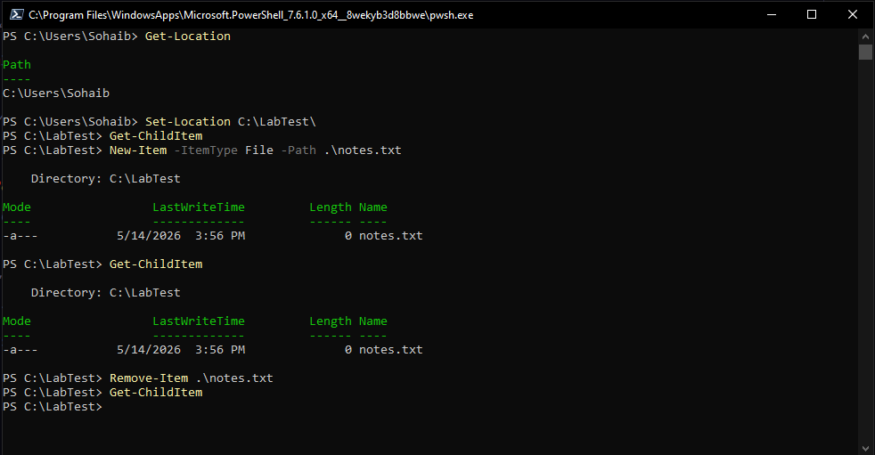
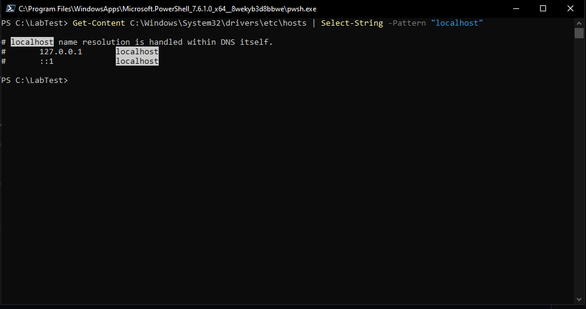
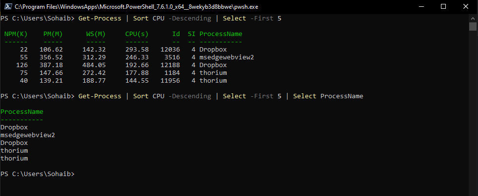
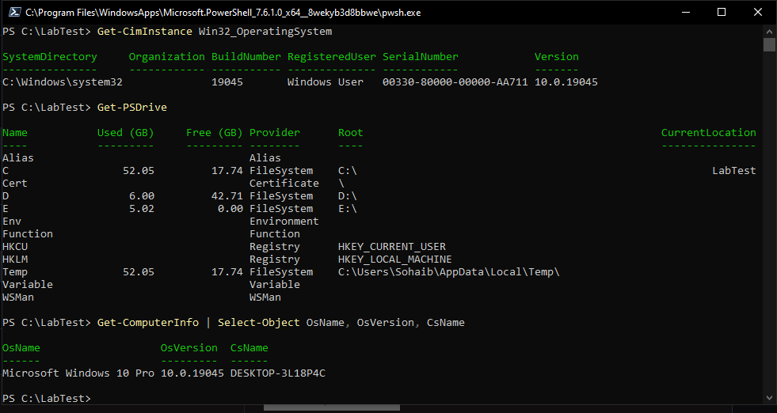

# PowerShell Basics - Navigation, Processes, grep equivalent, System Tools

All practice done on PowerShell 7 (`pwsh.exe`) on Windows 10. The goal was to get comfortable with the core commands and understand how they map to Linux equivalents already covered in Phase 1.

---

# Navigation and File Management

PowerShell uses cmdlets with a Verb-Noun naming pattern which makes commands more readable than Linux equivalents, though more verbose to type.



```powershell
Get-Location                              # equivalent of pwd
Set-Location C:\LabTest\                  # equivalent of cd
Get-ChildItem                             # equivalent of ls
New-Item -ItemType File -Path .\notes.txt # equivalent of touch
Remove-Item .\notes.txt                   # equivalent of rm
```

`Get-Location` returns the current working directory as an object, not just a string. `Get-ChildItem` lists directory contents including mode, last write time, size and name. The Mode column uses letters to describe file attributes: `d` for directory, `a` for archive, `r` for read-only, `h` for hidden, `s` for system.

---

# Select-String - grep equivalent

PowerShell's equivalent of `grep` is `Select-String`. It searches through file contents or piped input and returns matching lines with line numbers and the file they came from.



```powershell
Get-Content C:\Windows\System32\drivers\etc\hosts | Select-String -Pattern "localhost"
```

`Get-Content` reads the file and pipes each line into `Select-String`, which filters for lines matching the pattern. The matched term is highlighted in the output. This is the same pattern as `cat /etc/hosts | grep localhost` on Linux, just with different cmdlet names.

---

# Process Management

PowerShell returns process information as objects rather than plain text, which means you can sort, filter and select specific properties cleanly through the pipeline.



```powershell
# Top 5 processes by CPU usage
Get-Process | Sort CPU -Descending | Select -First 5

# Same but only show process names
Get-Process | Sort CPU -Descending | Select -First 5 | Select ProcessName
```

`Get-Process` returns all running processes. Piping through `Sort CPU -Descending` orders them by CPU consumption highest first. `Select -First 5` limits the output to 5 entries. Adding another `Select ProcessName` at the end narrows the output to just that one property, which shows how PowerShell pipelines pass objects rather than text, each cmdlet can inspect and select specific fields from what it receives.

Other useful process cmdlets:

```powershell
Stop-Process -Name "processname"   # equivalent of kill / pkill
Start-Process "notepad.exe"        # launch a process
Get-Process -Name "explorer"       # filter by name
```

---

# System Information Tools



```powershell
# Query OS information via WMI/CIM
Get-CimInstance Win32_OperatingSystem

# View all PowerShell drives including filesystem, registry, environment
Get-PSDrive

# Pull specific system properties
Get-ComputerInfo | Select-Object OsName, OsVersion, CsName
```

`Get-CimInstance Win32_OperatingSystem` queries the Windows Management Instrumentation (WMI) layer for operating system details. WMI is Windows' equivalent of reading from `/proc` on Linux, a structured interface to system information.

`Get-PSDrive` is one of the more interesting commands. It shows not just filesystem drives (C:, D:) but also the Windows Registry (HKCU, HKLM), environment variables, certificates, and more. This reflects how PowerShell treats everything as a navigable provider, you can actually `Set-Location HKLM:` and browse the registry the same way you browse a filesystem.

`Get-ComputerInfo` returns a large object with detailed system information. Piping it through `Select-Object` with specific property names trims the output to just what you need.

---

# Environment

- Machine: Windows 10 Pro
- Shell: PowerShell 7 (`pwsh.exe`)
- Practice directory: `C:\LabTest`
