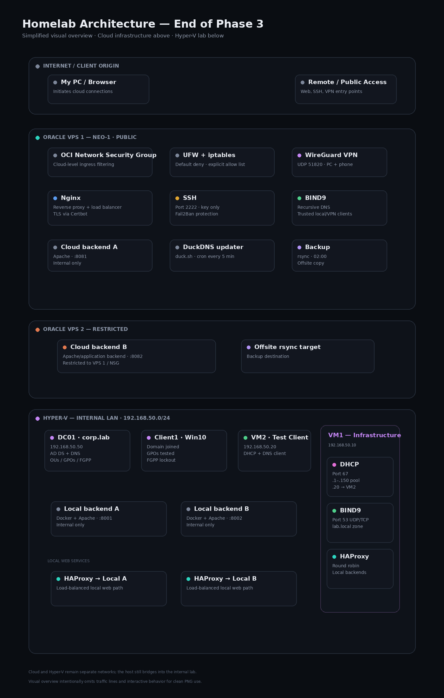

# IT Homelab

A practical, hands-on infrastructure lab built to develop real-world skills across Linux administration, Windows administration, networking, systems infrastructure, and security.

The lab combines Oracle Cloud infrastructure with a local Hyper-V environment. Each phase builds on the previous one, with the repository documenting not only what was configured, but how it was tested, verified, broken, and fixed.

> **Current state:** Phase 3 — Sysadmin Infrastructure complete. Phase 4 — Security is next.

## Architecture

### Phase 3 — End State



The architecture is split into two major environments:

* **Oracle Cloud** — public-facing and restricted VPS infrastructure
* **Hyper-V** — local Windows and Linux infrastructure on an internal lab network

The cloud and local environments serve different purposes, while the Hyper-V internal switch provides connectivity between the host and its guests. The lab is therefore **internally segmented, but not physically or logically air-gapped from the host**.

The diagram shows the major traffic paths, firewall layers, VPN access, DNS/DHCP services, web infrastructure, Active Directory, load balancing, and backup flow.

**Interactive architecture diagram:** https://sohaib-lab.duckdns.org/architecture-diagram.html

## Phases

| Phase   | Area                           | Status   |
| ------- | ------------------------------ | -------- |
| Phase 1 | Power User / Linux Foundations | Complete |
| Phase 2 | Networking                     | Complete |
| Phase 3 | Sysadmin Infrastructure        | Complete |
| Phase 4 | Security                       | Upcoming |

### Phase 1 — Power User

Linux and system-level fundamentals developed through practical command-line work and administration tasks.

→ [`PowerUser/`](PowerUser/)

### Phase 2 — Networking

Networking fundamentals progressing from packet behaviour and addressing to DNS, DHCP, routing, traffic inspection, VPNs, and troubleshooting.

→ [`Networking/`](Networking/)

### Phase 3 — Sysadmin Infrastructure

The environment evolved from basic connectivity into actual infrastructure: web servers, reverse proxies, TLS, firewalls, DNS, DHCP, load balancing, Active Directory, backups, file services, time synchronization, auditing, and operational hardening.

→ [`Sysadmin_Infrastructure/`](Sysadmin_Infrastructure/)

### Phase 4 — Security

The next phase will build on the infrastructure established during Phase 3 and focus on security-focused testing, analysis, and hardening.

## Environment

### Oracle Cloud

The cloud side currently contains:

* A primary public-facing VPS
* A restricted secondary VPS
* Nginx reverse proxy and TLS termination
* Dockerized Apache backends
* SSH with hardened configuration
* UFW and iptables host-level filtering
* OCI network-level filtering
* WireGuard VPN
* BIND9 DNS
* Dynamic DNS
* Automated rsync backups

### Hyper-V

The local lab contains:

* Active Directory domain controller
* Windows domain client
* Linux test client
* Infrastructure VM providing DNS and DHCP
* HAProxy load balancer
* Multiple Dockerized Apache backends
* Internal lab networking

The Hyper-V environment is intentionally used as a separate infrastructure domain, while still documenting the host-to-guest relationship rather than pretending the lab is completely isolated.

## Phase 3 Highlights

Phase 3 introduced the infrastructure layer that turns the earlier networking exercises into a functioning systems environment.

### Web Infrastructure

* Apache2 virtual hosts
* Apache hardening
* Nginx reverse proxy
* TLS with Let's Encrypt and Certbot
* Multiple backend services
* HAProxy load balancing
* Dockerized Apache backends

### Network Services

* BIND9 authoritative and recursive DNS
* Reverse DNS
* DNS/DHCP comparisons
* ISC DHCP server
* Dynamic DNS with DuckDNS
* NTP with chrony

### Access & Host Security

* Hardened SSH
* Key-based authentication
* Non-default SSH port
* Fail2Ban
* UFW
* iptables
* VPS listener audit
* Unused-service cleanup
* Lynis security auditing

### Windows Infrastructure

* Active Directory Domain Services
* Organizational Units
* Group Policy
* LDAP fundamentals
* Fine-Grained Password Policy
* Domain-joined Windows client

### Operations

* Automated rsync backups
* Recovery verification
* File-sharing labs
* FTP / SFTP / TFTP
* Disk partitioning
* Operational troubleshooting and post-mortems

## Verification Philosophy

The central principle of this lab is:

> **Learn the concept → observe it → break it → fix it → verify it → document it.**

Configuration alone is not treated as proof that something works.

Whenever practical, the lab uses direct evidence such as:

* `ss`
* `ip`
* `dig`
* `curl`
* `tcpdump`
* `systemctl`
* `journalctl`
* `ufw`
* `iptables`
* `wg`
* PowerShell / Active Directory commands
* service logs
* recovery tests
* security audits

This makes the repository a record of **verified infrastructure**, rather than a collection of configuration snippets.

## Documentation Beyond the Phases

### Audits & Reports

Security and system audits are kept separately from the build phases so that the state of the environment can be measured independently.

→ [`Audits_and_Reports/`](Audits_and_Reports/)

### Post-Mortems

Failures that crossed multiple infrastructure layers are documented separately with their root causes, impact, resolution, and prevention.

→ [`Post_Mortems/`](Post_Mortems/)

## Repository Structure

```text
homelab/
├── Audits_and_Reports/
├── Networking/
├── Post_Mortems/
├── PowerUser/
├── Sysadmin_Infrastructure/
├── LICENSE
└── README.md
```

## Security & Privacy

This repository intentionally documents infrastructure and configuration concepts without committing credentials, private keys, tokens, passwords, or other secrets.

Some documentation and architecture diagrams may contain intentionally documented lab-only addressing, service ports, or internal naming where they are useful for understanding the topology.

No credentials or authentication secrets belong in this repository.

## Current Milestone

**Phase 3 complete.**

The lab has progressed from Linux and networking fundamentals into a functioning multi-environment infrastructure stack with cloud services, local virtualization, network services, Windows domain infrastructure, load balancing, backups, auditing, and host hardening.

**Next:** Phase 4 — Security.

