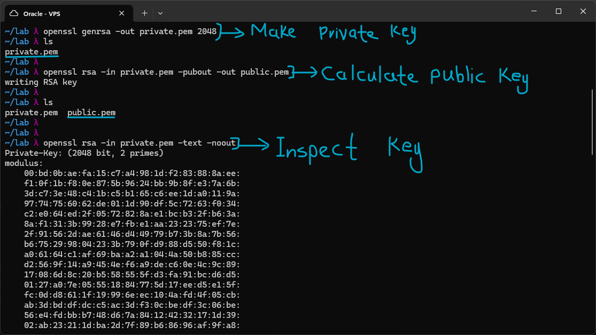
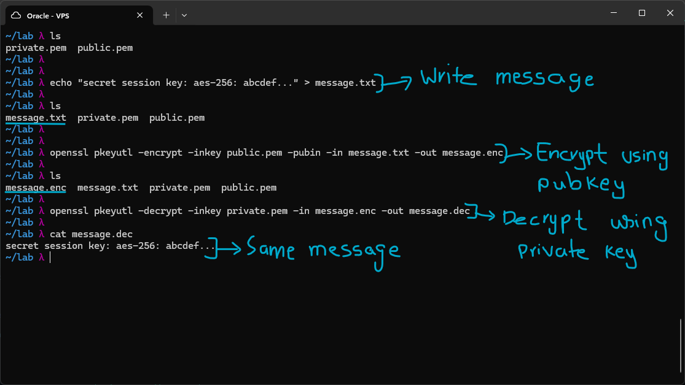
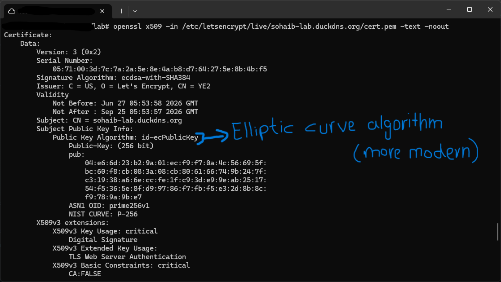

# Asymmetric Encryption

Asymmetric encryption uses a mathematically linked key pair, what one key encrypts, only the other can decrypt. This solves the key distribution problem of symmetric encryption. The public key can be shared with anyone, the private key never leaves your machine.

## RSA Key Operations

Two keys are created as part of a key pair, the public key and the private key. The public key is calculated from the private key, which is generated first. RSA-2048 is a 2048-bit key.
The private key is never shared. The public key can be shared freely.

**Encrypt with Public Key**
Anyone encrypts, only the private key holder can decrypt.
Use case: someone wants to send you a secret message. They encrypt it with your public key. Only you, holding the private key, can read it.

**Sign with Private Key**
Only the key holder signs, anyone with the public key can verify.
Use case: you want to prove a document came from you. You sign it with your private key. Anyone with your public key can verify it was not forged or tampered with.

**RSA Size Limitation**
RSA can only encrypt data smaller than the key size.
RSA-2048 can only directly encrypt roughly 245 bytes, so a 10MB file is impossible to encrypt directly. The solution is hybrid encryption, where RSA encrypts a symmetric key and AES encrypts the actual data.

## Lab

I generated an RSA-2048 private key using `openssl genrsa -out private.pem 2048`, which produced a `private.pem` key file. I then calculated the corresponding public key by giving the private key as input with `openssl rsa -in private.pem -pubout -out public.pem`, which wrote out the `public.pem` key file.
To inspect the private key file, I used `openssl rsa -in private.pem -text -noout`, which shows the contents of the generated key so it can be inspected.

For a demonstration of asymmetric encryption, I created a file `message.txt` with a secret inside, which was to be encrypted.
The file was encrypted using `openssl pkeyutl -encrypt -inkey public.pem -pubin -in message.txt -out message.enc`. The file was encrypted through the public key and not the private key, meaning it can only be decrypted using the private key. If the goal had been verification instead of confidentiality, it would have been encrypted using the private key instead, so that anyone with the public key could verify its integrity.
I then decrypted the `message.enc` file using `openssl pkeyutl -decrypt -inkey private.pem -in message.enc -out message.dec` and supplied the private key file to it.
Using the private key, the file was decrypted successfully, and `cat` showed it was identical to the original file.

For a practical demonstration, I inspected the Let's Encrypt certificate of the domain my lab site is running on. It is an x509 certificate, which is a digital document that binds a public key to an identity, in this case the site itself.
The public key algorithm being used is id-ecPublicKey, the Elliptic Curve algorithm, which can be seen in the output. EC is the more modern algorithm and has become the standard choice for new digital certificates.

## Hybrid Encryption

RSA cannot encrypt large files and AES has the key sharing problem. Hybrid encryption solves both issues by combining them, RSA is used to safely share the AES key, and then AES does the actual heavy lifting of encrypting the real data. This is basically how TLS/HTTPS works under the hood.

1. First, a random AES session key is generated. This key only exists for this one session and gets thrown away right after use. In TLS 1.3 specifically, this step is done using Diffie-Hellman, so the key itself never actually gets sent over the wire, both sides work it out independently.

2. That AES session key is then encrypted using the recipient's RSA public key. Since the AES key is small, 32 bytes for AES-256, it fits well within what RSA is capable of encrypting. Now only whoever holds the matching private key can get that AES key back, which is exactly how the key distribution problem gets solved.

3. The actual data gets encrypted with the AES session key, not RSA. AES is fast enough to encrypt gigabytes of data in milliseconds, while RSA would take seconds for the same amount of data and also has a hard size limit. This is why RSA is only used for exchanging the key and AES handles the real payload.

4. What actually gets sent over is the encrypted session key plus the encrypted data. On the other end, the recipient uses their RSA private key to get back the AES session key, then uses that key to decrypt the actual data. Since an eavesdropper does not have the private key, they cannot get the session key, and without the session key they cannot decrypt anything either.
