# Crypto Lab

Heavy lab, six parts, each one demonstrating a different cryptographic primitive: hash, sign, hybrid encrypt, crack, inspect, capture. The idea is to consolidate previous labs so the lab tells one story: encryption done right first, then what happens when it is done wrong or not done at all.

All commands were run, output is from the actual sessions.

## Part 1 - Hash and sign a document

A hash proves integrity, a signature proves authenticity. These are not the same thing and this part is where that distinction actually clicked for me.

```
cat > lab-document.txt <<DOC
CRYPTOGRAPHY LAB DOCUMENT
Author: Sohaib
Date: $(date)
Content: This document demonstrates digital signing.
I confirm the lab tasks for Cryptography labs are complete.
DOC
```

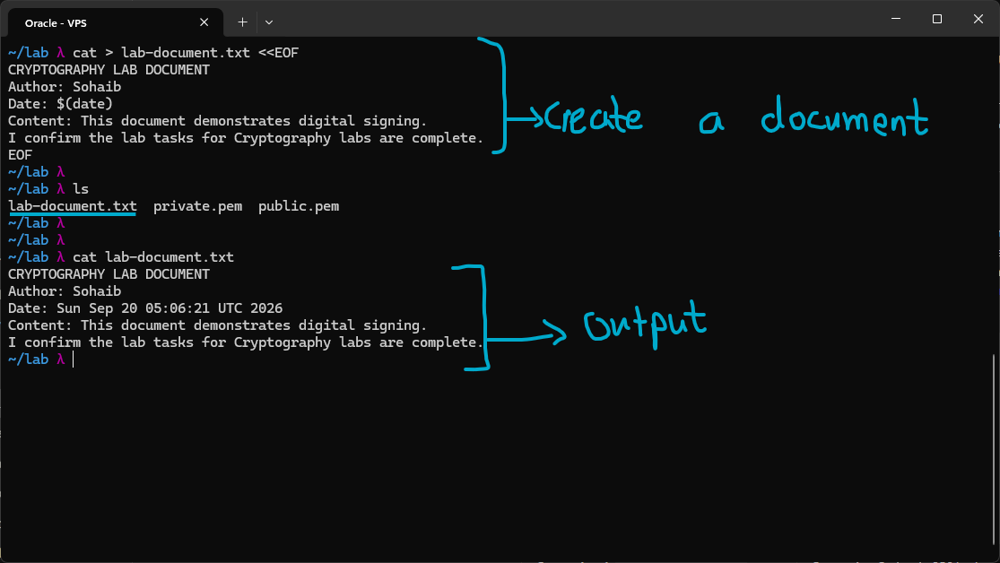

Hashed it with SHA-256:

```
sha256sum lab-document.txt > lab-document.sha256
cat lab-document.sha256
```

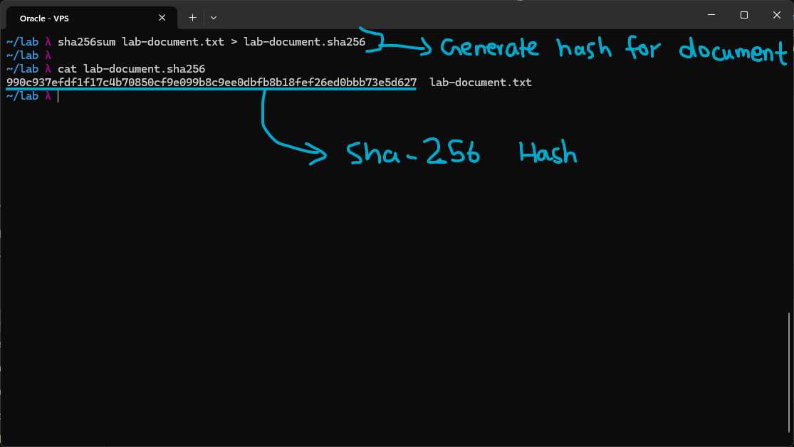

Signed the hash with my private key, then verified it against the public key:

```
openssl dgst -sha256 -sign private.pem -out lab-document.sig lab-document.txt
openssl dgst -sha256 -verify public.pem -signature lab-document.sig lab-document.txt
```

`Verified OK` means the signature could only have come from whoever holds `private.pem`. The hash by itself never proves that, it only proves the file has not changed.

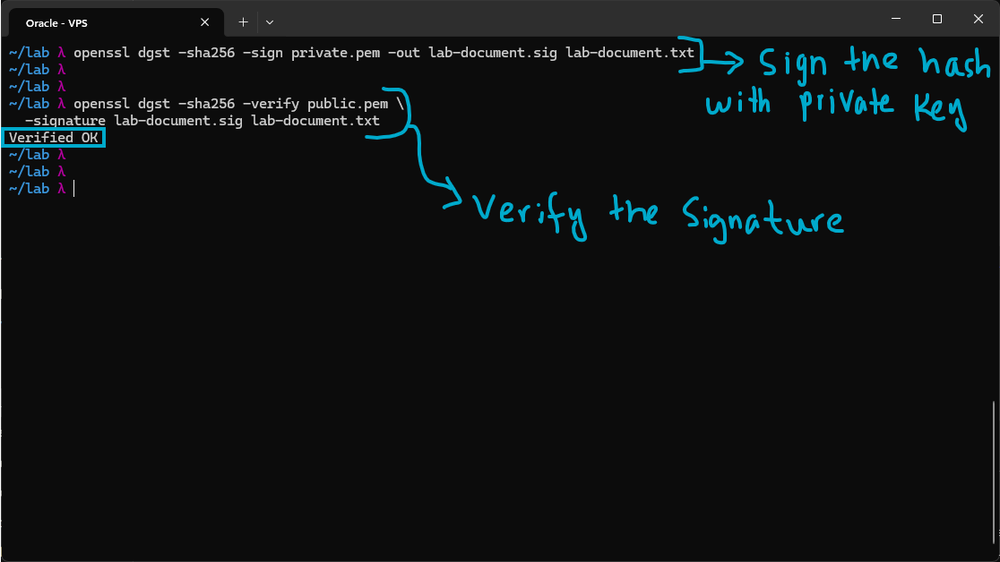

## Part 2 - Hybrid encryption

RSA does not scale well to large data, AES does but needs a safe way to hand over the key. Hybrid encryption is the fix both TLS and this lab use: encrypt the message with AES, then encrypt the AES key itself with RSA.

Generated a random 256-bit session key:

```
openssl rand -hex 32 > session.key
cat session.key
```

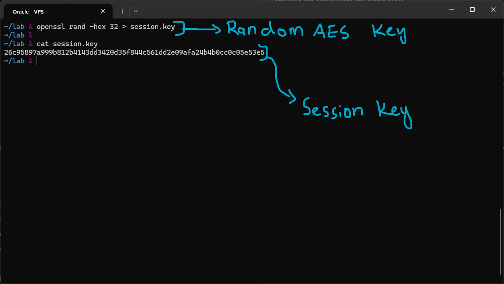

Encrypted the message with AES using that key, then RSA-encrypted the session key so only my private key can recover it. Decrypt goes in reverse: RSA-decrypt the key first, then use that recovered key to AES-decrypt the message.

```
openssl enc -aes-256-cbc -pbkdf2 -pass file:session.key -in lab-document.txt -out lab-document.enc
openssl pkeyutl -encrypt -inkey public.pem -pubin -in session.key -out session.key.enc
openssl pkeyutl -decrypt -inkey private.pem -in session.key.enc -out session.key.dec
openssl enc -d -aes-256-cbc -pbkdf2 -pass file:session.key.dec -in lab-document.enc -out lab-document.dec
diff lab-document.txt lab-document.dec && echo "Perfect decrypt"
```

`diff` came back empty and the decrypted file matched byte for byte.

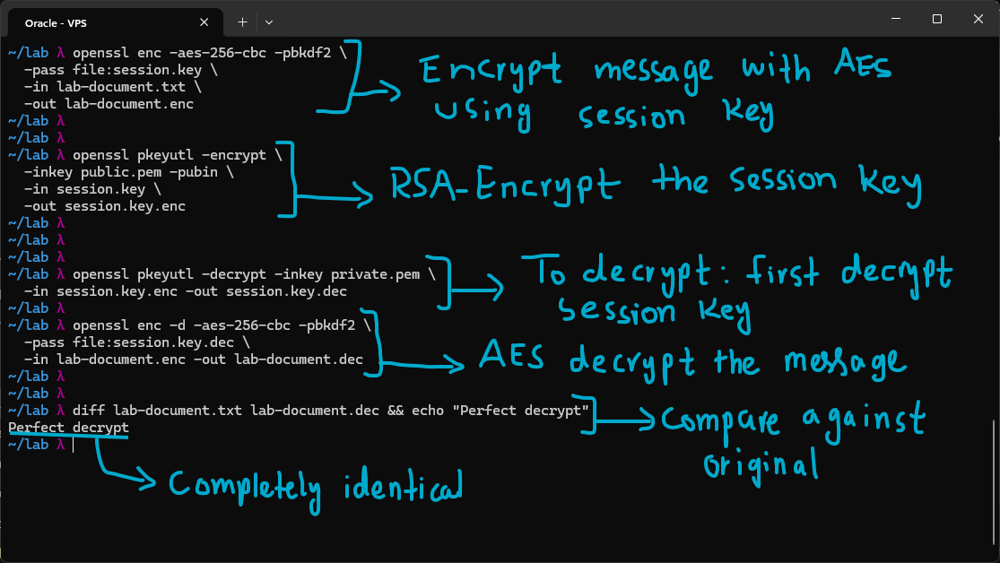

## Part 3 - Crack a weak hash

This is the part that flips the lesson around. Hashing a password is not protection on its own, if the password is guessable the hash is reversible with a dictionary attack.

Generated a SHA-512 crypt hash for a weak password and wrote it into a shadow-style line:

```
HASH=$(python3 -c "import crypt; print(crypt.crypt('qwerty', crypt.mksalt(crypt.METHOD_SHA512)))")
echo "testuser:$HASH:0:0:Test:/tmp:/bin/bash" > shadow.txt
cat shadow.txt
```

Got a `DeprecationWarning` here since `crypt` is slated for removal in Python 3.13. It still ran fine and produced a real hash, so I left it as is rather than switching to `mkpasswd` mid-lab. Worth knowing for future labs once the Kali Python version moves past 3.13.

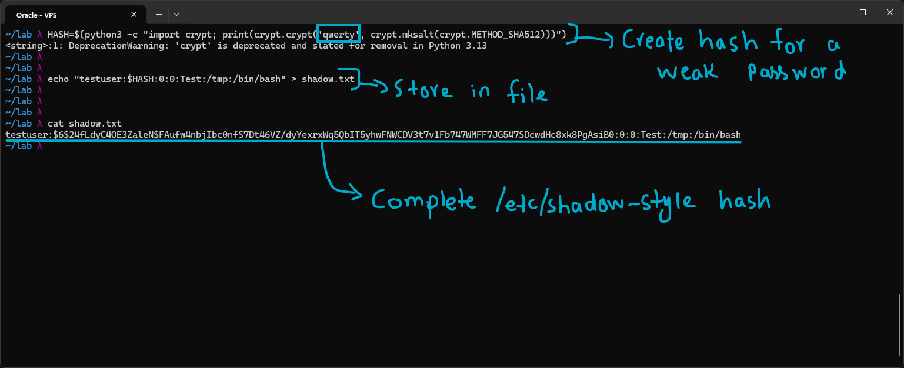

Moved `shadow.txt` over to Kali and cracked it with John, using rockyou.txt:

```
john --wordlist=/usr/share/wordlists/rockyou.txt shadow.txt
john --show shadow.txt
```

`qwerty` came back in seconds. John auto-detected the hash type as `sha512crypt` and reported a cost factor of 5000 iterations, the built-in slowdown SHA-512 crypt is supposed to add. That cost factor did not matter here, a common word still cracks in seconds regardless. That is the whole point of the part, a weak password is only ever as safe as the hash's resistance to guessing, which for a common word is basically none.

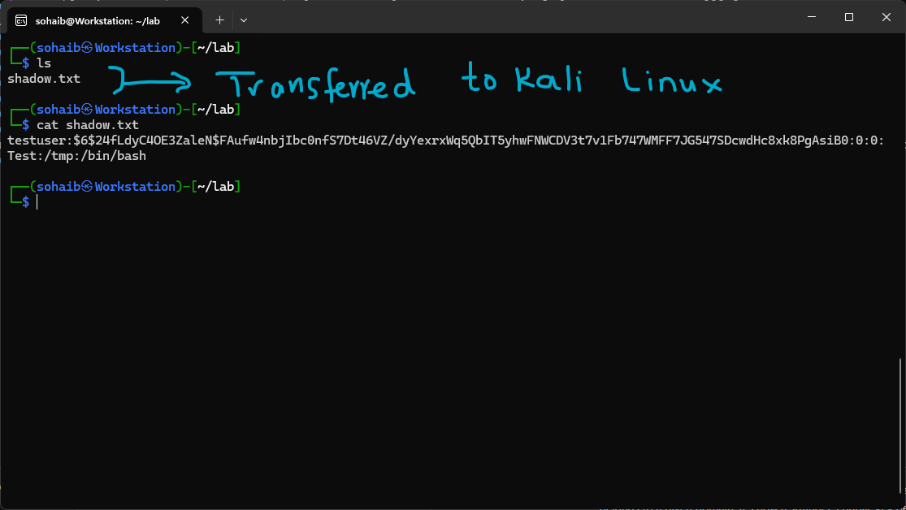 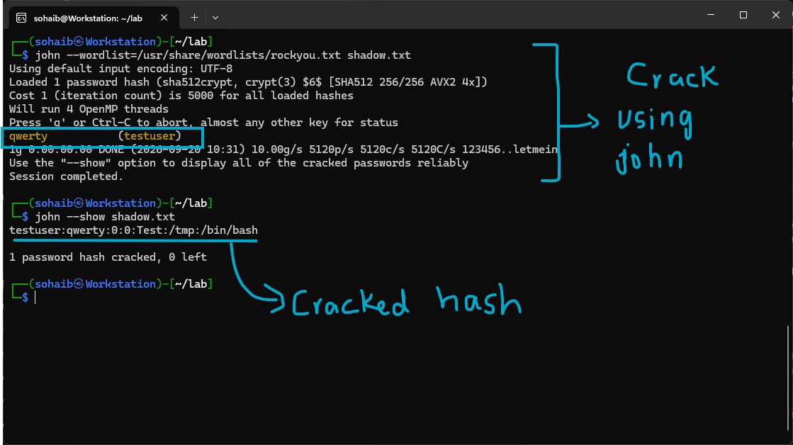

## Part 4 - Inspect a certificate chain

This closes the loop from Parts 1 and 2. A certificate is a CA's signed statement that a given public key belongs to a given domain, which is what lets a stranger's public key be trusted in the first place.

Inspected Google's cert chain:

```
openssl s_client -connect google.com:443 -showcerts 2>/dev/null | grep -E "subject|issuer|notBefore|notAfter"
```

Google's cert is issued by Google Trust Services, their own in-house CA, not a third party.

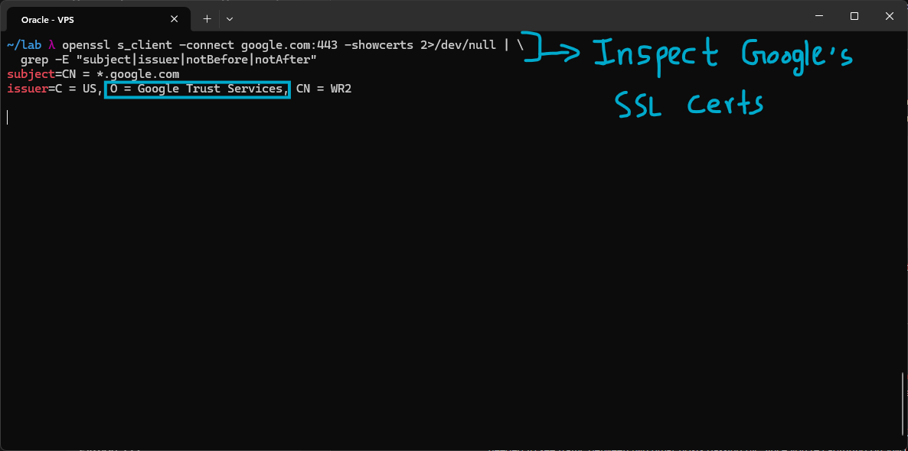

Then my own domain, issued through Let's Encrypt:

```
openssl s_client -connect sohaib-lab.duckdns.org:443 2>/dev/null | openssl x509 -noout -text | grep -E "Issuer:|Subject:|Not (Before|After)"
```

Same shape as the Google output, issuer, subject, validity window, just a different CA. Seeing my own domain go through the same checks made the concept concrete in a way just reading about it did not, and the contrast with Google running its own CA versus my domain going through Let's Encrypt made it clear that "a CA" is not one single company, it is a role different organizations can fill.

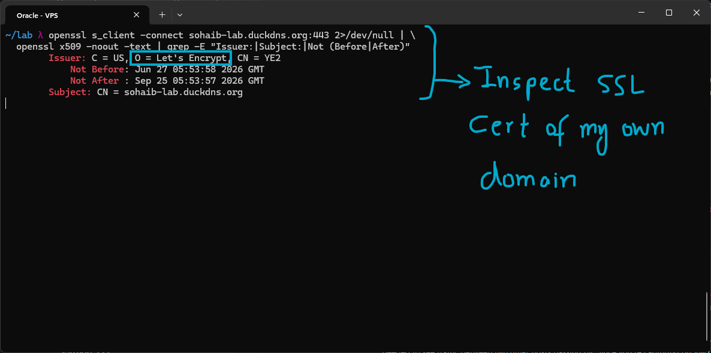

## Part 5 - FTP capture in plaintext

The payoff part. Plaintext FTP has none of the protections from Parts 1 and 2, no hashing, no signing, no encryption, so credentials sit on the wire exactly as typed.

Ran this across three VMs, an Ubuntu server running vsftpd, an Ubuntu client, and Kali for analysis. Captured directly on the server's own interface rather than sniffing traffic between two other machines. That distinction matters: a NIC always sees its own traffic, promiscuous mode is only needed to see traffic between two other hosts passing by. Since the server is one side of the FTP conversation, no special switch config was needed to capture it.

```
sudo tcpdump -i eth1 port 21 -w ./ftp_capture.pcap
```

Client connected to the server while the capture was running:

```
ftp 192.168.50.10
```

tcpdump reported 13 packets captured, 13 received by the filter, and 0 dropped by the kernel, so the whole exchange was captured cleanly with nothing missing.

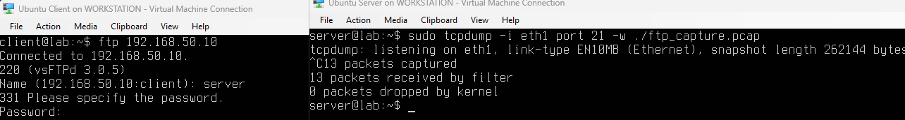

Pulled `ftp_capture.pcap` onto Kali and opened it in Wireshark, filtered on `ftp`. The capture also shows a failed login attempt (`530 Login incorrect`). This does not weaken the demonstration, FTP transmits `USER` and `PASS` in plaintext before the server even validates them, so the credentials are exposed on the wire regardless of whether the login succeeds.

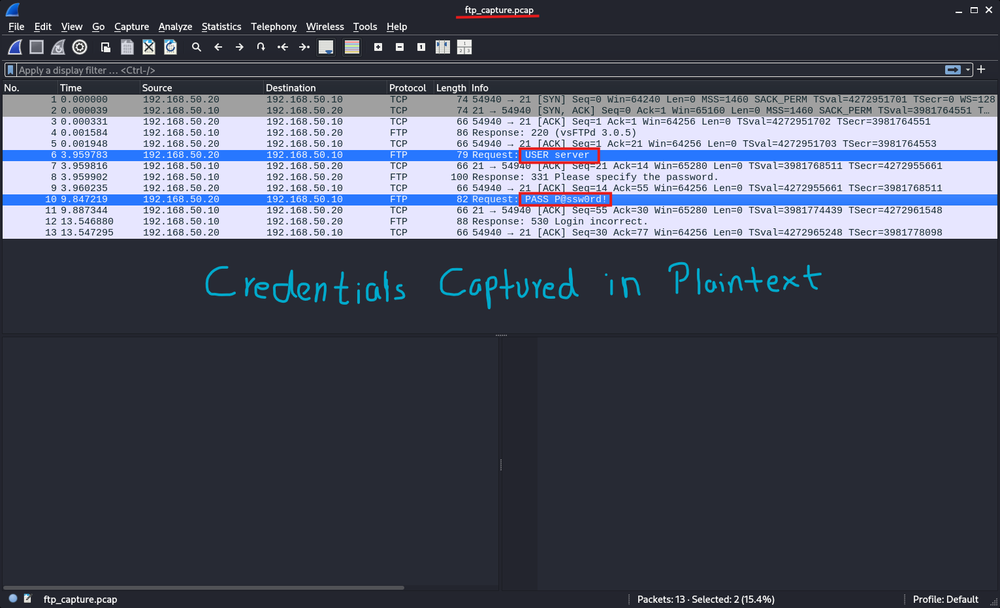

## What this lab actually proved

- Hashing proves integrity, signing proves authenticity, they solve different problems and one does not substitute for the other
- Hybrid encryption exists because RSA and AES each solve half the problem, RSA for safe key exchange, AES for speed
- A hash is not protection if the underlying password is weak, cracking speed depends entirely on the wordlist matching the password, not on the hash algorithm being broken
- Certificates are what make Part 1 and 2's "public key" trustworthy in practice, someone has to vouch for it, and that someone can be different CAs for different sites
- None of the first four parts matter if the protocol itself never encrypts anything, which is exactly what plaintext FTP demonstrates
