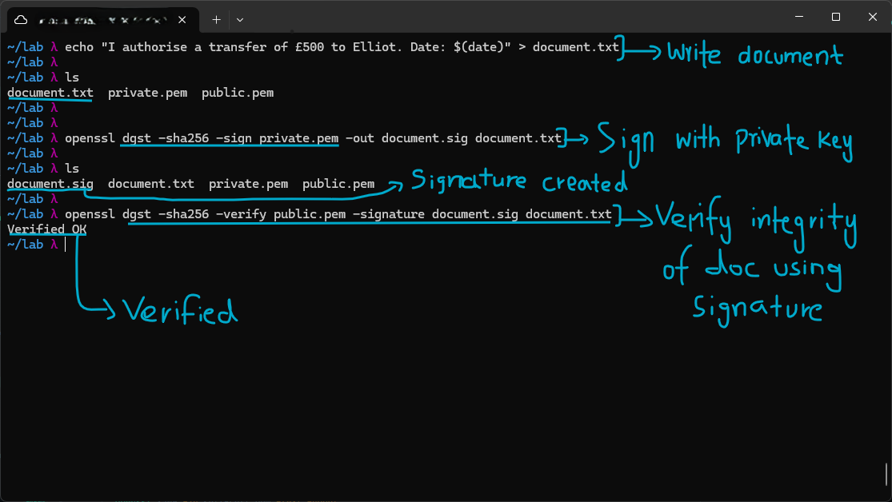
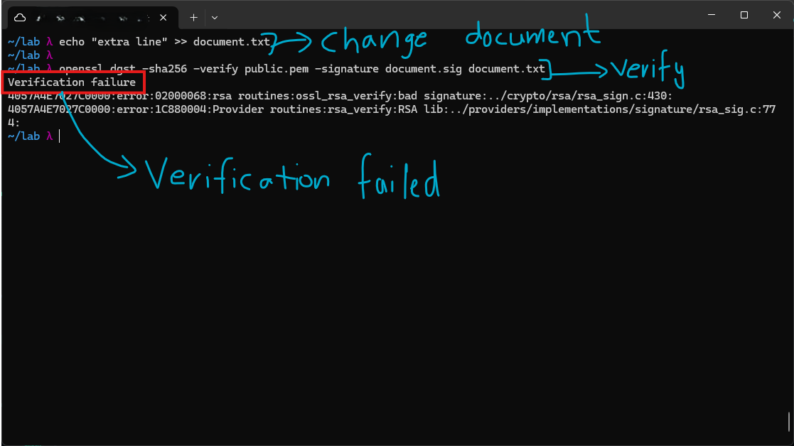
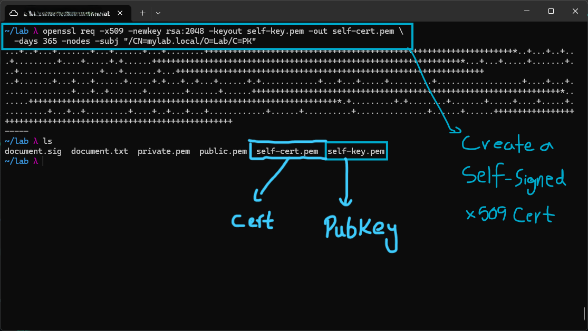
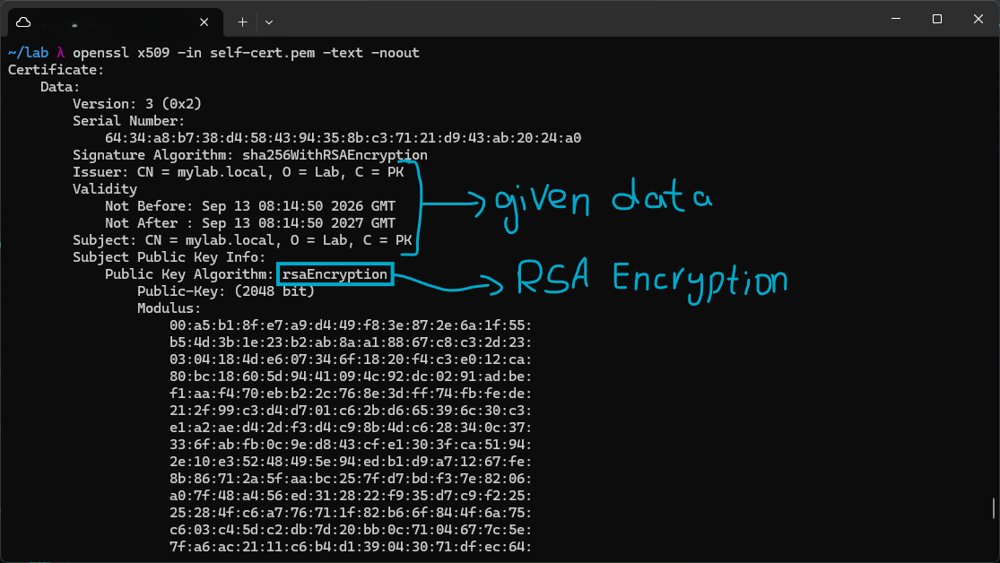

# Digital Signatures

Encryption hides content. Signatures prove authorship. A digital signature provides two guarantees, authenticity (this came from the key holder) and integrity (it has not been tampered with). Understanding this distinction is fundamental to how TLS, code signing, and software updates work.

## How Signing + Verification Works

**Signing (Sender):**
1. Hash the document with SHA-256, this produces a 32-byte digest
2. Encrypt the hash with the private key
3. This encrypted hash IS the signature
4. Send the document plus the signature

**Verification (Receiver):**
1. Decrypt the signature with the sender's public key, this reveals the original hash
2. Independently hash the received document with SHA-256
3. Compare the two hashes
4. If they match, the signature is valid

## Lab

To demonstrate signing and verification, I created a document named `document.txt` which contains a realistic account of a statement that may need a signature.
The document was signed using the private key created in the earlier asymmetric encryption lab, using the command `openssl dgst -sha256 -sign private.pem -out document.sig document.txt`. This created a SHA-256 digest and signed it with the private key, giving a `document.sig` signature file as output.
Verification was done using the public key file and the signature file against the original `document.txt`, using `openssl dgst -sha256 -verify public.pem -signature document.sig document.txt`. It returned "Verified OK", meaning the verification was successful and the integrity of the file is intact.

To demonstrate integrity assurance, I appended a line to the original file with `echo "extra line" >> document.txt`, then tried to verify again. This returned "Verification failure", with `openssl` giving a "bad signature" error, indicating that the signature no longer matches this modified file. Verification would succeed again if the file were restored to its original state. This shows that tampering can easily be detected once a file has been signed.

To simulate my own Certificate Authority, I created a self-signed certificate to understand the basic structure.
I used the command `openssl req -x509 -newkey rsa:2048 -keyout self-key.pem -out self-cert.pem -days 365 -nodes -subj "/CN=mylab.local/O=Lab/C=PK"`.
I specified the x509 standard for the certificate, RSA-2048 for the public key, `self-key.pem` as the private key file, and `self-cert.pem` as the certificate file. I also set a 365 day expiry along with the identity details to embed in the certificate: Common Name = mylab.local, Organization = Lab, Country = PK. The `-nodes` flag means "no DES", it stores the private key unencrypted with no passphrase, which is why the command never prompted me for one. That is fine for a lab, but a real private key would normally be passphrase-protected.

Upon inspecting the certificate with `openssl x509 -in self-cert.pem -text -noout`, the data given when creating the certificate shows up embedded inside it, linking the public key to the identity specified. The Signature Algorithm field shows sha256WithRSAEncryption, meaning the certificate itself is signed using the same SHA-256 plus RSA combination from the signing lab above. The Public Key Algorithm is shown as rsaEncryption, matching what was specified in the command.
Anyone with the public key can now verify this certificate and confirm the identity of the Certificate Authority it is linked to.

## Public Key Infrastructure + CA Chain

No one can trust an unknown public key without a vouching system. PKI (Public Key Infrastructure) solves this with a chain of trust: you trust a root CA (built into your OS or browser), the root signs an intermediate CA, and the intermediate signs your server certificate. Here is the CA chain for the certificates issued during the labs, using Let's Encrypt.

#### Root CA

**ISRG Root X1** is the root of trust for Let's Encrypt. It is a self-signed certificate, it signs itself because there is no higher authority. An OS and browser ship with about 150 pre-trusted root certificates baked in, ISRG Root X1 is one of them. You implicitly trust every certificate that chains back to this root. If ISRG's private key were compromised, all Let's Encrypt certificates would be untrustworthy, which is why root private keys are stored offline in hardware security modules (HSMs) inside physically secured facilities.

#### Intermediate CA

**R11 is Let's Encrypt's intermediate CA.** The root CA never directly signs end-entity certificates, doing so would require the root's private key to be online and used frequently, increasing exposure risk. Instead, the root signs a long-lived intermediate certificate. The intermediate CA's key is the one actually used day to day to sign the thousands of certificates Let's Encrypt issues. If R11's key were compromised, ISRG could revoke R11 and create a new intermediate without touching the root. This architecture limits the blast radius of a compromise.

#### End-Entity (Leaf)

**sohaib-lab.duckdns.org** is the leaf, the end of the chain. It contains my domain name and my public key, and is valid for 90 days. Browsers verify the chain: leaf signed by R11, R11 signed by ISRG Root, ISRG Root in the trust store, valid. The 90-day lifetime is intentional, short-lived certs reduce the window in which a compromised cert can be misused. Certbot, which was used during the lab, handles renewal automatically, so this is transparent day to day.
