# GPG / PGP

PGP (Pretty Good Privacy) applies the same asymmetric principles as TLS, but for email and file encryption. GPG (GNU Privacy Guard) is the free, open-source implementation used on Linux. It is used for signing software releases, encrypting emails, and verifying developer commits.

## Lab

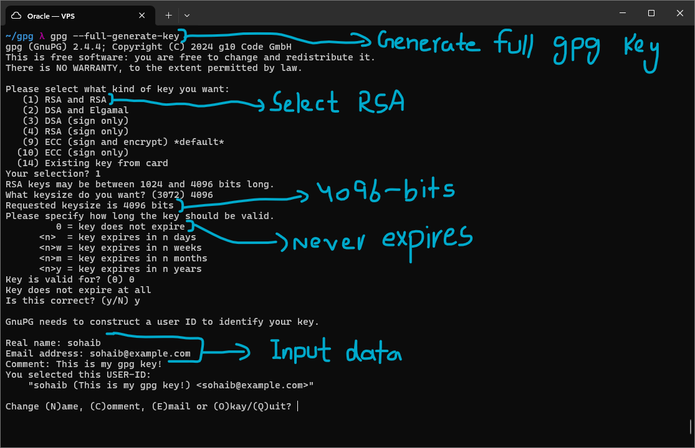

I generated a PGP key pair using `gpg --full-generate-key`. This flag launches an interactive wizard through which the key type, length, expiry, and identity info can all be specified.
I chose option 1, RSA and RSA, at a 4096-bit key size, larger than the RSA-2048 used in the earlier asymmetric encryption and signature labs. When asked how long the key should be valid for, I chose 0, meaning it never expires, which is fine for a lab key but a real-world key would normally be given an expiry date for security.
For the identity, I entered Name: sohaib, Email: sohaib@example.com, Comment: This is my gpg key!. It then prompted for a passphrase, and once entered, the key was created.

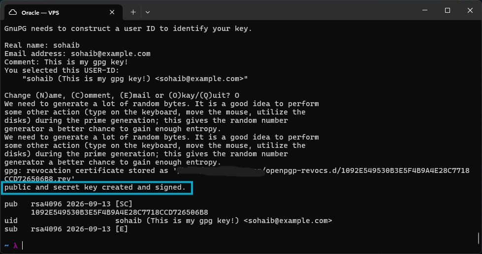

The key has been created, "public and secret key created and signed" confirms it, and the status can be seen with gpg commands.

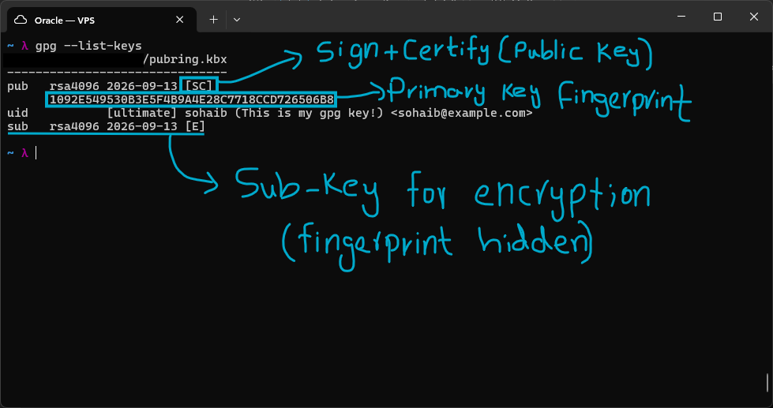

Using `gpg --list-keys`, the public key info is shown. This info is limited by default for privacy.
`pub` refers to the public section of the primary key. The `[SC]` next to the creation date means this key can Sign and Certify, sign meaning it can sign messages or other keys, certify meaning it can vouch for identities (its own uid, or other people's keys).
Below `pub` is the primary key fingerprint, which is the same for both the public and private sides of the primary key, since it identifies the key as a whole.
`uid` shows the identity information entered when creating the key.
`sub` is a separate encryption subkey, marked `[E]`. This subkey is what actually gets used to encrypt messages sent to this identity, it is not used to encrypt the primary key itself. Its fingerprint is different from the primary key's and is hidden by default for privacy.

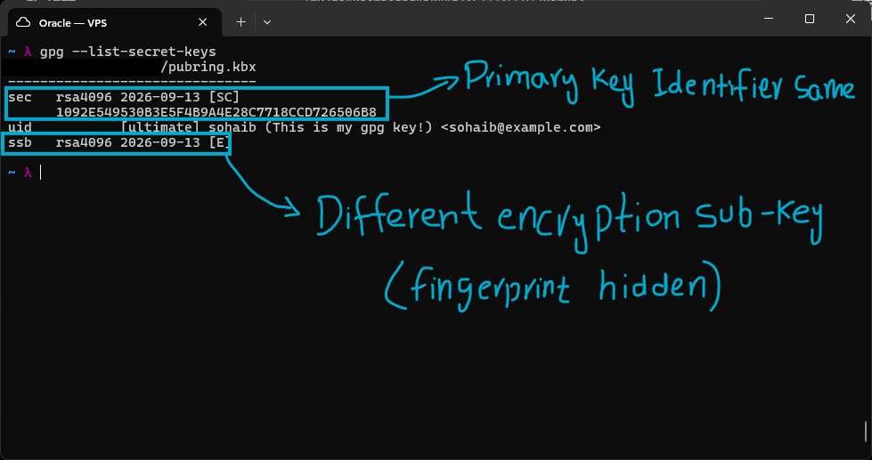

Inspecting the private side with `gpg --list-secret-keys`, the identifier and fingerprint for the `sec` section match the `pub` section exactly, and the `uid` is the same, since it is the same primary key.
What differs is `ssb`, the private counterpart of the encryption subkey, used to decrypt messages that were encrypted to this identity's public subkey. Its fingerprint is different from the primary key's and hidden by default.

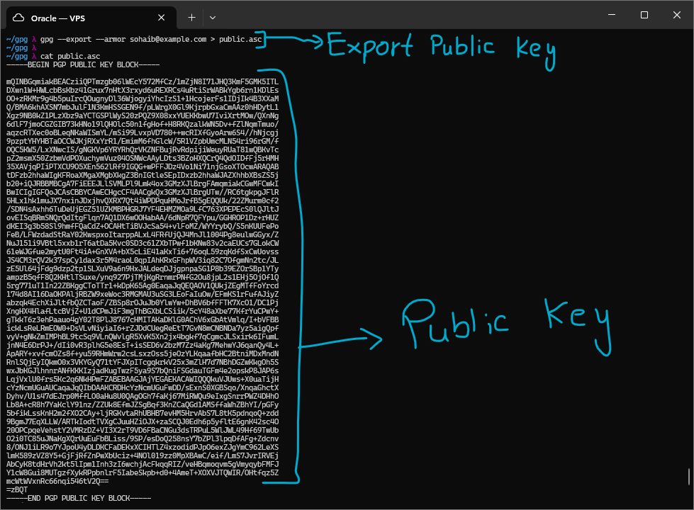

I exported the public key for sohaib@example.com using `gpg --export --armor sohaib@example.com > public.asc`, then inspected it with `cat`, which showed the full ASCII-armored public key, from the BEGIN block to the END block.

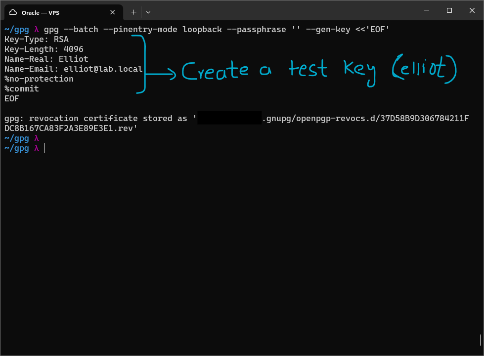

To simulate a real exchange, I created a second, throwaway key for a test user Elliot (elliot@lab.local), without a passphrase, using a non-interactive batch command instead of the wizard:
`gpg --batch --pinentry-mode loopback --passphrase '' --gen-key` with a heredoc specifying `Key-Type: RSA`, `Key-Length: 4096`, `Name-Real: Elliot`, `Name-Email: elliot@lab.local`, and `%no-protection` to skip passphrase protection entirely, then `%commit` to finalize it. This is the scriptable way to generate a key without answering prompts, useful for automation or, in this case, quickly creating a disposable test identity.

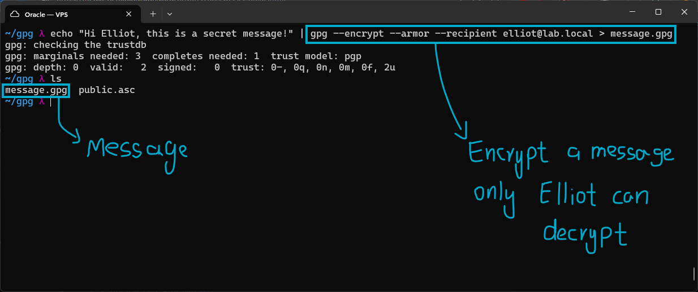

I encrypted a message for elliot@lab.local using `gpg --encrypt --armor --recipient elliot@lab.local > message.gpg`, meaning only Elliot's private key can decrypt it.
Before encrypting, gpg checks the trustdb and prints its trust model parameters (marginals needed, completes needed, trust counts). This is the Web of Trust bookkeeping mentioned later, gpg tracks how much it trusts each key to vouch for others, even for a throwaway key like Elliot's.

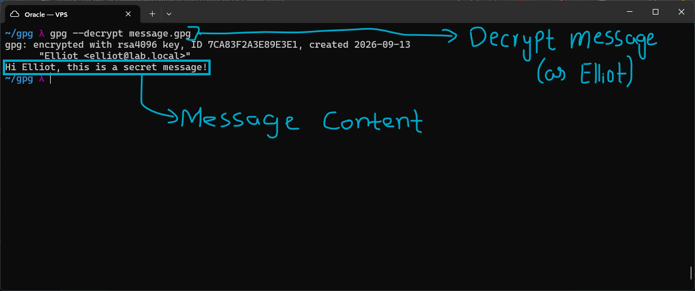

I decrypted it with `gpg --decrypt message.gpg`, which automatically found and used Elliot's key since it is stored locally. It printed the decrypted message in full along with the encryption details.
This Elliot key was generated locally purely for testing. In a real scenario I would import someone's key from a keyserver or a direct exchange instead, and its trust level would show as unknown until I had actually verified their identity, since having someone's public key is not the same as trusting them.

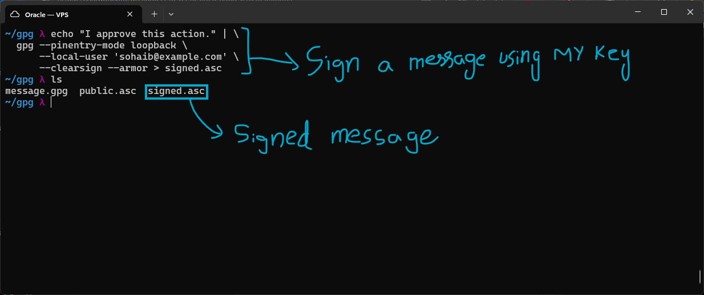

I signed a message using my own key (sohaib@example.com) into a file named signed.asc, using:
`gpg --pinentry-mode loopback --local-user 'sohaib@example.com' --clearsign --armor > signed.asc`
`--local-user` picks which key to sign with, useful once you have more than one key. `--clearsign` specifically produces a cleartext signed message, the original text stays human-readable with the signature wrapped around it, rather than the message being turned into an opaque signed blob.

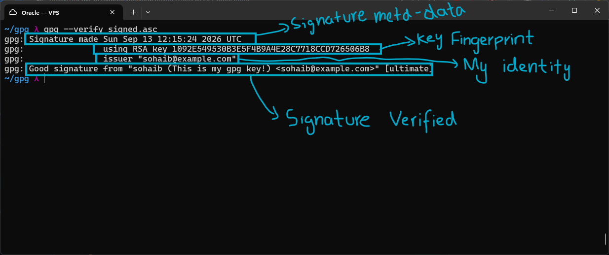

Verifying signed.asc with `gpg --verify signed.asc` showed the signature metadata: when it was made, the key fingerprint, the issuer identity (sohaib@example.com), and the verification result.
"Good signature from "sohaib (This is my gpg key!) <sohaib@example.com>" [ultimate]" confirms the signature is valid against the key stored locally. The trust level is ultimate because this is my own key, ultimate trust is used for signing my own outgoing messages and decrypting messages sent to myself.

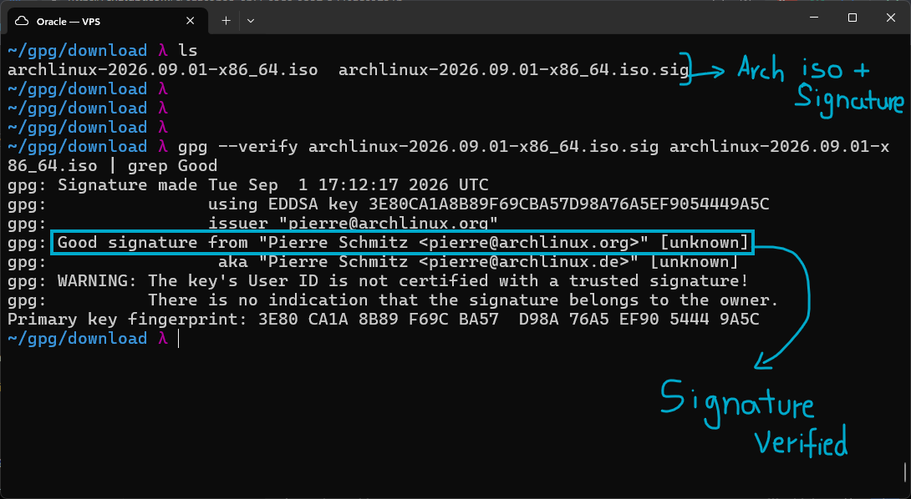

To see a real-world use case, I downloaded an Arch Linux ISO along with its signature file, and imported the Arch Linux signing key beforehand so gpg would have something to verify against.
I then ran `gpg --verify archlinux-2026.09.01-x86_64.iso.sig archlinux-2026.09.01-x86_64.iso | grep Good`, and the result was positive: "Good signature from...".
The signature shows [unknown] trust because I have not personally verified the identity of the issuer, Pierre Schmitz, I only have his public key, the same reasoning applies here as with Elliot's key above, and it is also why gpg prints warnings alongside the result. Interestingly, this signature uses an EDDSA key rather than RSA, a different and more modern signing algorithm than anything else used in this lab.
Even with the trust warnings, this still proves the ISO genuinely came from the person who holds that signing key, so if you trust that person or organization, you can trust the file.

# Web of Trust vs CA Model

PGP and TLS both need a way to decide whether an unknown public key can be trusted, but they solve it very differently.

PGP's Web of Trust is decentralized, there is no single root authority anyone has to trust. Instead, people vouch for each other by signing one another's keys. If I sign Elliot's key, anyone who already trusts me now has a reason to trust Elliot too, and trust spreads outward through the community this way instead of coming down from a central authority. It relies on things like community signatures and key signing parties rather than any company. The downside is that it is hard to get started, you need to already know some trusted people to bootstrap any trust at all, and revoking a compromised key relies on revocation certificates that can be slow to spread through the network. This model is mainly used for things like email encryption, software signing, and developer identity, which lines up with what I did in this lab.

The CA model, which is what TLS/HTTPS uses, is centralized instead. Browsers and operating systems ship with a pre-installed list of around 150 trusted root CAs, and those CAs verify domain ownership before they sign a certificate for that domain. Authority here is centralized, companies like Mozilla, Google, and Apple control which roots actually make it into that trusted list. Because the whole web depends on a relatively small number of these CAs behaving correctly, a compromised or rogue CA can be a real problem, this actually happened with DigiNotar in 2011, where a breached CA was used to issue fraudulent certificates. On the plus side, revocation in this model is well established through OCSP and CRLs, and it is what allows HTTPS to work reliably at the scale of the entire internet.
