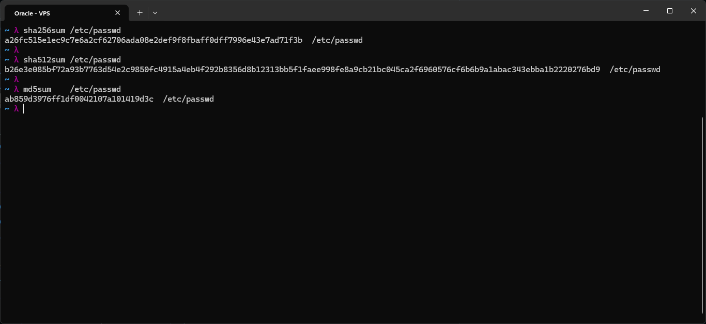
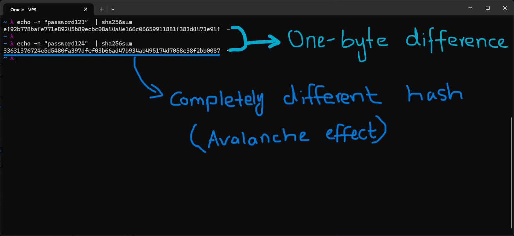
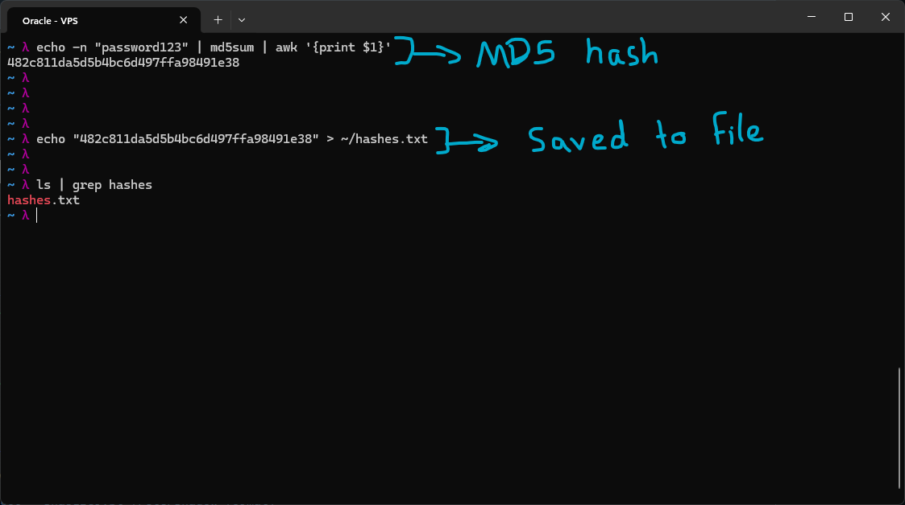
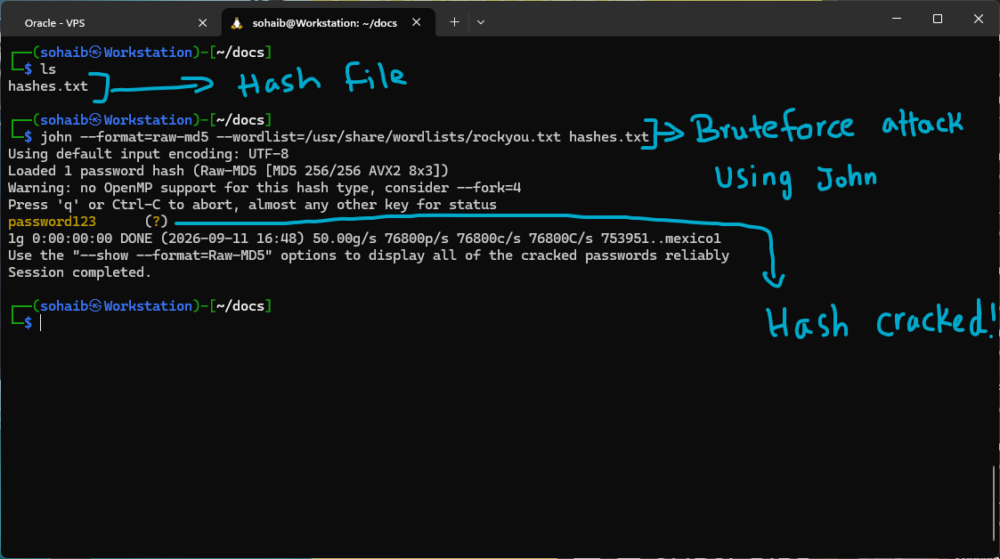

# Hashing, One-Way Functions

A hash function takes any input and produces a fixed size output, called a digest, that is deterministic and fast to compute, but practically impossible to reverse.

**Avalanche Effect**: a tiny change in the input significantly alters the output hash.

This underpins password storage, file integrity, digital signatures, and blockchains.

## Hashing Algorithms

| Algorithm | Output | Speed | Status | Use Today? |
|-----------|--------|-------|--------|------------|
| MD5 | 128-bit (32 hex) | Very fast | BROKEN | Never for security |
| SHA-1 | 160-bit (40 hex) | Fast | DEPRECATED | Legacy only |
| SHA-256 | 256-bit (64 hex) | Fast | SECURE | Yes, general use |
| SHA-512 | 512-bit (128 hex) | Fast (on 64-bit) | SECURE | Yes, higher security |
| SHA-3 | 256/512-bit | Slower | SECURE | Yes, alternative |
| bcrypt | 184-bit (60 chars) | Deliberately slow | SECURE | Yes, passwords only |

## Lab

A look at the length of the hashes for SHA-256, SHA-512, and MD5. MD5 gives a shorter hash compared to the SHA algorithms. That is part of why it has possible collisions and is not considered secure.

To see the avalanche effect for myself, I created SHA-256 hashes for two almost identical strings with only a one byte difference. That one byte difference resulted in the second hash being almost completely different from the first. This is the avalanche effect, and it is a big part of why hashing works the way it does for security purposes.

To demonstrate how MD5 is insecure, I created a hash for a string that is one of the commonly used passwords from past breaches. I then saved that hash to a file named `hashes.txt`. This was done on my Oracle VPS, and the file was moved over to Kali Linux running under WSL on my Windows PC.

I used a wordlist of commonly used passwords, which contains the string I had hashed earlier. I used `john`, a Kali password cracker, to try the wordlist against the password hash, essentially a brute force attack. It took milliseconds for `john` to crack the hash and recover the original password string.

The command I used was:

`john --format=raw-md5 --wordlist=<wordlist path> <hashfile>`

> Why this lab is legal and educational: I cracked hashes that I created from passwords I chose. Never run password crackers against hashes you do not have explicit authorization to crack. Understanding how cracking works makes you a better defender, and it is why bcrypt, long passwords, and salting are essential.
