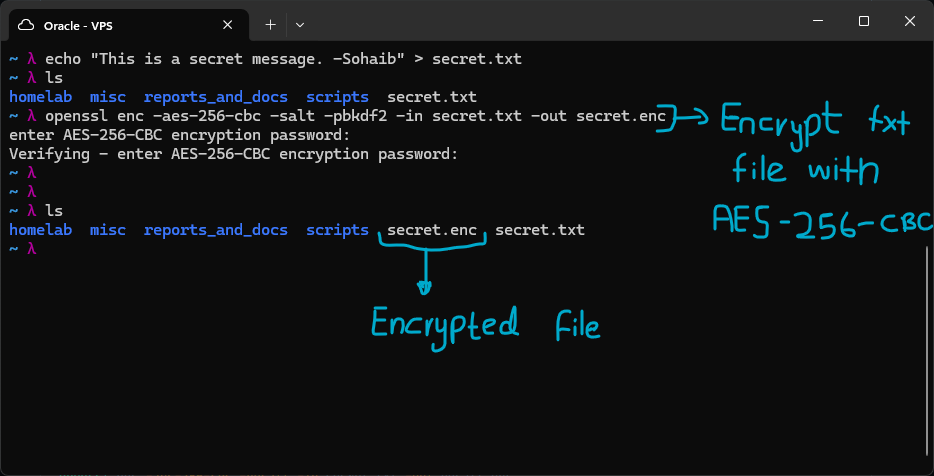
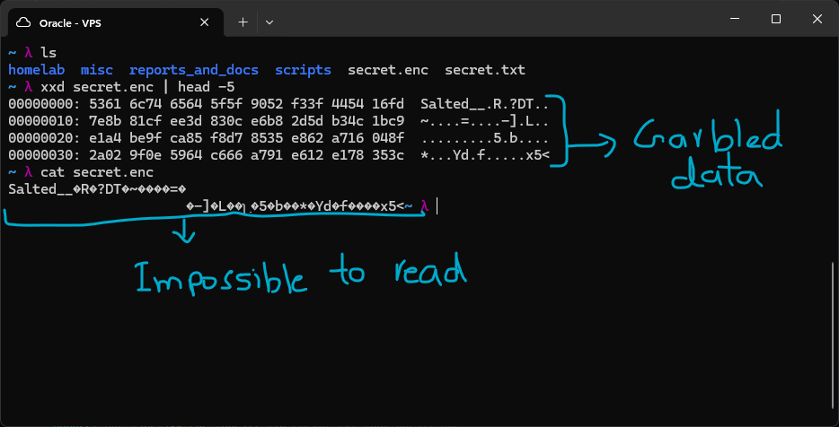
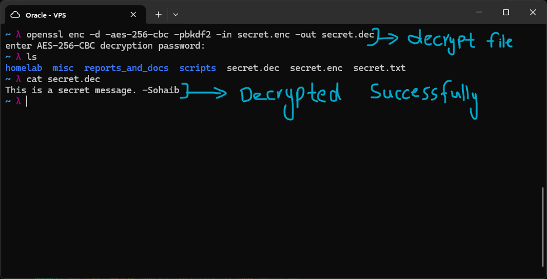
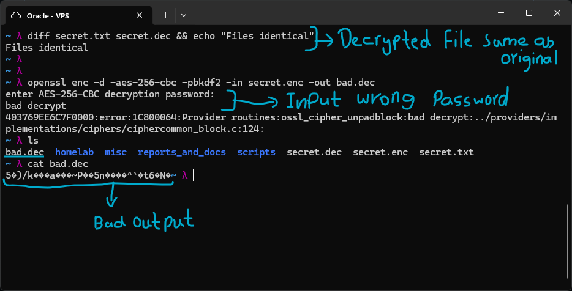

# Symmetric Encryption

Symmetric encryption uses the same key to encrypt and decrypt. It is fast and suitable for large data. The challenge is how you securely share that key with the recipient in the first place, the answer to that is asymmetric encryption, which will be covered later.

## AES - Advanced Encryption Standard

AES is the global standard for symmetric encryption. It operates on 128-bit blocks of data and is available in several key sizes (128, 192, 256 bits). AES-256 is used in TLS, WireGuard, disk encryption and file encryption. The key size determines the number of encryption rounds, 128-bit uses 10 rounds while 256-bit uses 14 rounds.

## Lab Demonstration

I created a file named `secret.txt` and encrypted it with AES-256-CBC encryption. CBC stands for Cipher Block Chaining, it will be overviewed later. The command `openssl enc -aes-256-cbc -salt -pbkdf2 -in secret.txt -out secret.enc` was used. The `-salt` flag is used to introduce randomness which changes the key each time the file is encrypted, otherwise the same password would return the same key, which is not ideal. The `-pbkdf2` flag is used for better key derivation, it is a superior key derivation method compared to the default one. The output of this command is an encrypted file named `secret.enc`, which can only be decrypted upon providing the correct password, and is practically impossible to read without decrypting it.

Upon inspection of the encrypted file through `xxd`, the headers return garbled data. The same is the case when using `cat` to read the file. It is practically impossible to read without decryption.

I then decrypted the file using the command `openssl enc -d -aes-256-cbc -pbkdf2 -in secret.enc -out secret.dec`, which returned an output file named `secret.dec` after inputting the correct password for decryption. Using `cat` to read the decrypted file returns the original message which was encrypted using AES-256-CBC.

When checked for any difference between the original file and the decrypted file, the files are shown to be completely identical, proving the encryption works as expected. I then intentionally provided the wrong password when decrypting the enc file. It threw an error and returned a `bad.dec` file as the output. Reading the bad decrypted file shows garbage data, similar to what the original encrypted file shows.

## Cipher Modes

AES only encrypts data in 16-byte blocks, so a cipher mode is what decides how these blocks get chained together when there is more than one block to encrypt. The mode you pick actually matters a lot for security, not just performance.

**CBC - Cipher Block Chaining** Before encrypting a block, it gets XORed with the ciphertext of the previous block. The very first block uses something called an IV (Initialization Vector), which is just a random value used to kick off the chain. Because of this chaining, even if two blocks contain the exact same plaintext, they will not produce the same ciphertext, which is not the case in ECB (below). Decryption in CBC can happen in parallel but encryption cannot, since each block depends on the one before it. CBC also needs padding to fill out the last block if it does not evenly divide. This is the mode I used in the lab above, and it is the default for OpenSSL enc and was used in TLS 1.2. The downside is that CBC is vulnerable to padding oracle attacks (POODLE is a real world example), which is one of the reasons GCM is considered better for new projects.

**GCM - Galois/Counter Mode (the recommended one)** GCM takes counter mode, which lets you encrypt in parallel, and adds an authentication tag on top using something called GHASH. That tag (usually 128 bits) can tell if the ciphertext was tampered with at all. So GCM gives you both confidentiality and integrity checking in one step, this combo is called AEAD (Authenticated Encryption with Associated Data). If the tag does not match when decrypting, the data gets rejected immediately instead of being processed. This is mandatory in TLS 1.3, and WireGuard uses a similar idea with ChaCha20-Poly1305. No padding needed either.

**ECB - Electronic Codebook (never use this)** Each block is encrypted completely on its own, with no relation to the other blocks. This means the exact same 16-byte plaintext block will always turn into the exact same ciphertext block if the key stays the same. So any patterns in the original data carry over into the encrypted version. The classic example is encrypting a bitmap image with ECB, you can literally still see the outline of the image afterward. There have also been real attacks where people extracted cookies encrypted with ECB byte by byte. Basically there is no good reason to use ECB, always go with CBC or GCM instead.

**CTR - Counter Mode** Instead of directly encrypting the plaintext, CTR encrypts a counter value to build a keystream, then just XORs that keystream with the plaintext. This effectively turns AES into a stream cipher, so there are no block boundaries or padding to worry about. Both encryption and decryption can be fully parallelized, and you can even decrypt just one byte in the middle without needing to decrypt everything before it. The catch is that CTR gives you no authentication at all, so an attacker could flip specific bits in the ciphertext and it would flip the same bits in the decrypted plaintext. Because of this you should always pair CTR with an HMAC, or just use GCM which already does that for you.
