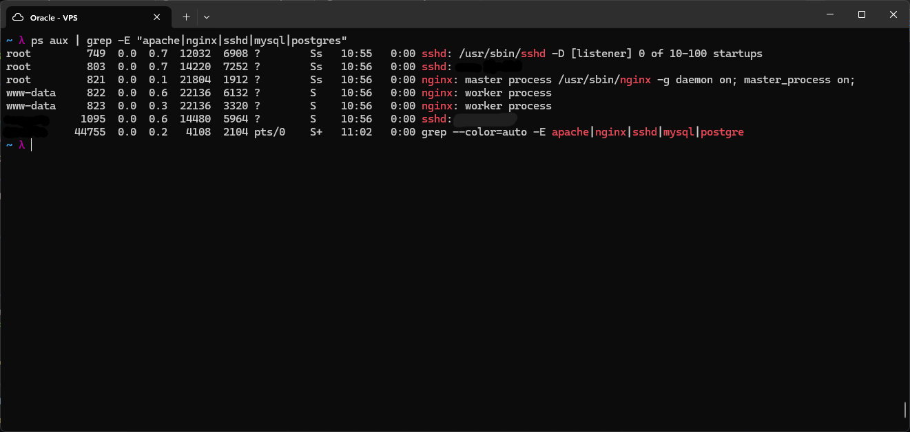
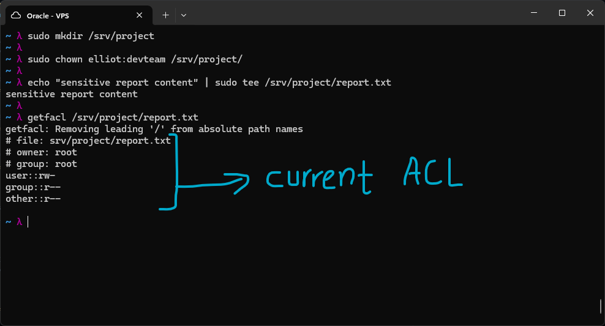
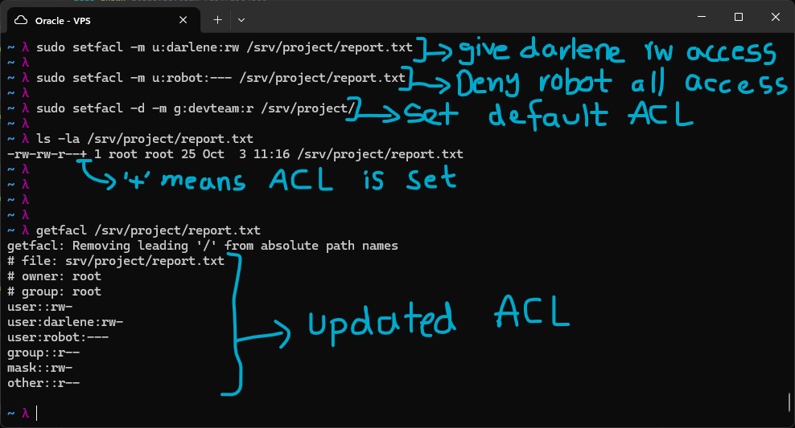

# Access Control Models

Access control is the mechanism by which a system decides who can do what to which resource. Three major models exist, DAC, MAC, and RBAC, each representing a different philosophy about who actually controls access decisions.

## DAC - Discretionary Access Control

**Owner controls access.** The owner of a resource decides who can access it. Standard Unix permissions (chmod/chown) are DAC, you own a file, you set rwx for owner/group/other. ACLs (setfacl) are an extension of DAC.

**Strength:** Flexible, users manage their own files without admin intervention.
**Weakness:** If a user is compromised, the attacker inherits that user's permissions. A trojan running as elliot can read everything elliot can read.

**Real world:** Every Linux filesystem, Windows NTFS without mandatory labels, Google Drive sharing.

## MAC - Mandatory Access Control

**The system enforces access based on labels.** Users cannot override policy even on their own files. Every subject (process) and object (file) has a security label. Policy defines which labels can access which. Users cannot change labels without privilege.

**Strength:** Even a compromised process can only access resources within its label, a web server vulnerability can't read SSH keys if MAC policy prevents it.
**Weakness:** Complex to configure, can break applications if labels aren't set correctly.

**Real world:** SELinux (RHEL/Fedora), AppArmor (Ubuntu), Android (SELinux for app sandboxing), iOS, classified government systems.

## RBAC - Role-Based Access Control

**Permissions attach to roles; users get roles.** Instead of granting permissions directly to users, you define roles (like "DBA", "Developer", "ReadOnly") with specific permissions, then assign users to roles. Changing a role's permissions instantly affects all users in that role.

**Strength:** Scales to thousands of users. Adding a new employee: add them to the right role, done. Revoking access: remove role.
**Weakness:** Role explosion, organisations often end up with hundreds of overlapping roles that are hard to manage.

**Real world:** Active Directory security groups, AWS IAM, Kubernetes RBAC, database roles (PostgreSQL GRANT), sudo rules.

### Principle of Least Privilege - checked on the VPS

`sshd`'s main listener process runs as root, which it needs in order to bind to a privileged port and accept new connections. What's more interesting is the two other `sshd` entries. One stays owned by root, that's the privilege-separated child process handling a connection that hasn't finished authenticating yet. The other is owned by my own actual login user, not by some generic "sshd" system account, because once a session finishes authenticating, sshd drops from running as root down to running as the connecting user. That second process is exactly what's backing my own current session, which is why it's the one I had to black out.

`nginx` follows the same pattern. The master process also runs as root, since it needs to bind to port 80/443 and manage the worker pool, but the actual worker processes handling web requests run as `www-data`, a dedicated low-privilege user with no reason to ever touch anything outside what nginx needs. Both cases are the same lesson, keep the privileged part as small and short-lived as possible, and drop to a low-privilege identity for everything that actually touches untrusted input.

---

## Linux ACLs - setfacl / getfacl

Standard Linux permissions only have owner, group, and other. ACLs (Access Control Lists) let you grant specific permissions to any individual user or group without changing ownership.

I created a directory `/srv/project`. Ownership of the directory was given to `elliot:devteam`, so the owner is "elliot" and the group is "devteam". I then wrote a simple report file inside the directory using sudo, so the owner of that file ends up as `root` instead.
Running `getfacl /srv/project/report.txt` showed the current ACL, owner root, group root, and standard 644 permissions, nothing custom set yet.

I then used `setfacl` to actually change access. I gave the user `darlene` read and write access with `sudo setfacl -m u:darlene:rw /srv/project/report.txt`, and explicitly denied the user `robot` entirely with `sudo setfacl -m u:robot:--- /srv/project/report.txt`. I also set a default ACL on the directory itself with `sudo setfacl -d -m g:devteam:r /srv/project/`, giving the devteam group read access on any new file created under that directory going forward, not just the one that already existed.

Running `ls -la` on the file afterward shows a `+` at the end of the permissions string, which is the signal that an ACL beyond the standard owner/group/other model is attached to it. Running `getfacl` again confirms the updated entries, darlene with rw, robot with no access at all, alongside the standard owner/group/other lines.

One thing the output makes clear that I hadn't thought about going in is the `mask` line, shown here as `mask::rw-`. The mask caps the effective permissions for any named user or group entry, not the owner or other. Darlene's entry says rw, and the mask here also allows rw, so her access works as expected, but if the mask were ever lower than an individual entry, say mask::r-- while darlene's own entry still says rw, her actual effective access would be capped down to read-only by the mask. It's the part of ACLs that actually trips people up, since the permission you set on a user doesn't necessarily reflect what they can actually do.

**Further commands:**
Remove a specific ACL entry:
`sudo setfacl -x u:darlene /srv/project/report.txt`
Remove ALL ACL entries (reset to standard permissions):
`sudo setfacl -b /srv/project/report.txt`

---

# Kerberos - Single Sign-On in Active Directory

Kerberos is the authentication protocol that actually powers SSO in Active Directory. Once you log into a domain-joined Windows machine with your AD credentials, Kerberos handles authentication to every service you touch after that, file shares, Exchange, SharePoint, without you having to type your password again for each one. The KDC, Key Distribution Centre, is the trusted authority that makes this whole process work, and it lives on the Domain Controller.

## How the flow actually works, Elliot logging in and reaching a file server

It starts with the AS-REQ, the Authentication Service Request. Elliot's workstation sends his username and a timestamp to the Authentication Service on the DC, encrypted with his password hash. His actual password itself never travels over the network at any point, only this encrypted timestamp does, and the KDC uses it to verify his identity.

Once that checks out, the KDC responds with the AS-REP, issuing Elliot a TGT, a Ticket Granting Ticket. This TGT is encrypted with the KDC's own secret key, so Elliot holds it but cannot actually read what is inside it. What it proves is that he already authenticated successfully, and by default it is only valid for 10 hours before it expires.

When Elliot wants to access a file server, he does not go back to proving his identity from scratch. Instead he sends a TGS-REQ, a Ticket Granting Service Request, presenting his TGT and asking for a service ticket specifically for that file server, FS01 in this case. The KDC checks the TGT and verifies whether Elliot actually has permission to access FS01.

If that checks out, the KDC replies with a TGS-REP, the service ticket itself. This ticket is encrypted with FS01's own secret key, not Elliot's, so again Elliot cannot read it, only FS01 can decrypt it. The ticket carries Elliot's identity and his permissions inside it.

The last step is the AP-REQ, the Application Request. Elliot presents this service ticket directly to FS01. FS01 decrypts it with its own secret key, reads Elliot's identity and permissions from inside, and grants access, all without ever having to contact the Domain Controller itself. This last step is really what SSO comes down to, Elliot typed his password exactly once, at login, and from there every subsequent service access rides on tickets instead.

## Why this design actually matters

The part that stands out here is that nothing ever gets decrypted by the party that is not supposed to read it. Elliot never sees inside his own TGT or his own service ticket, only the KDC and the destination service can. This is the same idea I kept running into in the earlier asymmetric and PKI labs, encrypting something for a specific holder of a specific key rather than trusting the sender to just behave. Kerberos applies that same principle to session management instead of to one-off messages, tickets that only the intended recipient can actually open, with built-in expiry so a stolen ticket does not stay useful forever.

It also means the Domain Controller is not a bottleneck for every single resource access the way password re-prompting would be. Once Elliot has his TGT, reaching a new service is a ticket exchange between him and that service, not a repeated round trip of credential checks against the DC. That is the actual mechanism behind "log in once, access everything you are permitted to," not just a UX convenience sitting on top of repeated logins.
