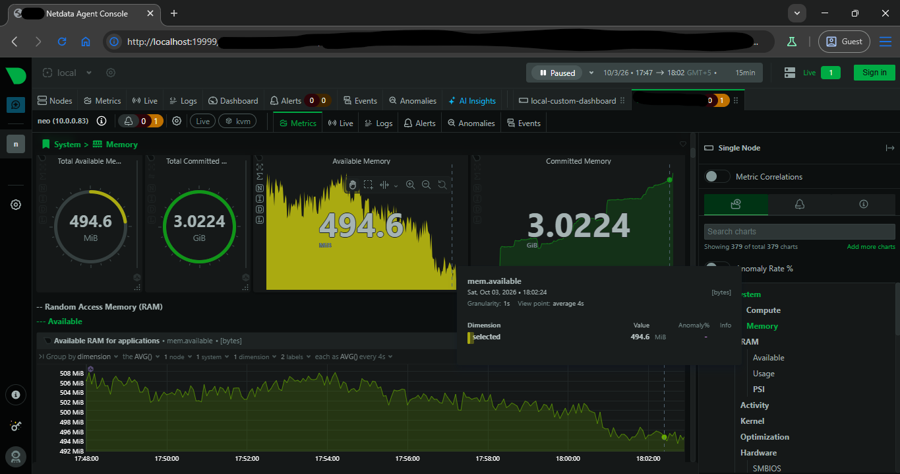
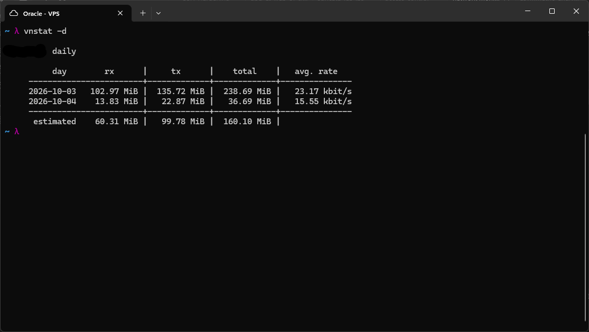
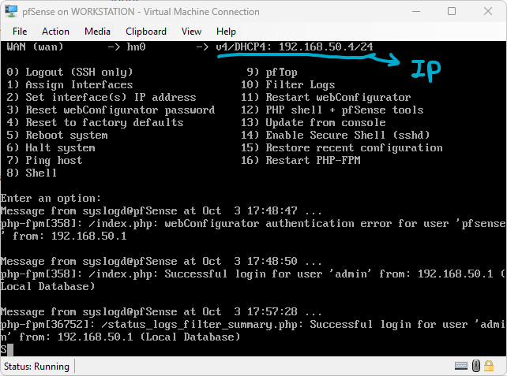
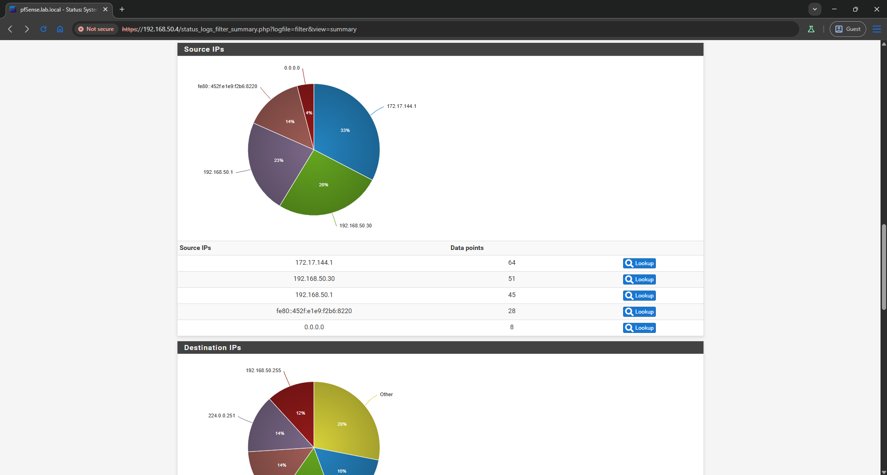
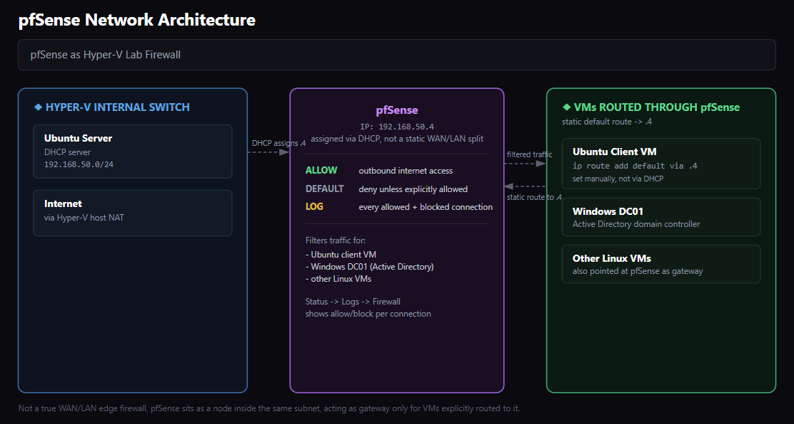

# Netdata - Real-Time Dashboard

I installed `netdata` for real-time monitoring on my VPS, this is essential for monitoring system usage on the server as well as keeping track of traffic activity.

Netdata listens on port 19999 by default, so I accessed it using SSH port forwarding, without publicly exposing the netdata port on the server or in the Oracle dashboard.

The netdata interface opened as I forwarded the port to my PC over SSH. It displays stats on the server and other useful information. It is quite a powerful tool for server monitoring, covering everything from memory and CPU to anomaly detection, far more than a quick glance would suggest.

---

I also installed `vnstat` for a network usage summary on the go inside the server, run here with `vnstat -d` to get the daily breakdown specifically, rather than the default summary view. It shows network statistics in a table for quick assessment, day by day rx, tx, total, and average rate.

---

## pfSense + Unified Threat Management

### What is UTM?

UTM, Unified Threat Management, is the idea of consolidating a bunch of separate security functions into a single box instead of running them as six different standalone tools. pfSense is a good concrete example of this philosophy, it isn't just a firewall, it's really a platform that several of these pieces plug into.

**Stateful Firewall**
Tracks the state of each connection rather than just filtering packets individually, so it only allows return traffic back in for sessions that were actually established from the inside, and blocks everything else by default. This is the core of what pfSense does out of the box.

**IDS/IPS**
Suricata or Snort running as a plugin inline with traffic, inspecting it and blocking threats before they ever reach the actual network. This is the same role Suricata played in my earlier lab, except here it's integrated directly into the UTM box rather than running as a separate standalone VM.

**Web Filter**
Blocks categories of sites, malware, phishing, adult content, either by DNS-based filtering or by inspecting packets more deeply. Not something I've set up yet, but it's the same general idea as DNS blackholing.

**VPN Gateway**
IPsec, OpenVPN, or WireGuard endpoints for remote access or site-to-site tunnels, so the UTM box itself becomes the entry point into the network rather than having a separate VPN server.

**Traffic Monitoring**
Real-time bandwidth graphs, top talkers, protocol breakdowns, alert dashboards. This is where netdata and vnstat come in for me, netdata gives the real-time, per-second view of what's happening on the box right now, while vnstat tracks longer-term bandwidth totals over days and months. Neither of these is part of pfSense itself in my setup, but they cover the same monitoring role a UTM's built-in traffic dashboard would.

**Anti-Malware**
ClamAV integration, scanning HTTP/FTP downloads for known malware signatures as they pass through.

The point of UTM as a model is that all six of these used to be separate appliances, a firewall box, a separate IDS sensor, a separate VPN concentrator, a separate monitoring server. Consolidating them into one platform like pfSense means one place to manage policy and one choke point all traffic actually passes through, instead of security being spread across devices that don't talk to each other. My current setup doesn't have every piece running through pfSense itself yet, Suricata and the monitoring tools are still separate, but the direction is clearly toward folding more of this into the one box over time.

---

I installed pfSense on Hyper-V and got it up and running, the IP address that pfSense got from the DHCP server (my Ubuntu server) was `192.168.50.4`, through which I accessed the web panel of the firewall and set it up. The console log also shows a failed login attempt for the user `pfsense` right before the successful one, I tried that as the default username first before realizing the actual admin account is just `admin`.
In another Ubuntu client VM, I set up pfSense as the default gateway through the command `sudo ip route add default via 192.168.50.4`. This ensured that all traffic on that VM had to pass through the firewall.
I also configured the firewall for the Windows domain controller VM running Active Directory, along with the other Linux VMs.

---

Under `Status -> Logs -> Firewall`, the firewall activity can be seen as soon as the firewall is configured on a node. Every allowed/blocked connection can be seen in the detailed view of the logs, this was the summary view with charts instead. As a concrete example, the source IP breakdown showed traffic split across a handful of addresses, all of them internal to the lab network, which makes sense given this is a closed Hyper-V setup with no actual external traffic reaching pfSense directly.

---

### Final architecture

After setting up pfSense, this is the final network architecture I ended up with on my Hyper-V network. It is worth being precise about what this actually is though, it is not a true WAN/LAN edge firewall. pfSense picked up its own address via DHCP from the same flat `192.168.50.0/24` subnet my Ubuntu server already runs, rather than sitting between two separate networks. It only acts as a gateway for the specific VMs I pointed at it with a static route, the Ubuntu client, the Windows DC, and the other Linux VMs, everything else on the subnet is unaffected unless explicitly routed through it.
