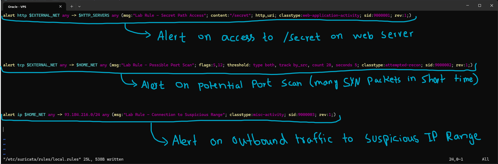
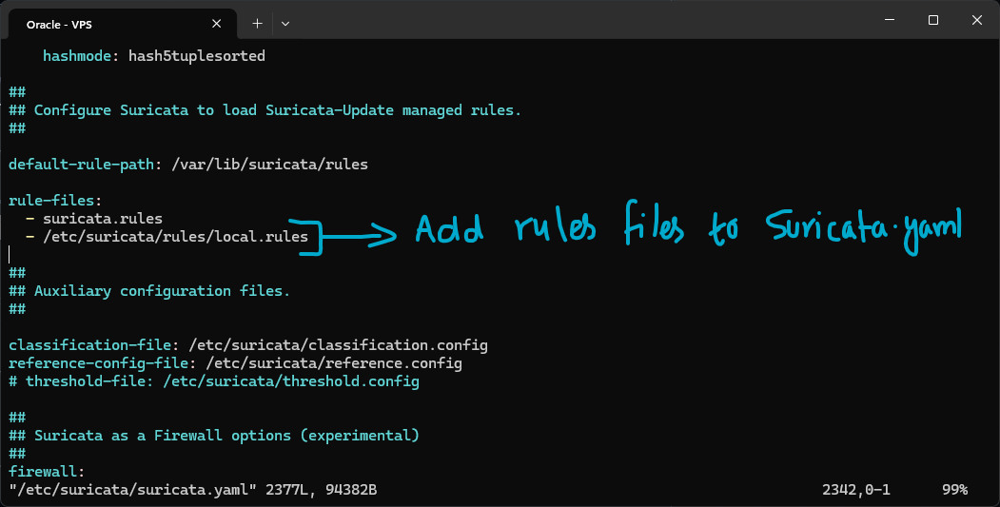
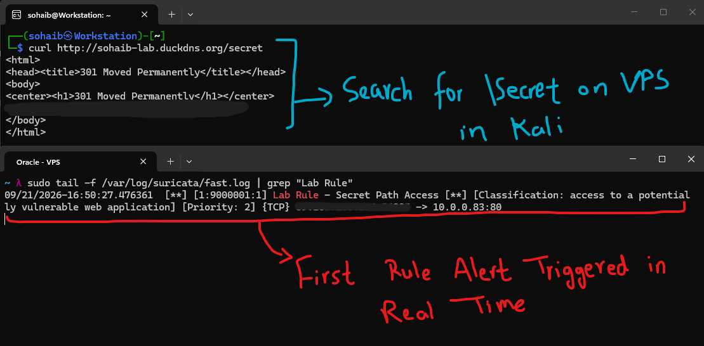
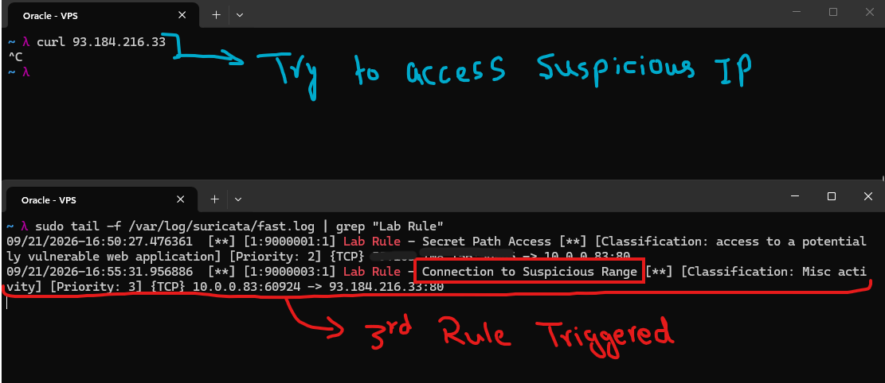

# Suricata Custom Rules

Writing your own rules teaches exactly how signature-based detection works, and its limitations. A custom rule fires only when traffic matches a very specific pattern you define. Understanding this helps you see why anomaly-based detection, machine learning, statistical baselines, exists alongside signature detection.

## Anatomy of a rule

This is typically how a Suricata rule looks. They are defined in `.rules` files:
```
alert  http  $EXTERNAL_NET any  ->  $HTTP_SERVERS $HTTP_PORTS  (  
    msg:"ET SCAN Attempted Admin Access";  
    content:"/admin"; http_uri;  
    content:"GET"; http_method;  
    threshold: type threshold, track by_src, count 5, seconds 60;  
    classtype:web-application-attack;  
    sid:9000001; rev:1;  
)
```

**Action - alert**
What Suricata does when this rule matches. Options: alert (log + alert), drop (IPS mode, block packet), reject (send TCP reset), pass (ignore). Start with "alert" in IDS mode, never use "drop" until your rules are thoroughly tested.

**Protocol - http**
The network protocol to match. Options: tcp, udp, icmp, ip, http, tls, dns, smtp, ssh, and more. Using "http" instead of "tcp port 80" enables Suricata to inspect decoded HTTP fields (URI, headers, method) rather than raw bytes.

**Source - $EXTERNAL_NET any**
Source IP and port. $EXTERNAL_NET is a variable defined in suricata.yaml, typically the inverse of $HOME_NET (any IP not in your network). "any" means any source port. Use specific IPs, CIDRs, or variables like $SQL_SERVERS.

**Direction - '->'**
Packet flow direction. "->" means source to destination only. "<>" means bidirectional (match in either direction). Use "->" for most rules to be precise about which side is the attacker.

**Destination - $HTTP_SERVERS $HTTP_PORTS**
Destination IP group and port group. $HTTP_SERVERS and $HTTP_PORTS are variables you define in suricata.yaml. This keeps rules portable, change the variable value and all rules using it update automatically.

- **msg - Human readable alert name**
- **content - Pattern to match**: Combine with modifiers: "http_uri" (search in the URI only), "http_method" (match HTTP method), "nocase" (case-insensitive).
- **content + http_method**: Combining content:"GET" with http_method tells Suricata to look for GET specifically in the HTTP method field.
- **threshold - Rate limiting**: Prevent alert storms. "type threshold, track by_src, count 5, seconds 60" means only alert after the 5th match from the same source IP within 60 seconds. Use "type limit" to only fire once per timeframe. Essential for noisy rules.
- **classtype - Alert categorisation**: Groups alerts by category for SIEM integration and reporting. Common values: attempted-admin, web-application-attack, policy-violation, attempted-recon. Suricata maps classtypes to severity levels and to the human-readable text shown in the alert, via /etc/suricata/classification.config.
- **sid - Signature ID**: A globally unique identifier for this rule. Emerging Threats uses 1xxxxxx, Suricata reserved uses 2xxxxxxx. For custom rules, use 9xxxxxxx to avoid conflicts. Rev (revision number) must be incremented every time you modify a rule.

# Lab



I added three custom rules in a newly created `local.rules` file inside `/etc/suricata/rules/`. The rules do the following:
1. Alert on access to `/secret` on my web server (nginx)
2. Alert on a potential port scan, 20 SYN packets from the same source within 5 seconds
3. Alert on outbound traffic from the VPS to a specified suspicious IP range (93.184.216.0/24)

These end up simpler than the anatomy example above. Rule 1 skips the `http_method` check and matches on any port rather than `$HTTP_PORTS`. Rule 2 uses `flags:S,12`, the `S` matches the SYN flag, and `12` is a mask restricting which other flag bits are considered, this is what lets it catch bare SYNs without also tripping on normal SYN-ACK handshake traffic, and it uses `threshold: type both` rather than `type threshold`, which both waits for the count to be hit and then keeps limiting further alerts in the same window rather than firing just once. Rule 3 uses protocol `ip` instead of `tcp`, so it matches any IP traffic into that range, not just TCP.



I then added the newly created `local.rules` file into the `suricata.yaml` config, under `rule-files`. This makes sure the new rules get loaded on the next reload. I triggered the reload with `sudo kill -USR2 $(pidof suricata)`, which reloads the rules without fully restarting Suricata.



I then tested the first rule by trying to access the `/secret` path under my hostname using `curl` from Kali Linux, acting as an external attacker. This correctly triggered an alert in Suricata's `fast.log`. The alert's classification text, "access to a potentially vulnerable web application", comes from mapping the rule's `classtype:web-application-activity` through Suricata's classification config, a direct link between what I wrote in the rule and what actually shows up in the log. The public IP of the attacking machine was logged, redacted here since it is a real external address.



I then triggered the third rule, this time trying to access one of the suspicious IPs from the range specified in that rule, from the VPS itself. This tests Suricata's ability to detect and filter outbound traffic as well. It correctly triggered the rule, and the log accurately showed "Connection to Suspicious Range", matching what was specified in `local.rules`, with the VPS's own address as the source this time instead of an external one.

## Signature vs Anomaly Detection

Now that Suricata is running, it is worth understanding where it actually sits among detection approaches, since it is only one piece of the picture.

**Signature-based detection** works by matching traffic against known-bad patterns, rules built from things that are already known to be malicious. This is what Suricata and Snort do, and it is also how antivirus definitions work. The upside is that it is very precise and fast, with a low false positive rate, since it is only flagging things that match a confirmed bad pattern. The obvious weakness is that it cannot catch anything it does not already have a rule for, so zero-day or otherwise unknown attacks slip straight through.

**Anomaly-based detection** takes the opposite approach. Instead of matching known bad patterns, it learns what normal traffic looks like first, then alerts whenever something deviates from that baseline. This is how ML-based SIEMs, Darktrace, and NetFlow analysis tools work. The strength here is that it can catch genuinely novel attacks, including zero-days, since it is not relying on a rule existing beforehand. The tradeoff is a higher false positive rate and the fact that it needs real tuning to actually be useful, an untuned baseline just means noisy alerts.

**Hybrid detection** combines both approaches, which is what most modern enterprise SIEMs like Splunk and Elastic actually do. It gives the best coverage with fewer gaps, but it is also the most complex to manage, since you are now maintaining and tuning two different detection philosophies at once instead of one.

Looking at my own lab setup, it is already unintentionally hybrid. Suricata handles the signature side directly. My Lynis hardening score, fail2ban's rate limiting, and UFW's logs all act as anomaly signals in a rough sense, they are not ML-based, but they still flag deviations from expected behavior rather than matching a fixed rule. In Week 11 I am planning to add auditd, which will give me a proper audit trail to actually build real anomaly analysis on top of, instead of the loose signals I have right now.
