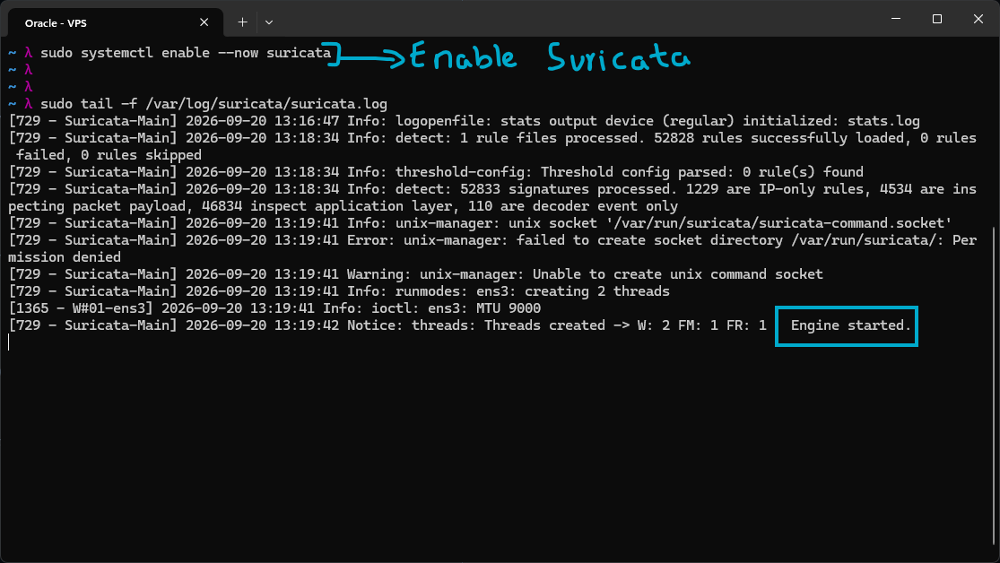
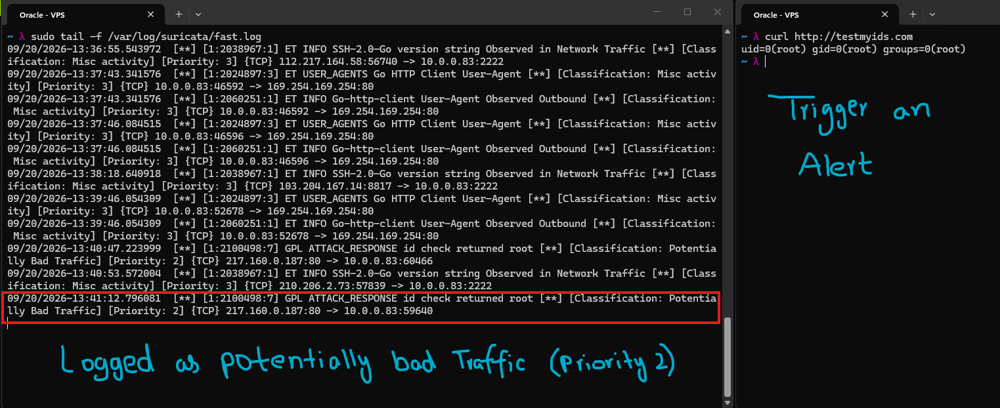
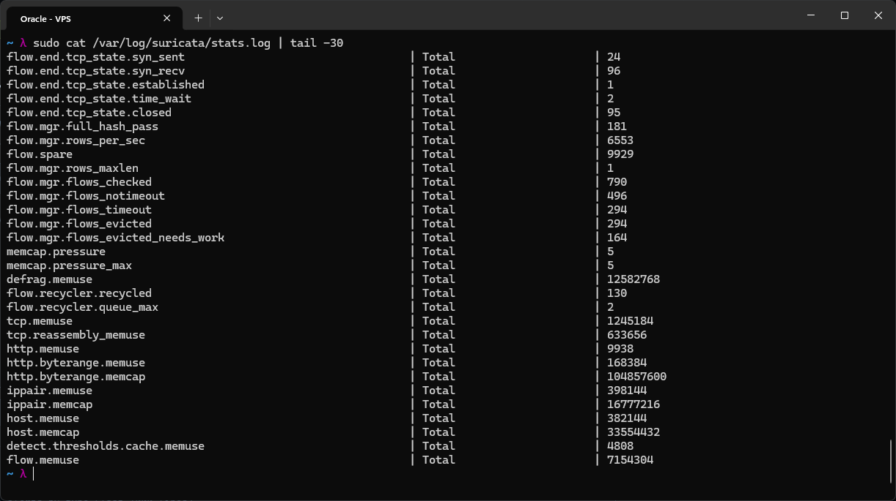

# Suricata IDS/IPS

Suricata is an open-source, high-performance network IDS/IPS/NSM engine. Today's goal is to get it running and trigger my first alert. Before touching any config, it helps to understand the two modes it can run in, since they behave completely differently on the network.

### IDS - Intrusion Detection System (passive)

In IDS mode, Suricata only observes and alerts, it does not touch the traffic at all. It gets its data by copying packets passively off a tap or SPAN port, inspects that copy, and generates an alert whenever something matches a known threat signature. Because it is only working off a copy and sitting outside the actual packet path, it cannot block or slow down real traffic even if it wanted to. This also means false positives are basically free, a bad alert never affects the actual service, which is exactly why IDS mode is the safe place to start. Under the hood, Suricata does this using AF_PACKET mode, it just listens on the interface without interfering with anything passing through it.

### IPS - Intrusion Prevention System (active)

IPS mode is a different story. Here Suricata sits inline, directly in the path the packets take, meaning every single packet has to pass through it before it can reach its destination. Because it is now actually in the packet path, it has the power to drop packets that match a rule, not just alert on them. That power comes with real risk though, a false positive here does not just log a warning, it can block legitimate traffic outright, so rules need to be tuned carefully before IPS is turned on for real. Suricata achieves this inline behavior using either NFQ, the netfilter queue, or DPDK depending on setup, both of which let it actively intercept and act on traffic rather than just watch it.

The plan today is to start in IDS mode since it is safe to experiment with, confirm alerts are firing correctly, and only look at IPS mode once I trust the ruleset.

## Lab

Added the Suricata PPA for the latest stable version:
`sudo add-apt-repository ppa:oisf/suricata-stable -y`
`sudo apt update && sudo apt install suricata -y`

Edited the Suricata config, set the interface to ens3, my VPS interface:
`sudo nano /etc/suricata/suricata.yaml`
Find: af-packet: -> interface: ens3

Downloaded the Emerging Threats open ruleset, free and updated daily:
`sudo suricata-update`
This downloads rules to /var/lib/suricata/rules/suricata.rules.

I then enabled and started Suricata:
`sudo systemctl enable --now suricata`

Checked the logs for startup status:
`sudo tail -f /var/log/suricata/suricata.log`

The startup log confirmed 52828 rules loaded successfully with 0 failed and 0 skipped, broken down into 1229 IP-only rules, 4534 rules that inspect packet payload, 46834 that inspect the application layer, and 110 that are decoder event only. That breakdown is a better picture of what Suricata is actually checking than just "around 50000 rules".

The log also threw a real error along the way: "failed to create socket directory /var/run/suricata/: Permission denied", followed by a warning that the unix command socket could not be created. That socket is what tools like `suricatasc` use to talk to a running Suricata instance interactively, and it is a separate subsystem from the actual packet processing engine. Despite that error, the engine itself started fine right after ("Engine started."), which was a good reminder that a failure in one Suricata subsystem does not necessarily take down the rest.

---

I then opened a second SSH connection and triggered an alert using a hostname made specifically for testing IDS systems:
`curl http://testmyids.com`

Suricata immediately classified it as potentially bad traffic. The exact alert was `[1:2100498:7] GPL ATTACK_RESPONSE id check returned root`, classification "Potentially Bad Traffic", priority 2. What testmyids.com actually does is serve back an HTTP response whose body contains fake root `id` output, literally `uid=0(root) gid=0(root) groups=0(root)`, which you can see directly in the curl output above. That text is exactly the pattern this GPL signature is built to catch, since it normally indicates a webshell or command injection that got a response back as root. Seeing my own curl output line up with the alert text made it obvious why this specific rule fired.

The same alert actually appears twice a few seconds apart in fast.log, both from the same source IP, so it looks like the request landed on the log before I confirmed it the first time and I ended up running the curl a second time.

Looking at the rest of fast.log, Suricata had already been quietly logging plenty of lower-priority "Misc activity" alerts before I ran the test, mostly SSH banner fingerprinting hitting my SSH port from random IPs, and outbound Go-http-client requests to 169.254.169.254, which is the standard cloud metadata service address, not anything external. None of that is an actual attack, it is just background internet noise and the VPS talking to its own metadata service, but it is a good example of why priority levels matter when triaging alerts instead of treating every log line as equally urgent.

---

I then took a brief look at the stats.log file for Suricata, which logs things like flows processed and memory usage, useful for a quick health summary rather than individual alerts.

# Conclusion

This lab is the start of the network security section of the Security phase. I kicked it off by installing and setting up an intrusion detection system, which will be used to secure the network of my VPS.
