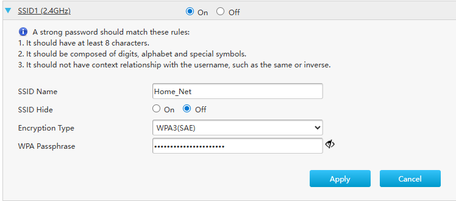
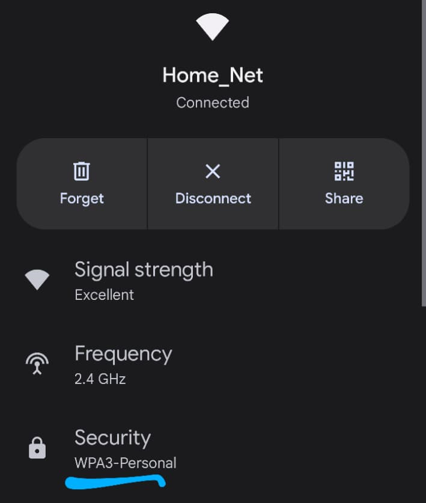

# Wireless Security

Wireless security has evolved dramatically, WEP was broken within years, WPA had flaws, WPA2 is still solid with proper configuration, and WPA3 adds forward secrecy.

## WEP

WEP (Wired Equivalent Privacy) used RC4 with a static key and a flawed IV implementation, meaning the same keystream could be recovered by capturing enough packets. Aircrack-ng can crack WEP in under 2 minutes with enough IVs. WEP was deprecated in 2004 but some legacy devices still offer it. Never use it. Real risk: if you see a WEP network, assume everything on it is compromised.

## WPA

WPA (Wi-Fi Protected Access) was a stopgap while WPA2 was developed. It added TKIP (Temporal Key Integrity Protocol) on top of RC4 to fix WEP's IV weaknesses, using per-packet key mixing and a message integrity check. TKIP itself has known attacks (TKIP Michael attack, chopchop). WPA is deprecated since 2012. Many routers removed it, but some cheap IoT devices still use it.

## WPA2

WPA2 replaced RC4 with AES-CCMP (Counter Mode with CBC-MAC Protocol), a proper AEAD cipher. This was a fundamental improvement. WPA2-PSK (Personal) uses a pre-shared password, its only practical weakness is dictionary attacks against the 4-way handshake. WPA2-Enterprise uses 802.1X (RADIUS + EAP) for per-user certificates, much stronger. Still the current standard for most networks. Hardening: use a 20+ character random PSK, disable WPS.

## WPA3

WPA3 adds SAE (Simultaneous Authentication of Equals, the "Dragonfly" key exchange) replacing PSK. SAE provides forward secrecy, capturing the handshake and cracking the password later won't decrypt previously captured traffic. WPA3 also adds OWE (Opportunistic Wireless Encryption) for open networks, encrypting traffic even without a password. Protected Management Frames are mandatory, blocking deauthentication attacks. Adoption is growing, enable it on your home router if your devices support it.

---

# WPA2 Four-Way Handshake

The WPA2 4-way handshake is what actually establishes the session keys between a client and an access point after both sides already know the PSK. This handshake is also exactly what an attacker captures off the air to attempt an offline dictionary attack, which is why password strength matters so much for WPA2-Personal, the handshake itself doesn't leak the password, but it gives an attacker enough material to test guesses against offline, as fast as their hardware allows.

## How the four messages actually work

Before any of this starts, both the access point and the client already know the PSK, the password. Neither side ever sends the password itself over the air at any point in this exchange.

**Message 1, AP to client:** the access point sends an ANonce, a random 256-bit number it just generated. Nothing is proven yet at this point, it's purely a fresh random value to seed the key derivation that's about to happen.

**Message 2, client to AP:** the client generates its own random number, the SNonce, and from that plus the ANonce it just received plus the MAC addresses of both devices, it derives the PTK, the Pairwise Transient Key. It sends the SNonce back along with a MIC, a Message Integrity Check, computed using that derived key. This MIC is the first proof that the client actually knows the real PSK, since deriving the correct PTK and therefore a valid MIC is only possible if the password used to seed the whole process was correct.

**Message 3, AP to client:** the access point has now derived its own copy of the PTK using the same inputs, and sends the GTK, the Group Temporal Key used for broadcast traffic, encrypted, along with its own MIC. This is the AP's proof back to the client that it also knows the PSK.

**Message 4, client to AP:** the client sends back an acknowledgment with its own MIC, confirming the connection is fully established. At this point both sides hold the PTK, and all unicast traffic between them from here on is encrypted with it.

## Why this is the actual target for offline cracking

The reason this handshake matters so much for security isn't that it transmits the password, it never does. What it transmits is message 2's MIC, which is a value derivable only if you know the PSK. An attacker who captures all four messages can take that MIC offline and try candidate passwords against it as fast as their hardware allows, since checking a guess doesn't require talking to the AP or the client again at all. This is exactly why WPA2-Personal's actual security ceiling is the strength of the password itself, a weak or common password turns a captured handshake into a matter of time, while a long random one makes the same offline attack computationally pointless.

---

# Securing my Home Network

I changed the protection on my home router from WPA2 to WPA3(SAE), so it becomes more secure, and set a relatively long and strong passphrase so cracking is nearly impossible. I left SSID Hide off, since hiding the SSID doesn't actually add meaningful security, client devices still broadcast probe requests containing the network name as they look for it, so an attacker nearby can usually recover the SSID anyway. It mainly just adds inconvenience for my own devices reconnecting, so there was no real reason to turn it on.

The security shows up correctly as WPA3-Personal on a connected device after the settings change.

I also ensured the following:
- WPS is disabled (the WPS PIN attack is fast and effective)
- Admin interface not accessible from WAN

This makes my home network sufficiently secured.
