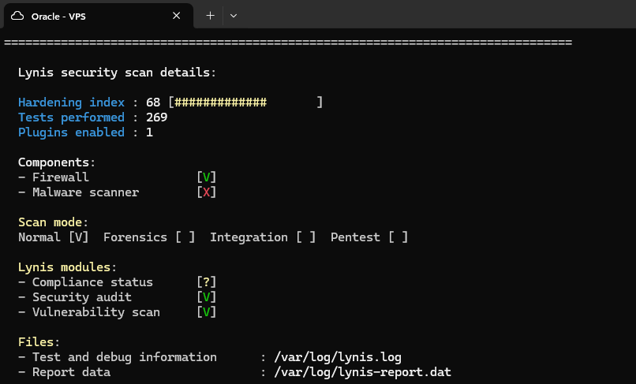
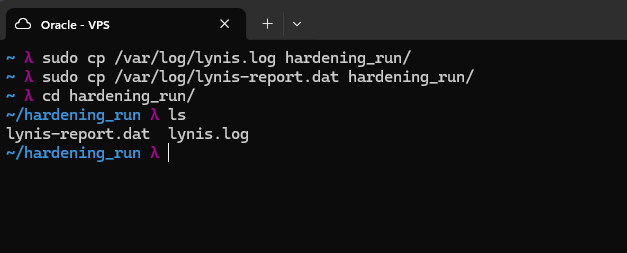
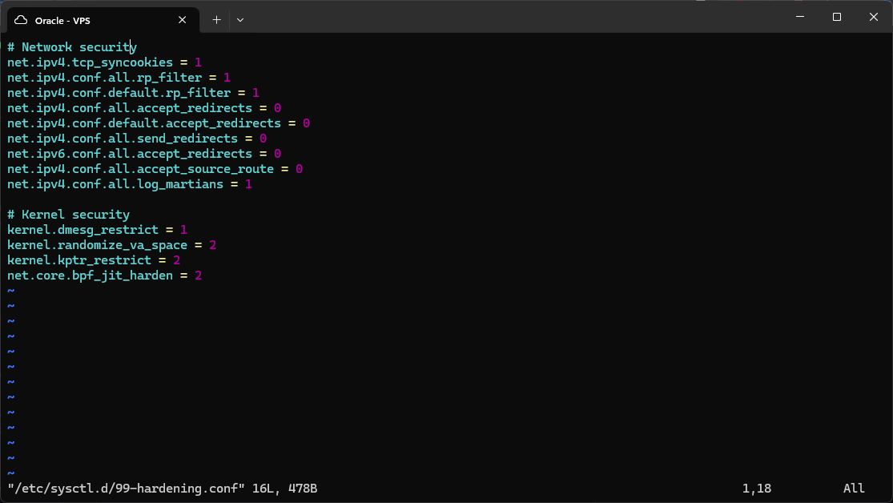
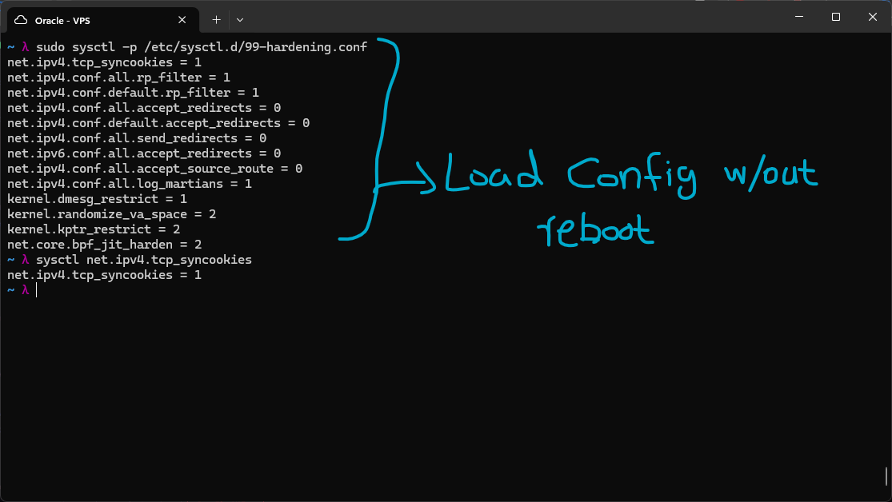

# Lynis Run

I ran `sudo lynis audit system` and got a current hardening index of 68, out of 269 tests performed. Everything done during this section, the upcoming labs, will be hardening the system to push that score higher.

One thing worth flagging straight from this summary: the Malware scanner component shows `[X]`, meaning it isn't installed or active right now. That lines up directly with the Anti-Malware piece from the UTM theory earlier, ClamAV integration is exactly what would close this gap, it just hasn't been set up yet.

I saved the detailed reports for comparison once I've finished hardening the system, using `sudo cp /var/log/lynis.log hardening_run/` and `sudo cp /var/log/lynis-report.dat hardening_run/`, then moved into that directory to confirm both files copied over.

---

## Kernel Hardening

`/etc/sysctl.d/99-hardening.conf` is a drop-in file that controls live kernel behaviour, kept separate from the main `/etc/sysctl.conf` rather than editing that directly, so my custom hardening stays isolated from anything the distro manages by default. These parameters can dramatically improve network security, preventing SYN floods, stopping IP spoofing, and blocking ICMP redirect attacks.

I wrote this config file specifying kernel parameters for hardening the system further, below is what each one does:

- **net.ipv4.tcp_syncookies**: SYN cookies protect against SYN flood attacks. When the SYN queue fills under attack, the kernel generates a cryptographic cookie in the SYN-ACK instead of allocating a full connection entry. Legitimate clients complete the handshake with the cookie, attackers flooding fake SYNs can't fill the connection table. This is already enabled by default on Ubuntu, but Lynis will verify it.
- **net.ipv4.conf.all/default.rp_filter**: Reverse Path Filtering, when a packet arrives on an interface claiming to come from some IP, the kernel checks "would I normally send traffic to that IP via this interface?" If not, the packet is dropped. This prevents IP spoofing, attackers can't fake a source IP that wouldn't normally arrive on that interface. Set to 2 for strict mode, more aggressive, may break asymmetric routing.
- **net.ipv4/ipv6.conf.all/default.accept_redirects**: ICMP redirects tell a host "use a different router for that destination." An attacker can send crafted ICMP redirects to route your traffic through their machine, a routing-based MITM. Disabling accept_redirects prevents this, both for IPv4 and IPv6.
- **net.ipv4.conf.all.send_redirects**: Prevents the server from sending ICMP redirects to other hosts. A server shouldn't act as a router sending redirects. If the VPS isn't a router, which is almost certainly the case here, disable this. Running WireGuard with IP forwarding would need this reviewed more carefully, but that isn't the case on this box.
- **net.ipv4.conf.all.accept_source_route**: Source routing lets a packet specify its own path through the network instead of letting normal routing decide. That is a classic way to bypass routing-based security controls or spoof a path a packet shouldn't actually be able to take. Disabling it means the kernel ignores any route the packet itself claims to want.
- **net.ipv4.conf.all.log_martians**: A martian packet is one with an impossible source or destination address for the interface it arrived on, like a private IP showing up on a public-facing interface. Logging these makes spoofing attempts or routing misconfigurations visible instead of silently dropped and forgotten.
- **kernel.dmesg_restrict**: By default, any user can read kernel messages via dmesg. This exposes information about hardware, kernel addresses, and loaded modules, useful for attackers crafting exploits. Setting this to 1 requires root to read the kernel ring buffer, so regular users, including a compromised www-data, cannot access this information.
- **kernel.kptr_restrict**: Similar idea to dmesg_restrict but specifically for kernel pointer addresses exposed through /proc. Leaking these addresses makes it much easier to build a working kernel exploit, since the attacker needs to know where things actually live in memory. Restricting this hides those addresses from unprivileged users.
- **kernel.randomize_va_space**: Address Space Layout Randomisation randomises where the stack, heap, and libraries are loaded in memory. This makes exploitation of buffer overflows much harder, the attacker can't predict addresses. 2 means full randomisation, stack, heap, and mmap. Already default on Ubuntu, but worth verifying it hasn't been changed.
- **net.core.bpf_jit_harden**: The eBPF JIT compiler accelerates packet filtering. In an attack scenario, a compromised process with BPF access can try to use JIT-compiled programs to leak kernel addresses. Hardening mode 2 poisons all JIT constants, making them useless for KASLR bypass attacks. Required by CIS Benchmark and STIG hardening guides.

I then loaded the newly configured parameters into the kernel without rebooting the system, using `sudo sysctl -p /etc/sysctl.d/99-hardening.conf`. This loaded all the parameters and I verified the first one, tcp_syncookies, was set correctly afterward.

The kernel has now been sufficiently hardened, without making the system impractical to use.
