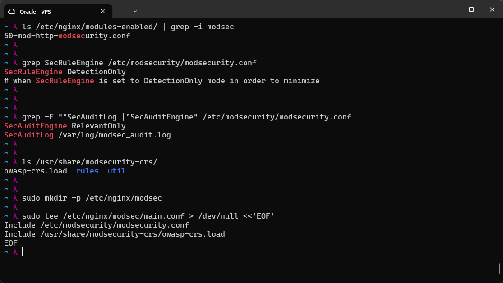
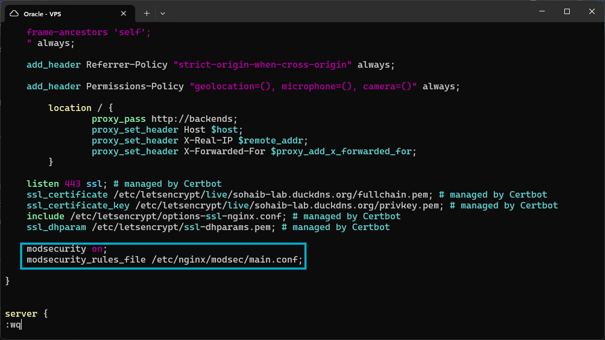
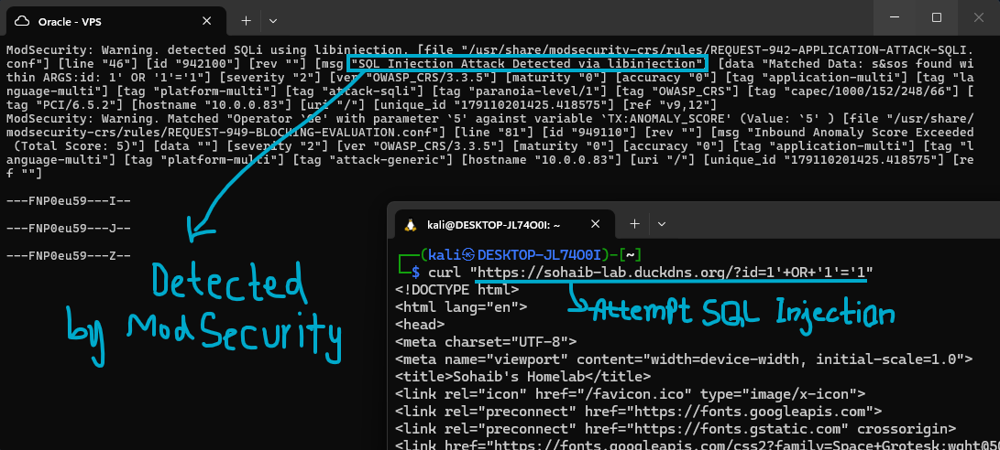
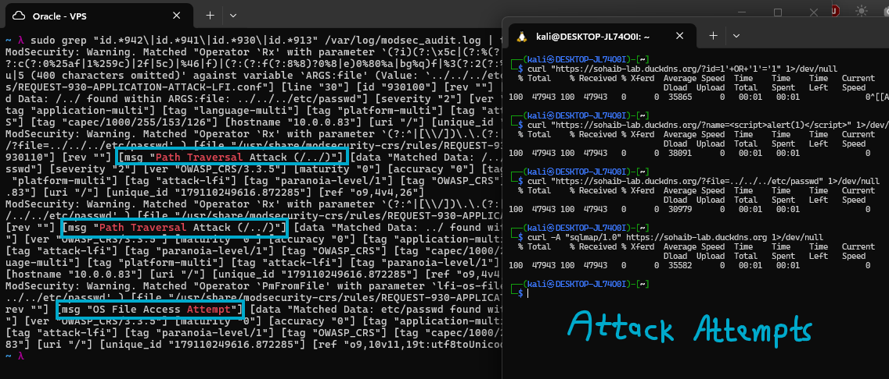
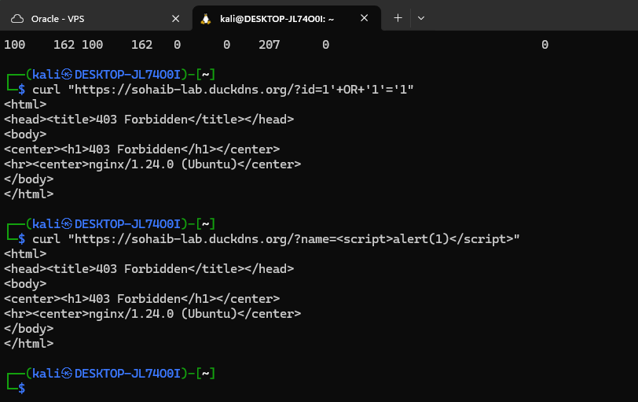
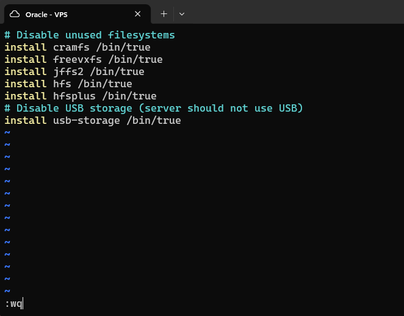

# ModSecurity Firewall

A Web Application Firewall sits in front of your web server and blocks malicious HTTP requests before they reach your application code. ModSecurity is Apache's open-source WAF module, also usable with nginx through a dedicated connector module. I'll run it in detection mode first, so I can see what it catches without accidentally blocking legitimate traffic.

**WAF vs Suricata:** Suricata operates at the network layer (Layer 3/4) and inspects raw packets. ModSecurity operates at the application layer (Layer 7) and understands HTTP, it can inspect decoded request bodies, URL-decoded parameters, headers, and session cookies. They complement each other.

---



I installed ModSecurity for nginx using `sudo apt install libnginx-mod-http-modsecurity modsecurity-crs -y`, since it is present in Ubuntu's repositories by default.
I then confirmed the module would actually load into nginx using `ls /etc/nginx/modules-enabled/ | grep -i modsec`, which listed the modsecurity module config.
I checked whether it was detection only by default with `grep SecRuleEngine /etc/modsecurity/modsecurity.conf`, so I don't accidentally restrict normal traffic. It was confirmed to be in DetectionOnly mode.
I also checked the audit logging settings, `SecAuditEngine` is set to `RelevantOnly`, meaning only relevant or anomalous transactions actually get written to the log instead of every single request, and the log itself lives at `/var/log/modsec_audit.log`.
I then checked how the CRS package lays out its files with `ls /usr/share/modsecurity-crs/`.

Created the main rules file that nginx will point at:
```
sudo mkdir -p /etc/nginx/modsec
sudo tee /etc/nginx/modsec/main.conf > /dev/null <<'EOF'
Include /etc/modsecurity/modsecurity.conf
Include /usr/share/modsecurity-crs/owasp-crs.load
EOF
```

---



I enabled the WAF on the only domain nginx was serving, my own lab domain at sohaib-lab.duckdns.org. Added two directives at the end of the server block:
```
modsecurity on;
modsecurity_rules_file /etc/nginx/modsec/main.conf;
```
These enable the WAF and point it at the rule file created above. I then tested the nginx config with `nginx -t` and reloaded the web server with `sudo systemctl reload nginx`.

---



I made an SQL injection style HTTP request from the Kali Linux VM (`?id=1'+OR+'1'='1`), and the ModSecurity audit log immediately reported it, rule 942100, "SQL Injection Attack Detected via libinjection". What's worth noting here is that detection isn't just a single rule firing, a second log entry shows the request also tripped the anomaly scoring check, "Inbound Anomaly Score Exceeded (Total Score: 5)" from rule 949110. OWASP CRS works by having individual rules add points toward a total anomaly score rather than blocking outright themselves, and a separate threshold rule decides whether that accumulated score is high enough to actually act on. The detection was working as expected either way.



I then ran several more attack types from Kali to see how broadly it would catch things: the same SQLi payload again, an XSS attempt (`?name=<script>alert(1)</script>`), a path traversal / local file inclusion attempt (`?file=../../../etc/passwd`), and a request sent with the User-Agent set to `sqlmap/1.0` to see if it would get flagged as scanner activity. I reviewed the results by grepping the audit log for the relevant CRS rule families together, `id.*942` for SQLi, `id.*941` for XSS, `id.*930` for LFI/path traversal, and `id.*913` for scanner detection, and confirmed matches including "Path Traversal Attack (../..)" and "OS File Access Attempt" against the /etc/passwd target.

After I was satisfied with how the firewall was working in detection mode, I switched it to enforcement using `sudo sed -i 's/SecRuleEngine DetectionOnly/SecRuleEngine On/' /etc/modsecurity/modsecurity.conf`, turning it from DetectionOnly to On.

---



I then tried the attack requests again and they came back 403 Forbidden, meaning the firewall was now actively rejecting them instead of just logging them, confirming enforcement mode was working.

---



I then did some further hardening at the end of this, since this was my hardening sprint. I disabled a handful of unused filesystem kernel modules the server has no reason to load, cramfs, freevxfs, jffs2, hfs, and hfsplus, along with usb-storage, since a VPS has no legitimate use for USB storage at all. All of these are set to install `/bin/true` instead of loading the real module, which effectively disables them while keeping the config declarative.

After all this, I restarted the server for the first time in a long while, making sure all the upgrades and new rules were actually fully applied rather than just loaded piecemeal.
