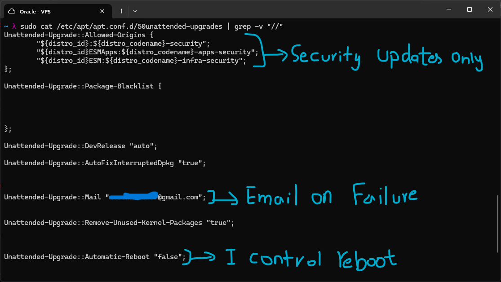
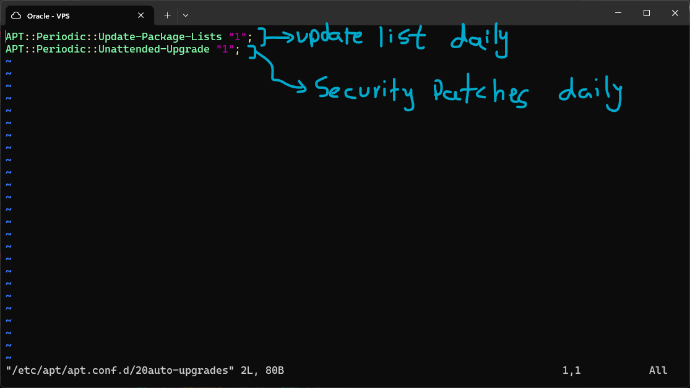
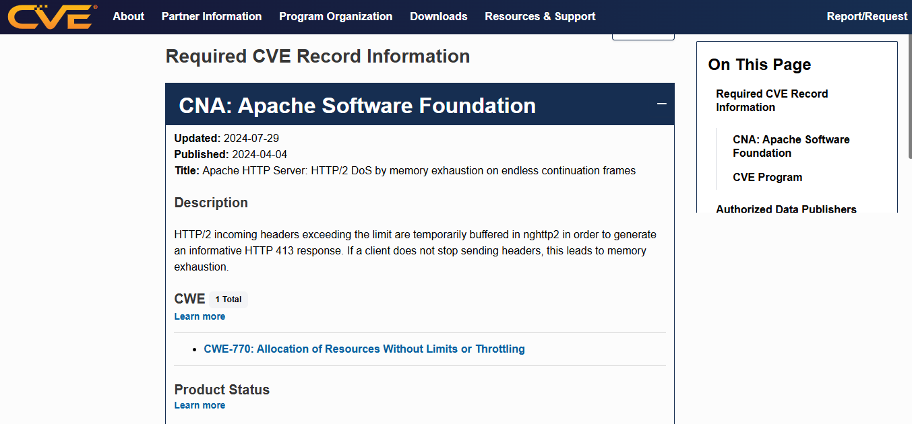

# Software Patch Management

Unpatched software is the single most common attack vector in real breaches. Today I set up automatic security patch delivery, learned how to read CVE disclosures, and put together a patch prioritization workflow.

## Patch Priority Levels

**CRITICAL**
Patch within 24 hours.
CVSS 9.0 or higher. Remote code execution, unauthenticated. Active exploitation likely. Examples: Heartbleed, Log4Shell. Drop everything.

**HIGH**
Patch within 72 hours.
CVSS 7.0 to 8.9. May require auth or specific conditions. Significant risk if exploited. Priority for internet-facing services.

**MEDIUM / LOW**
Next maintenance window.
CVSS below 7.0. Limited impact, requires local access, or difficult conditions. Include in the regular monthly patch cycle.

---

Since `unattended-upgrades` came pre-installed with the Ubuntu server, I just modified the settings to automatically apply security updates. The Allowed-Origins block covers more than just the standard `-security` channel, it also includes `ESMApps` and `ESM:infra-security`, Ubuntu's Extended Security Maintenance channels, so coverage isn't limited to the base repo alone. Package-Blacklist is left empty, so nothing is excluded from auto-updates.
I also added a few helper settings: `AutoFixInterruptedDpkg` to true so an interrupted update doesn't leave the package manager in a broken state, `Remove-Unused-Kernel-Packages` to true so old kernel packages get cleaned up automatically after upgrades instead of piling up, `Automatic-Reboot` set to false so I control when the server actually reboots, and my email added for notification when an upgrade fails.

I then configured `/etc/apt/apt.conf.d/20auto-upgrades` with `APT::Periodic::Update-Package-Lists "1"` and `APT::Periodic::Unattended-Upgrade "1"`, which together update the package list and apply security updates daily rather than waiting for a manual check.

---

## CVE Database - Reading Vulnerability Disclosures

Every known vulnerability has a CVE (Common Vulnerabilities and Exposures) identifier. Looking at a real CVE entry is the best way to actually learn how to read a disclosure, this is how you evaluate whether you're affected and how urgently you need to patch.

#### Example of a CVE entry on cve.org

**Apache HTTP Server: HTTP/2 DoS by memory exhaustion on endless continuation frames**
Incoming HTTP/2 headers that exceed the limit get temporarily buffered by nghttp2 so the server can generate an informative HTTP 413 response. If a client never stops sending headers, that buffering itself leads to memory exhaustion, a denial of service rather than a code execution issue. Classified under CWE-770, Allocation of Resources Without Limits or Throttling.
Reading further down the full page, past what's captured in the screenshot above, shows this affects Apache 2.4.17 through 2.4.58, with the fix being to upgrade to 2.4.59 or disable HTTP/2 entirely (`Protocols h2 http/1.1` to `Protocols http/1.1`). Checking the installed version is as simple as `apache2 -v`.

---

**How to check if you're affected:**
1. Find the affected version range in the CVE.
2. Check your version: `apache2 -v`, `openssl version`, `ssh -V`.
3. If your version is in the range, patch immediately.
4. Check `apt-cache policy packagename` to see if Ubuntu has already backported the fix to your installed version. Ubuntu often patches without changing the version number.
