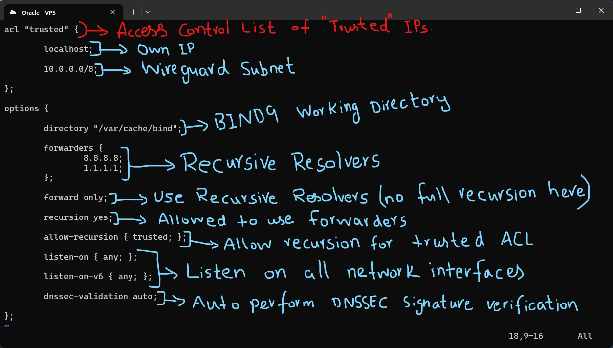
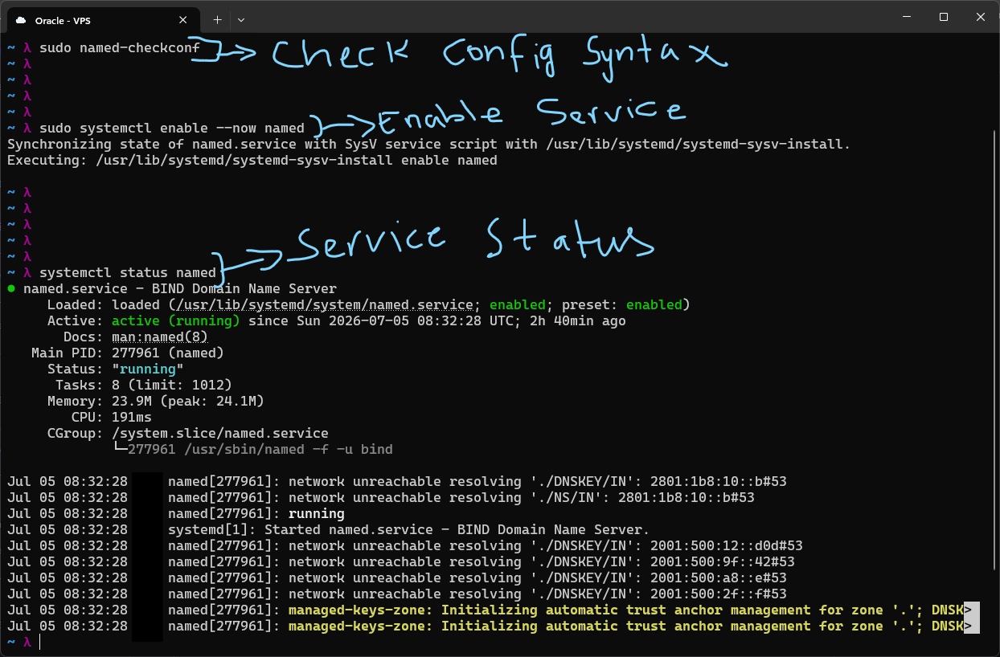
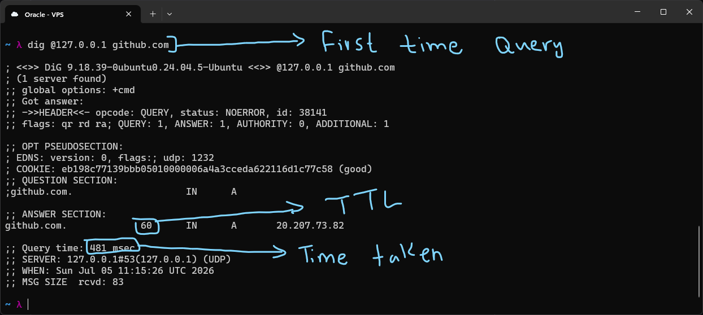
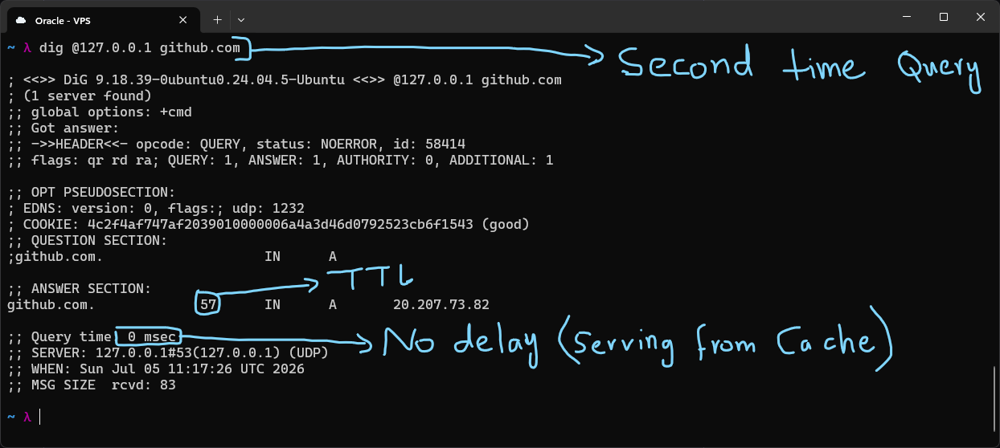
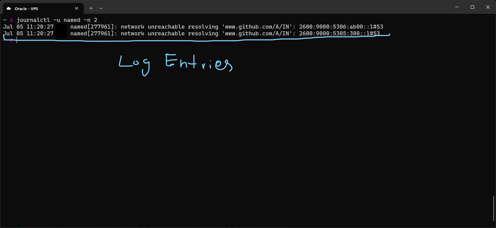
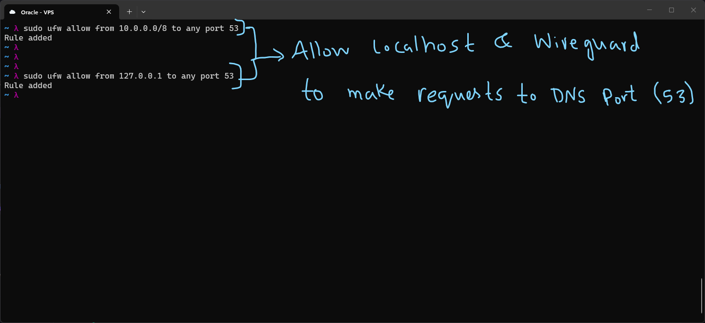

# DNS Server Roles

A single DNS server can play one or more roles simultaneously, depending on what it's being asked to do. Before setting anything up I wanted to actually understand these roles rather than just copy config, since BIND9's options only make sense once you know which of these jobs you're asking it to do.

**Caching Resolver:** Forwards queries to upstream resolvers and stores the responses in memory for the duration of their TTL. This makes repeated lookups for the same name much faster since the server doesn't have to go out and ask again. A pure caching resolver knows nothing about any zone, it is just a middleman with memory.

**Authoritative Server:** Owns zone files for one or more domains and gives definitive answers for records in those zones. It does not resolve external names, that is simply not its job. This is where the DNS hierarchy actually terminates, an authoritative server is the source of truth for its own zone rather than a lookup point for everything else.

**Recursive Resolver:** Does the full walk from root servers, to TLD servers, to the authoritative server for a domain, on behalf of a client. This is typically combined with caching so it doesn't have to repeat that whole walk for names it has already resolved recently. This is the role my VPS was already using by default through DHCP, since my ISP or cloud provider's resolver was doing this walk for me before I set up my own.

For this lab I set BIND9 up to act mainly as a caching and recursive resolver for my own trusted network, rather than as an authoritative server for a public zone.

## BIND9 Config File Structure

| File                          | Purpose                                           |
| ----------------------------- | -------------------------------------------------- |
| /etc/bind/named.conf          | Root config, includes the other files below       |
| /etc/bind/named.conf.options  | Global BIND options: forwarders, recursion, ACLs   |
| /etc/bind/named.conf.local    | Zone declarations                                  |
| /etc/bind/db.lab.internal     | The actual zone file containing DNS records        |

Understanding this split helped a lot, since it means the global behavior of the server (options) is kept completely separate from what zones it is actually authoritative for (local), and `named.conf` itself stays a thin file that just wires the two together.

# BIND9 Install and Config

I installed the full BIND9 package with:

```

sudo apt install bind9 bind9utils bind9-doc -y

```

`bind9utils` pulls in tools like `named-checkconf` and `dig`, which I ended up using constantly to verify config and test queries, and `bind9-doc` for local documentation.



This is the `named.conf.options` file I configured, which controls BIND's global behavior. I went through it option by option to make sure I actually understood what each line was doing rather than just pasting a template:

- I created an access control list (ACL) named `trusted`, and added `localhost` and `10.0.0.0/8` to it. The `10.0.0.0/8` range is my WireGuard subnet. The idea of an ACL here is to define a reusable group of "who is allowed to do X" so I don't have to repeat IP ranges throughout the config.
- I set the working directory to `/var/cache/bind`, which is where BIND stores its runtime cache data and other working files.
- I set `forwarders` to Google (`8.8.8.8`) and Cloudflare (`1.1.1.1`). Forwarders are the servers BIND sends a query to when it needs to resolve something outside of its own authoritative zones, instead of doing the full recursive root to TLD to authoritative walk itself.
- I set `forward only`, which means BIND will only use the configured forwarders for resolution and will not attempt full recursion on its own even if forwarding fails. I chose this since I specifically wanted a predictable resolution path through known, trusted resolvers rather than my server making raw queries out to arbitrary authoritative servers on the internet.
- I set `recursion yes`, which enables BIND to actually perform recursive resolution (using the forwarders) on behalf of clients at all. Without this, BIND would only answer for zones it holds directly.
- I set `allow-recursion { trusted; }`, which restricts who is allowed to actually use this recursive resolving behavior to the `trusted` ACL I defined earlier. This was an important one to get right, since an open recursive resolver reachable by anyone on the internet is a known way for DNS servers to get abused in DNS amplification DDoS attacks. Locking it to my own WireGuard subnet closes that off.
- I set `listen-on { any; }` and `listen-on-v6 { any; }` so BIND listens on all network interfaces on the machine, rather than binding to a single specific IP.
- I set `dnssec-validation auto`, which tells BIND to verify DNSSEC signatures on responses coming back from authoritative servers, using its built in trust anchors. This protects against DNS cache poisoning, where an attacker tries to inject a forged response into the resolver's cache to redirect users to a malicious IP for a given domain.



Once the config was written I checked it and brought the service up:

```

sudo named-checkconf sudo systemctl enable --now named systemctl status named

```

`named-checkconf` returning no output means no syntax errors were found, which I learned is a slightly unusual pattern compared to tools like `apache2ctl configtest` that print "Syntax OK" explicitly, here silence itself is the success signal. `systemctl enable --now` both enables the service to start on boot and starts it immediately in one command. The status output confirmed it was active and running, and the log lines under it showed BIND initializing its DNSSEC trust anchors on startup, which lined up with the `dnssec-validation auto` setting.

# Testing Resolution and Caching



I queried my own resolver directly with:

```

dig @127.0.0.1 github.com

```

This was the first time asking for `github.com`, so BIND had nothing cached and had to go through its recursive resolver path (via the forwarders) to get an answer. The response came back with a TTL of 60 seconds, meaning the record is allowed to sit in cache for a minute before it has to be looked up again, and the query took 481 msec, since it genuinely had to reach out over the network to resolve it.



I ran the exact same query again a few seconds later:

```

dig @127.0.0.1 github.com

```

This time the query took 0 msec, meaning it was served straight from BIND's local cache instead of going out to a forwarder again. The TTL had also counted down to 57 seconds, which lines up with roughly 3 seconds having passed since the first query. This was a good way to actually see caching behavior happening rather than just take it on faith from the config, the 0ms response time and decreasing TTL together confirm the cache is working as expected.



I also checked BIND's own logs with:

```

journalctl -u named -n 2

```

which showed `named` reporting that certain IPv6 root/TLD addresses were unreachable while resolving. This is expected on this VPS since it does not have IPv6 connectivity configured, so those specific paths fail and BIND falls back to IPv4 without issue.

# Firewall Rules for DNS



Finally, since BIND is now listening on all interfaces, I needed to make sure the firewall only lets the right traffic reach port 53 (the standard DNS port). I added:

```

sudo ufw allow from 10.0.0.0/8 to any port 53 sudo ufw allow from 127.0.0.1 to any port 53

```

This allows DNS queries to reach BIND from localhost and from anywhere on my WireGuard subnet, which matches the same `trusted` ACL logic I used inside the BIND config itself. Keeping the firewall rule and the BIND ACL aligned like this means even if I misconfigure one of them, the other still enforces the same boundary, rather than relying on a single point of control for who can query this resolver.

---

