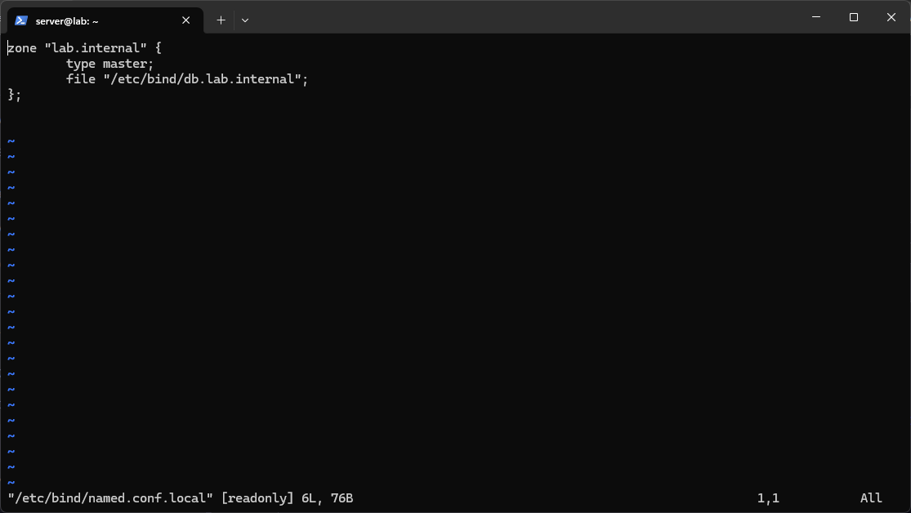
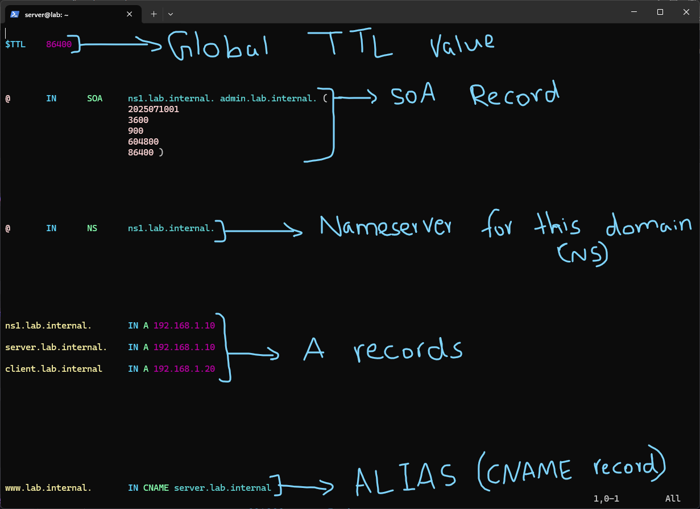
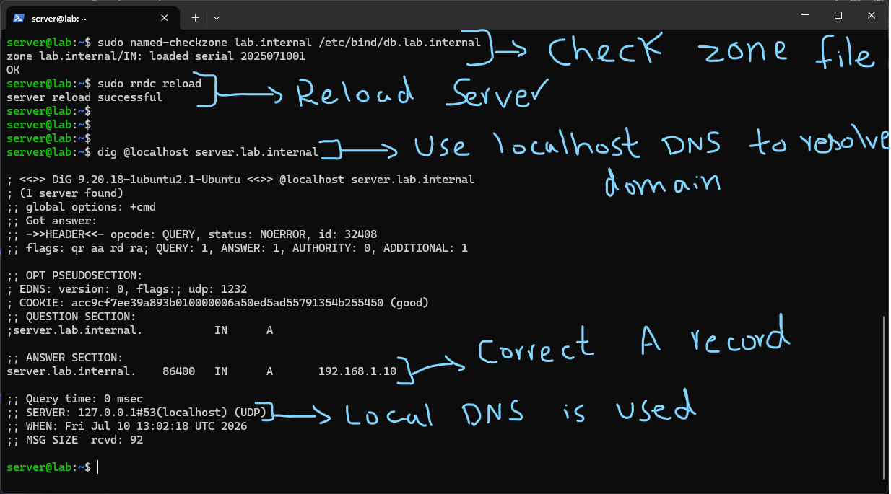
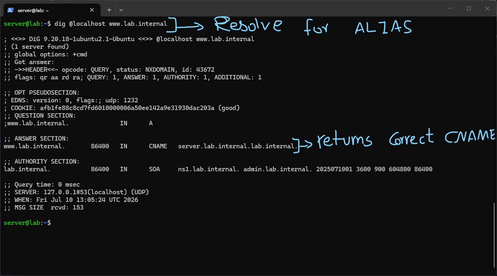
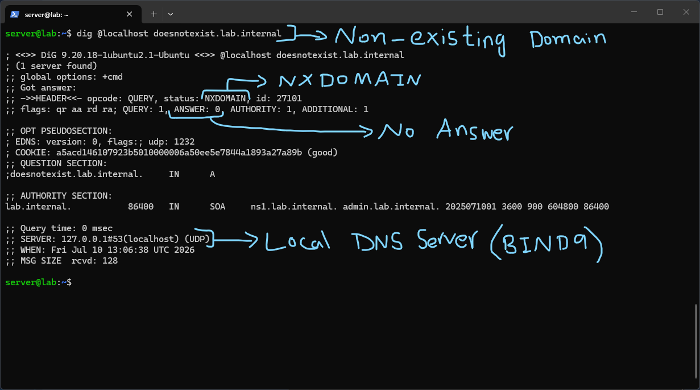

# Zone Files

A zone file is where the actual DNS records for a domain live. It is a plain text file, but the format is fairly rigid and small mistakes in it (especially around trailing dots, which I ran into) can silently break resolution instead of throwing an obvious error.



Before a zone can actually be used, BIND needs to be told it exists. I added the zone declaration into `/etc/bind/named.conf.local`:

```

zone "lab.internal" { type master; file "/etc/bind/db.lab.internal"; };

```

`type master` means this server is authoritative for the zone, it holds the actual records rather than just caching someone else's answers. The `file` line points to where the actual zone data lives, which is a separate file I created next. This was a good moment to actually see the difference between the two roles I read about earlier: up to this point BIND was only acting as a caching and recursive resolver, here I was configuring it to be authoritative for a zone of my own for the first time.



This is the actual zone file, `/etc/bind/db.lab.internal`, where I defined the records for `lab.internal`. Going through it line by line helped me actually understand what each part does rather than just copying a template:

- `$TTL 86400` sets the default TTL for every record in this file that doesn't specify its own, in this case 86400 seconds (24 hours). This is separate from the TTLs I saw earlier when caching external lookups through the forwarders, here I am the one deciding how long other resolvers are allowed to cache my records.
- The `SOA` (Start of Authority) record marks this file as authoritative for the zone and defines administrative metadata: the primary nameserver (`ns1.lab.internal.`), an admin contact in email format (`admin.lab.internal.` represents `admin@lab.internal`), and then a set of timing values in parentheses. The first of those, `2025071001`, is the serial number, which secondary/slave servers use to detect when the zone has changed and needs to be re-pulled. The remaining four values (refresh, retry, expire, and minimum/negative-cache TTL) control how often secondaries check for updates and how long a negative answer (like NXDOMAIN) can be cached.
- The `NS` record declares `ns1.lab.internal.` as the nameserver responsible for this zone. This is what other DNS servers would reference to figure out who to ask about `lab.internal`.
- The `A` records map hostnames directly to IPv4 addresses: `ns1.lab.internal.` and `server.lab.internal.` both point to `192.168.1.10`, and `client.lab.internal` points to `192.168.1.20`.
- The `CNAME` record makes `www.lab.internal.` an alias for `server.lab.internal`, meaning anyone querying `www.lab.internal` gets redirected at the DNS level to resolve `server.lab.internal` instead, rather than having its own separate `A` record.

The trailing dot turned out to matter a lot more than I expected. A name like `server.lab.internal` without the trailing dot is treated as relative, so BIND appends the zone's origin onto the end of it, which would silently produce `server.lab.internal.lab.internal`, an entirely different and wrong name. Writing it as `server.lab.internal.` with the dot makes it an absolute, fully qualified name, telling BIND this is the complete name and nothing should be appended. I can see why this is called out as the most common zone file mistake, since the file still loads and parses fine either way, it just quietly resolves to the wrong thing.



Before trusting any of it I validated the zone file and reloaded the server:

```

sudo named-checkzone lab.internal /etc/bind/db.lab.internal sudo rndc reload

```

`named-checkzone` parses the zone file and checks it against the expected format, confirming both the zone name and the serial number it picked up. This is a more targeted check than `named-checkconf`, since it is specifically validating the records inside a zone file rather than the global BIND config. `rndc reload` then tells the running BIND process to reload its zones and config without fully restarting the service.

Then I tested resolution directly:

```

dig @localhost server.lab.internal

```

This returned the correct `A` record, `192.168.1.10`, with a query time of 0 msec and the answer coming from `127.0.0.1#53`, confirming this was answered locally by my own BIND instance acting as the authority for the zone, not forwarded out anywhere.



Next I tested the alias:

```

dig @localhost www.lab.internal

```

The response correctly returned a `CNAME` pointing to `server.lab.internal`, with the `SOA` record showing up in the authority section alongside it. This confirmed BIND was correctly following the alias chain rather than treating `www` as a separate unresolvable name.



Finally I tested a name that does not exist in the zone at all:

```

dig @localhost doesnotexist.lab.internal

```

This came back with `status: NXDOMAIN` and `ANSWER: 0`, meaning BIND correctly recognized the name doesn't exist in the zone rather than either timing out or incorrectly returning something. The `SOA` record still appears in the authority section here too, which I learned is expected, it lets the querying client know which zone was authoritative for the negative answer and for how long it can cache that "does not exist" result, using the minimum TTL value from the SOA record.

# Summary

In this lab BIND9 was configured as a proper authoritative DNS server for my own zone, `lab.internal`, rather than purely as a caching and recursive resolver using Google and Cloudflare as forwarders like in the previous lab. This was a meaningfully different role: instead of just relaying and caching other people's answers, BIND was now the actual source of truth being queried.

This lab was performed on a separate Ubuntu Server VM (Hyper-V) rather than the production VPS, specifically to avoid bloating the VPS config with a lab-only zone that has no real use outside of testing. All the DNS concepts here, zone files, SOA records, NS/A/CNAME records, the trailing dot behavior, and NXDOMAIN handling, were worked through and verified individually with `dig` rather than just assumed to be correct once the config was written.


