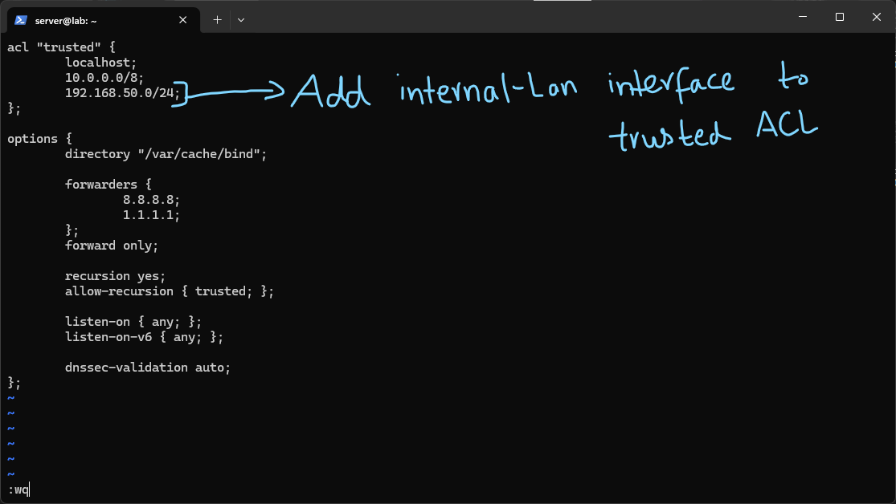
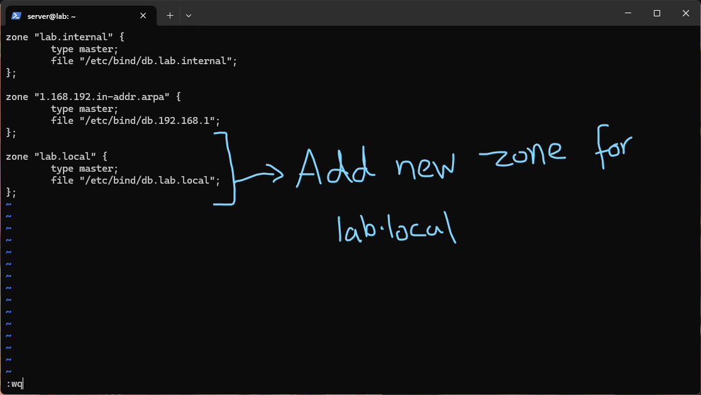
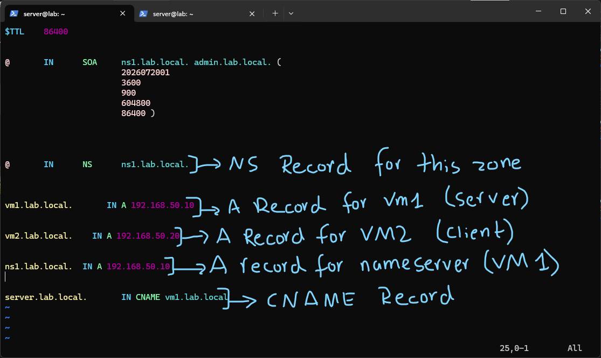
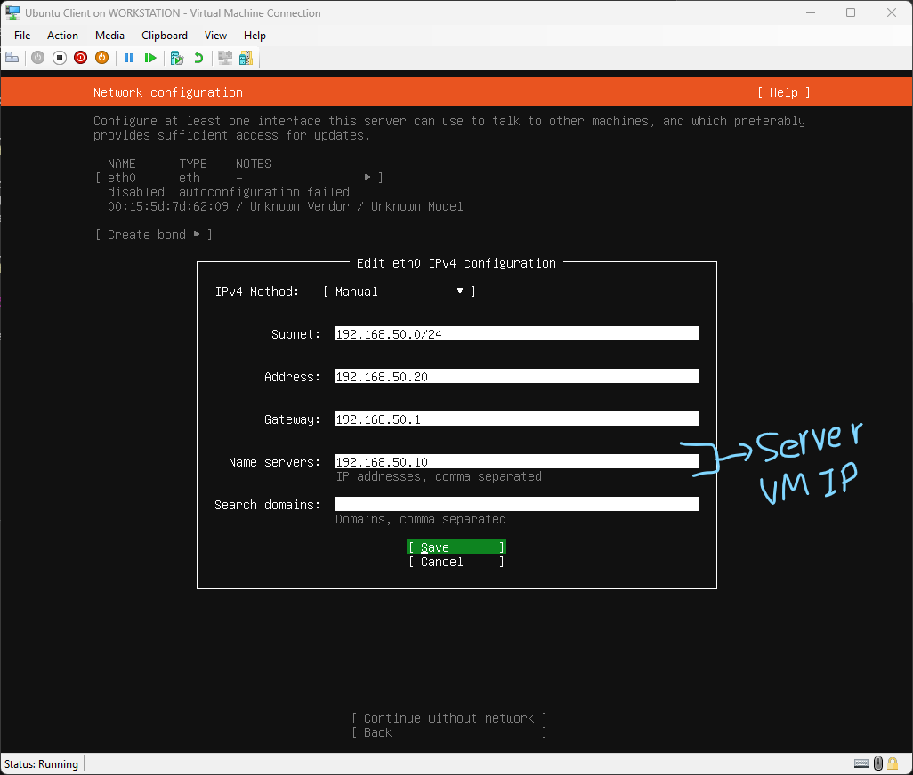
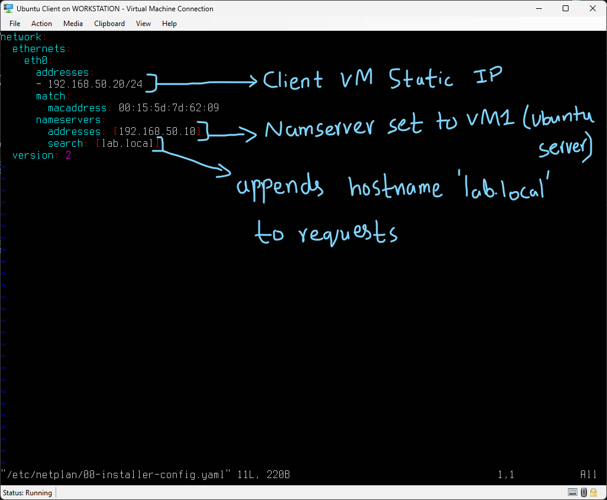
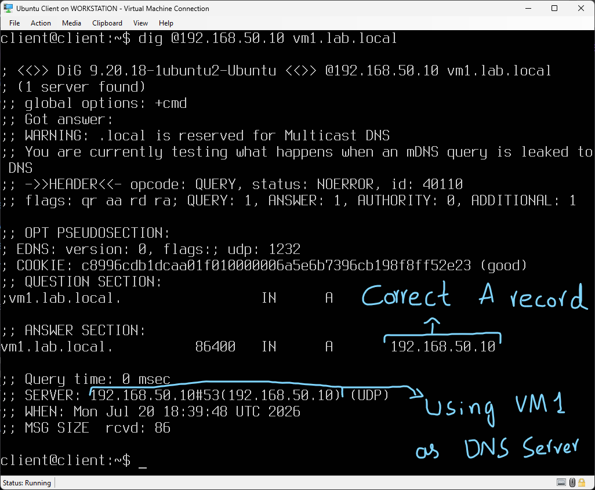
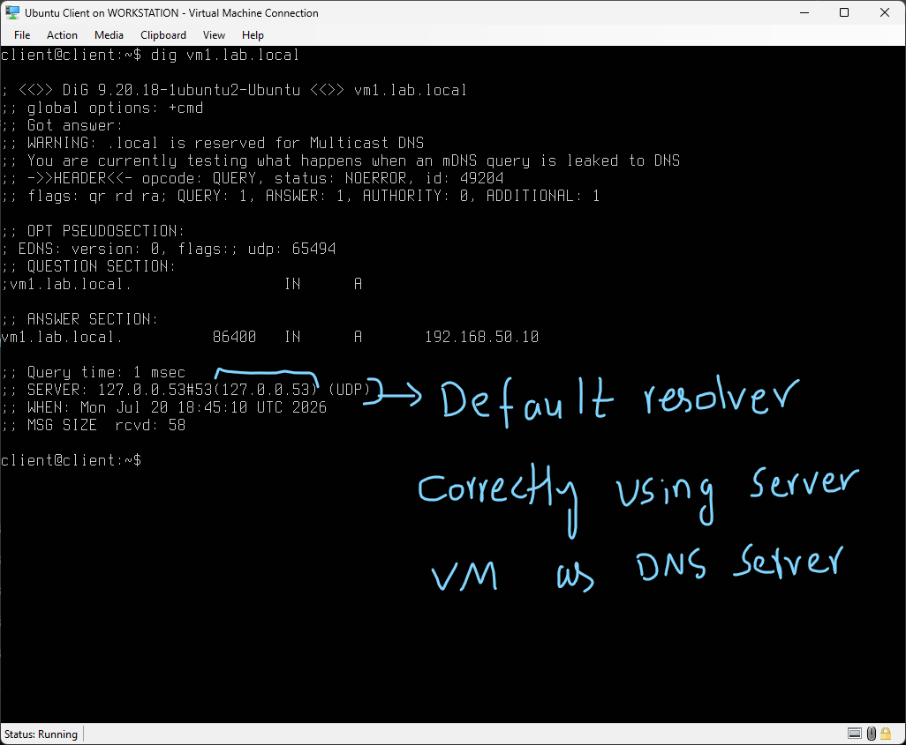
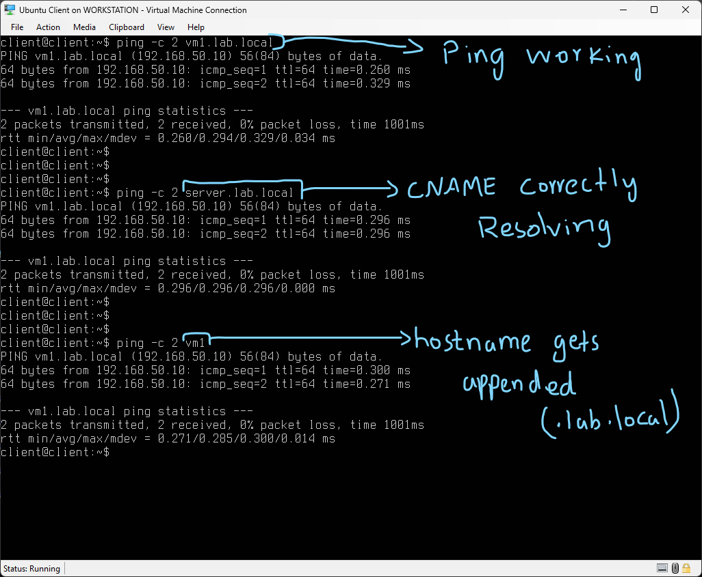

# Internal DNS for a Multi-Host Network

Up to this point BIND9 had only ever been queried from the same machine it was running on, `localhost` or `127.0.0.1`. Today's lab was about actually using it as a real DNS server for a second machine on the network, which meant dealing with things I hadn't had to think about yet: client side DNS configuration, testing resolution across machines instead of on one box, and the difference between explicitly querying a server versus a client actually being configured to use it by default.

This lab was performed using two VMs in Hyper-V Manager. VM1 is the Ubuntu Server VM with BIND9 already set up from the previous labs, connected to a Hyper-V internal virtual switch (`Internal-LAN`) with a static IP of `192.168.50.10`. VM2 is a newly created Ubuntu Server VM meant to act purely as a client, also connected to `Internal-LAN`, with a static IP of `192.168.50.20`.



Before anything else, I updated the `trusted` ACL inside `/etc/bind/named.conf.options` to include the new internal LAN network:

```

acl "trusted" { localhost; 10.0.0.0/8; 192.168.50.0/24; };

```

This mattered because of the `allow-recursion { trusted; }` line already set from the earlier labs. VM2 would be sending queries from `192.168.50.20`, and without adding this subnet to the trusted ACL, BIND would have refused to perform recursive resolution for it, since it wasn't part of any range the server considered trusted. This was a good reminder that the ACL isn't just documentation, it is an actual enforced boundary that would have silently broken the client's DNS requests if I forgot this step.



Next I declared a new zone for `lab.local` in `/etc/bind/named.conf.local`, alongside the existing `lab.internal` and reverse zones:

```

zone "lab.local" { type master; file "/etc/bind/db.lab.local"; };

```

I used a separate zone (`lab.local`) rather than reusing `lab.internal` here, since this is really a distinct network segment (the Hyper-V internal LAN, `192.168.50.0/24`) from the earlier `lab.internal` zone, which was built around the `192.168.1.0/24` WireGuard style network. Keeping them as separate zones matches how a real environment would separate DNS namespaces for genuinely different networks, rather than mixing records for two unrelated subnets into one zone file.



In `/etc/bind/db.lab.local`, I set up the actual records:

- The `SOA` and `NS` records work the same way as in the earlier zone, declaring `ns1.lab.local.` as authoritative for this zone.
- `vm1.lab.local.` and `ns1.lab.local.` both map via `A` records to `192.168.50.10`, since VM1 is both the DNS server and the machine I'm calling the "server" in this lab.
- `vm2.lab.local.` maps to `192.168.50.20`, the client machine.
- `server.lab.local.` is a `CNAME` pointing at `vm1.lab.local`, giving the same host a more descriptive alias, the same pattern I used with `www` in the earlier zone file lab.



With the server side zone ready, I moved on to installing VM2 as the client. During the Ubuntu Server install process, I set a static IP for VM2 directly in the installer's network configuration screen, and critically, set the Name Server field to `192.168.50.10`, VM1's IP. This was the first time I configured DNS client settings at install time rather than after the fact, and it meant VM2 would be pointed at my own BIND server from the very first boot rather than some default resolver.



After installation, I checked the resulting netplan config on VM2, at `/etc/netplan/00-installer-config.yaml`:

```

network: ethernets: eth0: addresses: - 192.168.50.20/24 match: macaddress: 00:15:5d:7d:62:09 nameservers: addresses: [192.168.50.10] search: [lab.local] version: 2

```

This confirmed the static IP and nameserver settings I entered during install were applied correctly. The `search: [lab.local]` line was new to me, this is a search domain, and it means that whenever a query is made using just a short hostname with no dot in it (like `vm1` instead of `vm1.lab.local`), the resolver will automatically append `lab.local` to it before sending the query. This is the same convention I'm used to from work or school networks, where you can type a bare hostname like `printer` instead of the full domain, and it turned out to be exactly this search domain setting making that possible.



To verify DNS was actually working from a second machine, I ran a manual query from VM2, explicitly pointing at VM1's IP:

```

dig @192.168.50.10 vm1.lab.local

```

This correctly returned `192.168.50.10` as the `A` record. Dig also printed a warning that `.local` is reserved for Multicast DNS and that I was testing what happens when an mDNS style query gets sent to a regular DNS server instead. This is worth noting for anyone extending this lab, `.local` is technically reserved by convention for mDNS/Bonjour style zero-configuration networking, not classic unicast DNS, so using it here works fine inside this isolated lab network, but it's not something to carry over to a production domain, where a proper subdomain or an actually registered TLD would be the correct choice instead.



Next I tested whether VM2 was actually using VM1 as its default resolver, rather than requiring the IP to be specified manually every time:

```

dig vm1.lab.local

```

With no server explicitly given, this still correctly returned `192.168.50.10`, and the `SERVER` line in the output showed `127.0.0.1#53`, which is the local `systemd-resolved` stub resolver that Ubuntu uses, itself configured to forward to the DNS server specified in netplan. This confirmed the netplan configuration from the install step was actually working end to end, VM2 really was using VM1 as its DNS server by default, not just when told to explicitly.



Finally I ran a few ping tests to sanity check everything together:

```

ping -c 2 vm1.lab.local ping -c 2 server.lab.local ping -c 2 vm1

```

All three resolved to `192.168.50.10` and successfully pinged. The second one confirmed the `CNAME` record for `server.lab.local` was resolving correctly through to VM1's address. The third one was the most interesting to actually see happen, pinging just `vm1` with no domain at all still correctly resolved, which is the search domain behavior from the netplan config actually appending `.lab.local` automatically before the query went out.

# Summary

This lab moved BIND9 from something I had only ever queried locally into an actual DNS server for a second machine on the network. The main new concepts were the ACL needing to explicitly trust the client's subnet before recursion would even be allowed, and the client side DNS configuration itself, both the explicit nameserver setting and the search domain behavior, which I hadn't had a reason to think about when everything was running and being queried from a single machine. Testing this properly meant checking three separate things rather than assuming success from one working query: that the server would actually answer a client on a different IP, that the client was using that server by default rather than only when explicitly told to, and that the convenience features like the search domain and CNAME resolution were both working as expected under real use rather than just in a single `dig` command.

