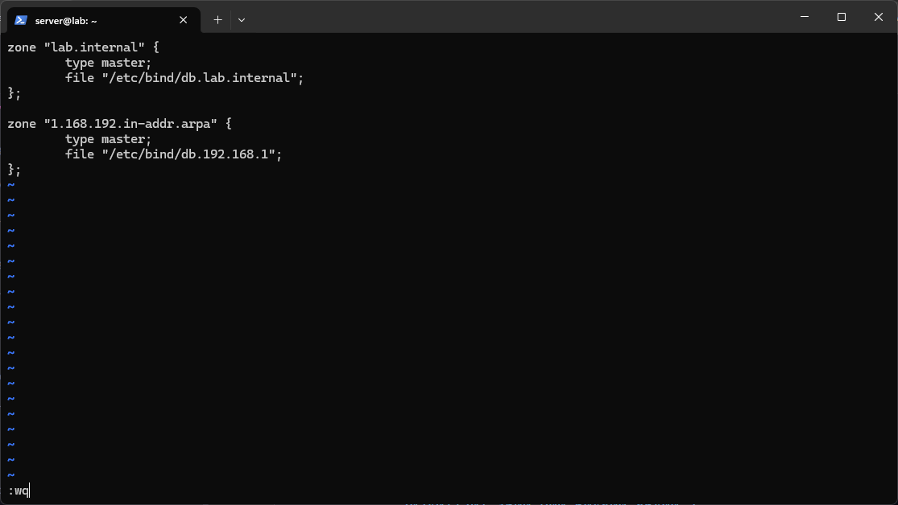
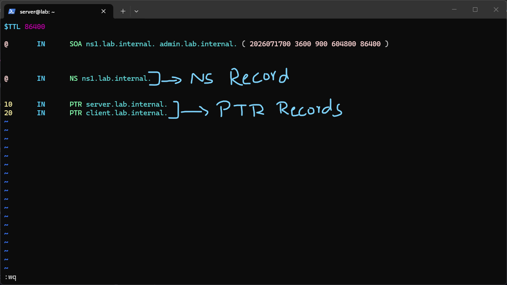
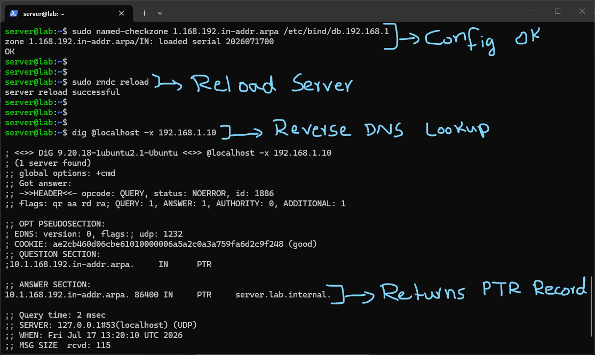
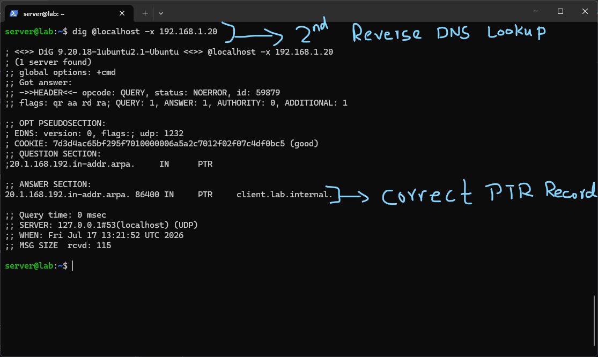

# Reverse DNS

Everything up to this point was forward DNS, going from a name like `server.lab.internal` to an IP address. Reverse DNS does the opposite, going from an IP address back to a name. This is used for things like verifying mail servers, logging tools that resolve IPs to hostnames, and some general troubleshooting where you have an IP and want to know what it actually belongs to. It runs through a special reverse zone rather than through the normal zone I already had.



To support this, I added a second zone declaration into `/etc/bind/named.conf.local`, alongside the existing `lab.internal` zone:

```

zone "1.168.192.in-addr.arpa" { type master; file "/etc/bind/db.192.168.1"; };

```

The zone name here looks backwards on purpose. Reverse zones are named using the network portion of the IP address written in reverse order, followed by `.in-addr.arpa`, which is the special domain reserved for reverse DNS lookups. Since my lab network is `192.168.1.0/24`, the network portion is `192.168.1`, and reversed that becomes `1.168.192`. This took a bit to wrap my head around, the reversal exists because DNS is read left to right from most specific to least specific, but IP addresses are written most significant to least significant, so reversing the octets lets the same left to right zone delegation logic that works for domain names also work for IP ranges.



This is the actual reverse zone file, `/etc/bind/db.192.168.1`:

- `$TTL 86400` and the `SOA` record work exactly the same way as they did in the forward zone, defining the default record TTL and the authoritative metadata for this zone (serial number, refresh, retry, expire, and minimum TTL).
- The `NS` record again declares `ns1.lab.internal.` as authoritative, this time for the reverse zone rather than the forward one. A reverse zone still needs its own nameserver record even though it is functionally answering a different kind of question.
- The actual reverse records are `PTR` records, not `A` records. `PTR` stands for pointer, and it is the record type specifically used to map an address back to a name. I added two: `10 IN PTR server.lab.internal.` and `20 IN PTR client.lab.internal.`. The `10` and `20` here are just the last octet of the IP address, since the rest of the address (`192.168.1`) is already implied by the zone itself. So this maps `192.168.1.10` back to `server.lab.internal.` and `192.168.1.20` back to `client.lab.internal.`, matching the forward `A` records I had already set up for those same hosts.



Before trusting it, I validated the zone and reloaded BIND:

```

sudo named-checkzone 1.168.192.in-addr.arpa /etc/bind/db.192.168.1 sudo rndc reload

```

`named-checkzone` confirmed the zone loaded correctly and picked up the right serial number. Then I tested an actual reverse lookup with:

```

dig @localhost -x 192.168.1.10

```

The `-x` flag tells `dig` to do a reverse lookup instead of a normal forward one, it handles converting the IP into the correct `in-addr.arpa` query format automatically rather than me having to type out `10.1.168.192.in-addr.arpa` by hand. The question section in the output confirms this happened, showing the query actually went out as `10.1.168.192.in-addr.arpa`. The answer came back correctly as `server.lab.internal.`, matching the `PTR` record I configured for `.10`.



I tested the second host as well:

```

dig @localhost -x 192.168.1.20

```

This correctly returned `client.lab.internal.`, confirming both `PTR` records were working and that forward and reverse lookups for both hosts now agree with each other, `server.lab.internal` resolves to `192.168.1.10` and `192.168.1.10` resolves back to `server.lab.internal`, and the same both ways for `client`.

# Summary

This lab added reverse DNS resolution on top of the existing authoritative forward zone from the previous lab, using a dedicated `in-addr.arpa` reverse zone and `PTR` records instead of `A` records. The main concept to actually understand here was why the zone name and the records inside it are structured in reverse order compared to a normal zone, rather than just memorizing the syntax. Like the previous zone file lab, this was done on the Ubuntu Server Hyper-V VM rather than the production VPS, and both forward and reverse lookups were tested individually with `dig -x` to confirm they were consistent with each other rather than just assuming the config was correct once it loaded without errors.

