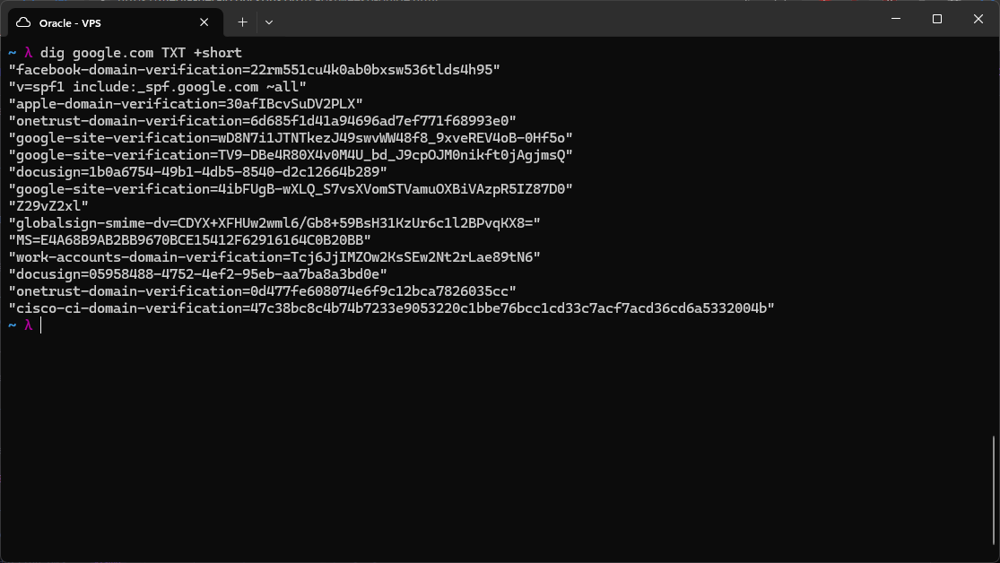
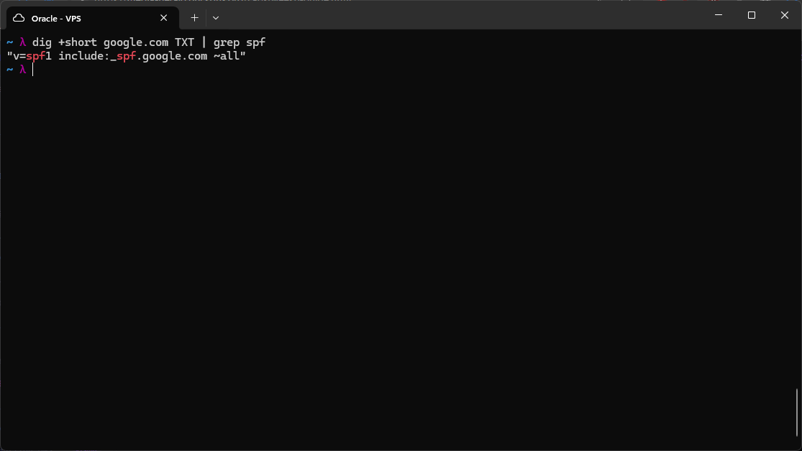
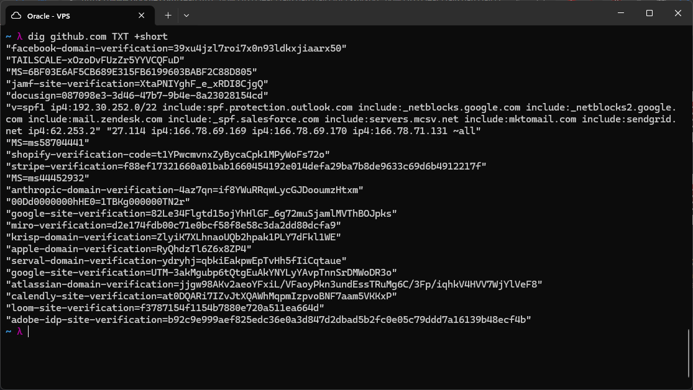
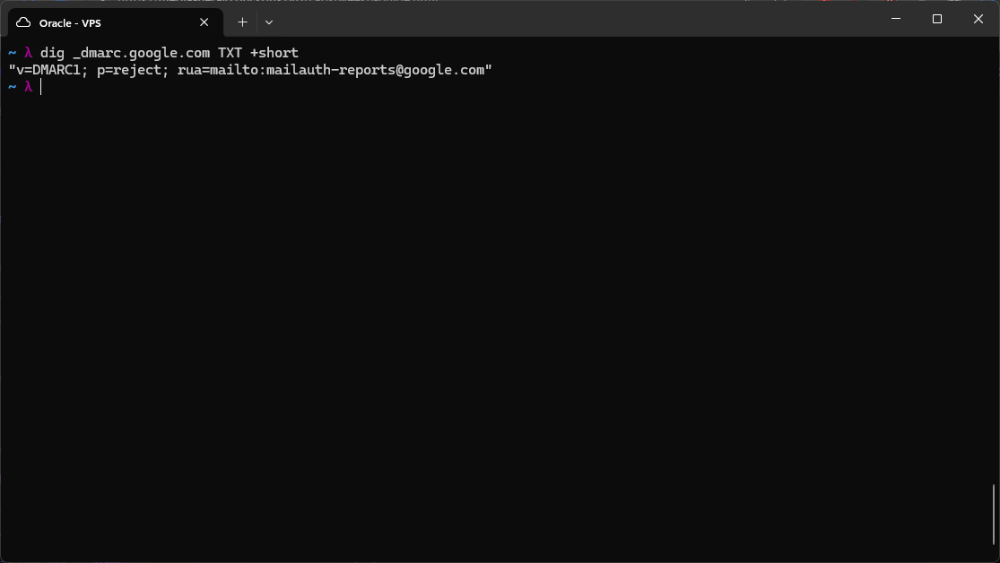

# Email Security DNS Records

Beyond the record types I looked at in the previous lab, real domains also carry TXT records that exist specifically to secure email delivery. These don't affect web traffic at all, but they are one of the most common practical uses of the TXT record type, and they tie directly into the DNS trust model I had been working with in the earlier BIND labs. Today's focus was understanding SPF, DKIM, and DMARC and how they work together rather than as three unrelated acronyms.

| Record | Type | Protects Against | How it Works |
|--------|------|-------------------|--------------|
| SPF | TXT | Email spoofing | Lists which mail servers are allowed to send email on behalf of this domain. Receiving servers check the sending server's IP against this list. |
| DKIM | TXT | Email tampering | The sending server cryptographically signs outgoing emails. The public key used to verify that signature is published in DNS. Receivers use it to confirm the email wasn't altered in transit. |
| DMARC | TXT | Both, plus enforcement policy | Tells receiving servers what to actually do if SPF and/or DKIM checks fail: `none` (do nothing, just report), `quarantine` (send to spam), or `reject` (drop entirely). |

The relationship between these three took a bit to click. SPF and DKIM are both just verification checks, they answer "is this sender legitimate" and "was this message tampered with," but neither one says what to actually do about a failure on its own. DMARC is the policy layer sitting on top of both of them, it is the piece that turns a failed check into an actual enforced action.



I queried Google's TXT records directly:

```

dig google.com TXT +short

```

This returned a long list, and most of it was not email related at all. A lot of these are domain ownership verification strings for various services (`facebook-domain-verification`, `apple-domain-verification`, `docusign=...`, `google-site-verification`, and so on). These exist because TXT records are a generic place to put arbitrary text, and proving you control a domain's DNS is a common way for third party services to confirm you actually own a domain before letting you use their tools with it. Mixed in among all of that was the one I was actually looking for:

```

v=spf1 include:_spf.google.com ~all

```



To isolate just that line I filtered for it:

```

dig +short google.com TXT | grep spf

```

Reading this one piece at a time: `v=spf1` declares the SPF version. `include:_spf.google.com` means "don't list servers here directly, instead go check the SPF record at `_spf.google.com` and trust whatever it says," which is how large providers like Google delegate and manage huge, frequently changing lists of mail server IPs without having to update every domain's own SPF record individually. `~all` is the qualifier for anything not covered by the include, and it means soft fail, mark it as suspicious but don't outright reject it. I also learned there's a harder version, `-all`, meaning hard fail, reject anything not on the list outright, and a much weaker `?all`, neutral, meaning accept it anyway, which defeats the point of having SPF at all and shouldn't really be used.



I ran the same query against GitHub's domain:

```

dig github.com TXT +short

```

This had an even longer SPF record, with multiple `include:` statements chained together (Zendesk, Salesforce, SendGrid, and others) plus several raw `ip4:` entries listed directly, ending in the same `~all` soft fail. This made sense once I thought about it, a company the size of GitHub sends mail through many different services for different purposes (support tickets, marketing, transactional email, and so on), and each of those needs to be an authorized sender in the SPF record, or their genuinely legitimate email risks being flagged as spoofed.



Finally I checked Google's DMARC record, which lives at a special `_dmarc` subdomain rather than the root:

```

dig _dmarc.google.com TXT +short

```

This returned:

```

v=DMARC1; p=reject; rua=mailto:mailauth-reports@google.com

```

`v=DMARC1` declares the version. `p=reject` is the actual enforcement policy, telling receiving mail servers to outright drop any message that fails SPF or DKIM checks for this domain, the strictest of the three policy options. `rua=mailto:...` specifies an address where aggregate failure reports get sent, so Google can monitor abuse attempts against their own domain rather than just silently rejecting and never knowing about it. Seeing `p=reject` on a domain as large and frequently targeted for phishing as Google's made it clear why DMARC exists as a separate record from SPF and DKIM, verification alone doesn't stop anything, it's the policy that actually decides the outcome.

# What a Zone File TXT Entry Looks Like

If I wanted to set an SPF record for my own zone, it would go into the zone file the same way the other record types (`A`, `NS`, `PTR`) I've already configured do:

```

yourdomain. IN TXT "v=spf1 ip4:YOUR_VPS_IP -all"

```

Using `ip4:` directly instead of an `include:` makes sense at this scale, since I only have a single sending IP rather than a fleet of delegated mail providers to reference. Using `-all` here rather than `~all` would make sense too, if I actually control every legitimate sending source for the domain, there is no reason to soft fail unknown senders when I know none should exist.

# Summary

This lab connected the TXT record type from the previous DNS lab to a real, widely used purpose: authenticating email senders and defining what should happen when that authentication fails. The main insight was seeing that SPF and DKIM are verification mechanisms while DMARC is the enforcement policy layered on top, and that real production domains like Google and GitHub often carry many unrelated TXT records (domain verification strings for outside services) mixed in with the email security ones, so knowing what to actually look for in a `dig` dump matters as much as knowing the record type itself.


