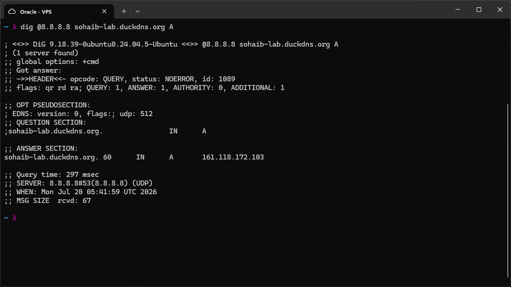
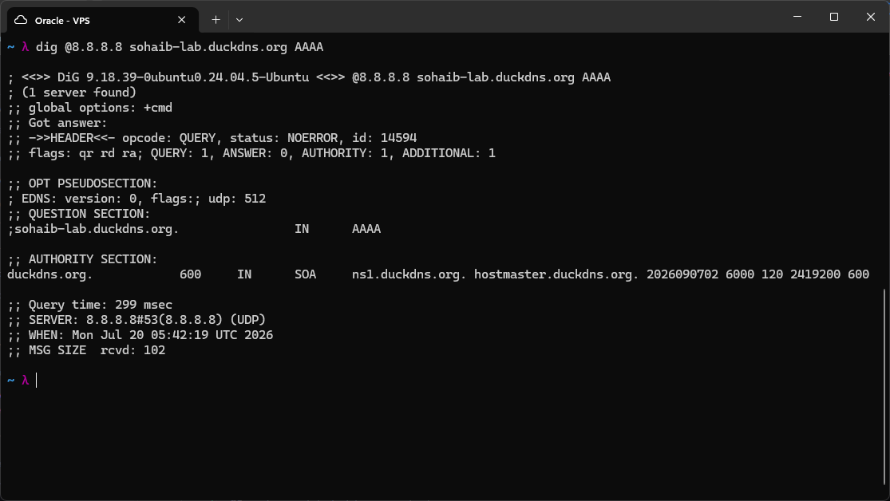
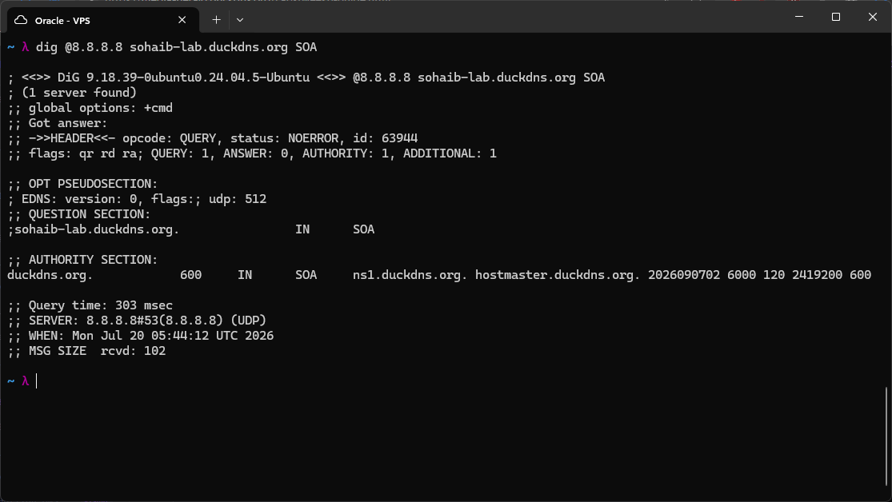
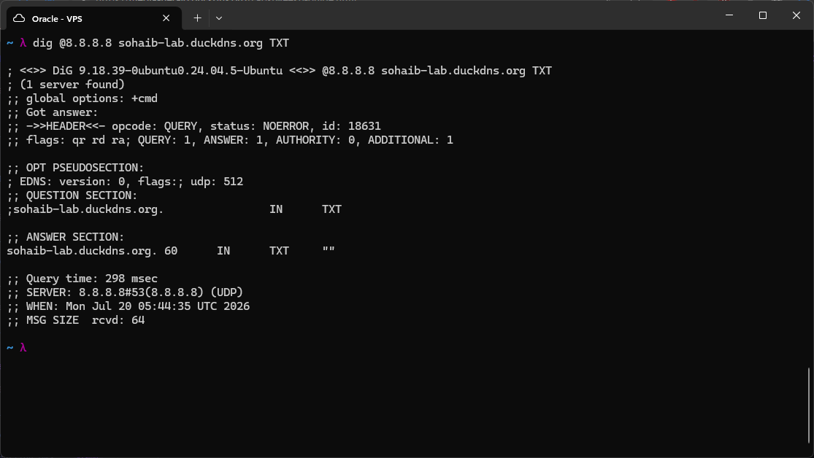
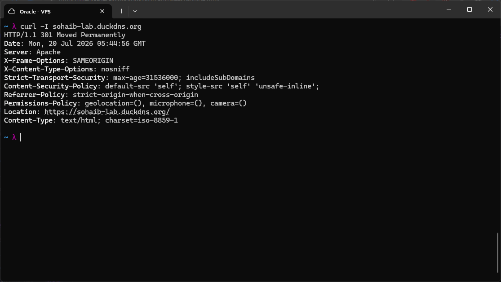
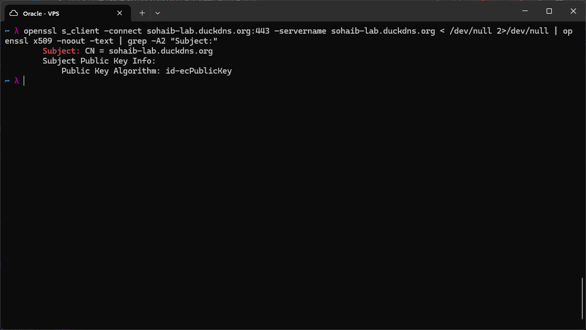
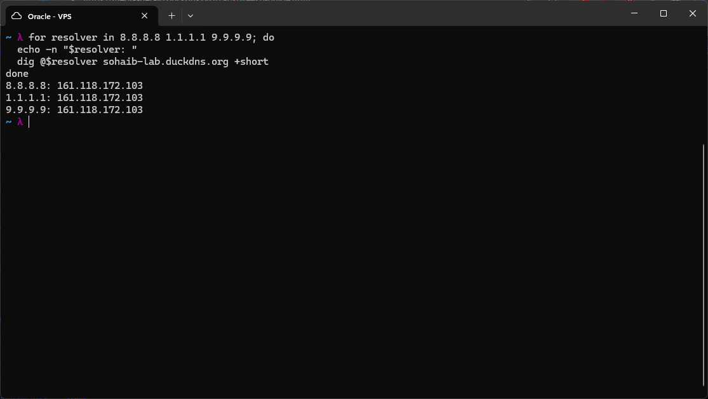

# DNS for Web Servers

The Apache site from the previous lab has been reachable at `sohaib-lab.duckdns.org` for a while now, but up to this point I hadn't actually looked at the full DNS chain that makes that possible, or at the other record types a real domain typically carries alongside the basic `A` record. Today's lab was about understanding that chain end to end and querying the additional record types that come with a production domain.



First I queried the `A` record directly against Google's public resolver:

```

dig @8.8.8.8 sohaib-lab.duckdns.org A

```

This returned `161.118.172.103` with a TTL of 60 seconds. The low TTL makes sense here since this is a DuckDNS dynamic DNS record, my earlier homelab work has a cron job updating this IP periodically if it changes, so DuckDNS keeps the TTL short on purpose. A long TTL would mean resolvers could keep serving a stale IP for hours after an actual change, which defeats the purpose of dynamic DNS.



Next I queried for an `AAAA` record, which is the IPv6 equivalent of an `A` record:

```

dig @8.8.8.8 sohaib-lab.duckdns.org AAAA

```

This came back with `ANSWER: 0` and no actual address, instead returning an `SOA` record for the parent `duckdns.org` zone in the authority section. This is the expected result when a name genuinely has no record of the queried type. It is different from `NXDOMAIN`, which would mean the name itself does not exist at all. Here the name exists and has an `A` record, it just has no `AAAA` record, since my VPS does not have IPv6 configured. The `SOA` in the authority section is the resolver's way of telling me who is authoritative for this space and how long it can cache this "no data" answer, using the same negative caching mechanism I saw earlier with NXDOMAIN responses in the BIND labs.



I then queried the `SOA` record directly:

```

dig @8.8.8.8 sohaib-lab.duckdns.org SOA

```

Since `sohaib-lab` itself is a subdomain of `duckdns.org` rather than its own independently registered domain, it does not have its own `SOA` record. The query returned `ANSWER: 0` again, with the `duckdns.org` zone's `SOA` record showing up in authority instead, same nameserver (`ns1.duckdns.org.`) and same serial/refresh/retry/expire/minimum values as the AAAA query. This made it clear that `SOA` records exist per zone, not per hostname, and `sohaib-lab` is just a name inside DuckDNS's zone rather than a zone of its own.



I checked for a `TXT` record as well:

```

dig @8.8.8.8 sohaib-lab.duckdns.org TXT

```

This returned an empty string as the answer. `TXT` records hold arbitrary text data attached to a name, commonly used for things like domain ownership verification, SPF/DKIM email authentication, or other metadata that doesn't fit into the other record types. DuckDNS apparently reserves an empty `TXT` slot for each hostname by default, presumably so it can be filled in later if needed, but nothing has been set for mine.



To connect the DNS layer to what's actually being served, I ran:

```

curl -I sohaib-lab.duckdns.org

```

This confirmed the site is reachable and returned all the security headers from the Apache hardening lab (`X-Frame-Options`, `Content-Security-Policy`, `HSTS`, etc), along with a 301 redirect to the HTTPS version of the site. This was a good way to see the whole picture in one place, DNS resolves the name to an IP, and once a connection reaches that IP, Apache is the one actually answering and applying all the hardening from before.



I also checked the TLS certificate being presented on that connection:

```

openssl s_client -connect sohaib-lab.duckdns.org:443 -servername sohaib-lab.duckdns.org < /dev/null 2>/dev/null | openssl x509 -noout -text | grep -A2 "Subject:"

```

The `-servername` flag matters here because of SNI (Server Name Indication), which lets a single IP host TLS certificates for multiple different domains, the server needs to know which hostname is being requested before it can decide which certificate to present. The output confirmed the certificate's Common Name (`CN`) matches `sohaib-lab.duckdns.org`, and that it uses an EC (elliptic curve) key rather than RSA, which is consistent with a modern Let's Encrypt issued certificate.



Finally I checked whether different public resolvers all agree on the same answer, using a small loop:

```

for resolver in 8.8.8.8 1.1.1.1 9.9.9.9; do echo -n "$resolver: " dig @$resolver sohaib-lab.duckdns.org +short done

```

Google, Cloudflare, and Quad9 all returned the exact same IP. This is expected since all three are just recursive resolvers doing the same walk back to the same authoritative DuckDNS nameservers, they are not independent sources of truth, they are just different paths asking the same authority the same question. Seeing them agree is really just confirming there isn't some kind of DNS split or caching inconsistency happening across different resolver providers.

# Summary

This lab connected several pieces I had worked through separately before: the DNS resolution chain from resolver to authoritative answer, the record types that make up a real domain (`A`, `AAAA`, `SOA`, `TXT`) versus the ones I had focused on for my own zone (`NS`, `PTR`, `CNAME`), and how that resolution hands off into the actual TLS and HTTP layer once a client reaches the IP. The main thing I took away is that a "domain" is really just a name inside somebody else's zone until it has its own `SOA`, and that record types that come back empty (like `AAAA` and `TXT` here) are not something broken, they are DNS correctly reporting that a valid name simply has no data of that specific type.


