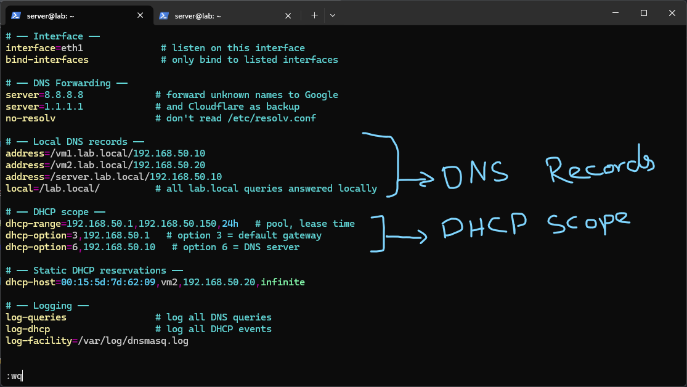
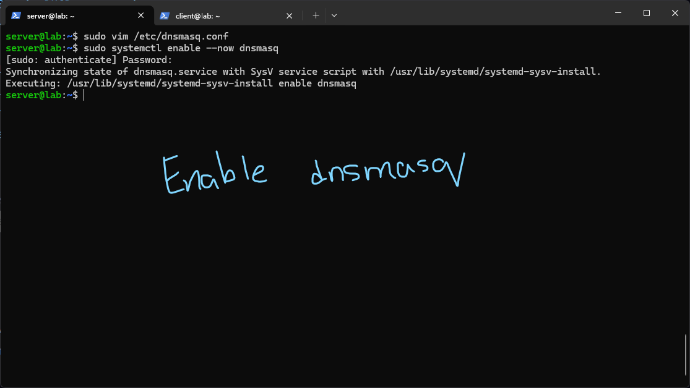
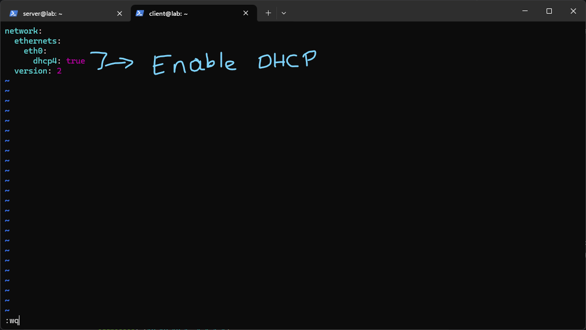
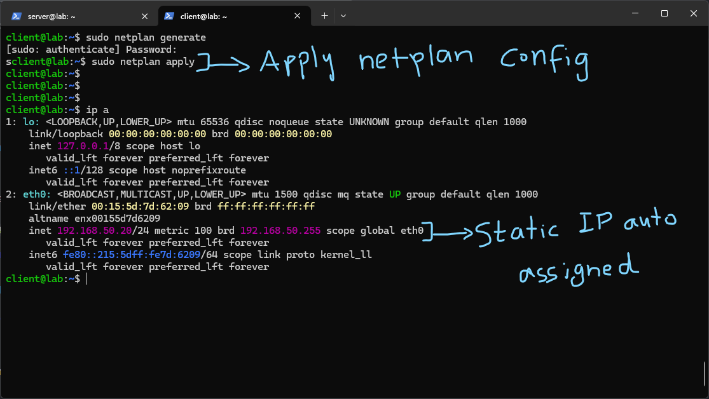
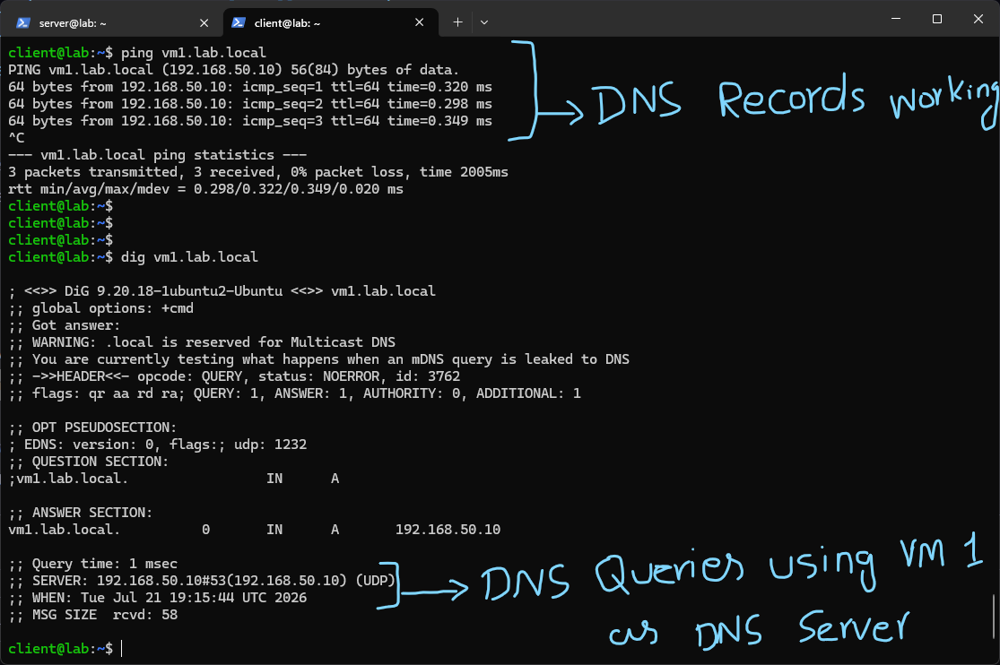
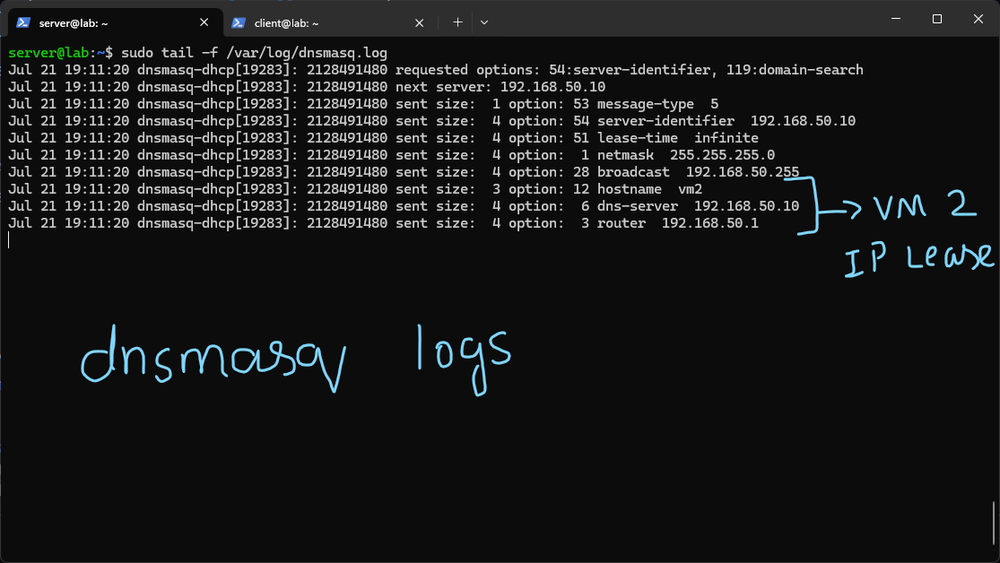

# dnsmasq

For this lab I used the same two VMs from the previous internal DNS lab, but switched DNS software entirely. I disabled the `named` service to stop BIND9 from running, so I could install and test `dnsmasq` instead, both as a DNS server and to test its DHCP capabilities, which BIND9 doesn't provide on its own. This felt like a useful contrast to actually work through, BIND9 is a dedicated, heavyweight authoritative/recursive DNS server, while dnsmasq is a much lighter combined DNS and DHCP tool that's common on small networks and home routers specifically because it does both jobs in one lightweight package.



After installing dnsmasq, I wrote a config file at `/etc/dnsmasq.conf` that recreated the DNS setup from BIND9 and added DHCP on top of it:

- `interface=eth1` and `bind-interfaces` tell dnsmasq to only listen on the specified interface rather than every interface on the machine. This matters more here than it did with BIND, since dnsmasq is also going to be answering DHCP broadcasts, and I didn't want it responding on any interface other than the lab network.
- The `server=8.8.8.8` and `server=1.1.1.1` lines under DNS Forwarding do the same job forwarders did in BIND, any name dnsmasq doesn't know locally gets forwarded upstream. `no-resolv` tells it not to read `/etc/resolv.conf` for additional forwarders, so the only upstream servers it uses are the ones I explicitly listed.
- Under Local DNS records, I used `address=/hostname/ip` lines to recreate the same `A` records I had in the BIND zone file, `vm1.lab.local`, `vm2.lab.local`, and `server.lab.local` all pointing to their respective IPs. `local=/lab.local/` tells dnsmasq that any query ending in `lab.local` should be answered authoritatively from its own local records rather than ever being forwarded upstream, this is dnsmasq's equivalent of BIND treating a zone as authoritative.
- The DHCP scope section is the genuinely new part. `dhcp-range=192.168.50.1,192.168.50.150,24h` defines the pool of addresses dnsmasq is allowed to hand out and how long a lease lasts before it needs to be renewed. `dhcp-option=3,192.168.50.1` sets DHCP option 3, which is the default gateway to hand to clients. `dhcp-option=6,192.168.50.10` sets option 6, the DNS server to hand out, pointed at VM1 itself. Learning that DHCP options are just numbered codes like this was useful, it explained why DHCP configs across different tools all look superficially different but are really just setting the same standardized option numbers.
- `dhcp-host=00:15:5d:7d:62:09,vm2,192.168.50.20,infinite` is a static DHCP reservation, tying VM2's specific MAC address to always receive the same IP it had before under manual netplan configuration, with an infinite lease. This meant I could reuse the same IP addressing scheme I had already been using, just handed out dynamically now instead of typed into each VM by hand.
- The Logging section enables `log-queries` and `log-dhcp` so I could actually watch DNS and DHCP activity happen in real time, which turned out to be genuinely useful for confirming things were working rather than just inferring it from the client side.



I enabled the service the same way as before:

```

sudo systemctl enable --now dnsmasq

```



On the client, VM2, I removed the static IP configuration from netplan entirely and switched to DHCP:

```

network: ethernets: eth0: dhcp4: true version: 2

```

This is a meaningfully different setup than the previous lab, where VM2 had a manually assigned static IP and a manually specified nameserver. Here I'm relying entirely on the network to hand out both the IP and the DNS server automatically.



I applied the new config:

```

sudo netplan generate sudo netplan apply ip a

```

Checking the interface with `ip a` afterward showed `eth0` had picked up `192.168.50.20/24`, the exact IP I had reserved for its MAC address in the dnsmasq config, confirming the DHCP request and static reservation worked together correctly rather than VM2 just grabbing a random address from the pool.



I then tested resolution from the client:

```

ping vm1.lab.local dig vm1.lab.local

```

Both worked, and the `dig` output confirmed the query went to `192.168.50.10#53`, meaning VM2 was correctly using VM1 as its DNS server, not because I had typed that setting in manually this time, but because dnsmasq's `dhcp-option=6` handed that setting to VM2 automatically as part of the DHCP lease. This was the part that actually tied DHCP and DNS together for me, DHCP isn't just about getting an IP address, it's also how a client typically learns which DNS server to use in the first place, which is exactly what happened here automatically instead of through manual netplan entries like the earlier lab.



Finally I watched the dnsmasq logs live on the server:

```

sudo tail -f /var/log/dnsmasq.log

```

This showed the DHCP transaction in detail as it happened, dnsmasq receiving VM2's request and responding with the specific options I had configured: `dns-server 192.168.50.10`, `router 192.168.50.1`, `lease-time infinite`, and the hostname `vm2` being logged as part of the exchange. Watching this in real time made the earlier config file make a lot more sense, each `dhcp-option` line I wrote earlier showed up here as an actual field being sent to the client during the handshake, rather than just an abstract setting.

# Summary

This lab replaced BIND9 with dnsmasq for the same internal lab network, and added DHCP into the mix for the first time rather than only assigning static IPs by hand. The main thing this lab clarified was how DHCP and DNS are connected in a real network, a client doesn't just get an IP address from DHCP, it can also get told which DNS server to use as part of that same exchange, which is exactly how VM2 ended up using VM1 for DNS without me having to configure that manually the way I did in the previous lab. Comparing this to the BIND9 setup also made the tradeoff between the two tools clearer, BIND9 gave much finer control over zone files and record types, while dnsmasq traded some of that granularity for handling DNS and DHCP together in one simple config file, which is closer to what a small office or home router actually runs.
