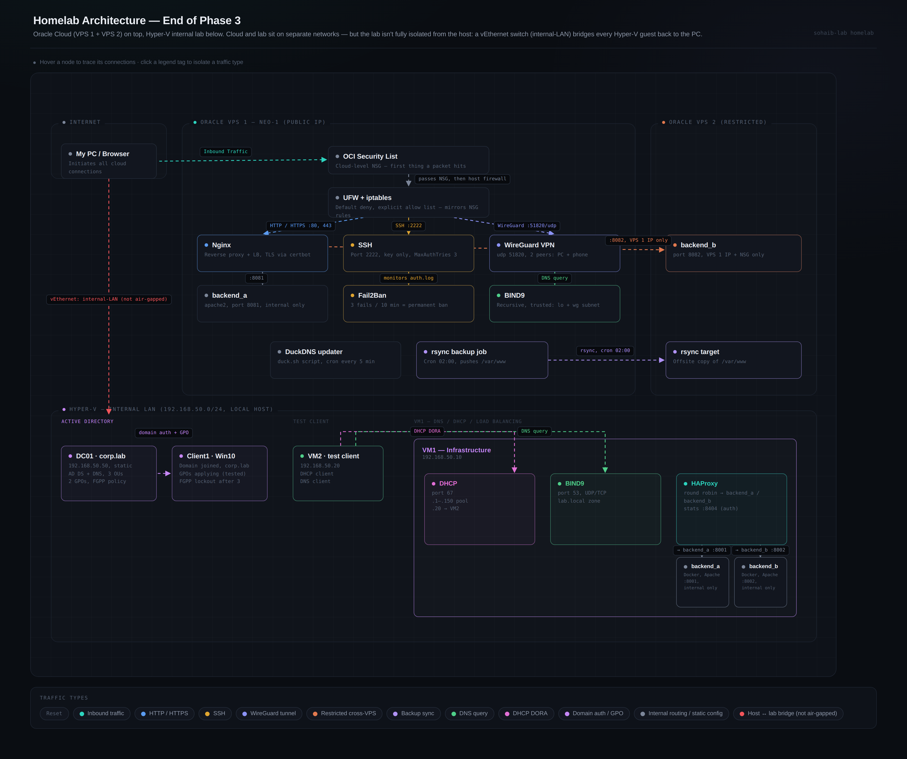

# Phase 3 — Sysadmin Infrastructure

## What I Built

A production-facing web stack on an Oracle Cloud VPS: Nginx reverse-proxying a
Dockerized Apache backend with Let's Encrypt TLS, hardened SSH with fail2ban,
a two-layer firewall (UFW + iptables) audited down to a justified listener for
every open port, a self-hosted BIND9/dnsmasq/isc-dhcp-server DNS and DHCP
stack, HAProxy load balancing across multiple backends, and a full Active
Directory domain (DC01, corp.lab) in the Hyper-V lab with OUs, GPOs, and a
Fine-Grained Password Policy. Automated backups, dynamic DNS, and NTP time
sync tie the whole environment together.

## Key Accomplishments
- [x] Stood up Apache2 with named virtual hosts, then moved it behind an Nginx
      reverse proxy so TLS termination and future backends could sit in one
      place
- [x] Hardened Apache — disabled `ServerTokens`/`ServerSignature`, added six
      security headers, disabled unused modules — verified with `curl -I` and
      an A+ grade from securityheaders.com
- [x] Issued and auto-renewing Let's Encrypt certificates via Certbot, backed
      by a cron-driven DuckDNS updater so the domain never drifts from the
      VPS's public IP
- [x] Hardened SSH: `PasswordAuthentication no`, `PermitRootLogin no`,
      `MaxAuthTries 3`, non-default port, moved to `sshd_config.d/`; paired
      with fail2ban (`maxretry = 3`, `bantime = -1`) verified via
      `fail2ban-client status sshd`
- [x] Built a default-deny firewall with UFW plus a hand-written
      `firewall.sh` iptables script (loopback, invalid-packet drop, trusted
      SSH source, established-connection accept, service allowlist)
- [x] Ran BIND9 as both authoritative and recursive resolver, wrote zone
      files, configured reverse DNS (PTR), and scoped recursion with an ACL
      to loopback + the WireGuard subnet
- [x] Compared BIND9 against dnsmasq and isc-dhcp-server for DHCP, and read
      SPF/DKIM/DMARC records on live domains (`dig google.com TXT +short`,
      `dig _dmarc.google.com TXT +short`) to understand email-security DNS
- [x] Deployed HAProxy in front of two Dockerized Apache backends with health
      checks, automatic failover, and an authenticated stats endpoint; tested
      round robin, least connections, IP hash, and random balancing
- [x] Promoted a Windows Server 2022 box to a domain controller
      (`corp.lab`), created 3 OUs and a working GPO inheritance chain, and
      queried the resulting LDAP tree by hand before trusting the GUI
- [x] Layered a Fine-Grained Password Policy on top of the default domain
      policy and confirmed the FGPP priority system actually applies
- [x] Automated nightly offsite backups with rsync + cron (02:00), verified
      recovery, and documented the setup against the 3-2-1 backup rule
- [x] Set up NTP with chrony and understood the stratum hierarchy it depends
      on
- [x] Ran a full VPS port audit — justified every open port against
      `ss -ulnp`/`ss -tlnp`/`systemctl list-units`, and disabled six unused
      services (rpcbind, rpc-statd, squid, fwupd, ModemManager, udisks2)
- [x] Closed the phase with a system-wide Lynis audit: hardening index moved
      from **66/100 → 69/100** (268 → 270 tests) after the port cleanup

## Technologies Used
| Tool | Purpose | Evidence |
|------|---------|---------|
| Apache2 | Web server, hardened backend | virtual host configs, security headers via `curl -I`, A+ on securityheaders.com |
| Nginx | Reverse proxy + TLS termination | site config proxying to `backend_a:8081` |
| Docker | Containerized Apache backends | `backend_a`/`backend_b` containers behind Nginx and HAProxy |
| Certbot / Let's Encrypt | TLS certificates | certificate install, verified auto-renewal (`certbot renew --dry-run`) |
| DuckDNS | Dynamic DNS | update script on cron, every 5 min |
| OpenSSH | Remote access, hardened | `sshd_config.d/60-cloudimg-settings.conf` |
| fail2ban | Brute-force mitigation | `jail.local`, `fail2ban-client status sshd` |
| UFW / iptables | Two-layer firewall | `firewall.sh`, `ufw status numbered` |
| BIND9 | Authoritative + recursive DNS | zone files, `allow-recursion` ACL, PTR records |
| dnsmasq | Lightweight DNS/DHCP comparison | `bind9_vs_dnsmasq` writeup |
| isc-dhcp-server | DHCP pools and reservations | `dhcpd.conf`, lease verification |
| HAProxy | Load balancing across backends | `haproxy.cfg`, stats page, failover test |
| Active Directory (Windows Server 2022) | Directory services | `DC01`, `corp.lab`, `Get-ADDomain`, `Get-ADDomainController` |
| Group Policy | Policy enforcement | 2 GPOs, inheritance order confirmed on domain client |
| LDAP (`ldapsearch`) | Directory protocol fundamentals | queries against `ldap.forumsys.com` |
| rsync + cron | Automated offsite backups | `crontab -l`, recovery test, backup log |
| chrony | NTP time sync | stratum verification |
| Samba / NFS | File sharing | mounted shares, `samba_vs_nfs` comparison |
| FTP / SFTP / TFTP | File transfer protocols | lab configs for all three |
| Lynis | System-wide security auditing | hardening index 66 → 69, `lynis_end_phase3.report` |

## Key Learnings

The biggest recurring lesson this phase was that "looks safe" and "is safe"
are different claims, and the gap between them only closes with verification,
not assumption. The Oracle two-layer firewall (NSG + OS-level iptables) and
the port 8081 "only Nginx can reach it" assumption both sat in that gap until
checked directly against `ss`, `ufw status`, and the OCI console instead of
taken on faith. The same pattern showed up with SSH: a session was always
kept open before touching `sshd_config`, because a config that looks correct
on paper can still lock out the only way in.

Doing LDAP by hand before touching Active Directory made AD readable instead
of magic — DNs, object classes, and filters were not new vocabulary by the
time `Get-ADDomain` returned the same DN grammar already queried manually
against a public LDAP server. And the Lynis delta (66 → 69) was a useful
reminder not to chase a single number mid-phase: the score only became
meaningful once it was measured at an actual phase boundary, after the real
infrastructure work was done rather than while it was still in progress.

## Files in This Directory
| File | Description |
|------|-------------|
| apache/README.md | Apache2 virtual hosts, hardening, and security headers |
| nginx_reverse_proxy/README.md | Nginx reverse proxy and load balancing setup |
| haproxy/README.md | HAProxy load balancing, health checks, and failover |
| ssh_hardening_fail2ban/README.md | SSH daemon hardening and fail2ban jail config |
| ufw/README.md | UFW rules, WireGuard NAT masquerading and forwarding |
| iptables/README.md | netfilter theory, interactive rule building, `firewall.sh` |
| firewall.sh | Production iptables firewall script |
| bind9/README.md | Authoritative and recursive DNS, zone files, reverse DNS |
| dnsmasq/README.md | Lightweight DNS/DHCP, compared against BIND9 |
| isc-dhcp-server/README.md | DHCP pool and reservation configuration |
| dns_for_web_servers/README.md | Pointing a domain at the VPS via DNS |
| internal_dns_multihost/README.md | Internal DNS across a multi-host network |
| email_security_dns_records/README.md | SPF, DKIM, and DMARC record analysis |
| ldap_and_active_directory/README.md | LDAP fundamentals and AD DS promotion (DC01) |
| active_directory_setup/README.md | OU, user, and group creation via PowerShell |
| gpo_inheritance/README.md | Group Policy processing order and testing |
| fine_grained_password_policy/README.md | FGPP priority system and lockout policy |
| certbot_tls/README.md | Let's Encrypt certificate issuance and renewal |
| duckdns/README.md | Dynamic DNS update script and cron schedule |
| rsync_backup/README.md | Automated nightly backups and the 3-2-1 rule |
| ntp_chrony/README.md | NTP stratum hierarchy and chrony configuration |
| disk_partitioning/README.md | GPT vs MBR, partition layout across the VM fleet |
| samba/README.md | Samba file sharing lab |
| samba_vs_nfs/README.md | Samba vs NFS comparison and use-case notes |
| nfs/README.md | NFS file sharing lab |
| ftp_sftp_tftp/README.md | FTP, SFTP, and TFTP setup and testing |
| vps_port_audit/README.md | Full listener audit and unused-service cleanup |
| lynis-scores.md | Hardening index progression, 66 → 69 |
