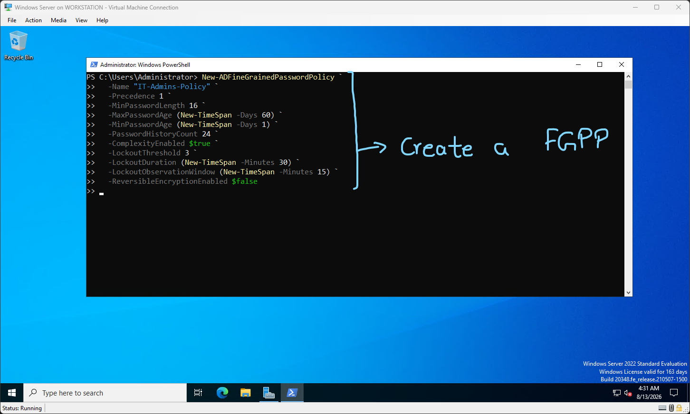
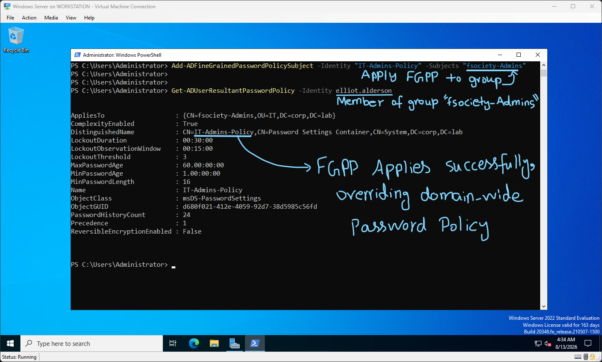
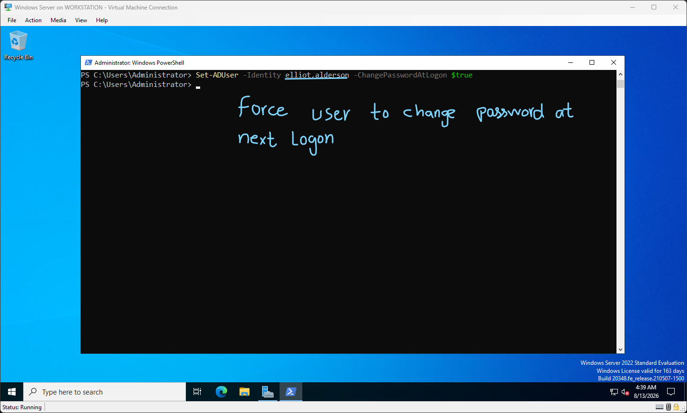
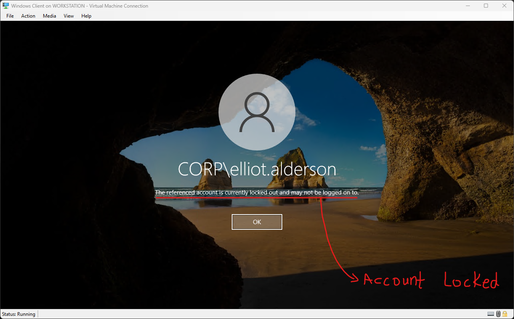
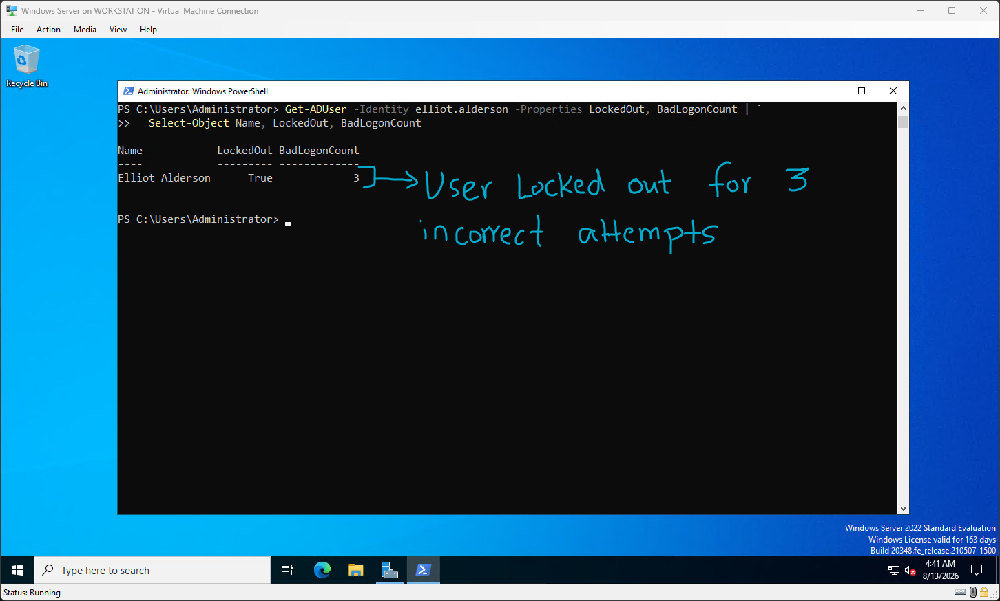
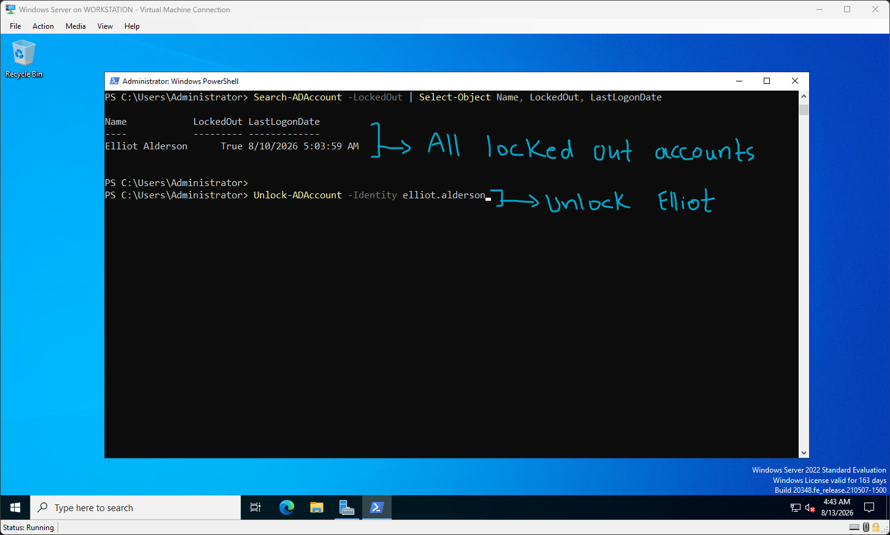
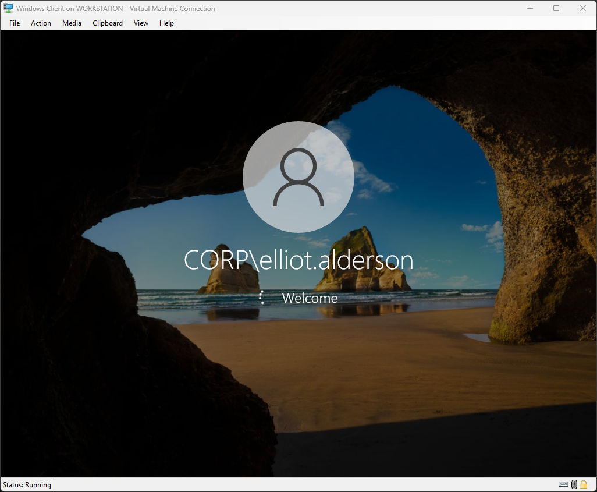

# Fine-Grained Password Policy

The Default Domain Policy applies one password policy to every user. Fine-Grained Password Policies (FGPPs) let you apply different, stricter policies to specific groups. IT admins can get a 16-character requirement while regular users get 12. This is the enterprise standard.

## FGPP Priority System

When a user is subject to multiple FGPPs, the one with the lowest precedence number wins. The Default Domain Policy always loses to any FGPP.

## Lab

This lab was performed on the Windows Server 2022 Eval VM running on Hyper-V, the same VM used in the previous AD lab.



I created an FGPP using PowerShell with the following specifications:

- Precedence 1
- MinPasswordLength 16
- MaxPasswordAge 60 days
- MinPasswordAge 1 day
- PasswordHistoryCount 24
- ComplexityEnabled true
- LockoutThreshold 3
- LockoutDuration 30 minutes
- LockoutObservationWindow 15 minutes
- ReversibleEncryptionEnabled false

This was done with the following command:

```powershell
New-ADFineGrainedPasswordPolicy `
  -Name "IT-Admins-Policy" `
  -Precedence 1 `
  -MinPasswordLength 16 `
  -MaxPasswordAge (New-TimeSpan -Days 60) `
  -MinPasswordAge (New-TimeSpan -Days 1) `
  -PasswordHistoryCount 24 `
  -ComplexityEnabled $true `
  -LockoutThreshold 3 `
  -LockoutDuration (New-TimeSpan -Minutes 30) `
  -LockoutObservationWindow (New-TimeSpan -Minutes 15) `
  -ReversibleEncryptionEnabled $false
```



I applied the newly created FGPP to the security group `fsociety-Admins`, as created in the last AD lab. This was done using the command:

`Add-ADFineGrainedPasswordPolicySubject -Identity "IT-Admins-Policy" -Subjects "fsociety-Admins"`

I also verified that elliot.alderson, a member of the `fsociety-Admins` group, had this FGPP applied to them by running:

`Get-ADUserResultantPasswordPolicy -Identity elliot.alderson`

This confirmed that the IT-Admins-Policy FGPP was applied to the given user.

---



To test this in practice, I forced the user Elliot to change their password at the next logon by using the command:

`Set-ADUser -Identity elliot.alderson -ChangePasswordAtLogon $true`



I then switched to the Windows 10 client VM, which is connected to the AD domain corp.lab. On the login screen, I supplied a wrong password three times, and it showed the account was locked out. This confirmed that the FGPP rules were being applied to this user.



I then checked on the server for the LockedOut status of the user Elliot by using:

`Get-ADUser -Identity elliot.alderson -Properties LockedOut, BadLogonCount | Select-Object Name, LockedOut, BadLogonCount`

It showed the Name, LockedOut, and BadLogonCount columns. This confirmed that the user had indeed been locked out of their account due to three incorrect password attempts.



I also checked for any other locked out users with the command:

`Search-ADAccount -LockedOut | Select-Object Name, LockedOut, LastLogonDate`

It printed only the name of the user Elliot. I finally unlocked the account by running:

`Unlock-ADAccount -Identity elliot.alderson`


Upon supplying the correct password this time on the client VM, I was asked to change my password, as specified by the earlier command.



Upon changing the password to one that met the new criteria set in the FGPP, I was able to successfully log in.

## Summary

FGPPs are essential for implementing security for the more sensitive user groups in Active Directory, such as IT administrators, who have more permissions and thus require stronger safeguards for their accounts, since a compromise of their accounts can be detrimental to the security of the whole network.
