# LDAP and Active Directory

This lab is where the sysadmin phase moved from individual servers into actual directory services. Before this, everything I had touched was standalone: a user account existed on one machine and nowhere else. This lab is about the opposite idea, one central database that every computer on the network trusts to answer "who is this person and what are they allowed to do."

I started with plain LDAP on the VPS before touching Active Directory, because I wanted to understand the protocol AD is built on top of, not just click through a wizard and hope it works.

## LDAP Concepts

LDAP (Lightweight Directory Access Protocol) is how enterprise systems store and look up identity information: users, groups, computers, printers. Active Directory is Microsoft's implementation of LDAP. Understanding LDAP first made AD click much faster, because AD's structure is not a Microsoft invention, it is LDAP's tree structure with Microsoft's tooling wrapped around it.

### The Directory Information Tree

An LDAP directory is a tree, not a flat table. That was the first thing I had to get used to. Every object in the tree has a Distinguished Name (DN), which is basically a full path from the root of the tree down to that object, similar to a file path but written back to front.

```
dc=corp, dc=lab                 Root of the directory - the domain
│
├── ou=IT                       Organizational Unit
│   ├── cn=Alice Chen
│   └── cn=Bob Malik
├── ou=Sales                    Organizational Unit
│   └── cn=Carol Yu
└── ou=Groups                   Organizational Unit
    └── cn=Domain Admins
```

| Term | Full Name | What It Means | Example |
|------|-----------|---------------|---------|
| **DN** | Distinguished Name | Unique path to an object, like a file path | `cn=Alice,ou=IT,dc=corp,dc=lab` |
| **DC** | Domain Component | Part of a domain name | `dc=corp` + `dc=lab` = `corp.lab` |
| **OU** | Organisational Unit | Container, like a folder | `ou=IT`, `ou=Sales` |
| **CN** | Common Name | Name of the actual object | `cn=Alice Chen`, `cn=Domain Admins` |
| **objectClass** | Object Class | Defines what kind of object and what attributes it has | `inetOrgPerson`, `groupOfNames` |
| **uid** | User ID | Login name attribute | `uid=alice` |
| **sAMAccountName** | SAM Account Name | AD-specific login name | `CORP\alice` |

The part that took a moment to sink in is that a DN is read from the object outward to the root, not the root inward. `cn=Alice,ou=IT,dc=corp,dc=lab` means Alice, who lives in the IT organizational unit, which lives in the corp.lab domain. Once I read it that way instead of like a normal file path, the whole tree made a lot more sense.

**Active Directory is LDAP.** AD stores everything in an LDAP-compatible database. When you create a user in ADUC (Active Directory Users and Computers), you are creating an LDAP object with attributes like `sAMAccountName`, `userPrincipalName`, `memberOf`. PowerShell's `Get-ADUser` queries LDAP under the hood. LDAP clients on Linux can authenticate against AD directly, which is exactly why this matters for the cloud and cross-platform side of things I care about, a Linux box can join an AD-backed network without needing Microsoft's own client stack.

### Querying a public LDAP server

Before doing anything on the Windows Server VM, I wanted to see LDAP with my own hands from the VPS, using a public test LDAP server so nothing here touches anything private.

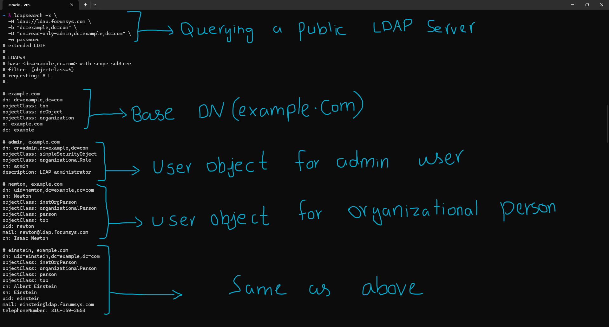

I queried the public LDAP server (`ldap.forumsys.com`) to dump every object under its base DN (`dc=example,dc=com`). This is the equivalent of asking "show me everything in this directory tree." The output confirmed the theory from the table above in a very concrete way: every entry has a DN, an `objectClass` (or several), and then a set of attributes specific to that class. Seeing `dn: uid=newton,dc=example,dc=com` right after reading about DNs made the abstract concept immediately real. This was also the first time I actually used `ldapsearch`, so getting the syntax right (`-x` for simple auth, `-H` for the server, `-b` for the base DN, `-D` for the bind DN, `-w` for the password) was as much a part of the lesson as the output itself.

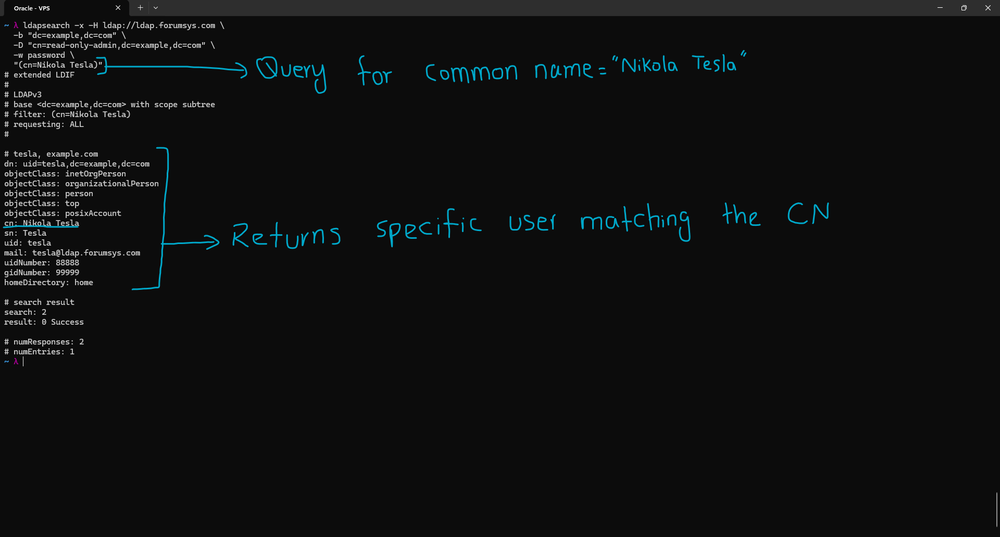

Next I narrowed the query down to a single object using a filter on the common name: `(cn=Nikola Tesla)`. This is where LDAP filters started to make sense as a query language, not just a lookup. The filter syntax is basically "attribute equals value" wrapped in parentheses, and it returned exactly one matching entry. This is the same mechanism that PowerShell's `Get-ADUser -Filter` uses behind the scenes on the AD side, so understanding raw LDAP filters here paid off directly later when reading AD cmdlets.

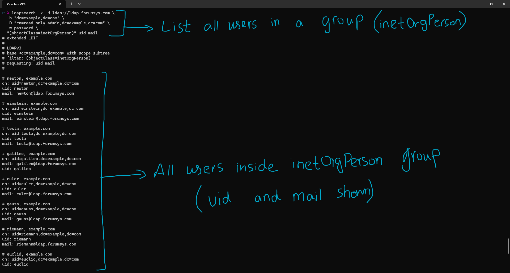

The last query combined two ideas at once: filtering by `objectClass=inetOrgPerson` to get every user of that class, and requesting only specific attributes back (`uid` and `mail`) instead of the full object. This is effectively a group-style listing, not because the users belong to an LDAP group object, but because they share the same object class. It also taught me that you can control exactly what LDAP returns, which matters a lot in real environments where you do not want to dump full user records including sensitive attributes just to get an email list.

## Windows Server 2022 and Active Directory

With the LDAP fundamentals actually understood rather than memorized, I moved to building a real domain controller. This lab runs on Windows Server 2022 Standard Evaluation (180 day trial) as a Hyper-V VM. The server was attached to the same internal virtual switch, "Internal-LAN," that my two Ubuntu Server VMs already use, so everything in this lab environment can eventually talk to everything else on that internal network.

The first thing I did after installation was assign the server a static IP of `192.168.50.50`. I decided this would be the start of a numbering scheme, `.50` and up reserved for Windows Server and Windows client machines, keeping them visually separate from the Linux VMs I already had running lower in the range. A DC with a floating DHCP address would be a bad idea anyway, since every client on the domain needs to reliably find it at the same address for authentication and DNS.

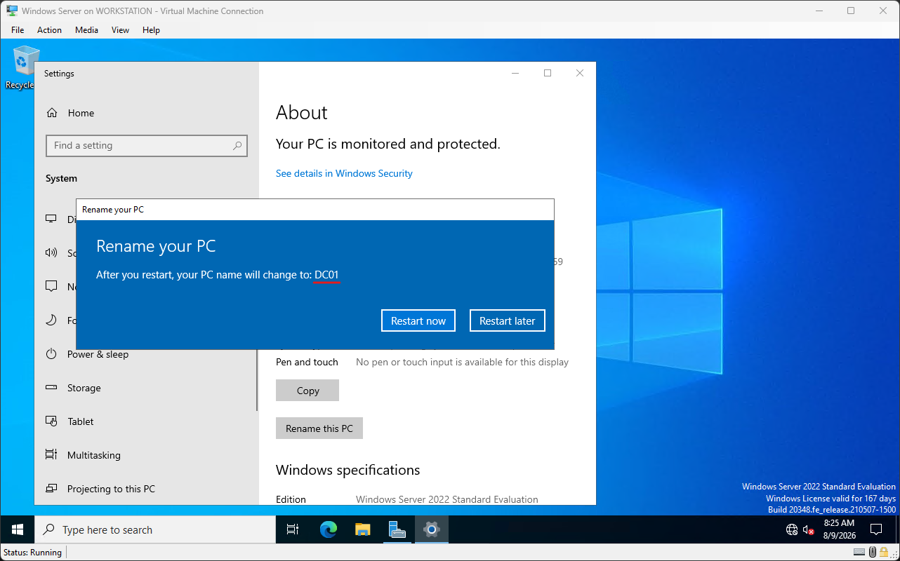

Right after setting the static IP, I renamed the server to `DC01`. I wanted the name to say exactly what the machine's job is before I even installed the AD role, since I plan to add more domain controllers or member servers later and naming them clearly from the start avoids confusion.

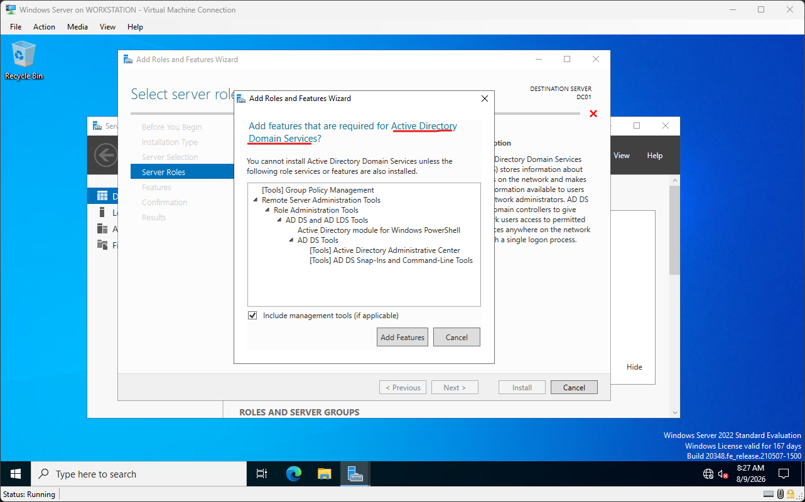

I installed the Active Directory Domain Services (AD DS) role. This step only installs the software and management tools, it does not actually create a domain yet. That distinction did not click for me until I saw the next screen.

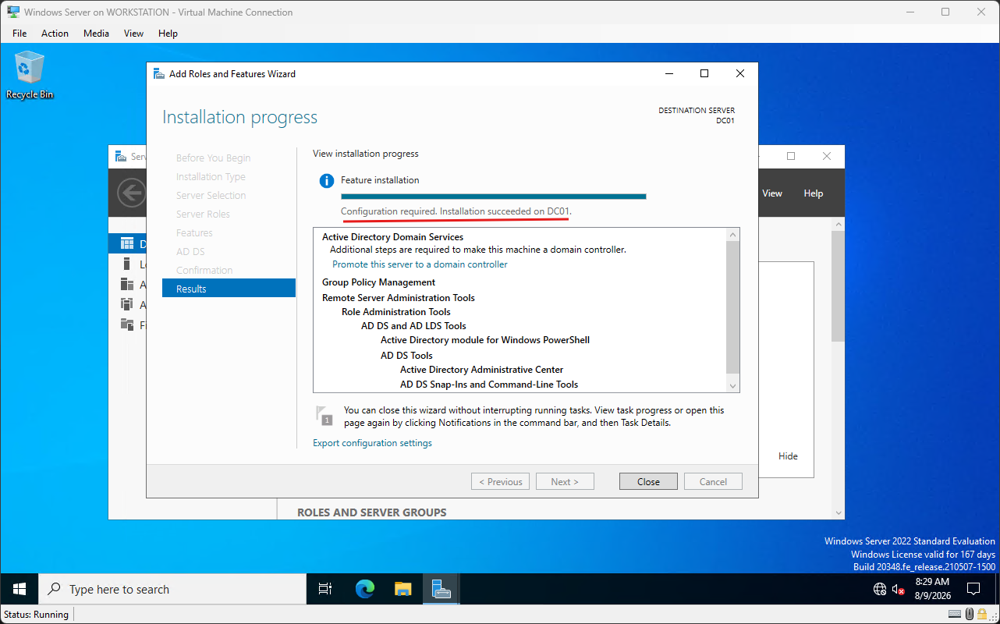

After installation finished, Server Manager flagged "Configuration required. Installation succeeded on DC01." This is the point where I understood that installing the role and promoting the server are two separate steps. The role install just puts the binaries and LDAP engine on disk, it is the promotion step that actually stands up a domain, builds the database, and turns this into a functioning directory service.

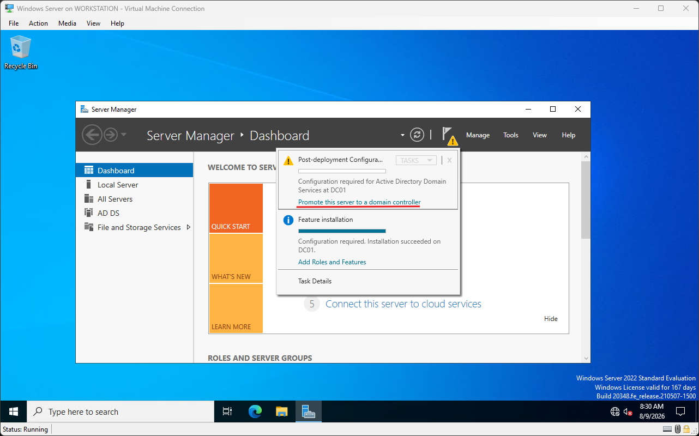

Server Manager surfaced a direct link to "Promote this server to a domain controller," which is the entry point into the actual AD DS Configuration Wizard.

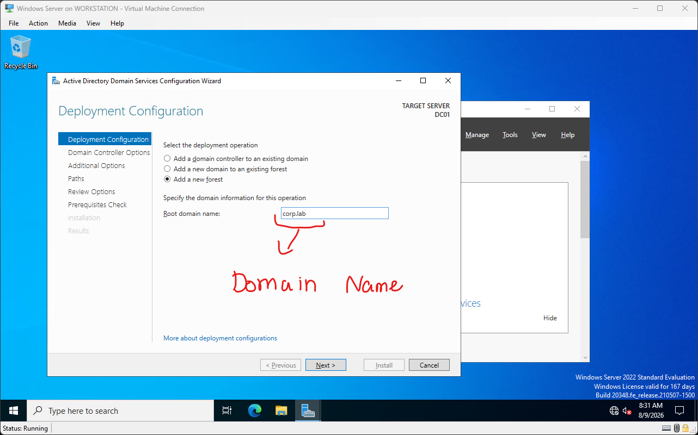

Promoting the server to a domain controller is what actually creates the AD database, the DNS zones, and the SYSVOL share (the folder that replicates Group Policy objects and scripts between domain controllers). I chose "Add a new forest" since this is the very first domain controller in a brand new environment, there is no existing forest to join yet. I set the root domain name to `corp.lab`. Using a non-routable, clearly fake TLD like `.lab` here matters, since using a real domain you do not own for an internal AD namespace can cause DNS conflicts down the line.

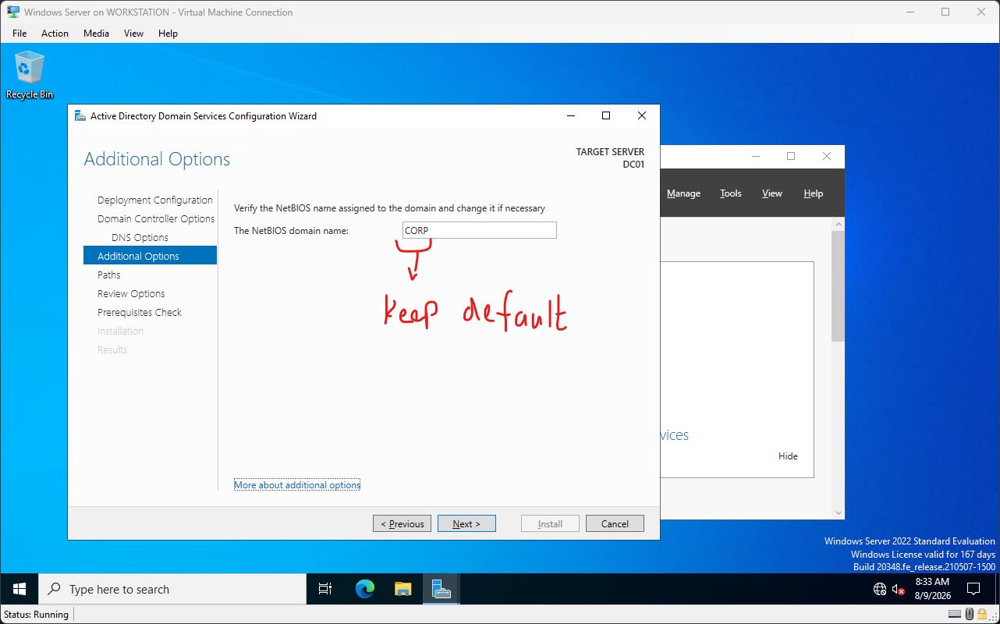

The wizard auto-derived the NetBIOS name `CORP` from the domain name. NetBIOS names are the legacy short-form identifier still used in some login contexts (`CORP\username` instead of the full `corp.lab`). I left it at the default since there was no reason to diverge from it here.

The server rebooted automatically once the promotion finished, which is expected since promoting a server to a DC fundamentally changes how the OS boots and what services start.

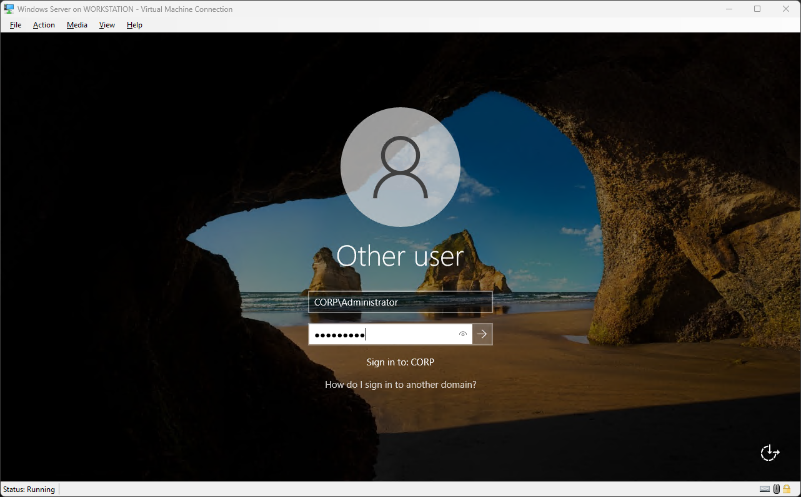

After the reboot, I logged in as `CORP\Administrator` instead of the old local administrator account. This was the first concrete proof the promotion actually worked, the login screen itself now recognizes a domain to sign into ("Sign in to: CORP") rather than just the local machine.

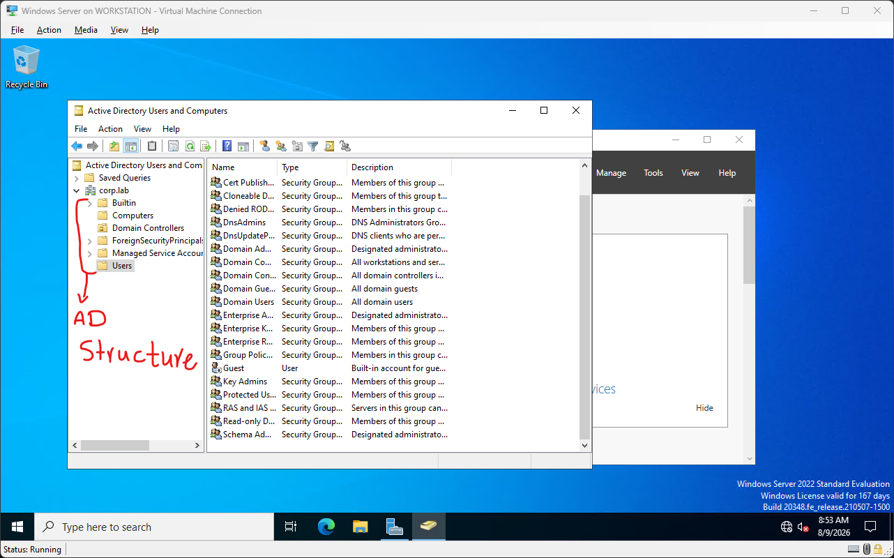

I opened Active Directory Users and Computers (ADUC), found under `Server Manager -> Tools -> Active Directory Users and Computers`, and confirmed the domain structure had actually been created. What stood out here is how closely this maps to the LDAP tree I explored earlier on the VPS: the same idea of containers (`Users`, `Domain Controllers`, `Builtin`) sitting under the domain root, and every object underneath having its own DN even though ADUC hides that detail behind a friendly GUI.

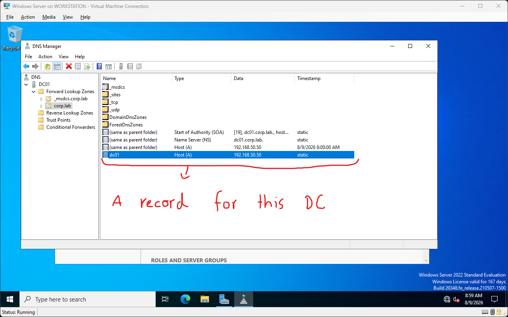

Under `Server Manager -> Tools -> DNS`, I checked the forward and reverse lookup zones for `corp.lab`. DC01's own A record (`192.168.50.50`) was added automatically during promotion. This answered a question I had going in: AD does not just use DNS, it depends on it completely. Domain-joined clients find the domain controller by querying DNS for special service records, not by having an IP hardcoded anywhere. Promoting a server to a DC without correct DNS in place is one of the most common ways an AD setup breaks, so seeing this record appear on its own was reassuring.

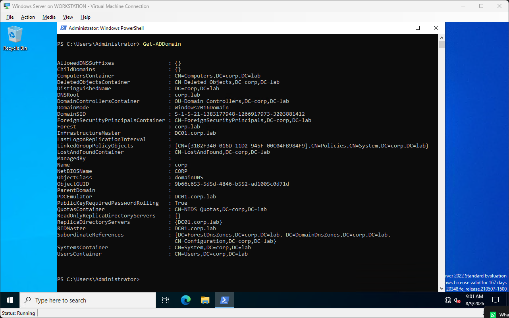

Running `Get-ADDomain` in PowerShell returned a structured dump of the domain: DNSRoot, DomainSID, NetBIOSName, DistinguishedName, and several container paths, all expressed as DNs like `CN=Users,DC=corp,DC=lab`. This was the moment the connection between AD and LDAP stopped being theoretical. The output here uses the exact same DN grammar I had already queried by hand against the public LDAP server earlier in this lab, which confirmed that AD really is LDAP with a Microsoft management layer on top, not a separate technology that happens to look similar.

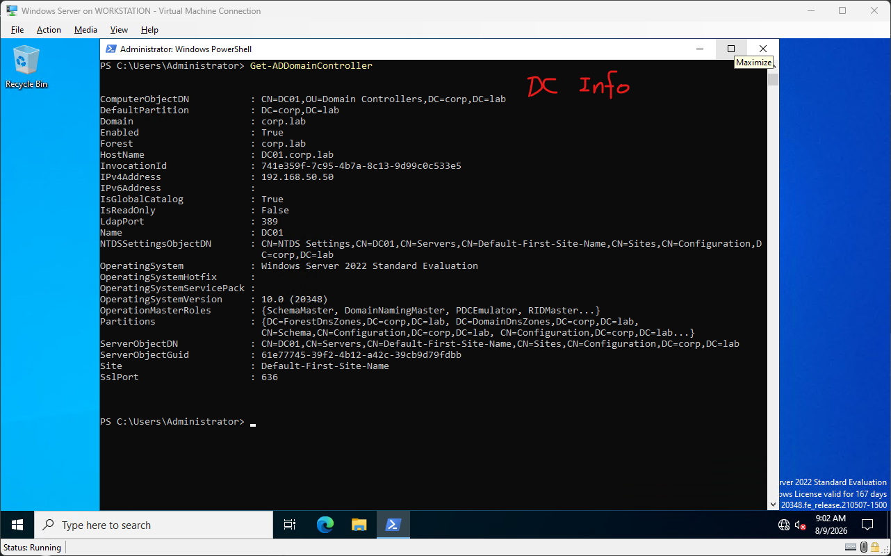

`Get-ADDomainController` gave the domain controller's own record: hostname, IPv4 address, whether it is a Global Catalog server, its FSMO operation master roles (SchemaMaster, DomainNamingMaster, PDCEmulator, RIDMaster among others), and its LDAP and SSL ports (389 and 636). Seeing the LDAP port explicitly listed here tied everything together, this server is not just "an Active Directory server" in some abstract sense, it is literally an LDAP server listening on 389, which is the same protocol and largely the same port I was querying against a public server earlier with `ldapsearch`.

## What I actually learned from this lab

The biggest shift in understanding was realizing AD is not a separate product bolted onto Windows, it is a specific vendor's implementation of LDAP, wrapped in wizards and PowerShell cmdlets that hide the raw protocol. Doing the LDAP queries first, before touching Windows Server at all, made every later AD screen readable instead of mysterious. DNs, object classes, and filters were not new vocabulary by the time I got to `Get-ADDomain`, they were the same thing I had already typed by hand.

The second big piece was the dependency chain: static IP, then DNS, then the AD role, then promotion. Skipping or misordering any of those steps is a common way these labs break in practice, and now I understand why each one has to come before the next rather than just following the wizard blindly.

Next step in this phase is Group Policy, which is where this directory structure actually starts enforcing behavior on client machines rather than just existing as a database.
