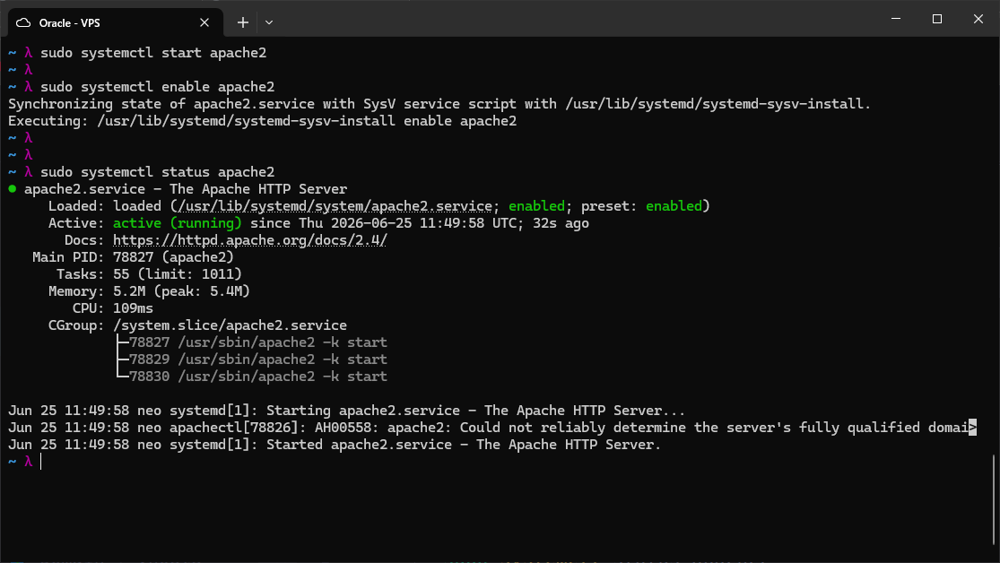
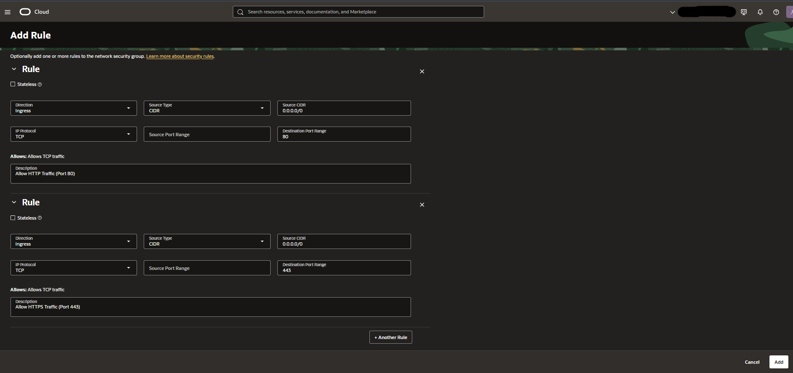
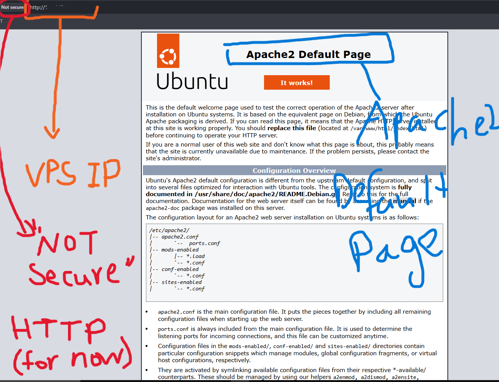
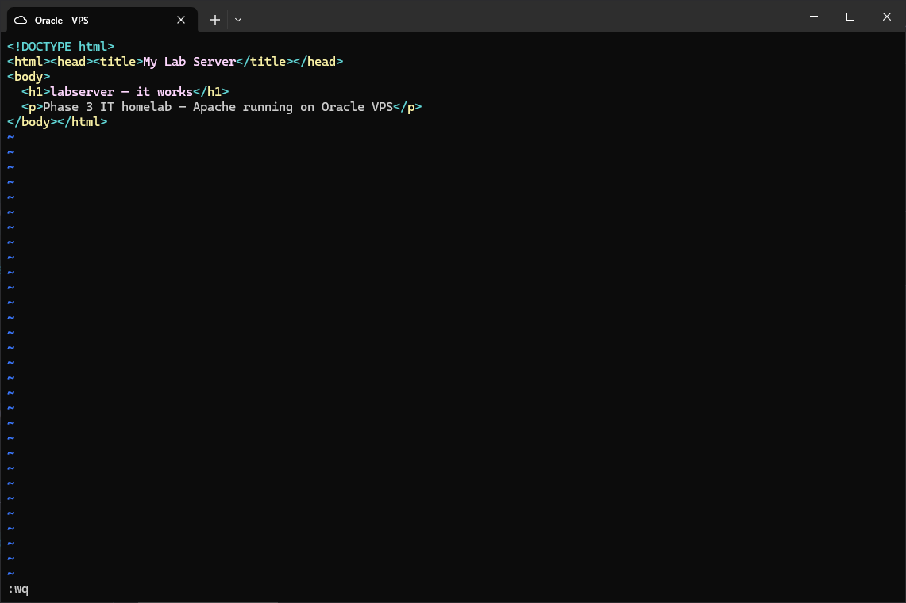
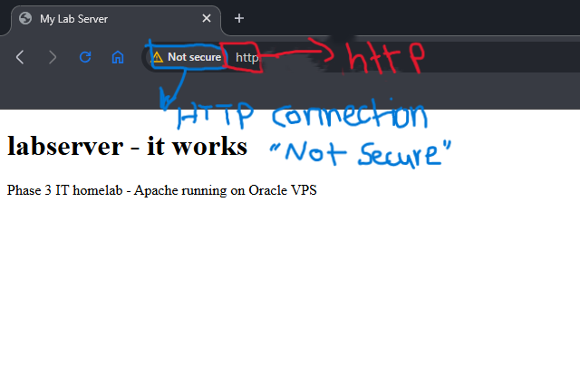

## Installation and Initial Setup

```bash
sudo apt install -y apache2
sudo systemctl start apache2
sudo systemctl enable apache2
sudo systemctl status apache2
```



Apache starts immediately after installation. `systemctl enable` registers it
to start automatically at boot. The status output confirms the service is
active and running with three worker processes in the CGroup.

---

## Firewall Configuration

Oracle Cloud uses a two-tier firewall. Both the OCI Network Security Group and
the OS-level iptables must allow the relevant ports or the server will not be
reachable from the internet.

Two ingress rules were added to the VPS Network Security Group:



| Rule | Protocol | Source | Port | Description |
|------|----------|--------|------|-------------|
| 1 | TCP | 0.0.0.0/0 | 80 | Allow HTTP traffic |
| 2 | TCP | 0.0.0.0/0 | 443 | Allow HTTPS traffic |

Port 443 was opened now even though TLS is not configured yet. Apache will
serve HTTPS in a future lab and opening the firewall rule at this stage avoids
having to revisit the OCI console later.

The iptables rules to match:

```bash
sudo iptables -I INPUT -p tcp --dport 80 -j ACCEPT
sudo iptables -I INPUT -p tcp --dport 443 -j ACCEPT
```

---

## Verifying the Default Page

After opening the firewall, navigating to the VPS IP in a browser loads the
Apache2 default page:



The browser shows "Not secure" because the connection is plain HTTP at this
stage. There is no domain name configured yet and no TLS certificate -- the
VPS IP is typed directly into the address bar. Both of those will be addressed
in later labs. The default page confirms Apache is installed, running, and
reachable from the public internet.

---

## Replacing the Default Page

The default page lives at `/var/www/html/index.html`. It was replaced with a
minimal custom page:

```bash
sudo vim /var/www/html/index.html
```



```html
<!DOCTYPE html>
<html><head><title>My Lab Server</title></head>
<body>
  <h1>labserver - it works</h1>
  <p>Phase 3 IT homelab - Apache running on Oracle VPS</p>
</body></html>
```

Saving the file is enough -- Apache serves files directly from disk and
reflects changes immediately without a restart.



The custom page loads instantly. The "Not secure" indicator remains since TLS
has not been configured yet. This will be resolved when Certbot and a domain
name are set up in the next lab.
