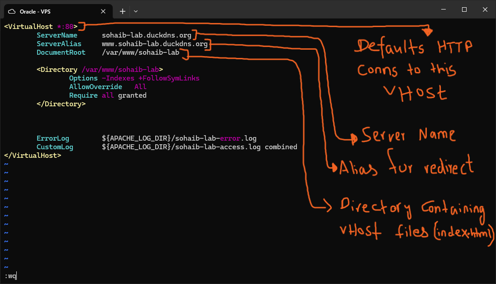
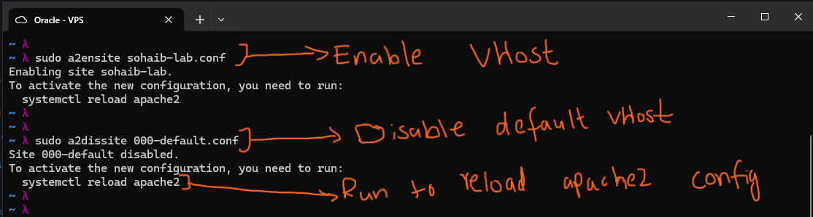
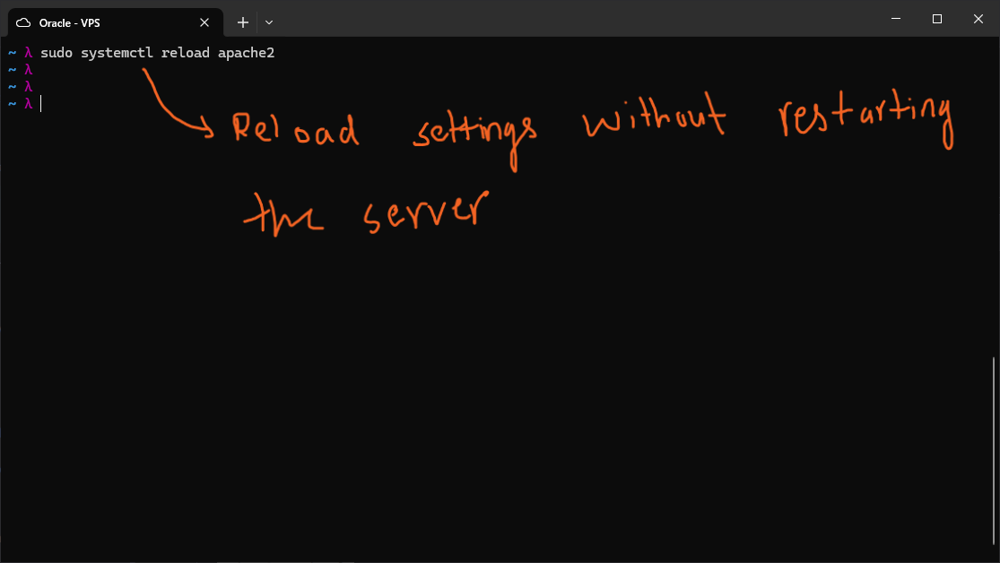
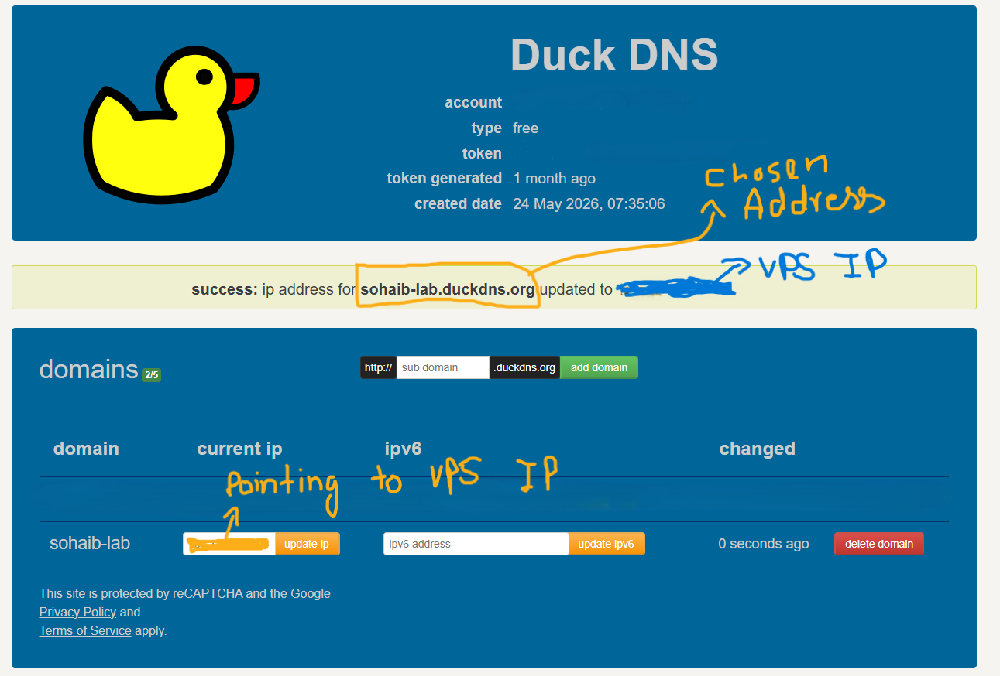
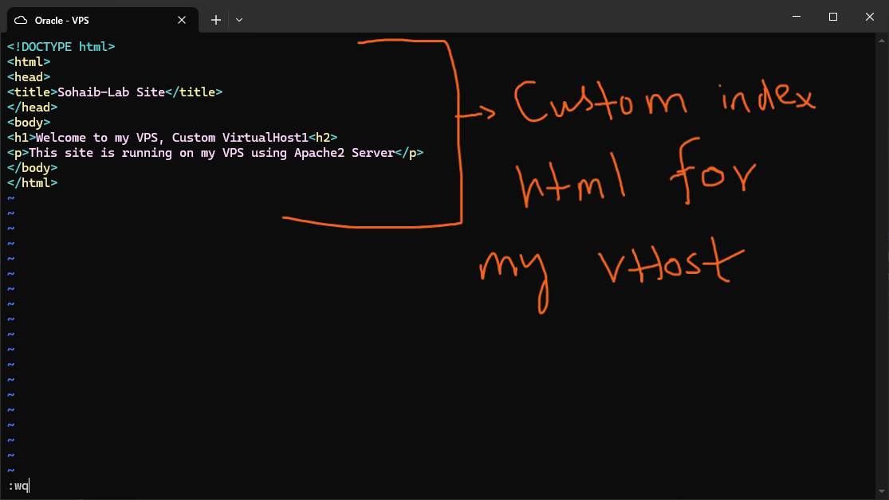
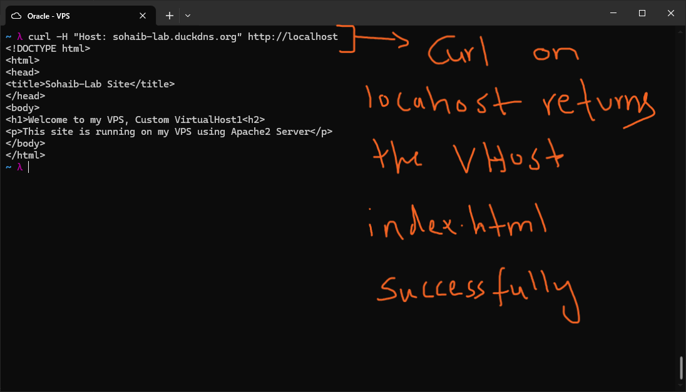
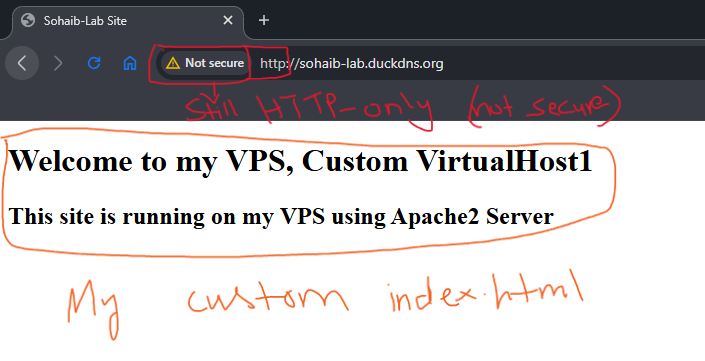
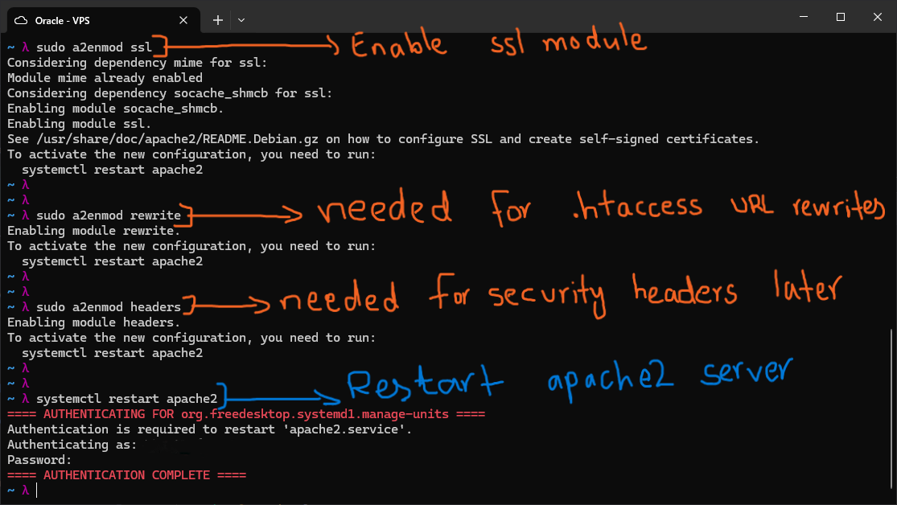

# Apache2 Virtual Host Setup

## Apache2 Config Directory Structure

Apache2 on Ubuntu organizes its configuration across several directories.
Understanding this layout makes it much easier to manage sites and modules.

| Path | Purpose |
|---|---|
| `/etc/apache2/apache2.conf` | Main config file. Defines global server-wide settings and includes other configs as optional directives. |
| `/etc/apache2/ports.conf` | Defines which ports Apache2 listens on (default: 80 for HTTP, 443 for HTTPS). |
| `/etc/apache2/sites-available/` | Holds all virtual host config files, both enabled and disabled. |
| `/etc/apache2/sites-available/000-default.conf` | The default virtual host. Catches any request that does not match a specific ServerName. |
| `/etc/apache2/sites-enabled/` | Contains only symlinks pointing to active configs in `sites-available/`. |
| `/etc/apache2/mods-available/` | All Apache modules available on the system. |
| `/etc/apache2/mods-enabled/` | Symlinks to currently active modules in `mods-available/`. |
| `/etc/apache2/conf-available/` | Global config fragments that apply server-wide, not tied to any specific virtual host. |
| `/var/log/apache2/` | Contains `access.log` (every HTTP request: IP, timestamp, URL, status code, bytes sent) and `error.log` (all Apache errors and warnings). |

The `sites-available` and `sites-enabled` split is a clean pattern: you write
configs in `sites-available/`, then Apache tools create symlinks in
`sites-enabled/` to activate them. Same idea applies to modules.

---

## Creating a Virtual Host

A virtual host tells Apache how to handle requests for a specific domain.
The config file lives in `sites-available/` and defines the document root,
server name, logging paths, and directory permissions.

I created `/etc/apache2/sites-available/sohaib-lab.conf` with the following
configuration:



Key directives in the config:

- `<VirtualHost *:80>` -- listens on port 80 (HTTP) and acts as the default
  catch-all for incoming HTTP connections routed to this host
- `ServerName` -- the primary domain this vhost responds to
- `ServerAlias` -- an alias (such as the `www.` subdomain) that redirects to
  the same vhost
- `DocumentRoot` -- the directory on disk that Apache serves files from
- `<Directory>` block -- sets permissions for that document root:
  - `Options -Indexes +FollowSymLinks` -- disables directory listing,
    allows symlinks
  - `AllowOverride All` -- allows `.htaccess` files to override settings
  - `Require all granted` -- permits all incoming requests
- `ErrorLog` / `CustomLog` -- per-vhost log files, separate from the global
  Apache logs

---

## Enabling the Virtual Host and Disabling the Default

Apache provides helper commands so you do not have to manually manage symlinks.



```bash
sudo a2ensite sohaib-lab.conf    # creates symlink in sites-enabled/
sudo a2dissite 000-default.conf  # removes symlink for the default vhost
```

After running these, Apache prompts you to reload so the changes take effect.

---

## Reloading Apache2

```bash
sudo systemctl reload apache2
```



`reload` applies config changes without fully restarting the server process.
Active connections are not dropped. Use `restart` only when loading new modules
that require a full process restart.

---

## Pointing a Domain to the VPS

I registered `sohaib-lab.duckdns.org` as a free subdomain on DuckDNS and
pointed it to the public IP of the VPS.



DuckDNS is a free dynamic DNS service. It lets you map a hostname to any IP
address, which is useful for a cloud VPS where you want a readable domain
rather than a raw IP in your browser or curl tests.

---

## Writing a Custom index.html

I created a simple `index.html` inside the document root defined in the vhost
config (`/var/www/sohaib-lab/`):



This is the file Apache will serve when someone requests the root path (`/`)
of the domain.

---

## Testing the Virtual Host Locally

Before testing from a browser, I verified the vhost was working correctly
on the server itself using curl:

```bash
curl -H "Host: sohaib-lab.duckdns.org" http://localhost
```



The `-H` flag injects a custom `Host` header into the request. Apache uses the
`Host` header to decide which virtual host to route the request to. Sending
it to `localhost` confirms the vhost config is correct without needing external
DNS resolution.

The response returned the custom `index.html`, confirming the vhost is
routing correctly.

---

## Verifying in Browser

Visiting `http://sohaib-lab.duckdns.org` in a browser served the custom page:



The browser shows "Not secure" because no TLS certificate is configured yet.
The site is HTTP only at this stage. SSL setup is the next step.

---

## Enabling Modules for Later Use

With the vhost working, I enabled three Apache modules that will be needed
for hardening and HTTPS setup:



```bash
sudo a2enmod ssl      # enables TLS/HTTPS support
sudo a2enmod rewrite  # enables URL rewriting, required for .htaccess redirects
sudo a2enmod headers  # enables HTTP response header control, used for security headers
```

After enabling modules, a full `restart` is required (not just `reload`)
because Apache needs to load the new module binaries into the server process:

```bash
sudo systemctl restart apache2
```

---

