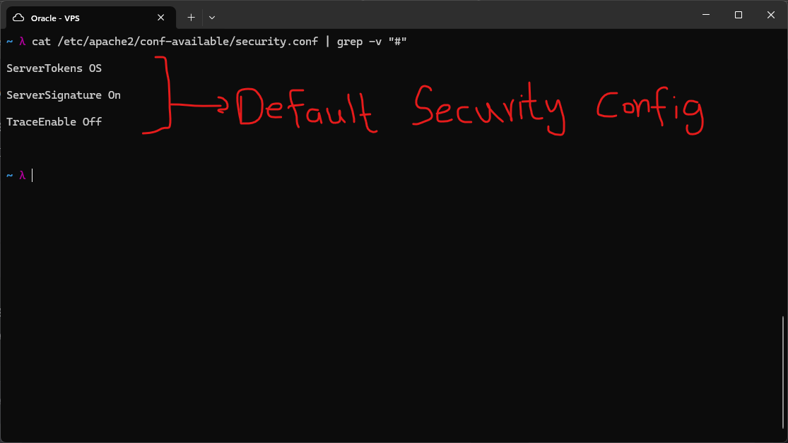
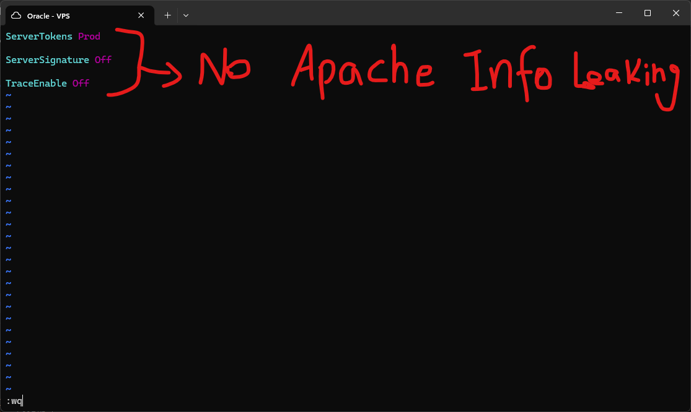
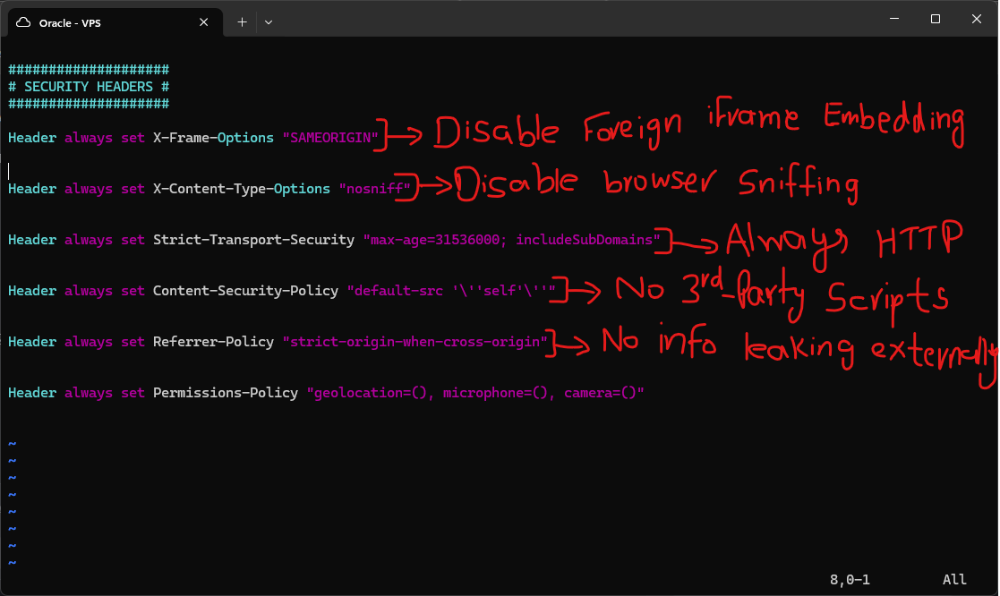
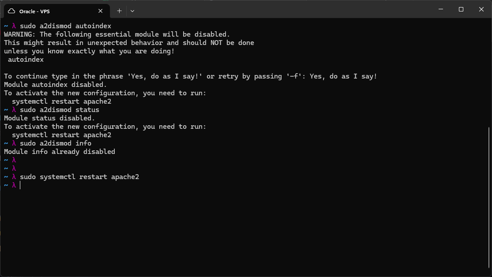
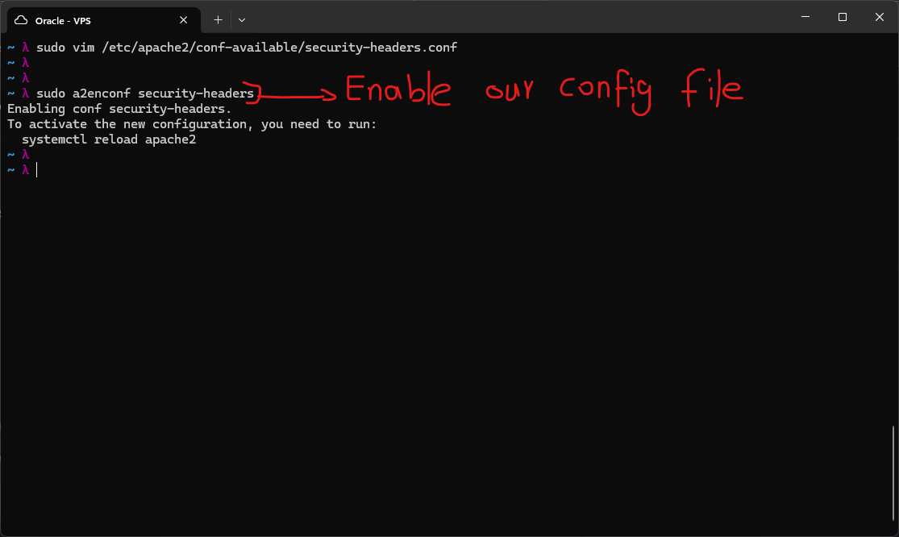
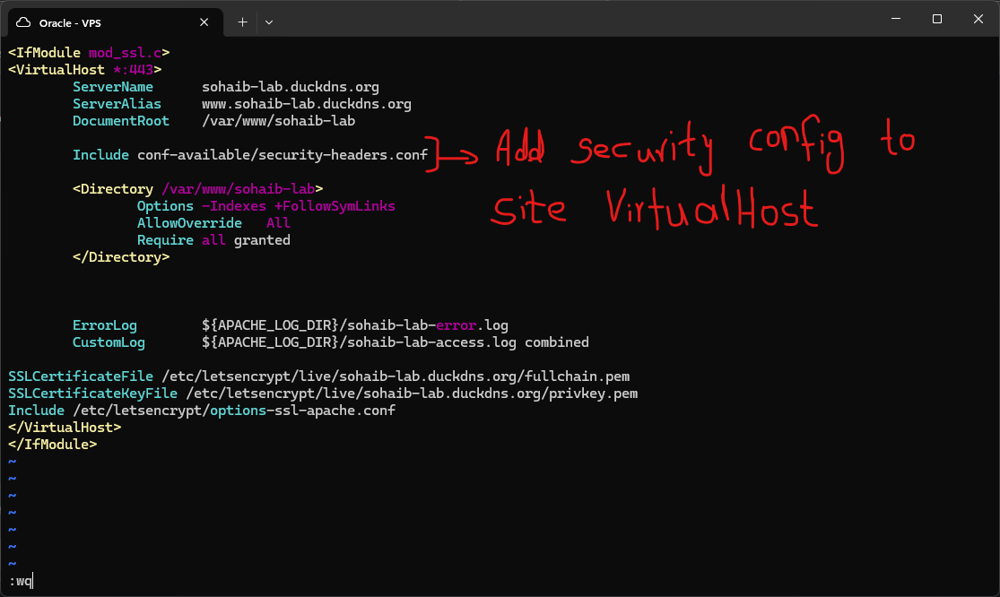
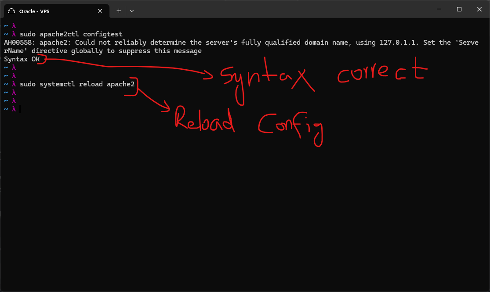
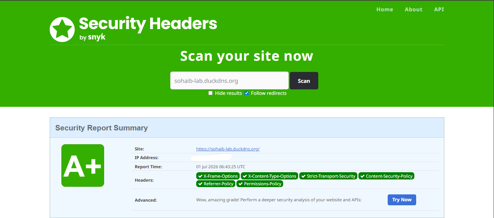
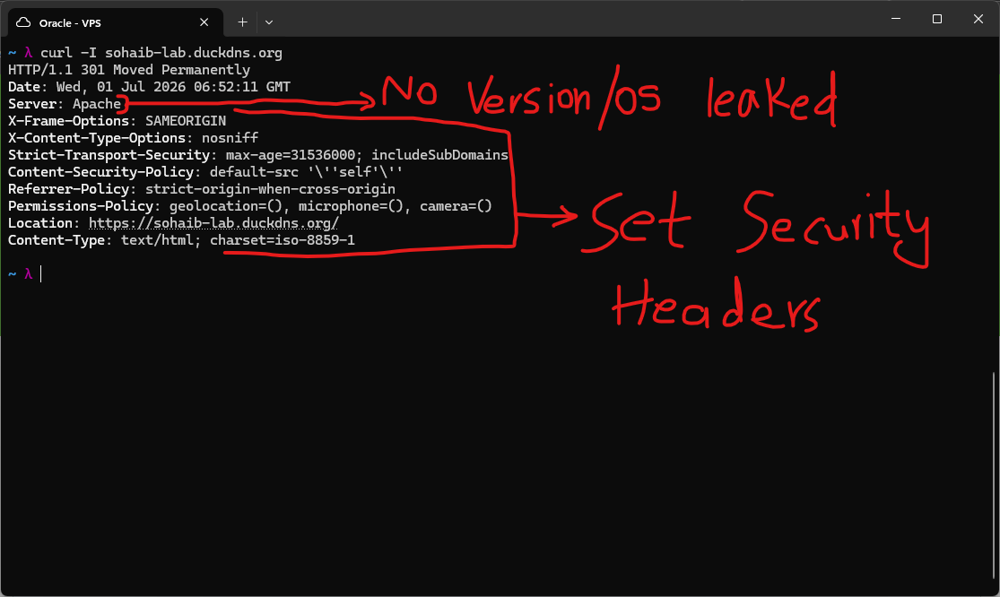
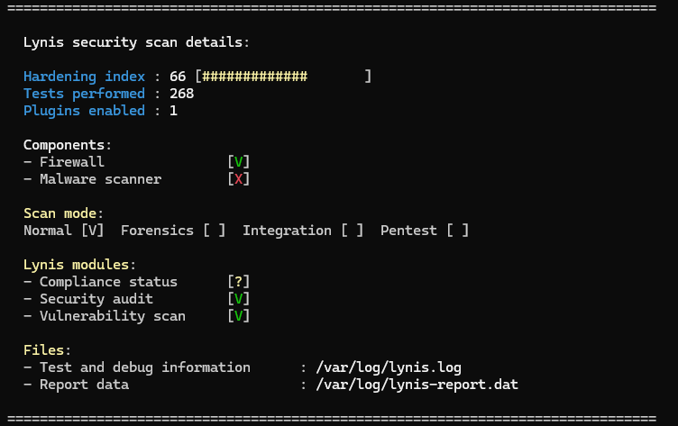

# Introduction

For this lab I wanted to lock down Apache on my VPS against information disclosure and some common web attacks. By default Apache tells the world a lot more about itself than it should, things like OS name and exact version number, and it also does not set any of the modern browser security headers on its own. Both of these are small things individually but they add up to giving an attacker a head start when they are probing a server. The goal here was to fix the information leakage and add the standard set of security headers that any production site should have.

# Checking the Default Security Config



Apache ships with a file at `/etc/apache2/conf-available/security.conf` that controls some baseline security behavior. I catted it out with the comments filtered so I could see just the active directives.

Two things stood out as bad defaults:

- `ServerTokens OS` means Apache will include the operating system name in its response headers and error pages, on top of the Apache version itself. So any response from the server was basically telling anyone who asked "this is Apache running on Ubuntu."
- `ServerSignature On` adds a footer to Apache-generated error pages (like 404s) that shows the server version and OS. Same problem, different place.

Neither of these directly gives an attacker access to anything, but they do make reconnaissance easier. If a known vulnerability exists for a specific Apache version, this is literally handing over that version number for free. This is called banner grabbing and it is one of the first things a threat actor does before enumerating a target more deeply.

# Fixing ServerTokens and ServerSignature



I edited the file and changed:

- `ServerTokens` from `OS` to `Prod`. `Prod` is the most restrictive setting, it makes Apache only report itself as "Apache" with no version and no OS info at all.
- `ServerSignature` from `On` to `Off`, so error pages stop showing version info in their footer too.

`TraceEnable` was already set to `Off`, which was good to see left alone, since `TRACE` requests can be abused for cross site tracing attacks if left enabled.

# Adding Security Headers



Hiding the server version is only half the picture though. Modern browsers support a set of HTTP response headers that tell the browser itself to enforce extra security rules on the page. Apache does not send any of these by default, so I created a new config file at `/etc/apache2/conf-available/security-headers.conf` and added the following:

```

Header always set X-Frame-Options "SAMEORIGIN"

Header always set X-Content-Type-Options "nosniff"

Header always set Strict-Transport-Security "max-age=31536000; includeSubDomains"

Header always set Content-Security-Policy "default-src 'self'"

Header always set Referrer-Policy "strict-origin-when-cross-origin"

Header always set Permissions-Policy "geolocation=(), microphone=(), camera=()"

```

Here is what each one actually does, and why I picked these values:

- **X-Frame-Options: SAMEORIGIN** stops other websites from embedding my site inside an iframe. Without this, someone could load my site inside a hidden frame on their own malicious page and trick users into clicking things they did not mean to, this is called clickjacking.
- **X-Content-Type-Options: nosniff** stops the browser from trying to guess a file's type based on its content instead of trusting the declared Content-Type header. Browsers doing this "MIME sniffing" has historically been used to sneak scripts past filters by disguising them as harmless file types.
- **Strict-Transport-Security** (HSTS) tells the browser to only ever connect to my site over HTTPS for the next year (31536000 seconds), and to apply that to subdomains too. This protects against downgrade attacks where a user's first request accidentally goes out over plain HTTP and gets intercepted.
- **Content-Security-Policy: default-src 'self'** restricts the page to only load scripts, styles, and other resources from my own domain by default. This is one of the stronger defenses against cross site scripting (XSS), since even if an attacker manages to inject a script tag pointing to an external file, the browser will refuse to load it.
- **Referrer-Policy: strict-origin-when-cross-origin** controls how much of my site's URL gets leaked to other sites when a user clicks a link away from it. This keeps full URLs (which can contain sensitive query parameters) from being sent to third party sites in the referrer header.
- **Permissions-Policy** explicitly disables browser features like geolocation, microphone, and camera access for the page, since none of these are needed here. This closes off features that could be abused if a script injection ever did slip through.

# Disabling Unused Modules



Along with the header work, I went through and disabled Apache modules that were not being used by this site, starting with `autoindex`, which is the module that auto generates a directory listing page when there is no index file present. I do not want directory listings enabled since they can expose file structure and files that were never meant to be browsed directly.

This ran into a warning since `autoindex` is considered an "essential" module by Apache and it asked me to confirm before disabling it, which I did. This is really just the same principle as closing unused ports on a firewall, applied to Apache modules instead. Fewer active modules means fewer things that can potentially be exploited later, this is generally called reducing the attack surface.

# Enabling the New Config



Creating the `security-headers.conf` file is not enough on its own, Apache needs to be told to actually load it. I enabled it with:

```

sudo a2enconf security-headers

```

This is Apache's way of symlinking a config from `conf-available` into `conf-enabled`, which is the folder Apache actually reads from on startup. I learned that this two folder split (`available` vs `enabled`) exists specifically so you can keep configs written but toggled off without deleting them, same pattern as `sites-available` and `sites-enabled` for VirtualHosts and `mods-available`/`mods-enabled` for modules.

# Wiring the Headers into the Site's VirtualHost



Enabling the config globally is still not enough by itself, since I needed to make sure it actually applies to my specific site. I added it into the SSL VirtualHost block for the lab site using the `Include` directive, pointing at the `security-headers.conf` file. This means the headers will be sent specifically on requests to `sohaib-lab.duckdns.org`, alongside the existing SSL certificate paths from Let's Encrypt.

# Testing the Config and Reloading



Before restarting anything I ran:

```

sudo apache2ctl configtest

```

This checks the config syntax without actually touching the running service, so if I had made a typo anywhere it would tell me before anything broke. It came back with a harmless warning about not being able to determine the fully qualified domain name (a generic Apache message that shows up when `ServerName` is not set globally), and otherwise returned "Syntax OK."

Once I confirmed the syntax was fine, I reloaded rather than restarted Apache with:

```

sudo systemctl reload apache2

```

I specifically used reload instead of restart here, since reload re-reads the config files without dropping active connections, while restart would briefly take the whole service down. For a config change like this, reload is the safer and less disruptive choice.

# Verifying the Results



I ran the site through the Security Headers scanner (securityheaders.com) and it came back with an A+ grade, confirming all six headers were being sent correctly.



I also checked manually with:

```

curl -I sohaib-lab.duckdns.org

```

The response showed all the headers I configured, and just as important, the `Server` line now only said `Apache` with no version number and no OS name attached, confirming the `ServerTokens` and `ServerSignature` changes were actually working, not just set in the config.

# Overall System Check with Lynis



To get a sense of where the whole VPS stands security wise, not just Apache, I ran a full Lynis scan. It came back with a hardening index of 66 out of 100, based on 268 tests across the system. This is a reasonable baseline but nowhere near where a production system should sit. A lot of what is pulling the score down is likely outside of Apache entirely (things like the malware scanner component showing as not installed), so improving this further is something I am planning to come back to more seriously once I move into the Security phase of the lab, where hardening the whole system is the actual focus rather than just one service.

