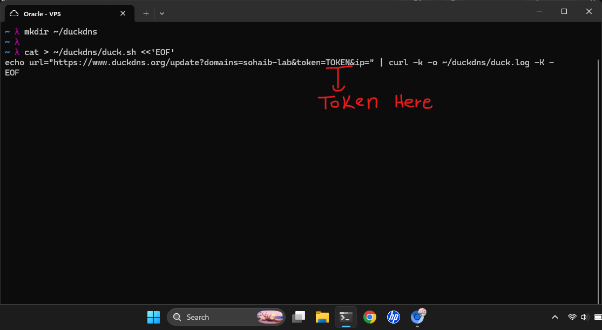
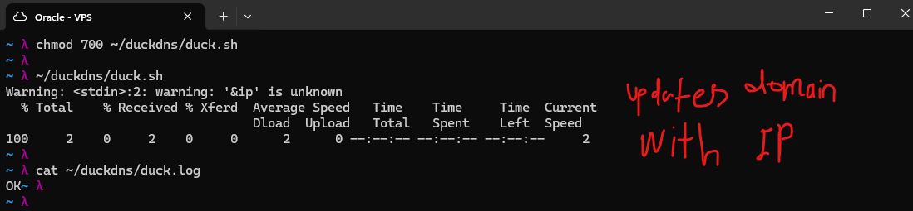
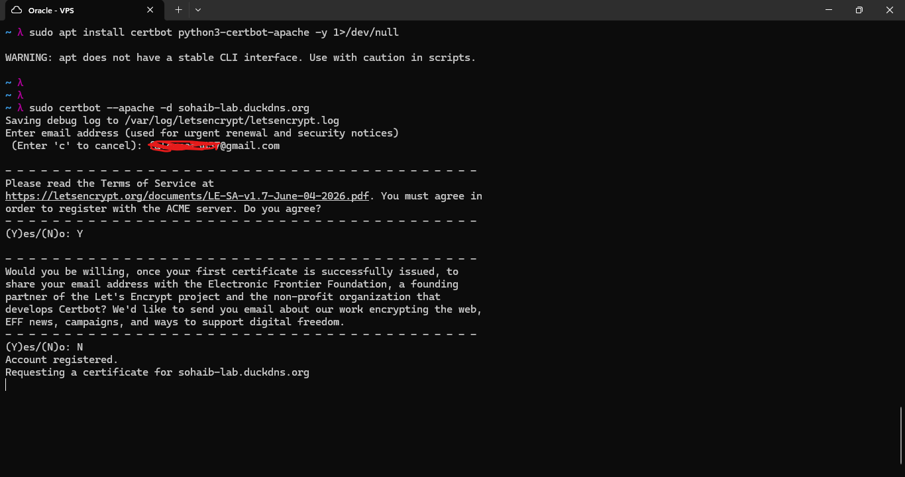
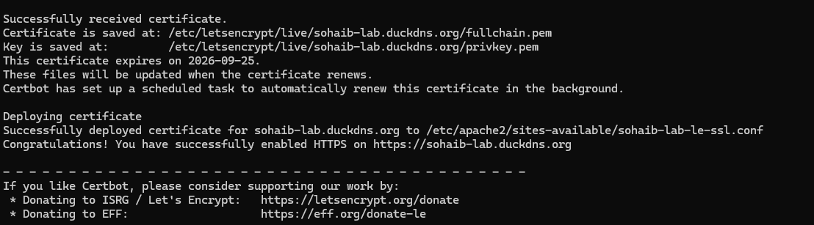
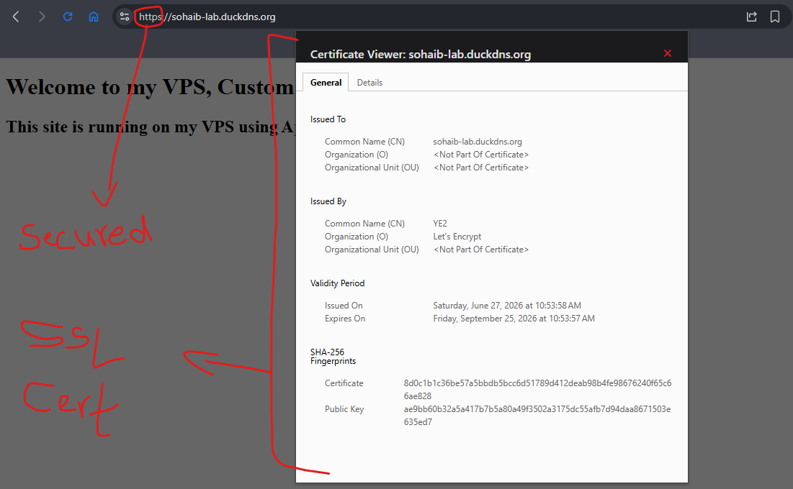
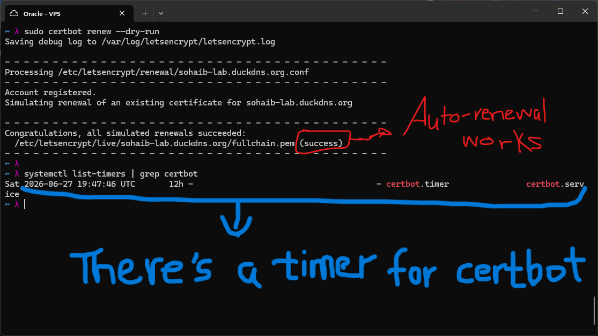
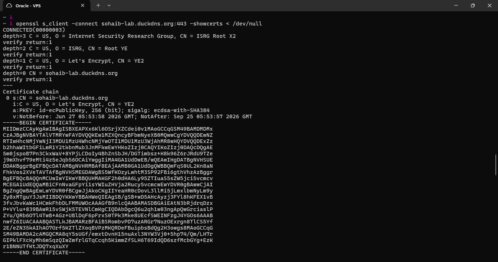
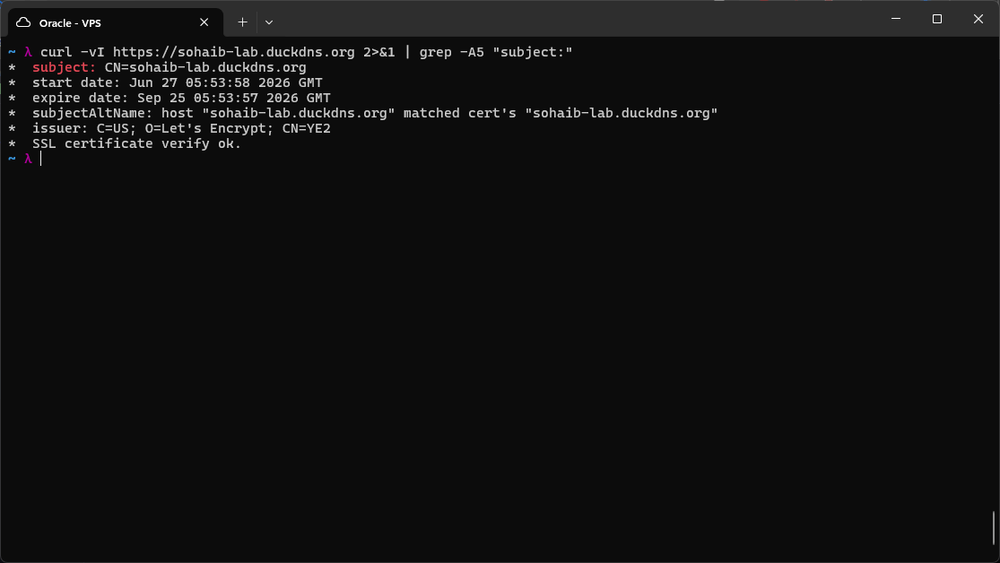

# DuckDNS Dynamic DNS Setup

DuckDNS provides a free subdomain service with an HTTP-based API for updating the DNS
record of a subdomain. The update URL structure accepts the subdomain name, an auth
token, and optionally an IP address as query parameters. If no IP is provided, DuckDNS
uses the public IP of the requesting machine automatically.

## Creating the Update Script

A shell script was created to call the DuckDNS update API using curl:

```bash
mkdir ~/duckdns
cat > ~/duckdns/duck.sh <<'EOF'
echo url="https://www.duckdns.org/update?domains=<your-subdomain>&token=<your-token>&ip=" | curl -k -o ~/duckdns/duck.log -K -
EOF
```

The heredoc (`<<'EOF'`) prevents shell expansion inside the script during creation.
The `-K -` flag tells curl to read options from stdin rather than a config file.
Leaving `ip=` empty tells DuckDNS to detect the server's public IP automatically.



## Running the Script

```bash
chmod 700 ~/duckdns/duck.sh
~/duckdns/duck.sh
cat ~/duckdns/duck.log
```

`chmod 700` restricts the script so only the owner can read, write, and execute it.
This matters because the script contains the DuckDNS auth token in plaintext.

The log output `OK` confirms the DNS record was updated successfully. The warning
`'&ip' is unknown` is harmless -- curl does not recognize `&ip` as a flag because it
is part of the URL string being passed via stdin, not a curl option.



The `dig` command confirmed that the subdomain resolves to the correct VPS IP after
the update. This script can be automated later using a cron job so the DNS record
stays current if the VPS IP ever changes.

---

# TLS/SSL with Let's Encrypt and Certbot

TLS (Transport Layer Security) encrypts traffic between the client and server. Without
it, HTTP traffic is plaintext and can be intercepted. Let's Encrypt is a free,
automated Certificate Authority (CA) that issues trusted TLS certificates. Certbot is
the official client that requests, deploys, and renews those certificates.

## Installing Certbot

```bash
sudo apt install certbot python3-certbot-apache -y
```

This installs two packages: `certbot` (the core ACME client) and
`python3-certbot-apache` (the Apache plugin, which automates editing the virtual host
config to enable HTTPS and handle redirects).

## Requesting a Certificate

```bash
sudo certbot --apache -d sohaib-lab.duckdns.org
```

The `--apache` flag tells Certbot to use the Apache plugin so it can automatically
modify the site config rather than requiring manual steps. Certbot performs an HTTP-01
challenge by default -- Let's Encrypt makes a request to a known path on your domain
to verify you control the server.



Certbot saved the certificate files to `/etc/letsencrypt/live/sohaib-lab.duckdns.org/`:

- `fullchain.pem` -- the certificate plus the intermediate CA chain
- `privkey.pem` -- the private key (stays on the server, never transmitted)

Let's Encrypt certificates expire after 90 days. This is intentional: short lifetimes
limit the damage if a key is ever compromised, and they encourage automation of renewal
rather than manual processes.

Certbot also deployed the certificate automatically by creating a new Apache virtual
host config (`sohaib-lab-le-ssl.conf`) and set up a systemd timer for automatic
renewal.



## Verifying HTTPS in the Browser

The site is now reachable over HTTPS. The certificate viewer confirms:

- Issued to: `sohaib-lab.duckdns.org`
- Issued by: Let's Encrypt (intermediate CA: YE2)
- Valid for 90 days from issuance



## Testing Auto-Renewal

```bash
sudo certbot renew --dry-run
```

A dry run simulates the full renewal process without actually replacing the certificate.
All simulated renewals succeeded, confirming the renewal configuration is valid.

```bash
systemctl list-timers | grep certbot
```

This shows the active systemd timer that Certbot registered. The timer triggers
`certbot.service` periodically to check and renew certificates that are within 30 days
of expiry.



## Inspecting the Certificate from the Command Line

```bash
openssl s_client -connect sohaib-lab.duckdns.org:443 -showcerts < /dev/null
```

`openssl s_client` performs a TLS handshake with the server and prints the full
certificate chain. The chain here shows three depth levels: the server certificate
at depth 0, the Let's Encrypt intermediate (YE2) at depth 1, and the ISRG Root X2
at depth 2. All three returned `verify return:1`, meaning the chain is trusted.



```bash
curl -vI https://sohaib-lab.duckdns.org 2>&1 | grep -A5 "subject:"
```

`curl -vI` prints verbose connection info including TLS details without downloading
the page body. The `grep -A5` pulls the certificate summary lines. The output
confirms the issuer as Let's Encrypt, the validity window, and ends with
`SSL certificate verify ok`.



---

## How TLS Works: The Handshake

When a browser connects to an HTTPS site, the following exchange happens before any
application data is sent:

1. **ClientHello** -- The client sends supported TLS versions, cipher suites, and a
   random value.
2. **ServerHello** -- The server picks a cipher suite (for example, AES-256-GCM with
   SHA-384) and sends its own random value.
3. **Certificate** -- The server sends its TLS certificate, which contains its public
   key and the CA's signature proving the domain is legitimate.
4. **Certificate Verify** -- The client checks the certificate against the trusted CA
   store. Let's Encrypt is trusted by default in all major browsers and operating
   systems.
5. **Key Exchange** -- Both sides use Diffie-Hellman to independently derive the same
   session key. The session key is never transmitted over the network.
6. **Finished** -- Both sides confirm the handshake is complete. Encrypted data flow
   begins.

## Perfect Forward Secrecy

TLS 1.3 (which Let's Encrypt uses) generates a fresh Diffie-Hellman key pair for
every session. This means the session keys are not derived from the server's long-term
private key. If someone recorded your encrypted traffic today and later obtained the
private key, they still could not decrypt those old sessions. Each session's encryption
keys are discarded after the session ends.
