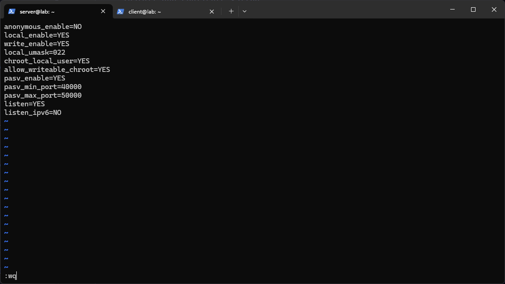
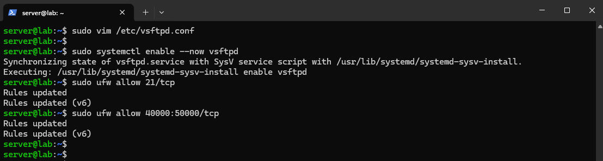
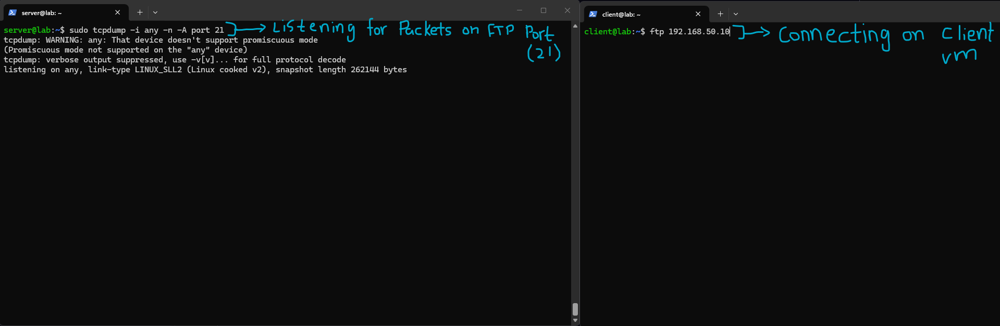
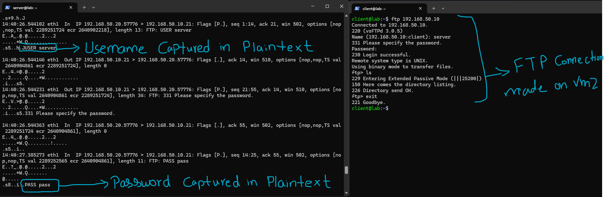
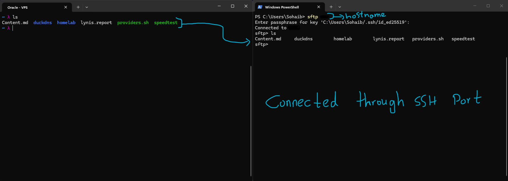

# FTP, SFTP, TFTP

Three file transfer protocols and one time synchronization protocol that come up constantly in real sysadmin work. The file transfer protocols matter because they represent three very different tradeoffs between simplicity, security, and compatibility, and NTP matters because it's the kind of infrastructure that's completely invisible until it breaks, at which point a surprising number of unrelated things start failing at once.

## FTP (File Transfer Protocol)

FTP dates back to 1971, which is old enough that it predates almost every security assumption modern protocols are built around. It uses two separate ports, port 21 for control commands and port 20 for the actual data transfer. This dual-port design is the source of a lot of FTP's practical headaches, since having a second, separately negotiated data connection causes real problems with firewalls and NAT, which is why "passive mode" exists, where the client initiates both connections instead of the server initiating the data one back to the client.

The actual disqualifying flaw though is that everything is sent in cleartext. Username, password, and file contents all travel across the network as plain readable text. Anyone positioned to intercept that traffic, on the same LAN, a compromised switch, or anywhere along the path to an ISP, can read all of it without needing to break any encryption, because there isn't any.

**Still use FTP if:** interfacing with legacy systems that specifically require it, and even then, always tunnel it through a VPN, or use FTPS (FTP layered over TLS) as a middle ground that keeps the old protocol's compatibility while adding encryption on top.

## SFTP (SSH File Transfer Protocol)

Despite the similar name, SFTP shares essentially nothing with FTP under the hood. It's a completely separate protocol that runs entirely inside an existing SSH session. There's no separate control and data port split, everything, commands and file data both, goes through the single encrypted port 22 connection.

Because it rides on top of SSH, it inherits SSH's entire authentication model for free, key-based authentication, host verification, connection multiplexing, all of it, without needing any separate password exchange at all.

**Use SFTP by default** for anything involving file transfer to or from a server. If SSH is already running, SFTP already works, there's no separate service to install or configure. It's accessible through FileZilla (set Protocol to SFTP), WinSCP, or the plain `sftp` command.

## TFTP (Trivial File Transfer Protocol)

TFTP is minimal by design, deliberately so. No authentication, no directory listing, no encryption, none of the features FTP or SFTP have. It also runs over UDP instead of TCP, meaning there's no connection handshake overhead at all, which lets it work in extremely restricted, low-resource environments that couldn't handle anything more complex.

**Why use something this limited?** PXE boot is the main case, when a diskless workstation or server first powers on, it needs to download a boot image before it has an operating system loaded at all. The pre-boot firmware environment can't parse TLS handshakes or authentication flows, but it can handle TFTP over UDP with very little code. Network equipment is the other common case, Cisco routers and switches often pull firmware updates via TFTP specifically because the protocol is simple enough to implement directly in ROM.

# Lab Work

## FTP

I installed the FTP server with:

```

sudo apt install -y vsftpd

```



I used a fairly standard baseline config for `vsftpd.conf`, since this was purely for demonstrating the security problem rather than something meant to be a real production FTP server:

- `anonymous_enable=NO` and `local_enable=YES` mean only actual local system users can log in, no anonymous access.
- `write_enable=YES` allows uploads, and `local_umask=022` sets the default permissions for anything written.
- `chroot_local_user=YES` and `allow_writeable_chroot=YES` jail each user to their own home directory rather than letting them browse the whole filesystem, though the writeable chroot combination is generally discouraged in a real production setup since it can be used to escape the jail under certain conditions, I left it for the lab specifically because I wanted the write test to work cleanly.
- `pasv_enable=YES` with a defined `pasv_min_port`/`pasv_max_port` range sets up passive mode, which is the client-initiates-both-connections approach mentioned above, needed because otherwise the server trying to open a second connection back to the client would very likely get blocked by NAT or a firewall along the way.



I enabled the service and opened the relevant ports through the firewall:

```

sudo systemctl enable --now vsftpd sudo ufw allow 21/tcp sudo ufw allow 40000:50000/tcp

```

Port 21 is the control channel, and the 40000-50000 range matches the passive port range I configured, since that's where the actual data connection gets negotiated to.



To actually demonstrate the cleartext problem rather than just take it on faith, I started capturing traffic on port 21 with:

```

sudo tcpdump -i any -n -A port 21

```

while connecting from VM2 as the client with:

```

ftp 192.168.50.10

```



The capture confirmed exactly what the protocol's reputation says it would. The raw packet dump clearly showed `FTP: USER server` and later `FTP: PASS pass`, both fully readable, my actual username and password sitting right there in the packet capture with zero effort needed to decode anything. On the client side, the FTP session itself worked completely normally, connecting, logging in, running `ls`, and exiting, giving no visible indication anything was wrong. That gap, a perfectly functional looking session on one side while the credentials are sitting in plaintext on the wire on the other, is exactly why FTP is banned outright in most security policies rather than just discouraged. It's not that it's inconvenient to secure, it's that there's fundamentally nothing to secure, the protocol was never designed with this threat model in mind at all.

## SFTP

Since SFTP runs entirely over SSH, there was nothing new to set up, my VPS already has SSH key-based authentication configured from earlier labs, so SFTP was already available on it for free.



I connected from my Windows machine with:

```

sftp <hostname>

```

which prompted for my SSH key passphrase rather than a password, then dropped me into an `sftp>` prompt in the home directory, the same directory I land in with a normal SSH session. Running `ls` inside the SFTP session returned the exact same file listing as running `ls` directly over a regular SSH connection to the same VPS, confirming this is genuinely the same authenticated session and filesystem view, just wrapped in a file-transfer-oriented command set instead of a general shell. This is the practical payoff of "SFTP shares nothing with FTP but the name," there was no separate service to install, no separate credentials to manage, and no separate port to open, it was already fully working the moment SSH was.

# Summary

The FTP lab was really about seeing well known vulnerability actually happen rather than just reading that FTP is insecure, watching a real username and password sitting in plaintext in a packet capture makes the "banned in most security policies" reputation concrete in a way that reading about it doesn't. SFTP by contrast required no additional setup at all, which was itself the useful lesson, since it rides entirely on infrastructure (SSH) that was almost certainly already correctly secured beforehand. 
